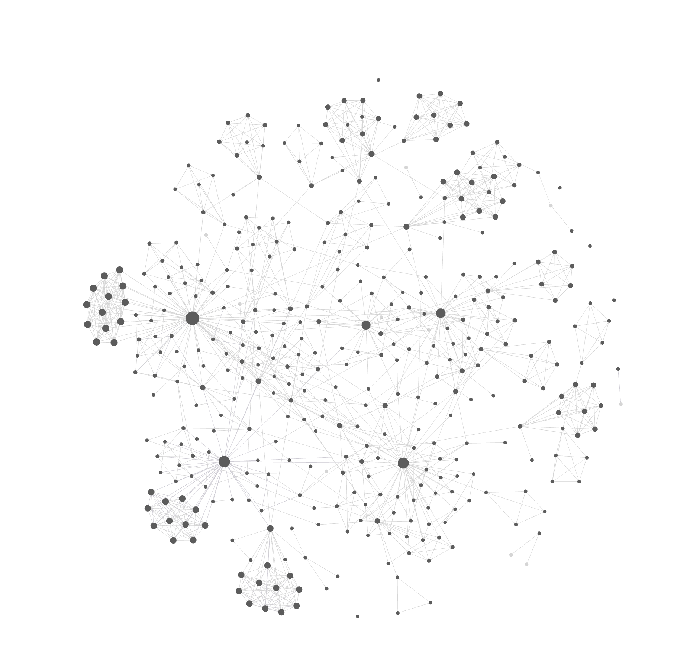

# Engram

> ⚠️ **Breaking change.** The pre-vault TOML memory-record storage layer
> (`~/.local/share/engram/memory/`) was removed. Engram now writes only
> to an agent-memory Obsidian vault. Migration from the
> old layout is not automated. An LLM should be able to migrate easily.

## Overview

Engram gives Claude Code and OpenCode agents persistent memory via a zettelkasten-style vault. Two skills — `recall` and `learn` — read from and write to an agent-memory vault on demand. A third skill, `please`, orchestrates end-to-end work by sequencing recall, learn, and other skills around a user's `<ask>`. `recall` and `learn` shell out to the `engram` binary; `please` is pure meta-orchestration.

After a few months of use, the vault's wikilink graph looks like this in Obsidian — each dot is a note, each line a `[[wikilink]]`; dense clusters are MOCs pulling related Permanents together, and the connective tissue between clusters is how recall cascades between topics:



## Installing

Requires Go 1.25+ on `PATH`.

1. Install the binary:

   ```bash
   go install github.com/toejough/engram/cmd/engram@latest
   ```

   Make sure `$GOBIN` (or `$GOPATH/bin`, default `~/go/bin`) is on your `PATH`.

2. Copy the skills and commands into every detected harness's user directory:

   ```bash
   engram update            # install / refresh
   engram update --dry-run  # show what would change
   ```

   `engram update` writes Claude Code skills to `~/.claude/skills/` and OpenCode skills + commands to `~/.config/opencode/{skills,commands}/`. Run it again any time to upgrade — it also reinstalls the binary via `go install`.

## Skills

| Skill | What it does |
|-------|--------------|
| `recall` | Surfaces relevant notes from an agent-memory vault via a single `engram query` call (semantic search + 3-hop subgraph + clusters + hubs), applies a per-cluster synthesis gate that may dispatch `/learn` to capture binding principles, and reports back whether the surfaced memory changed the agent's plan. |
| `learn` | Captures lessons from completed work as permanent vault notes. Each candidate passes a recall-mirror test — "would a future recall, querying the same situation, surface this note?" — before writing. |
| `please` | Drives an ask end-to-end through a fixed seven-step workflow — capture, orient, plan, execute (TDD), document, complete, capture. Sequences `recall`, `learn`, and other available skills; tracks each step on the task list. Triggers on `/please <ask>` and natural-language phrasings of the same intent. |

See `skills/recall/SKILL.md`, `skills/learn/SKILL.md`, and `skills/please/SKILL.md` for the full skill definitions.

## Vault location

Engram reads and writes a zettelkasten vault. Resolution order:

1. `--vault <path>` flag
2. `ENGRAM_VAULT_PATH` environment variable
3. `$XDG_DATA_HOME/engram/vault` (fallback: `~/.local/share/engram/vault`)

On first `engram learn` against a missing vault, the directory is
bootstrapped with `Permanent/`, `MOCs/`, a minimal `.obsidian/` config
so Obsidian recognizes it, a `.gitignore`, and a
`README.md`. Other subcommands do not bootstrap — they error with
"vault not found" so the user notices.

Vault layout:

```
<vault>/
  Permanent/   atomic principle-stated notes; <luhmann-id>.<YYYY-MM-DD>.<slug>.md
  MOCs/        Maps of Content with framing prose
```

## Binary commands

```
engram transcript                      Read session transcripts since last /learn (Claude Code + OpenCode)
engram transcript --mark               Same, then advance per-harness progress markers
engram transcript --from <date|all>    Override marker; scan from explicit date or epoch ('all')
engram transcript --max-bytes <n>      Set byte budget (default 200000)
engram learn feedback --slug ... --source ... --situation ... --behavior ... --impact ... --action ... [--project <slug>] [--issue <id>]
engram learn fact     --slug ... --source ... --situation ... --subject ... --predicate ... --object ... [--project <slug>] [--issue <id>]
engram learn episode  --slug ... --source ... --situation ... --boundary-rationale ... --session ... --transcript-range <start>..<end> (--from-transcript-range <session>:<start>..<end> OR --transcript-text "...") [--project <slug>] [--issue <id>]
engram embed apply [--all|--missing|--stale|--force|--dry-run]   (Re-)embed notes per selection (default: missing)
engram embed status                    Report counts per state (total / with-embeddings / without / stale / incompatible / broken)
engram query --phrase <p> [--phrase <p>...] [--limit N] [--project <slug>]   Semantic search + 3-hop subgraph + clusters + hubs; YAML output. --project restricts items to notes whose frontmatter `project:` matches.
engram update                          Refresh binary and harness skills/commands ([--dry-run])
```

## Semantic search (`engram query`) and the embed-on-write pipeline

Engram bundles an embedding model (`sentence-transformers/all-MiniLM-L6-v2`, 384 dims) inside the binary via `go:embed`. Inference runs in pure Go through [Hugot](https://github.com/knights-analytics/hugot) + [GoMLX](https://github.com/gomlx/gomlx)'s `simplego` backend — no CGO, no daemon, no API key.

Each note (`Permanent/<id>.<date>.<slug>.md`, `MOCs/<id>.<date>.<slug>.md`) has a sibling `.vec.json` sidecar:

```
Permanent/132.2026-05-23.foo.md
Permanent/132.2026-05-23.foo.vec.json
```

Sidecar shape:

```json
{
  "embedding_model_id": "minilm-l6-v2@384",
  "dims": 384,
  "vector": [-0.044, -0.043, ...],
  "content_hash": "sha256:..."
}
```

`content_hash` is sha256 over the markdown **body** (frontmatter stripped) so adding a `Related to:` line doesn't trigger re-embed.

Pipeline behavior:

- `engram learn` auto-embeds the new note before returning. Embedder failure is a warning, not an error — the Luhmann write is atomic, and `engram embed apply --missing` will fill the gap later.
- `engram embed status` reports per-state counts: `ok` / `missing` (no sidecar) / `stale` (body changed) / `incompatible` (different model_id) / `broken` (malformed JSON or dims mismatch).
- `engram embed apply` modes:
  - `--missing` (default): only notes without sidecars
  - `--stale`: also re-embed notes whose body hash changed (and broken sidecars)
  - `--force`: also re-embed sidecars whose model_id differs from the bundled model
  - `--all`: every note, regardless of state
  - `--dry-run`: report what would change without writing
- `engram query` embeds the query string, scores every note's sidecar by cosine similarity for direct hits, then expands 3 hops through the authored wikilink graph to build a subgraph (cap 200), auto-k-means clusters the subgraph (k=2..7, silhouette-selected, deterministic per query), and identifies the top-5 hubs by subgraph in-degree. The YAML output includes direct hits, cluster_rep, and hub provenances on each item, a separate `clusters` section with per-cluster silhouette + members, and a budget reporting subgraph size, hops traversed, clusters found, and hubs returned. Empty vault → `items: []` exit 0. Vault with notes but no sidecars → error with the `engram embed apply --all` recovery hint.

Inputs longer than 1500 chars are truncated to fit MiniLM-L6's 512-token positional limit. For engram's 200–500-word notes this is a non-issue; long MOCs and feedback notes lose tail context but still embed cleanly.

## Transcript progress tracking

`engram transcript` tracks a separate progress marker per harness (`last-learn-at-claude`, `last-learn-at-opencode`) under `${XDG_STATE_HOME:-$HOME/.local/state}/engram/projects/<slug>/`. Each marker is advanced independently by `--mark` so that sessions from one harness don't skip unprocessed sessions from the other.

**First-run behavior.** When a source has no marker yet and `--from` is unset, `engram transcript --mark` exits non-zero with a message naming each source's earliest detectable session date. Re-run with `--from <YYYY-MM-DD>` (to start at a specific cutoff) or `--from all` (to scan from the Unix epoch). After the first scan establishes the marker, subsequent `--mark` runs advance incrementally as usual. The `learn` skill catches this error and prompts the user before re-running.

**Byte-cap continuation.** Each scan stops at `--max-bytes` (default 200000). When the cap halts a scan partway, a tail line names the first unscanned mtime per source: `[engram transcript: byte cap hit; <source> sessions from <date> onward not yet scanned; run again to continue]`. Run `/learn` again (after `/clear` if context is tight) to catch up.

## Project structure

```
cmd/engram/          CLI entry point (thin wiring layer)
internal/            Business logic (DI boundaries)
  cli/               CLI command wiring (targ targets)
  context/           Transcript processing
  debuglog/          Structured debug logging
  embed/             Embedder interface + Hugot/GoMLX backend, sidecar I/O, state classification
  learnmarker/       Per-harness progress marker (read/write/FS interface)
  luhmann/           Luhmann-ID allocation under file lock
  transcript/        Session transcript reading (Claude Code JSONL + OpenCode SQLite)
  update/            Self-refresh subcommand
  vaultgraph/        Vault traversal (MOCs/Permanent, anchors, follow)
skills/              Source for the recall and learn skills
commands/            Source for OpenCode slash commands
```

## Development

- `targ build` — build the `engram` binary
- `targ test` — run unit + integration tests
- `targ check-full` — lint + coverage (use this to see ALL errors at once)
- Never run `go test` / `go build` / `go vet` directly — use `targ`

## Design principles

- **DI everywhere** — No function in `internal/` calls `os.*`, `http.*`, or any I/O directly. All I/O through injected interfaces, wired at CLI edges.
- **Pure Go, no CGO** — external API for LLM operations only. The bundled embedder runs through GoMLX's pure-Go `simplego` backend.
- **Skills for behavior, slim Go binary for computation.**
- **Embed-on-write** — the vault is self-describing: a note plus its sidecar contain everything needed to participate in semantic search. No index file, no separate database; the vault remains a directory of markdown files.
