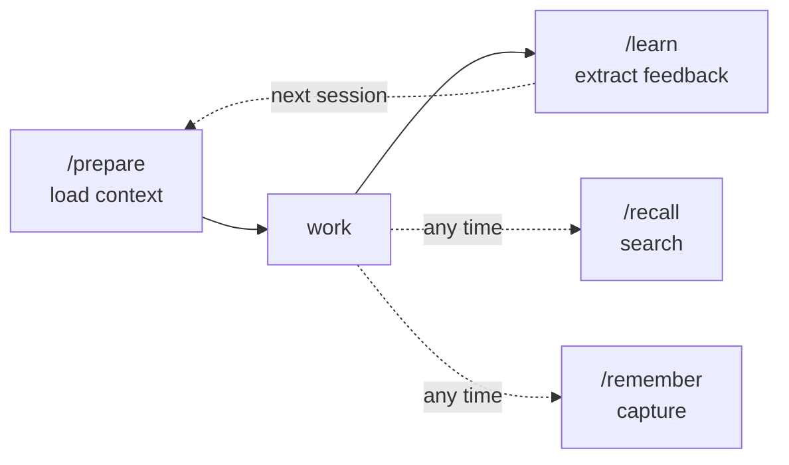
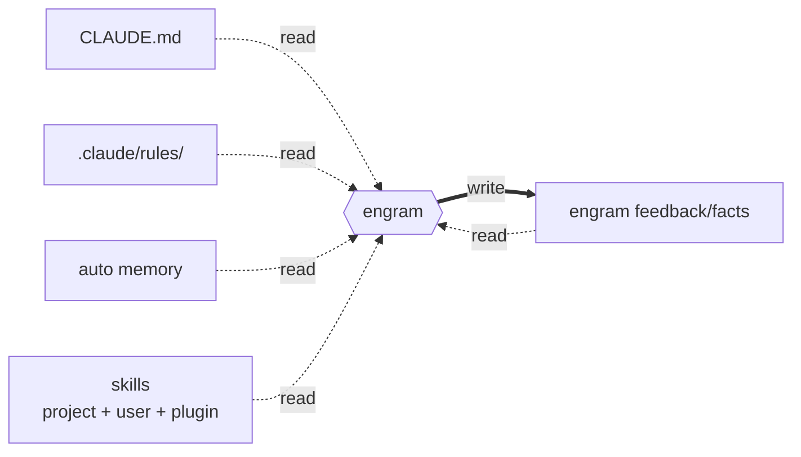
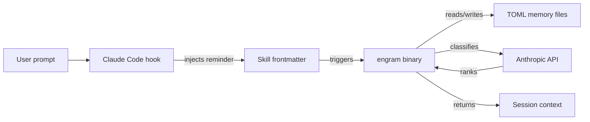
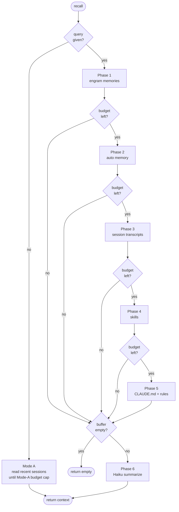
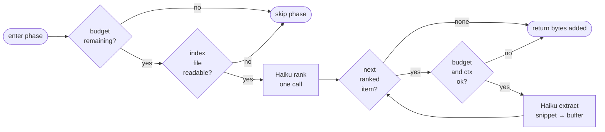
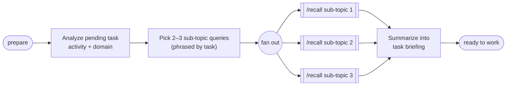
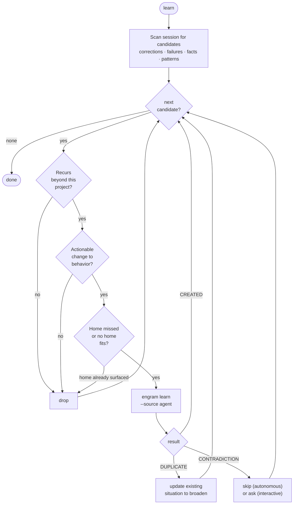
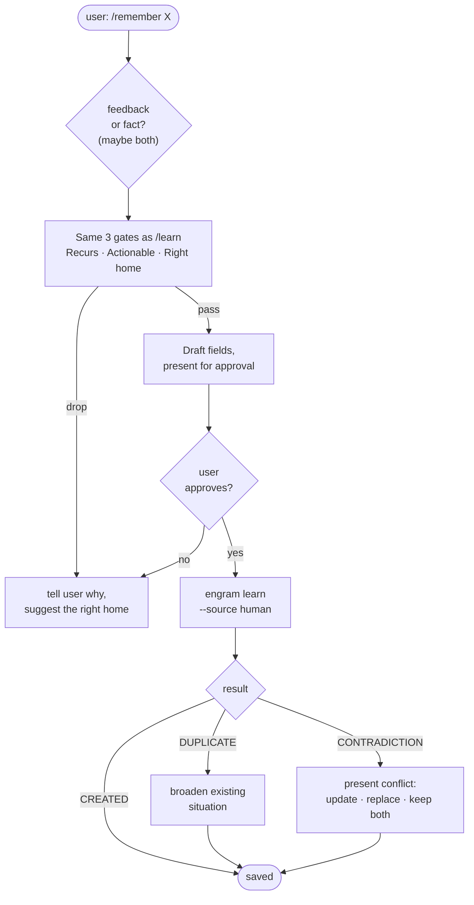

# Engram

> ⚠️ **Breaking change since [`062f127`](../../commit/062f127) (2026-04-04).**
> Everything from hook behavior to memory file layout to the TOML schema has changed between `062f127` (2026-04-04) and `cfd5fb5` (2026-04-17). If you have memories written before this change, **do not start a new session until you run the `/migrate` skill.** See [Changes since `062f127`](#changes-since-062f127) and [Migrating existing memories](#migrating-existing-memories) at the end of this document.

## Overview

Engram is a [Claude Code plugin](https://docs.anthropic.com/en/docs/claude-code/plugins) that gives agents persistent memory. Four skills help agents prepare for work, recall context, learn from experience, and remember explicitly.

## Core loop



`/prepare` loads relevant context before starting work. `/learn` extracts feedback after work completes. `/recall` searches session history and memories on demand. `/remember` captures explicit knowledge immediately.

## Quick reference

| Need | Do |
|------|-----|
| Install | `/plugin` → select `engram` in Claude Code |
| Build | `targ build` |
| Test | `targ test` |
| Check | `targ check-full` |
| Recall | `/recall` or `/recall "query"` |
| Learn | `/learn` (auto-fires at completion) |
| Remember | `/remember "..."` |
| Prepare | `/prepare` (auto-fires before work) |
| Migrate | `/migrate` (if upgrading from pre-cfd5fb5) |
| Memory dir | `~/.local/share/engram/memory/{feedback,facts}/` |

## For contributors & LLM agents

**Critical invariants:**
- **DI everywhere** — nothing in `internal/` calls `os.*`, `http.*`, or I/O directly. All I/O through injected interfaces, wired at CLI edges.
- **Use `targ`** — never `go test` / `go build` / `go vet` directly.
- **Pure Go, no CGO** — TF-IDF for text similarity, external API for LLM classification only.
- **Test hard-to-test code by refactoring for DI**, not by writing integration tests around I/O.
- **Always edit skills via `superpowers:writing-skills`** — TDD: baseline behavior test (RED), update skill (GREEN), verify behavioral change. Run pressure tests before marking complete.

**Key files to know:**
- `cmd/engram/main.go` — CLI entry point (excluded from coverage — thin wiring only)
- `hooks/hooks.json` — Claude Code hook definitions
- `dev/targs.go` — build target definitions
- `skills/*/SKILL.md` — behavioral skills (learn, prepare, recall, remember, migrate)
- `CLAUDE.md` — contributor conventions (issue workflow, worktree rules, code style)

**See CLAUDE.md for full contributor conventions**, including issue workflow, worktree/merge rules, and code quality standards.

## Getting started

1. Run `/plugin` in Claude Code and select `engram`. That's the whole install.
2. On first use (and whenever Go sources change), the `SessionStart` hook builds the `engram` binary in the background into `~/.claude/engram/bin/engram` and symlinks it to `~/.local/bin/engram`. You never `git clone` or run `targ build` yourself. Requires Go 1.25+ on `PATH`.
3. **Upgrading from a pre-`cfd5fb5` install?** Run `/migrate` before your first new session. See [Migrating existing memories](#migrating-existing-memories).

### Commands you invoke manually

These are the two you reach for by hand. Everything else in the core loop should happen without you asking.

| Command | When you use it |
|---------|-----------------|
| `/recall` | Ask Claude to recall something. With no query, Claude pulls recent history for this project and any engram memories from that same span of time. With a query, Claude searches all memory — engram's own feedback/facts plus Claude Code's various memory files — for anything relevant, and pulls it into the current context. |
| `/remember "..."` | Tell Claude to remember something going forward — a project fact, a convention, or a correction Claude just received. Instead of "don't do that again," say `/remember not to do that again`, so the lesson carries into future sessions instead of living only in this one. |

### Commands the system invokes automatically

`/prepare` and `/learn` are expected to fire without you asking, via two complementary mechanisms:

- **Skill frontmatter.** Each skill's `description` lists triggering conditions ("before starting new work", "at completion boundaries"). Claude Code auto-invokes the matching skill when those conditions are met.
- **Hook reminders.** On every `UserPromptSubmit`, engram injects a reminder to call `/prepare` before new work. On every `PostToolUse`, it injects a reminder to call `/learn` at completion boundaries. The hooks don't *force* the call — they make sure the model considers it.

When `/prepare` fires, it runs `/recall` against the current task and primes Claude with the highest-ranked memories, rules, and skill pointers before work begins. When `/learn` fires, it reviews what happened in the session so far, identifies reusable patterns (not one-off events), and writes SBIA feedback memories. `/learn` runs autonomously at completion boundaries and interactively when you invoke it by hand.

You can still call `/prepare` and `/learn` by hand, but if the automation is working you shouldn't need to. If you notice you're running them manually a lot, that's a sign the skill frontmatter or the hook reminders need sharpening — please [open an issue](https://github.com/toejough/engram/issues) so we can tune them.

## Data directory

All data lives under `~/.local/share/engram/` (respects `$XDG_DATA_HOME`):

```
~/.local/share/engram/memory/
├── feedback/   Behavioral observation memories (SBIA)
└── facts/      Declarative knowledge memories (SPO)
```

## Memory format

Memories are TOML files with two types: **feedback** and **fact**.

**Feedback** (behavioral observations, SBIA: situation/behavior/impact/action):

```toml
schema_version = 2
type = "feedback"
source = "agent"
situation = "implementing new features"

[content]
behavior = "skipped writing tests before implementation"
impact = "bugs found late, rework required"
action = "always write failing test first (TDD red phase)"

created_at = "2026-04-14T12:00:00Z"
updated_at = "2026-04-14T12:00:00Z"
```

### TOML schema (v2)

| Field | Type | Required | Notes |
|-------|------|----------|-------|
| `schema_version` | int | yes | Always `2` |
| `type` | string | yes | `"feedback"` or `"fact"` |
| `source` | string | yes | `"human"` or `"agent"` |
| `situation` | string | yes | Task-shaped, not problem-shaped (what recall matches against) |
| `content` | table | yes | Type-specific fields below |
| `created_at` | RFC3339 | yes | Auto-set on creation |
| `updated_at` | RFC3339 | yes | Auto-set on creation/update |

**Feedback content fields:** `behavior`, `impact`, `action` (all string, required)
**Fact content fields:** `subject`, `predicate`, `object` (all string, required)

## Why two types?

Memories split into **feedback** (behavioral corrections) and **fact** (declarative knowledge) because they answer different questions and surface at different moments. The cognitive psychology and feedback framework rationale is documented in [docs/design/rationale.md](docs/design/rationale.md).

## Why not just use auto memory?

[Claude Code already persists memory across sessions](https://code.claude.com/docs/en/memory) via `CLAUDE.md`, `.claude/rules/`, and [auto memory](https://code.claude.com/docs/en/memory#auto-memory) — the last of which has Claude write notes to itself across sessions. The built-in surfaces get loaded either in full or by a static cap (auto memory's `MEMORY.md` is capped at the first 200 lines or 25 KB), and there is no query-based retrieval. The more memories accumulate, the more context gets spent on irrelevant ones.

Engram doesn't replace any of this — engram reads from all of it, and adds a query-ranked retrieval layer on top.

| Dimension | Auto memory (built-in) | Engram |
|-----------|------------------------|--------|
| Who writes | Claude, implicitly during a session | You (via `/remember`) or Claude (via `/learn`), with a quality gate before write |
| Shape | Freeform markdown | Typed TOML: feedback (SBIA) or fact (SPO) |
| How retrieved | First 200 lines / 25 KB of `MEMORY.md` loaded at session start; topic files read on-demand during the session by Claude's judgement | Query-ranked via Haiku against the task in `/prepare` or `/recall` |
| Scope of retrieval | Auto memory only | Auto memory **plus** `.claude/rules/`, CLAUDE.md (with `@`-imports), project/user/plugin skills, and engram's own feedback/facts — merged and ranked together |
| Duplicate detection | None — Claude just appends | `engram learn` returns `CREATED` / `DUPLICATE` / `CONTRADICTION`; `/learn` can broaden an existing memory's situation when it sees a near-miss |
| Capture point | Implicit, inside a session | Explicit: `/learn` at completion boundaries, `/remember` on user cue |

The short version: auto memory persists text. Engram persists *structure*, ranks against a query, and pulls from every surface Claude Code exposes — not just its own directory. Feedback memories enforce situation/behavior/impact/action; fact memories enforce situation + subject/predicate/object. The shape exists so ranking has something sharper to match against than freeform prose.

## Where engram reads memories from

`/prepare` and `/recall` merge memories from several sources before ranking them with Haiku. You write only to engram's own data directory; you read from everywhere Claude Code already knows about.

| Kind | Path (resolved per session) | Source |
|------|------------------------------|--------|
| Engram feedback | `~/.local/share/engram/memory/feedback/*.toml` | Written by `/learn`, `/remember` |
| Engram facts | `~/.local/share/engram/memory/facts/*.toml` | Written by `/learn`, `/remember` |
| Claude Code auto-memory | `~/.claude/projects/<project-slug>/memory/*.md` | Written by Claude Code's built-in memory system |
| Project rules | `.claude/rules/*.md` (walking up from cwd) | Written by the project (checked in) |
| CLAUDE.md | Project root, user (`~/.claude/CLAUDE.md`), plus `@`-imports | Written by project and user |
| Skills | Project `.claude/skills/`, user `~/.claude/skills/`, plugin cache | Written by project, user, and installed plugins |

The `<project-slug>` for auto-memory is derived from the git main repo root (not the worktree), replacing `/` with `-`. External sources are discovered once per recall invocation, cached via a per-call `FileCache`, then ranked against your query.

## Read everywhere, write only what you own



The asymmetry is deliberate. Reading everywhere surfaces knowledge already captured in CLAUDE.md, rules, or auto memory without requiring you to re-enter it. Writing only to engram's own directory means engram never rewrites your CLAUDE.md, edits a skill it didn't author, or mutates auto-memory Claude Code manages. Uninstall engram and every other source survives untouched; only `~/.local/share/engram/` and the built binary at `~/.claude/engram/bin/engram` need cleanup.

## How hooks, skills, and the binary work together



Hooks inject reminders into Claude Code's context. Skill frontmatter describes *when* to invoke (e.g. "before starting new work"). When conditions match, Claude Code invokes the skill, which calls the `engram` binary. The binary reads/writes TOML files, uses the Anthropic API for ranking, and returns context into the session.

## How the skills work

### `/recall`

`/recall` is the retrieval engine the other skills build on. No query ⇒ plain session read (Mode A). Query ⇒ six extraction phases (Mode B), each sharing one byte budget, with early exits when the budget is exhausted or nothing was found:



Every extraction phase (Phases 1–5) shares the same inner shape. The rank call is a single Haiku request; the extract calls are one per winner, and the loop can cancel on context or budget *mid-phase*:



So "the pipeline" is really six conditional phases feeding a shared buffer through an inner rank-then-iterate loop, with three classes of early exit: budget exhausted, context cancelled, or nothing relevant found. File I/O is cached once per invocation via `FileCache` so the same path isn't read twice across phases.

### `/prepare`

`/prepare` answers "what do I need to know before starting this?" It breaks the pending task into 2–3 sub-topic queries, runs `/recall` for each, and presents a combined briefing. The situations engram writes at learn-time are phrased as *tasks* ("writing Go tests in internal/"), so `/prepare` queries in the same voice — by task, not by fear. Asking "common mistakes when writing tests" will miss memories that were actually stored against "writing tests."



### `/learn`

`/learn` fires at completion boundaries (via skill trigger, the `PostToolUse` reminder, or an explicit invocation). It scans the recent session for lessons worth persisting, then filters each candidate through three gates before writing. The gates exist to keep retrieval clean: memories that won't recur, aren't actionable, or belong in a different home (code, CLAUDE.md, a rule, a skill) get dropped rather than poisoning future recalls. Autonomous runs use `--source agent`; interactive runs present findings for approval first.



### `/remember`

`/remember` is `/learn`'s user-triggered sibling. The same three gates apply, but nothing writes without your approval, and the resulting memory is marked `--source human`. A `DUPLICATE` doesn't get silently dropped — engram already knew this but failed to surface it in time, so the existing memory's situation gets broadened so next session finds it.



## Implementation details

### Binary commands

The `engram` binary provides CLI access to memory operations:

```
engram recall      Recall recent session context
engram list        List all memories with type, name, and situation
engram learn feedback --behavior "..." --impact "..." --action "..." --source human --situation "..."
engram learn fact    --subject "..." --predicate "..." --object "..." --source human --situation "..."
engram update      Modify fields of an existing memory (--name required)
engram show        Display full memory details (--name required)
```

### Project structure

```
cmd/engram/          CLI entry point (thin wiring layer)
internal/            Business logic (DI boundaries)
  anthropic/         Anthropic API client
  cli/               CLI command wiring
  context/           Context extraction
  externalsources/   CLAUDE.md, rules, skills, auto-memory discovery
  memory/            Memory storage/retrieval
  recall/            Recall pipeline (six phases)
  tokenresolver/     Token budgeting
  tomlwriter/        TOML serialization
skills/              Plugin skills (recall, prepare, learn, remember, migrate)
hooks/               Shell hooks for Claude Code integration
.claude-plugin/      Plugin manifest
archive/             Historical planning artifacts
```

### Development

- `targ build` — build the `engram` binary
- `targ test` — run unit + integration tests
- `targ check-full` — lint + coverage (use this to see ALL errors at once)
- Never run `go test` / `go build` / `go vet` directly — use `targ`

### Design principles

- **DI everywhere** — No function in `internal/` calls `os.*`, `http.*`, or any I/O directly. All I/O through injected interfaces, wired at CLI edges.
- **Pure Go, no CGO** — TF-IDF for text similarity. External API for LLM classification only.
- **Plugin form factor** — Skills for behavior, slim Go binary for computation.
- **Measure impact, not frequency** — Content quality over mechanical sophistication.
- **Read everywhere, write only what you own** — Pull context from every surface Claude Code exposes; never mutate files engram didn't create.

### Adding a new skill

1. Create `skills/<name>/SKILL.md` with frontmatter `description` (triggers auto-invocation when conditions match).
2. If it calls the binary, wire the command in `internal/cli/`.
3. Write a baseline behavior test (RED), then implement (GREEN). Use `superpowers:writing-skills` when editing skill files.
4. Register in `.claude-plugin/plugin.json` if it should be exposed to users.
5. Run pressure tests before marking complete.

## What it doesn't do

- **No always-on surfacing.** The BM25 hook-surfacing pipeline was removed in this revision. Skills decide when to load memories; nothing is injected at every prompt.
- **No self-tuning adaptation loop.** The previous `/adapt` skill and effectiveness quadrants are gone. Memory quality depends on situation-query alignment (see `/learn` and `/remember` skill guidance).
- **No cross-agent coordination.** Engram is per-user, per-machine. For multi-agent coordination, use `mycelium`.
- **No vector embeddings.** Text similarity uses TF-IDF + Haiku classification. Pure Go, no CGO, no ONNX.

---

## Changes since `062f127`

This is a substantial rewrite. Everything listed below changed between commit [`062f127`](../../commit/062f127) (2026-04-04) and commit [`cfd5fb5`](../../commit/cfd5fb5) (2026-04-17).

| Area | Before (at `062f127`) | After (at `cfd5fb5`) |
|------|-----------------------|----------------------|
| Surfacing | BM25 scoring on every `UserPromptSubmit`, hook-driven | Skills load context on demand (`/prepare`, `/recall`) |
| Memory file layout | Flat `~/.local/share/engram/memories/*.toml` | Split: `~/.local/share/engram/memory/feedback/*.toml` and `~/.local/share/engram/memory/facts/*.toml` |
| TOML schema | Flat fields: `title`, `content`, `concepts`, `keywords`, `principle`, `anti_pattern`, `confidence`, outcome counters | `schema_version = 2`, `type` discriminator, `source`, `situation`, `[content]` sub-table |
| Outcome tracking | Per-memory counters (`surfaced_count`, `followed_count`, `not_followed_count`, `irrelevant_count`) | Removed — focus moved to situation-query matching |
| Confidence tiers | A / B / C | Removed — replaced by `source = "human"` or `source = "agent"` |
| Adaptation | `/adapt` skill, effectiveness quadrants, proposals | Removed — simpler model, no self-tuning loop |
| Hooks | `Stop` (async extract), `UserPromptSubmit` (surface) | `SessionStart`, `UserPromptSubmit`, `PostToolUse` — reminders only, no surfacing |
| Recall | Always-on injection via BM25 | Three-phase pipeline: auto-memory ranking, skill frontmatter ranking, CLAUDE.md/rules extraction. Haiku filters for relevance. Triggered by `/recall` or `/prepare`. |

## Migrating existing memories

If you ran engram before `cfd5fb5` (2026-04-17), you have memories in the old flat layout with `confidence`, `surfaced_count`, and other fields that no longer exist. They will not load under the current code.

**Do not start a new session on the updated engram until you migrate.** Running fresh against unmigrated memories will create a mixed state that's hard to untangle.

The `/migrate` skill walks you through:

1. Locating your existing memory files under `~/.local/share/engram/`.
2. Reading each file and classifying it as **feedback** or **fact** (judgement required — the skill guides this).
3. Rewriting the situation to a task-shaped form that recall can actually match.
4. Dropping obsolete fields (`surfaced_count`, `followed_count`, `not_followed_count`, `irrelevant_count`, `project_scoped`, `confidence`, `keywords`, `concepts`, `title`).
5. Writing the new file to `~/.local/share/engram/memory/feedback/` or `~/.local/share/engram/memory/facts/`.
6. Verifying each migrated file with `engram show --name <slug>`.
7. Archiving the old files to a dated directory (not deleting them).

The skill file is at `skills/migrate/SKILL.md`. Invoke with `/migrate` in Claude Code.
