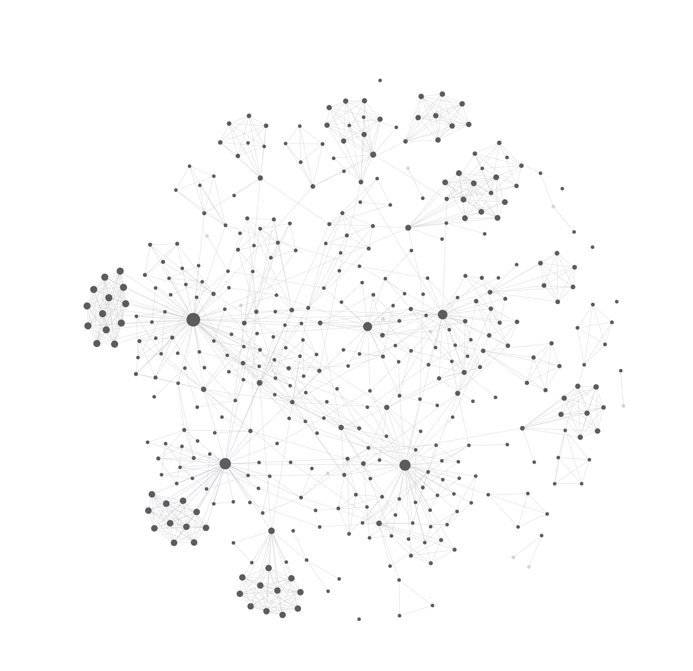

# Engram

> ⚠️ **Breaking change.** The pre-vault TOML memory-record storage layer
> (`~/.local/share/engram/memory/`) was removed. Engram now writes only
> to an agent-memory Obsidian vault. Migration from the
> old layout is not automated. An LLM should be able to migrate easily.

## Overview

Engram gives Claude Code and Pi agents persistent memory via a zettelkasten-style vault. Two skills — `recall` and `learn` — read from and write to an agent-memory vault on demand; at their write sites they hand off to `write-memory`, a worker skill that composes and executes the vault-write commands. A further skill, `please`, orchestrates end-to-end work by sequencing recall, learn, and other skills around a user's `<ask>`, and `route` encodes the delegate-everything doctrine `please` draws on to staff its subagents. `recall`, `learn`, and `write-memory` shell out to the `engram` binary; `please` and `route` are pure meta-orchestration.

`engram update` installs the skills into Claude Code and Pi, and the vault is harness-agnostic — so `recall` and `learn` work the same on each. Automatic sweeping of raw session transcripts into the chunk index reads Claude Code JSONL and Pi session files.

After a few months of use, the vault's wikilink graph looks like this in Obsidian — each dot is a note, each line a `[[wikilink]]`; dense clusters are groups of related notes, and the connective tissue reflects thematic proximity:



*Screenshot pre-dates the 2026-07-10 vocab→tags migration (#678): the ~25 vocab term-note hubs visible here no longer exist — vocab membership now rides `tags: [vocab/<term>]`, not wikilinks, so a fresh graph view no longer shows these hubs.*

## Installing

Requires Go 1.25+ on `PATH`.

1. Install the binary:

   ```bash
   go install github.com/toejough/engram/cmd/engram@latest
   ```

   Make sure `$GOBIN` (or `$GOPATH/bin`, default `~/go/bin`) is on your `PATH`.

2. Copy the skills into every detected harness's user directory:

   ```bash
   engram update                 # install / refresh
   engram update --with-guidance # also sync guidance docs (recall.md, delegate.md, learn.md) to engram-owned roots; --with-guidance is one-time opt-in per file
   engram update --dry-run       # show what would change, without writing
   engram update --allow-downgrade # override the local-mode refusal to install an older revision than what's installed
   ```

   `engram update` syncs engram artifacts to engram-owned roots per harness (`~/.claude/engram/`, `~/.pi/agent/engram/`) and materializes them as symlinks in each harness's discovery paths (`~/.claude/skills/`, `~/.pi/agent/skills/`, etc.). Removals from the source propagate on every update. First update performs a dark migration of pre-existing copies to symlinks. Run it again any time to upgrade — it also reinstalls the binary via `go install`, then re-execs the fresh binary so the sync itself runs with the new logic (ADR-0023). `--with-guidance` additionally syncs guidance docs to the root's `guidance/` subtree (canonical paths) and materializes symlinks; compat symlinks at flat paths (`~/.claude/engram/*.md`) keep existing `@import` lines in CLAUDE.md and AGENTS.md resolving (Claude Code + Pi; opt-in). It's a **one-time opt-in per file** — once your CLAUDE.md (or AGENTS.md) imports a guidance file, plain `engram update` keeps it current. Until then, plain `engram update` prints a one-line hint. See ADR-0022 for the deployment-as-sync design.

## Skills

| Skill | What it does |
|-------|--------------|
| `recall` | Surfaces relevant notes and raw chunks via a single `engram query` call: a clustered **relevance** channel (recency-biased per-phrase cosine over notes+chunks → bounded matched set → one unified chunk+note clustering that builds `candidate_l2s` from within-cluster top-5 only) plus an **explore** channel (notes sampled from vocab-term centroids by proximity to the query, budgeted to the matched-note count, delivered as top-level items tagged `provenance: explore`) plus an un-clustered **recency** channel (the newest chunks, tagged `recent`). For each cluster (and the explore items) it judges coverage inline (covered/near/absent) and crystallizes via `engram amend` (update an existing note) or `engram learn` (create one), activates only the notes it actually used, then reports whether the surfaced memory changed the agent's plan. |
| `learn` | Captures the session's explicit lessons — corrections, explicit save-requests, self-discovered reversals, and confirmed approaches (positive reinforcement, user-praised or self-validated) — as permanent vault notes via `write-memory` handoffs. Along the way it mechanically sweeps every conversation and doc into the searchable chunk index (`engram ingest --auto`) and checks vocab liveness (`engram vocab stats`, auto-refitting when due), so raw event memory stays current even when no explicit lesson exists. |
| `write-memory` | Executes a vault write handed off by `recall` or `learn`: composes the `engram learn`/`amend` command from the provided fields, runs it, verifies the result, and reports the written note path. Never fires on its own judgment — a handoff is required. |
| `please` | Drives an ask end-to-end through a fixed seven-step workflow — capture, orient, plan, execute (TDD), document, complete, capture. Sequences `recall`, `learn`, and other available skills; tracks each step on the task list. Four adversarial review gates dispatch fresh per-angle reviewer subagents over the plan, each refactor, touched docs, and outward prose, blocking step completion until findings are resolved. Triggers on `/please <ask>` and natural-language phrasings of the same intent. |
| `route` | Encodes the delegate-everything doctrine: guides subagent selection (agent type, model, effort) rather than doing object-level work. Easy work goes to a cheap model (not skipped), complex work is decomposed before dispatch, and every dispatched subagent recalls first. `please` consults it when staffing gate reviewers. |

See `agent-instructions/skills/recall/SKILL.md`, `agent-instructions/skills/learn/SKILL.md`, `agent-instructions/skills/write-memory/SKILL.md`, `agent-instructions/skills/please/SKILL.md`, and `agent-instructions/skills/route/SKILL.md` for the full skill definitions.

## Vault location

Engram reads and writes a zettelkasten vault. Resolution order:

1. `--vault <path>` flag
2. `ENGRAM_VAULT_PATH` environment variable
3. `$XDG_DATA_HOME/engram/vault` (fallback: `~/.local/share/engram/vault`)

On first `engram learn` against a missing vault, the directory is
bootstrapped with a minimal `.obsidian/` config so Obsidian recognizes
it, a `.gitignore`, and a `README.md`. Other subcommands do not
bootstrap — they error with "vault not found" so the user notices.

Vault layout (flat since the 2026-06-12 flat-vault migration — notes live at the
vault root; the `Permanent/` and `MOCs/` subdirectories are retired and ignored
by the scanner):

```
<vault>/
  <luhmann-id>.<YYYY-MM-DD>.<slug>.md   atomic notes at the root
  <luhmann-id>.<YYYY-MM-DD>.<slug>.vec.json   sibling embedding sidecar
```

## Binary commands

```
engram learn feedback --slug ... --source ... --situation ... --behavior ... --impact ... --action ... [--tag <family>[/<value>] ...] [--project <slug>] [--issue <id>]
engram learn fact     --slug ... --source ... --situation ... --subject ... --predicate ... --object ... [--tag <family>[/<value>] ...] [--project <slug>] [--issue <id>]
engram learn qa       --slug ... --source ... [--question <text>] [--answer <text>|--answer-file <path>] [--contributors <basename>...] [--certainty high|medium|low]   Write a QA pair (Q+A notes) to the vault. --slug and --source required; --answer and --answer-file are mutually exclusive; --contributors repeatable, validated against the vault; --certainty defaults to medium.
engram embed apply [--all|--missing|--stale|--force|--dry-run]   (Re-)embed notes per selection (default: missing)
engram embed status                    Report counts per state (total / with-embeddings / without / stale / incompatible / broken)
engram query --phrase <p> [--phrase <p>...] [--limit N] [--project <slug>] [--chunks-dir <dir>] [--content-budget N] [--recent-fill N] [--lazy-chunks]   Semantic search over vault notes + chunk index; YAML output. `--limit` (default 20) caps the returned `items[]` count — a real, enforced cap, not report-only metadata. With `ENGRAM_PARENT` set, merges local + parent results into one payload — see [Merged recall](#merged-recall-engram_parent). Recency-weights chunks AND notes. Builds a bounded matched set (per-phrase top-30, union/dedup, relevance floor 0.25, cap ~300), clusters it in one pass (AutoK k-means), emits `candidate_l2s: [{path, cosine, content}]` per cluster — within-cluster top-5 notes only — plus superseded-note ride-alongs at the next rank. Separately samples an **explore** half from vocab-term centroids by proximity to the query (softmax allocation, budgeted to the matched-note count, δ=0.05 match-evidence bonus for terms with an exploit-half member, core-first within-term selection, dedupe+backfill), delivered as top-level `items[]` entries (`provenance: explore`, `source_term`; budget reported in `explore_allocated`, a term → delivered-count map, always present — `{}` on missing/unreadable centroid data). Appends the newest chunks un-clustered (tagged `recent`; default 25, controlled by `--recent-fill`). `--content-budget` caps how many chunk items render with full content (default 15; later chunks get a snippet). `--lazy-chunks` renders matched chunk items path/score only — the agent fetches evidence on demand via `engram show-chunk`. Activation is agent-driven — the binary emits no `activated` flag. --project restricts items to notes whose frontmatter `project:` matches.
engram query-chunks --phrase <p> [--phrase <p>...] [--limit N] [--chunks-dir <dir>]   Semantic search over the chunk index only (YAML output). Scores chunks by max cosine across phrases; clusters results with AutoK k-means. No vault notes, no recency channel — chunk-space search only.
engram resituate --note <ref> --situation <text>   Rewrite a note's situation field in sync: frontmatter, body opener, and sidecar situation_vector (D4/INV-S2). Both flags required; no --dry-run.
engram check   Run vault-invariant checks; exit non-zero and list FAIL items on violations
engram ingest [--auto]   Merge-append session transcripts + markdown into the per-source chunk index — re-chunks/re-embeds only changed content; within one source this is append-only (a re-chunk never drops a prior record). Across sources, byte-identical content is deduplicated by content hash: only one canonical copy per hash group is indexed, and a duplicate's index file is removed only once its retained twin's index file is verified to cover every one of its own records — never on hash-match alone. `--auto` sweeps all known sources, skips session-log directories whose slugified project path starts with a non-persistent-workspace prefix (slugified forms of `/private/tmp`, `/tmp`, and macOS `$TMPDIR`), and additionally drops any resolved sweep root whose own path sits under `/tmp`, `/private/tmp`, `/var/folders`, or `/private/var/folders` — preventing eval/test runs from bloating the main index. An ancestor `.claude` dir's sweep also now excludes its `jobs/` subdirectory (agent-harness scratch, including whole snapshot copies of the vault) — matching the exclude the `.pi` ancestor sweep already had; `.claude/jobs` was previously swept and indexed. Configurable via `.engram/sweep.json` (`non_persistent_prefixes` / `non_persistent_path_prefixes` keys); bypassed by explicit `--sweep`/`--transcript`/`--markdown`/`--pi-sessions` or an isolated index via `ENGRAM_CHUNKS_DIR`. Used by /learn and /recall.
engram prune [--empty [--dry-run]] [--duplicates [--dry-run]]   Detach chunk index entries whose source file no longer exists (GC). Operator-run; reads the manifest and drops the stale per-source manifest entry, keeping the embedded chunks on disk (still searchable). `--empty` instead removes existing 0-byte `.jsonl` chunk-index files left by zero-record sources (ranking-neutral — empties hold zero records); `--duplicates` retroactively collapses every exact-content-hash group down to one canonical member, removing the rest's index files + manifest entries — safe by construction (a duplicate is removed only once its retained twin's index file is verified to cover its records; otherwise refused, not removed) and convergent (a second run removes nothing); `--dry-run` previews the count without deleting or removing. Not part of the recall/learn/please flows.
engram count [--group-by <attr> [--filter <attr=value>...]] [--backlinks-of <basename>]   Read-only vault aggregation, off the query/similarity path. `--group-by` counts distinct note membership per frontmatter attribute value (list attrs count one per distinct element; a value listed twice in one note still counts once), optionally restricted by repeatable AND-ed `--filter attr=value` predicates (scalar equality or list-contains); output is `value<TAB>count` lines sorted count-desc then value-asc, an `(attr absent): N` bucket when any in-set note lacks the attribute, then `total: N` (empty result prints nothing). `--backlinks-of <basename>` prints a vault-graph node's wikilink in-degree plus its sorted linkers. The two modes are mutually exclusive and each independently Obsidian-verifiable (group-by against a property/tag filter, backlinks-of against the backlinks panel) — they are NOT equal to each other: backlinks-of counts every linker (e.g. an index/MOC page) while group-by counts only frontmatter members, so the two diverge by the count of non-member linkers.
engram show <ref> [--parent]   Print a note (frontmatter + body) and its outbound wikilink targets, read-only. One required positional; no --ref flag. (candidate_l2s carry content inline, so /recall no longer shows candidates.) `--parent` resolves the ref against `ENGRAM_PARENT` instead of the local vault — errors if unset.
engram show-chunk <source#anchor> [--chunks-dir <dir>] [--parent]   Print a chunk's text by its source#anchor id (read-only). Used by /recall with `--lazy-chunks` to fetch a specific chunk's evidence on demand. `--parent` resolves the id against `ENGRAM_PARENT` instead of the local chunk index — errors if unset.
engram amend --target <ref> [--activate] [--supersedes "<basename>|<type>|<claim>"] [--chunk-source <source#anchor>...] [--situation/--subject/--predicate/--object | --behavior/--impact/--action ...]   Amend a note in place: merge chunk-source provenance (idempotent), overwrite only supplied content fields, re-embed only on a content change; `--activate` bumps `LastUsed`; `--supersedes` writes typed supersession frontmatter + inverse + body line. The /recall update path: covered link-enriches, near re-synthesizes content.
engram activate --note <path> [--note <path>...]   Mark note(s) as recently used — bumps `LastUsed` in the sidecar so usefulness keeps useful notes fresh (called by /recall on only the notes the agent actually used). `--note` paths are vault-relative (resolved against the vault root / `ENGRAM_VAULT_PATH`); absolute paths are used as-is.
engram vocab bootstrap --seed <yaml> [--floor <f>]     Seed vocab definition fact notes (bare `vocab` tag plus their own `vocab/<term>` self-tag per term — one family note stays bare-only) from the validated term set (--seed, required); embed them; tag all existing notes with `vocab/<term>` entries in the shared `tags:` list (no separate index file — the index is emergent via `engram count`). --floor sets the minimum cosine similarity for vocab assignment (default 0.35). Idempotent.
engram vocab tag-definitions [--vault <dir>]  Idempotent backfill: adds the missing `vocab/<term>` self-tag to every existing per-term definition note (skips the family note). Tags are not content-hash inputs so no re-embed occurs. `--vault` overrides the vault root.
engram vocab propose --term <t> --description <d>  LLM-gated: create a new vocab definition note if no existing term covers it and projected attachment ≤ 20% of vault (~$0.05/proposal). Both flags required.
engram vocab stats                     Per-term member counts, vault untagged-rate, hub terms (> 25% of vault), orphan terms (< 2 members), version staleness.
engram vocab refit [--dry-run] [--names <file>]  Derivational: derives the vocabulary from the vault's note embeddings; matches clusters to existing terms, retires unmatched derived terms (proposed terms are never auto-retired), and emits naming requests for new clusters — answer via --names <file>. --dry-run previews the matched/new/retired diff. Rewrites member `tags:` entries in the `vocab/<term>` namespace; major version bump on the family definition note (no index to regenerate — the index is emergent). Triggered growth-only (≥40 new notes AND ≥14 days).
engram update [--with-guidance]        Refresh binary, re-exec the fresh binary for the sync phase (ADR-0023); sync agents-instructions/{skills,guidance} to engram-owned roots and materialize as symlinks; removals propagate; dark migration on first sync ([--dry-run] previews, never installs/re-execs); --with-guidance includes guidance (canonical paths in guidance/, compat symlinks at flat paths) (Claude Code + Pi; opt-in; see ADR-0022). Local-mode installs refuse a provable downgrade (installed binary's revision not an ancestor of the module root's HEAD); override with --allow-downgrade
```

## `engram serve` & the two-doors model

One vault is one node, and one node has exactly one brain — but it has two doors. The **local door** is the CLI running directly against the vault: every command, including the host-only ones (`ingest`, `vocab refit`, `prune`, `check`, `update`, `resituate`), lives here and commits immediately. It is never served over HTTP. The **network door** is `engram serve` — the same node's HTTP surface for remote callers, exposing only a fixed subset (`query`, `query-chunks`, `show`, `show-chunk`, `activate`, `learn`, `amend`). Both doors run the exact same `Run*` code paths and share the exact same vault flocks (ADR-0013), so a local write and a served write racing the same vault never lose an update — there is no separate server-side implementation to keep in sync.

The two doors differ in write semantics, not in code path: a local `learn`/`amend` commits as a normal, immediately-live note. A served `learn`/`amend` always lands as a **pending offer** — a normal note carrying a pending marker, excluded from query results until a curation pass (the `curate` skill) judges it covered/near/absent against the existing vault and folds it in or discards it. This is deliberate: a served write is a caller outside the host asking to contribute, not the vault owner's own act of record.

Set `ENGRAM_SERVER=http://host:port` to make the CLI a transparent HTTP client for the served command set — same syntax, same output shape, no code path change. A served `learn`/`amend` stamps the note's `user:` field from whatever identity the calling instance declares in the request body (client-detected, the same way `repo:` already works) — no external authentication service is required or consulted; the server rejects only an empty declared identity, nothing else. Trust for a served write rests on network reachability of the server itself, not on edge-authenticated SSO.

### Merged recall: `ENGRAM_PARENT`

`ENGRAM_SERVER` is exclusive — set, the CLI runs entirely against that remote with zero local file access; unset, entirely local. `ENGRAM_PARENT=http://host:port` is a different, additive mechanism: it names this node's single parent vault (the vault-graph is a tree — personal → team → org — never a mesh, so a node has at most one parent) and layers a merge step on top of the local pipeline, not instead of it. `engram query` runs locally and fetches the parent's `/query` unmodified, then interleaves both result sets into one payload ranked by descending score. The merge is unconditional — it never refuses or falls back on an embedding `model_id` mismatch between local and parent (score comparability across differently-versioned models is an inherent approximation), so a fleet can roll out model upgrades node-by-node without breaking merged recall; each item carries its source's `model_id` as a visible, non-gating signal instead, and a `from_parent` boolean so an agent knows where an item came from. That matters for follow-up lookups: `engram show`/`engram show-chunk` accept a `--parent` flag to resolve a specific ref against the parent instead of local — note refs (bare Luhmann ids) are minted purely from each vault's own local id set, so the same ref can name unrelated notes in two vaults, and a naive local-first lookup could silently return the wrong one. If the parent is unreachable, `engram query` degrades to local-only results with a warning rather than failing. `ENGRAM_SERVER`, when also set, takes full precedence — `ENGRAM_PARENT` and `--parent` are both inert in that case.

**BREAKING:** `--limit` is now a real, enforced cap on `engram query`'s returned `items[]` count, in every mode — local, `ENGRAM_SERVER`-exclusive, and `ENGRAM_PARENT`-merged alike. It was previously report-only metadata; actual item count was governed by clustering/candidate-nomination sizing with no hard ceiling. Existing callers will see at most 20 items by default where they previously saw more.

## Semantic search & the embed-on-write pipeline

Engram bundles `all-MiniLM-L6-v2` (384-d) inside the binary via `go:embed`; inference is pure Go through [Hugot](https://github.com/knights-analytics/hugot) + [GoMLX](https://github.com/gomlx/gomlx)'s `simplego` backend — no CGO, no daemon, no API key. Every note (`<id>.<date>.<slug>.md`) gets a sibling `.vec.json` sidecar written on `engram learn`.

For the sidecar shape and the dual-vector / recency-decay / `content_hash` mechanics, see `docs/GLOSSARY.md` (the *sidecar* entry) and `docs/architecture/adr.md` (ADR-0002, ADR-0003). For the `engram query` matched-set + clustering pipeline, see the `engram query` line under [Binary commands](#binary-commands) above (and the recall-pipeline flowchart in `docs/architecture/c2-containers.md`) — the algorithm is not restated here.

`engram embed` CLI reference:

- `engram embed status` — per-state counts: `ok` / `missing` / `stale` / `incompatible` / `broken`.
- `engram embed apply [--missing|--stale|--force|--all|--dry-run]` — (re-)embed notes per selection: `--missing` (default) only notes without sidecars; `--stale` also body-changed + broken sidecars; `--force` also model_id mismatches; `--all` every note; `--dry-run` reports without writing.

Inputs longer than 1500 chars are truncated to MiniLM-L6's 512-token limit — a non-issue for engram's 200–500-word notes.

## Project structure

```
cmd/engram/          CLI entry point: wiring-only single-statement main() composing cli.Primitives from checker-thin per-capability-group functions of raw capability references (all adapter composition lives in internal/cli via cli.NewDeps; enforced by targ check-thin-api)
internal/            Business logic (DI boundaries)
  chunk/             Splits transcripts/markdown into embedding-sized chunks for the chunk index (pure string logic, no I/O)
  cli/               CLI command wiring (targ targets)
  cluster/           k-means clustering with silhouette-based auto-K, for recall clustering
  context/           Transcript processing
  debuglog/          Structured debug logging
  embed/             Embedder interface + Hugot/GoMLX backend, sidecar I/O, state classification
  luhmann/           Luhmann-ID allocation under file lock
  transcript/        Session transcript reading (Claude Code + Pi JSONL), read by engram ingest
  update/            Self-refresh subcommand
  vaultgraph/        Vault traversal (wikilink graph, note scanning)
agent-instructions/
  skills/            Source for the recall, learn, write-memory, please, and route skills
  guidance/          Source for the deployable ambient guidance docs — recall-firing (recall.md), delegation-firing (delegate.md), and learn-firing (learn.md)
```

## Development

- `go install ./cmd/engram` — install the binary (targ has no `build` target; it covers check/test/lint only)
- `targ test` — run unit + integration tests
- `targ check-full` — lint + coverage (use this to see ALL errors at once)
- Never run `go test` / `go build` / `go vet` directly — use `targ`

## Design principles

Design principles and their rationale live in `docs/architecture/adr.md` — the authoritative source; this README covers orientation and the CLI reference only.

## Documentation

See `docs/README.md` for the full documentation index — glossary, roadmap, shipped features, architecture, and proven results, one obvious place to start.
