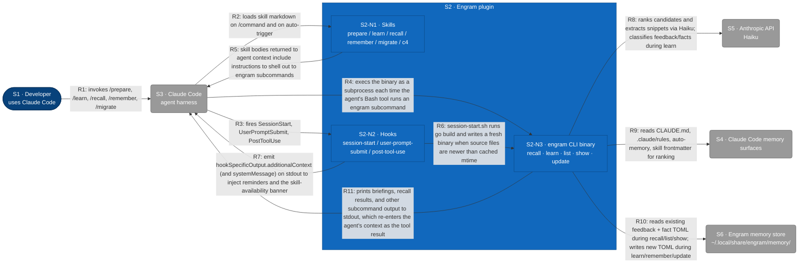

# C2 — Engram plugin (Container)

Refines L1's E2 Engram plugin into three internal containers — skill markdown files that drive agent behavior, shell hooks fired on Claude Code lifecycle events, and a Go CLI binary that performs all computation. External actors and the on-disk store keep their L1 E-IDs.

## Element Catalog

| ID | Name | Type | Responsibility | System of Record |
|---|---|---|---|---|
| S1 | Developer | Person | Engineer who triggers slash-commands and writes prompts that produce memories | Human, at a Claude Code session |
| S2 | Engram plugin | The system in scope | Plugin providing persistent, query-ranked memory: skills decide when to load context, a slim Go binary computes recall/learn, hooks remind the agent at session and tool-use boundaries | This repository (`github.com/toejough/engram`) |
| S3 | Claude Code | External system | Agent harness that loads skills, fires hooks, and execs the engram binary when the agent shells out | Anthropic Claude Code CLI |
| S4 | Claude Code memory surfaces | External system | Read-only inputs to recall ranking: project + user `CLAUDE.md`, `.claude/rules/*.md`, auto-memory, skill frontmatter | Owned by Claude Code and the user |
| S5 | Anthropic API | External system | Haiku model used for candidate ranking, snippet extraction, and learn-time classification | `api.anthropic.com` |
| S6 | Engram memory store | External system | On-disk memory state: feedback TOML under `~/.local/share/engram/memory/feedback/` and fact TOML under `~/.local/share/engram/memory/facts/`. The filesystem belongs to the OS; Engram only reads and writes within these paths | XDG data home on the user's machine |
| S2-N1 | Skills | The system in scope | Markdown skill files (`skills/{prepare,learn,recall,remember,migrate,c4}/SKILL.md`) that Claude Code loads on command or auto-trigger; bodies instruct the agent to call `engram` subcommands and present results | This repo, under `skills/` |
| S2-N2 | Hooks | The system in scope | Three bash scripts (`hooks/session-start.sh`, `hooks/user-prompt-submit.sh`, `hooks/post-tool-use.sh`) wired by `hooks/hooks.json`; emit JSON `additionalContext`, async-rebuild the binary on SessionStart | This repo, under `hooks/` |
| S2-N3 | engram CLI binary | The system in scope | Go binary (entry `cmd/engram/main.go`) implementing subcommands `recall`, `learn {feedback,fact}`, `list`, `show`, `update`. All I/O lives here; pure logic in `internal/{recall,memory,cli,…}`. Built by `session-start.sh` to `~/.claude/engram/bin/engram`; execed by Claude Code | This repo |

## Relationships

| ID | From | To | Description | Protocol/Medium |
|---|---|---|---|---|
| R1 | S1 | S3 | invokes /prepare, /learn, /recall, /remember, /migrate | Claude Code CLI / TTY |
| R2 | S3 | S2-N1 | loads skill markdown on /command and on auto-trigger | Plugin manifest, file read |
| R3 | S3 | S2-N2 | fires SessionStart, UserPromptSubmit, PostToolUse | Subprocess exec, stdin JSON |
| R4 | S3 | S2-N3 | execs the binary as a subprocess each time the agent's Bash tool runs an engram subcommand | Subprocess exec |
| R5 | S2-N1 | S3 | skill bodies returned to agent context include instructions to shell out to engram subcommands | Skill body text rendered into context |
| R6 | S2-N2 | S2-N3 | session-start.sh runs go build and writes a fresh binary when source files are newer than cached mtime | go build, file mtime check, file write |
| R7 | S2-N2 | S3 | emit hookSpecificOutput.additionalContext (and systemMessage) on stdout to inject reminders and the skill-availability banner | Hook stdout JSON |
| R8 | S2-N3 | S5 | ranks candidates and extracts snippets via Haiku; classifies feedback/facts during learn | HTTPS, Anthropic Messages API (Haiku) |
| R9 | S2-N3 | S4 | reads CLAUDE.md, .claude/rules, auto-memory, skill frontmatter for ranking | Local file reads (read-only) |
| R10 | S2-N3 | S6 | reads existing feedback + fact TOML during recall/list/show; writes new TOML during learn/remember/update | Local file I/O, TOML |
| R11 | S2-N3 | S3 | prints briefings, recall results, and other subcommand output to stdout, which re-enters the agent's context as the tool result | stdout |

## Cross-links

- Parent: [c1-engram-system.md](c1-engram-system.md) (refines **S2 · Engram plugin**)
- Refined by: *(none yet)*
