# C3 — engram CLI binary (Component)

Refines L2's E9 engram CLI binary into nine internal components. The shell of the binary (cmd/engram/main.go) only wires cli.Targets into targ.Main; all command logic, I/O adapters, and external integrations live under internal/. Pure-logic packages (recall, memory, tomlwriter) take all I/O as DI interfaces; thin adapter shims live in internal/cli so concrete I/O is wired only at the edge of the binary.

> Diagram source: [svg/c3-engram-cli-binary.mmd](svg/c3-engram-cli-binary.mmd). Re-render with
> `npx @mermaid-js/mermaid-cli -i architecture/c4/svg/c3-engram-cli-binary.mmd -o architecture/c4/svg/c3-engram-cli-binary.svg`.
> Pre-rendered because GitHub's Mermaid lacks the ELK layout engine, which is needed to
> separate bidirectional R/D edges between the same node pair.

## Element Catalog

| ID | Name | Type | Responsibility | Code Pointer |
|---|---|---|---|---|
| S2-N3 | engram CLI binary | Container in focus | Go binary entry cmd/engram/main.go, wiring internal/cli.Targets into targ.Main. | — |
| S3 | Claude Code | External system | Execs the binary as a subprocess each time the agent's Bash tool runs an engram subcommand; consumes its stdout. | — |
| S4 | Claude Code memory surfaces | External system | Read-only inputs: project + user CLAUDE.md, .claude/rules/*.md, auto-memory, skill frontmatter. | — |
| S5 | Anthropic API | External system | Haiku model used for recall ranking, snippet extraction, and learn-time classification. | — |
| S6 | Engram memory store | External system | On-disk feedback + fact TOML state under ~/.local/share/engram/memory/. | — |
| S2-N3-M1 | main.go | Component | Process entry. Calls cli.SetupSignalHandling and forwards cli.Targets into targ.Main. No business logic; excluded from coverage per project convention. | [../../cmd/engram/main.go](../../cmd/engram/main.go) |
| S2-N3-M2 | cli | Component | Subcommand dispatch for all five subcommands plus the embedded business-logic handlers for show, list, learn, and update (show.go, list.go, learn.go, update.go). Owns *Args arg structs and thin I/O adapter shims (os.ReadFile, os.ReadDir, os.UserHomeDir, os.Getwd, os.Getenv, exec.Command). Wires DI interfaces into the pure-logic packages. See Drift Notes — these handlers are intended to live as peer packages alongside `recall`. | [../../internal/cli](../../internal/cli) |
| S2-N3-M3 | recall | Component | Recall pipeline: orchestrator + per-source phases (CLAUDE.md, auto-memory, skill, transcript). Pure logic; consumes Finder, TranscriptReader, Summarizer, MemoryLister via DI. Currently the only subcommand with a dedicated package; the other four are absorbed into cli. | [../../internal/recall](../../internal/recall) |
| S2-N3-M4 | context | Component | Session transcript parsing: reads .jsonl lines, computes deltas, strips tool-summary noise within a budget. | [../../internal/context](../../internal/context) |
| S2-N3-M5 | memory | Component | Shared types and read-modify-write helpers for feedback (feedback/) and fact (facts/) memory TOML files; defines FactsDir / FeedbackDir paths under the data directory. | [../../internal/memory](../../internal/memory) |
| S2-N3-M6 | externalsources | Component | Reads ranking inputs outside the engram store: project + user CLAUDE.md, .claude/rules/*.md, auto-memory, skill frontmatter; resolves frontmatter imports; caches per-discover-call. | [../../internal/externalsources](../../internal/externalsources) |
| S2-N3-M7 | anthropic | Component | Anthropic Messages API client. Owns the HTTP request, error sentinels, and exposes a CallerFunc consumed by recall.NewSummarizer. Pinned to claude-haiku-4-5-20251001. | [../../internal/anthropic](../../internal/anthropic) |
| S2-N3-M8 | tokenresolver | Component | Resolves the Anthropic API token from ANTHROPIC_API_KEY env or, on darwin, the macOS Keychain via security. Documented to never return a non-nil error. | [../../internal/tokenresolver](../../internal/tokenresolver) |
| S2-N3-M9 | tomlwriter | Component | TOML serialization for new / updated feedback and fact memory files. | [../../internal/tomlwriter](../../internal/tomlwriter) |

## Relationships

| ID | From | To | Description | Protocol/Medium |
|---|---|---|---|---|
| R1 | S3 | S2-N3-M1 | execs the binary as a subprocess (Bash tool) | Subprocess exec |
| R2 | S2-N3-M1 | S2-N3-M2 | builds CLI targets and runs targ.Main | Go function call |
| R3 | S2-N3-M2 | S2-N3-M3 | delegates the recall pipeline (Orchestrator + phases) to the dedicated recall package — the one subcommand currently extracted from cli (see Drift Notes) | Go function call |
| R4 | S2-N3-M2 | S2-N3-M5 | reads / writes feedback + fact TOML through memory types and helpers | Go function call |
| R5 | S2-N3-M2 | S2-N3-M6 | discovers external source paths and shares the cache via discoverExternalSources | Go function call |
| R6 | S2-N3-M2 | S2-N3-M7 | builds the Anthropic caller used by recall.NewSummarizer | Go function call |
| R7 | S2-N3-M2 | S2-N3-M8 | resolves API token (env or Keychain) before any LLM call | Go function call |
| R8 | S2-N3-M3 | S2-N3-M4 | reads + strips session transcripts within budget | Go function call |
| R9 | S2-N3-M3 | S2-N3-M5 | lists memories during recall ranking | Go function call |
| R10 | S2-N3-M3 | S2-N3-M7 | ranks candidates and extracts snippets via Haiku (through DI Summarizer) | Go function call |
| R11 | S2-N3-M3 | S2-N3-M6 | reads CLAUDE.md / rules / auto-memory / skill frontmatter (cached) | Go function call |
| R12 | S2-N3-M2 | S2-N3-M9 | writes new TOML on learn / remember / update | Go function call |
| R13 | S2-N3-M2 | S3 | prints briefings, recall results, and list / show output to stdout | stdout |
| R14 | S2-N3-M7 | S5 | HTTPS POST /v1/messages (Haiku) | HTTPS, Anthropic Messages API |
| R15 | S2-N3-M6 | S4 | reads project + user CLAUDE.md, .claude/rules, auto-memory, skill frontmatter | Local file reads (read-only) |
| R16 | S2-N3-M5 | S6 | reads existing feedback + fact TOML during recall / list / show | Local file I/O, TOML |
| R17 | S2-N3-M9 | S6 | writes new feedback + fact TOML on learn / remember / update | Local file I/O, TOML |

## Cross-links

- Parent: [c2-engram-plugin.md](c2-engram-plugin.md) (refines **S2-N3 · engram CLI binary**)
- Siblings:
  - [c3-hooks.md](c3-hooks.md)
  - [c3-skills.md](c3-skills.md)
- Refined by: *(none yet)*

## Drift Notes

- **2026-04-26** — Subcommands are not architectural equals in code: of recall, show, list, learn, and update, only recall has its business logic extracted into a peer package (internal/recall). The other four handlers live as files inside internal/cli/ (show.go, list.go, learn.go, update.go). Reason: Persisted misalignment between intent (subcommands as equals, each with its own package) and current code. Resolution: when next touching show / list / learn / update business logic, prefer extracting to internal/<subcommand>/ packages with DI interfaces, mirroring internal/recall. Update this diagram and the catalog row for E21 once peer packages exist.
