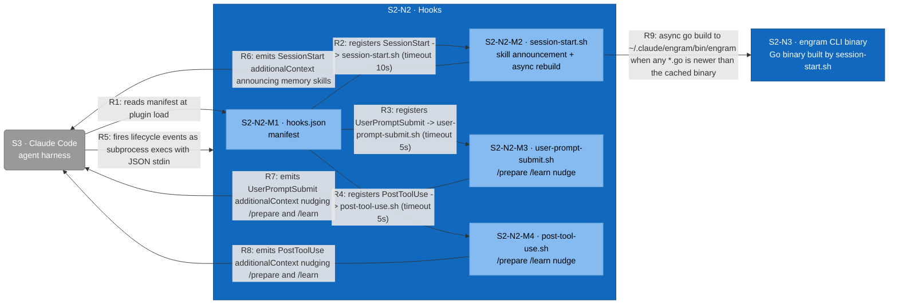

# C3 — Hooks (Component)

Refines L2's E8 Hooks container into the manifest plus three bash scripts wired to Claude Code lifecycle events. Hooks emit hookSpecificOutput.additionalContext JSON on stdout to inject reminders into the agent's context. The SessionStart hook additionally rebuilds the Go binary asynchronously when any source file is newer than the cached binary, isolating the build from the agent's own Bash provenance so macOS doesn't SIGKILL it on exec.

## Element Catalog

| ID | Name | Type | Responsibility | Code Pointer |
|---|---|---|---|---|
| S2-N2 | Hooks | Container in focus | Three bash scripts wired by hooks/hooks.json; emit JSON additionalContext, async-rebuild the binary on SessionStart. | — |
| S3 | Claude Code | External system | Reads the hook manifest at plugin load and execs the registered scripts on lifecycle events; consumes their stdout JSON to inject context. | — |
| S2-N3 | engram CLI binary | Container | Go binary built and refreshed by session-start.sh. Refined in c3-engram-cli-binary.md. | — |
| S2-N2-M1 | hooks.json | Component | Manifest mapping SessionStart, UserPromptSubmit, and PostToolUse events to their scripts via ${CLAUDE_PLUGIN_ROOT} paths and per-event timeouts (10s / 5s / 5s). | [../../hooks/hooks.json](../../hooks/hooks.json) |
| S2-N2-M2 | session-start.sh | Component | Synchronously emits the memory-skill announcement. Asynchronously rebuilds the Go binary when any *.go is newer than the cached binary mtime, deleting the prior binary first to avoid macOS provenance SIGKILL, then symlinks ~/.local/bin/engram to it. | [../../hooks/session-start.sh](../../hooks/session-start.sh) |
| S2-N2-M3 | user-prompt-submit.sh | Component | Emits additionalContext reminding the agent of /learn and /prepare boundaries on every user prompt. | [../../hooks/user-prompt-submit.sh](../../hooks/user-prompt-submit.sh) |
| S2-N2-M4 | post-tool-use.sh | Component | Emits the same /learn / /prepare reminder after each tool use. | [../../hooks/post-tool-use.sh](../../hooks/post-tool-use.sh) |

## Relationships

| ID | From | To | Description | Protocol/Medium |
|---|---|---|---|---|
| R1 | S3 | S2-N2-M1 | reads manifest at plugin load | File read |
| R2 | S2-N2-M1 | S2-N2-M2 | registers SessionStart -> session-start.sh (timeout 10s) | Manifest entry |
| R3 | S2-N2-M1 | S2-N2-M3 | registers UserPromptSubmit -> user-prompt-submit.sh (timeout 5s) | Manifest entry |
| R4 | S2-N2-M1 | S2-N2-M4 | registers PostToolUse -> post-tool-use.sh (timeout 5s) | Manifest entry |
| R5 | S3 | S2-N2 | fires lifecycle events as subprocess execs with JSON stdin | Subprocess exec, stdin JSON |
| R6 | S2-N2-M2 | S3 | emits SessionStart additionalContext announcing memory skills | Hook stdout JSON |
| R7 | S2-N2-M3 | S3 | emits UserPromptSubmit additionalContext nudging /prepare and /learn | Hook stdout JSON |
| R8 | S2-N2-M4 | S3 | emits PostToolUse additionalContext nudging /prepare and /learn | Hook stdout JSON |
| R9 | S2-N2-M2 | S2-N3 | async go build to ~/.claude/engram/bin/engram when any *.go is newer than the cached binary | Subprocess (go build), file I/O |

## Cross-links

- Parent: [c2-engram-plugin.md](c2-engram-plugin.md) (refines **S2-N2 · Hooks**)
- Siblings:
  - [c3-engram-cli-binary.md](c3-engram-cli-binary.md)
  - [c3-skills.md](c3-skills.md)
- Refined by: *(none yet)*
