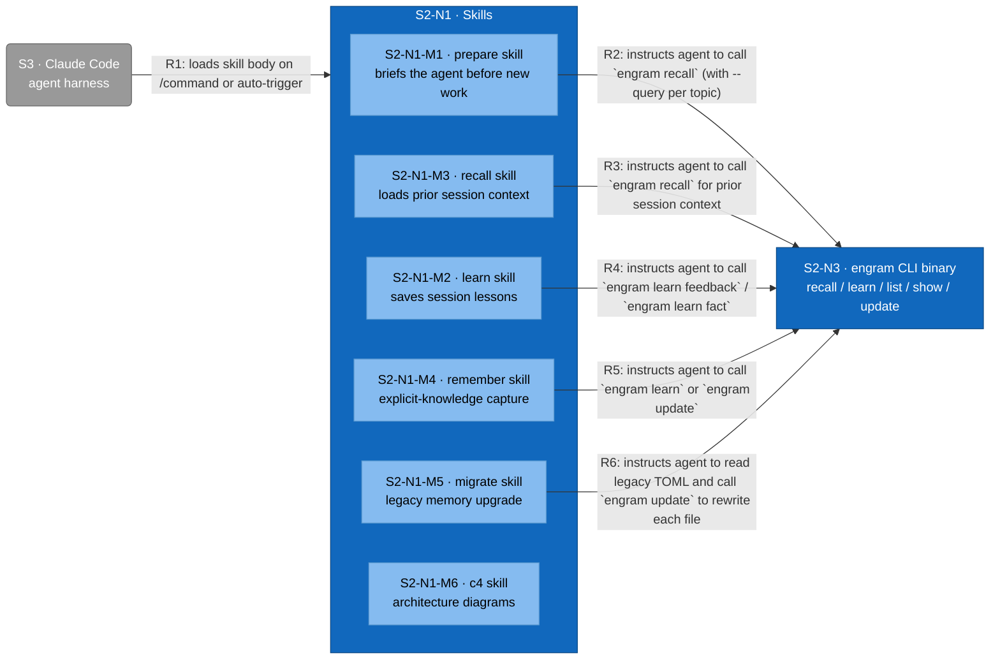

# C3 — Skills (Component)

Refines L2's E7 Skills container into the six skill markdown files Claude Code loads on slash-command or auto-trigger. Each skill body returns instructions to the agent; most instruct it to shell out to the engram CLI binary. The c4 skill is the exception — it instructs the agent to use targ and edit architecture/c4/ directly, never calling the engram binary.

## Element Catalog

| ID | Name | Type | Responsibility | Code Pointer |
|---|---|---|---|---|
| S2-N1 | Skills | Container in focus | Markdown skill files Claude Code loads on /command or auto-trigger; bodies instruct the agent to call engram subcommands and present results. | — |
| S3 | Claude Code | External system | Loads skill bodies on slash-command or auto-trigger; renders them into the agent's context as the next message. | — |
| S2-N3 | engram CLI binary | Container | Go binary that performs recall, learn, list, show, update. Refined in c3-engram-cli-binary.md. | — |
| S2-N1-M1 | prepare skill | Component | Tells the agent to make 2–3 targeted `engram recall` queries by task and present a summary. | [../../skills/prepare/SKILL.md](../../skills/prepare/SKILL.md) |
| S2-N1-M2 | learn skill | Component | Reviews the recent session for learnable feedback/facts and walks the agent through saving them via `engram learn feedback` / `engram learn fact`. | [../../skills/learn/SKILL.md](../../skills/learn/SKILL.md) |
| S2-N1-M3 | recall skill | Component | Calls `engram recall` against the project's session transcripts and surfaces relevant memories. | [../../skills/recall/SKILL.md](../../skills/recall/SKILL.md) |
| S2-N1-M4 | remember skill | Component | Captures explicit knowledge the user dictates as feedback or fact memories with user approval, via `engram learn` or `engram update`. | [../../skills/remember/SKILL.md](../../skills/remember/SKILL.md) |
| S2-N1-M5 | migrate skill | Component | Upgrades pre-cfd5fb5 (2026-04-17) flat-format memory files to the current split feedback/fact layout, calling `engram update` to rewrite each file. | [../../skills/migrate/SKILL.md](../../skills/migrate/SKILL.md) |
| S2-N1-M6 | c4 skill | Component | Generates and maintains C4 architecture diagrams under architecture/c4/. Uses targ c4-* targets; does not call the engram binary. | [../../skills/c4/SKILL.md](../../skills/c4/SKILL.md) |

## Relationships

| ID | From | To | Description | Protocol/Medium |
|---|---|---|---|---|
| R1 | S3 | S2-N1 | loads skill body on /command or auto-trigger | Plugin manifest, file read |
| R2 | S2-N1-M1 | S2-N3 | instructs agent to call `engram recall` (with --query per topic) | Skill body text → agent Bash subprocess |
| R3 | S2-N1-M3 | S2-N3 | instructs agent to call `engram recall` for prior session context | Skill body text → agent Bash subprocess |
| R4 | S2-N1-M2 | S2-N3 | instructs agent to call `engram learn feedback` / `engram learn fact` | Skill body text → agent Bash subprocess |
| R5 | S2-N1-M4 | S2-N3 | instructs agent to call `engram learn` or `engram update` | Skill body text → agent Bash subprocess |
| R6 | S2-N1-M5 | S2-N3 | instructs agent to read legacy TOML and call `engram update` to rewrite each file | Skill body text → agent Bash subprocess |

## Cross-links

- Parent: [c2-engram-plugin.md](c2-engram-plugin.md) (refines **S2-N1 · Skills**)
- Siblings:
  - [c3-engram-cli-binary.md](c3-engram-cli-binary.md)
  - [c3-hooks.md](c3-hooks.md)
- Refined by: *(none yet)*
