# C4 — anthropic (Property/Invariant Ledger)

> Component in focus: **S2-N3-M7 · anthropic**.
> Source files in scope:
> - [internal/anthropic/anthropic.go](internal/anthropic/anthropic.go)
> - [internal/anthropic/anthropic_test.go](internal/anthropic/anthropic_test.go)

## Context (from L3)

E26 anthropic is the shared client for the Anthropic Messages API. It owns the HTTP request shape, the API-version / beta-header pinning, the error sentinels, and the small `CallerFunc` adapter consumed by `recall.NewSummarizer`. Its single external dependency is the Anthropic API (E5), reached via R14 (HTTPS POST /v1/messages). cli constructs a `*Client` at startup, wiring in the `HTTPDoer` (`http.DefaultClient`) — the only true DI seam on the package. The `token` and `apiURL` fields are plain string configuration values (not interfaces / function values) so they don't appear on the manifest under the new schema. Recall (E22) consumes the resulting `CallerFunc` purely as a function value; it does not see the `Client` struct.



> Diagram source: [svg/c4-anthropic.mmd](svg/c4-anthropic.mmd). Re-render with
> `npx @mermaid-js/mermaid-cli -i architecture/c4/svg/c4-anthropic.mmd -o architecture/c4/svg/c4-anthropic.svg`.
> Pre-rendered because GitHub's Mermaid lacks the ELK layout engine, which is needed to
> separate bidirectional R-edges between the same node pair.

**Legend:**
- Yellow = focus component (S2-N3-M7 · anthropic).
- Blue components = sibling components in c3-engram-cli-binary.md.
- Grey = external systems (S5 · Anthropic API).
- R-edges carry inline property IDs `[P…]` linking to the Property Ledger.
- All edges traceable to a relationship in c3-engram-cli-binary.md.

## Wiring

Each edge is one or more DI seams the wirer plugs into anthropic, deduped by the
wrapped entity (label = SNM ID). The Dependency Manifest below shows the
per-seam breakdown.


> Diagram source: [svg/c4-anthropic-wiring.mmd](svg/c4-anthropic-wiring.mmd). Re-render with
> `npx @mermaid-js/mermaid-cli -i architecture/c4/svg/c4-anthropic-wiring.mmd -o architecture/c4/svg/c4-anthropic-wiring.svg`.

## Dependency Manifest

Each row is one DI seam the focus consumes. The wrapped entity is the diagram
node (component or external) the seam ultimately drives behavior against; it
must also appear on the call diagram. The wiring diagram dedupes manifest
rows by wrapped entity.

| Field | Type | Wired by | Wrapped entity | Properties |
|---|---|---|---|---|
| `client` | `HTTPDoer` | [S2-N3-M2 · cli](c3-engram-cli-binary.md#s2-n3-m2-cli) ([c4-cli.md](c4-cli.md)) | `S5` | S2-N3-M7-P2–P11 |

## Property Ledger

| ID | Property | Statement | Enforced at | Tested at | Notes |
|---|---|---|---|---|---|
| <a id="s2-n3-m7-p1-empty-token-short-circuit"></a>S2-N3-M7-P1 | Empty token short-circuit | For all calls to `Client.Call` where the configured `token` is the empty string, the method returns `ErrNoToken` and performs no HTTP request. | [internal/anthropic/anthropic.go:55](../../internal/anthropic/anthropic.go#L55) | [internal/anthropic/anthropic_test.go:116](../../internal/anthropic/anthropic_test.go#L116) | Guard runs before `doRequest`, so the injected `HTTPDoer` is never invoked. |
| <a id="s2-n3-m7-p2-bearer-authorization-header"></a>S2-N3-M7-P2 | Bearer authorization header | For all successful HTTP requests issued by `Client.Call`, the `Authorization` header equals `"Bearer " + token`. | [internal/anthropic/anthropic.go:107](../../internal/anthropic/anthropic.go#L107) | [internal/anthropic/anthropic_test.go:167](../../internal/anthropic/anthropic_test.go#L167) |   |
| <a id="s2-n3-m7-p3-pinned-api-version-header"></a>S2-N3-M7-P3 | Pinned API version header | For all HTTP requests issued by `Client.Call`, the `Anthropic-Version` header equals `"2023-06-01"`. | [internal/anthropic/anthropic.go:108](../../internal/anthropic/anthropic.go#L108) | [internal/anthropic/anthropic_test.go:168](../../internal/anthropic/anthropic_test.go#L168) | Constant pinned at file scope (`apiVersion`). |
| <a id="s2-n3-m7-p4-pinned-beta-header"></a>S2-N3-M7-P4 | Pinned beta header | For all HTTP requests issued by `Client.Call`, the `Anthropic-Beta` header equals `"oauth-2025-04-20"`. | [internal/anthropic/anthropic.go:109](../../internal/anthropic/anthropic.go#L109) | [internal/anthropic/anthropic_test.go:169](../../internal/anthropic/anthropic_test.go#L169) | Constant pinned at file scope (`betaHeader`). |
| <a id="s2-n3-m7-p5-json-content-type"></a>S2-N3-M7-P5 | JSON content-type | For all HTTP requests issued by `Client.Call`, the `Content-Type` header equals `"application/json"` and the body is a JSON-marshalled `request` struct with snake_case fields (`model`, `max_tokens`, `system`, `messages`). | [internal/anthropic/anthropic.go:110](../../internal/anthropic/anthropic.go#L110) | [internal/anthropic/anthropic_test.go:170](../../internal/anthropic/anthropic_test.go#L170) | `tagliatelle` lint suppression documents that snake_case is required by the Anthropic API. |
| <a id="s2-n3-m7-p6-context-propagation"></a>S2-N3-M7-P6 | Context propagation | For all calls `Client.Call(ctx, ...)`, the outgoing HTTP request is constructed with `http.NewRequestWithContext(ctx, …)` so the caller's context governs cancellation and deadlines. | [internal/anthropic/anthropic.go:97](../../internal/anthropic/anthropic.go#L97) | **⚠ UNTESTED** | Architectural: required by project rule (`http.NewRequestWithContext` not `http.Get`). No test currently asserts cancellation semantics. |
| <a id="s2-n3-m7-p7-nil-response-sentinel"></a>S2-N3-M7-P7 | Nil response sentinel | For all calls where the injected `HTTPDoer.Do` returns `(nil, nil)`, `Client.Call` returns `ErrNilResponse`. | [internal/anthropic/anthropic.go:117](../../internal/anthropic/anthropic.go#L117) | [internal/anthropic/anthropic_test.go:105](../../internal/anthropic/anthropic_test.go#L105) | Guards against doer implementations that violate the `http.RoundTripper` contract. |
| <a id="s2-n3-m7-p8-non-2xx-wraps-errapierror"></a>S2-N3-M7-P8 | Non-2xx wraps ErrAPIError | For all HTTP responses with status code outside [200, 300), `Client.Call` returns an error that wraps `ErrAPIError` and includes the status code and the API error message (or raw body if not parseable). | [internal/anthropic/anthropic.go:128](../../internal/anthropic/anthropic.go#L128), [:218](../../internal/anthropic/anthropic.go#L218) | [internal/anthropic/anthropic_test.go:16](../../internal/anthropic/anthropic_test.go#L16), [:38](../../internal/anthropic/anthropic_test.go#L38), [:58](../../internal/anthropic/anthropic_test.go#L58) | Tested with 401 (JSON error body), 502 (non-JSON body), and 429 (rate-limit JSON). |
| <a id="s2-n3-m7-p9-empty-content-sentinel"></a>S2-N3-M7-P9 | Empty content sentinel | For all 2xx responses whose JSON body decodes to a `response` with zero content blocks, `Client.Call` returns `ErrNoContentBlocks`. | [internal/anthropic/anthropic.go:239](../../internal/anthropic/anthropic.go#L239) | [internal/anthropic/anthropic_test.go:79](../../internal/anthropic/anthropic_test.go#L79) |   |
| <a id="s2-n3-m7-p10-returns-first-content-block-text"></a>S2-N3-M7-P10 | Returns first content block text | For all 2xx responses with at least one content block, `Client.Call` returns the `text` field of the first content block and a nil error. | [internal/anthropic/anthropic.go:243](../../internal/anthropic/anthropic.go#L243) | [internal/anthropic/anthropic_test.go:126](../../internal/anthropic/anthropic_test.go#L126) | Subsequent blocks (if any) are silently dropped — current Haiku usage returns a single text block. |
| <a id="s2-n3-m7-p11-response-body-always-closed"></a>S2-N3-M7-P11 | Response body always closed | For all paths that reach a non-nil `*http.Response`, `Client.Call` closes `resp.Body` exactly once before returning. | [internal/anthropic/anthropic.go:121](../../internal/anthropic/anthropic.go#L121) | **⚠ UNTESTED** | Architectural: deferred close immediately after nil-check. No test directly observes leak. |
| <a id="s2-n3-m7-p12-api-url-override"></a>S2-N3-M7-P12 | API URL override | For all clients on which `SetAPIURL(url)` has been called, every subsequent `Client.Call` POSTs to `url` instead of the default `https://api.anthropic.com/v1/messages`. | [internal/anthropic/anthropic.go:75](../../internal/anthropic/anthropic.go#L75), [:100](../../internal/anthropic/anthropic.go#L100) | [internal/anthropic/anthropic_test.go:199](../../internal/anthropic/anthropic_test.go#L199) | Test-only seam. Production code never calls `SetAPIURL`. |
| <a id="s2-n3-m7-p13-caller-delegates-to-call"></a>S2-N3-M7-P13 | Caller delegates to Call | For all `(ctx, model, system, user)` and all `maxTokens`, `c.Caller(maxTokens)(ctx, model, system, user)` returns the same `(string, error)` as `c.Call(ctx, model, system, user, maxTokens)`. | [internal/anthropic/anthropic.go:68](../../internal/anthropic/anthropic.go#L68) | [internal/anthropic/anthropic_test.go:173](../../internal/anthropic/anthropic_test.go#L173) | `CallerFunc` is the DI surface consumed by `recall.NewSummarizer`; the closure binds `maxTokens` at construction. |
| <a id="s2-n3-m7-p14-wrapped-errors-carry-package-prefix"></a>S2-N3-M7-P14 | Wrapped errors carry package prefix | For all errors returned by `Client.Call` other than the bare sentinels, the error string is prefixed with `"anthropic: "` and wraps the underlying cause via `%w`. | [internal/anthropic/anthropic.go:94](../../internal/anthropic/anthropic.go#L94), [:104](../../internal/anthropic/anthropic.go#L104), [:114](../../internal/anthropic/anthropic.go#L114), [:125](../../internal/anthropic/anthropic.go#L125) | **⚠ UNTESTED** | Architectural: project rule requires wrapped errors with context. Sentinel-bearing errors covered by P1, P7-P9. |
| <a id="s2-n3-m7-p15-stripcodefences-is-total"></a>S2-N3-M7-P15 | StripCodeFences is total | For all input strings `s`, `StripCodeFences(s)` returns a string without panicking and without returning an error. | [internal/anthropic/anthropic.go:142](../../internal/anthropic/anthropic.go#L142) | [internal/anthropic/anthropic_test.go:226](../../internal/anthropic/anthropic_test.go#L226) | Covers fenced ```json, plain ```, preamble+suffix, unclosed fence, no-fence object/array extraction, plain text passthrough, whitespace, empty string. |
| <a id="s2-n3-m7-p16-stripcodefences-extracts-json-payload"></a>S2-N3-M7-P16 | StripCodeFences extracts JSON payload | For all inputs of the form `prefix + "```json\n" + body + "\n```" + suffix` (or `prefix + "```\n" + body + "\n```" + suffix`), `StripCodeFences` returns `body` with surrounding whitespace trimmed; for fenceless inputs containing balanced `{...}` or `[...]`, it returns the outermost balanced substring. | [internal/anthropic/anthropic.go:146](../../internal/anthropic/anthropic.go#L146), [:161](../../internal/anthropic/anthropic.go#L161) | [internal/anthropic/anthropic_test.go:229](../../internal/anthropic/anthropic_test.go#L229), [:261](../../internal/anthropic/anthropic_test.go#L261) | Balanced extraction uses first opener / last matching closer; unbalanced or mismatched delimiters fall through to trimmed input. |
| <a id="s2-n3-m7-p17-no-direct-i-o-outside-injected-doer"></a>S2-N3-M7-P17 | No direct I/O outside injected doer | For all package-level functions and methods, the only I/O performed is via the injected `HTTPDoer.Do`; no calls to `os.*`, `net/http.Get/Post`, `sql.Open`, or other stdlib I/O escape the package. | [internal/anthropic/anthropic.go:33](../../internal/anthropic/anthropic.go#L33), [:112](../../internal/anthropic/anthropic.go#L112) | **⚠ UNTESTED** | Architectural invariant from project DI rule (`internal/` performs I/O only through injected interfaces). Verified by inspection of imports: only `bytes`, `context`, `encoding/json`, `errors`, `fmt`, `io`, `net/http`, `strings`. |
| <a id="s2-n3-m7-p18-model-constants-pinned"></a>S2-N3-M7-P18 | Model constants pinned | For all consumers of this package, the exported model identifier constants `HaikuModel` and `SonnetModel` resolve to the dated Anthropic model strings (`claude-haiku-4-5-20251001`, `claude-sonnet-4-20250514`) and are the only sanctioned model names within the binary. | [internal/anthropic/anthropic.go:16](../../internal/anthropic/anthropic.go#L16) | **⚠ UNTESTED** | Pinning is structural — bumping a model is a one-line edit here that reaches every caller. Recall + learn use `HaikuModel` exclusively today. |

## Cross-links

- Parent: [c3-engram-cli-binary.md](c3-engram-cli-binary.md) (refines **S2-N3-M7 · anthropic**)
- Siblings:
  - [c4-cli.md](c4-cli.md)
  - [c4-context.md](c4-context.md)
  - [c4-externalsources.md](c4-externalsources.md)
  - [c4-main.md](c4-main.md)
  - [c4-memory.md](c4-memory.md)
  - [c4-recall.md](c4-recall.md)
  - [c4-tokenresolver.md](c4-tokenresolver.md)
  - [c4-tomlwriter.md](c4-tomlwriter.md)

See `skills/c4/references/property-ledger-format.md` for the full row format and untested-property
discipline.

