# C4 — cli (Property/Invariant Ledger)

> Component in focus: **E21 · cli** (refines L3 c3-engram-cli-binary).
> Source files in scope:
> - [../../internal/cli/cli.go](../../internal/cli/cli.go)
> - [../../internal/cli/targets.go](../../internal/cli/targets.go)
> - [../../internal/cli/show.go](../../internal/cli/show.go)
> - [../../internal/cli/list.go](../../internal/cli/list.go)
> - [../../internal/cli/learn.go](../../internal/cli/learn.go)
> - [../../internal/cli/update.go](../../internal/cli/update.go)
> - [../../internal/cli/signal.go](../../internal/cli/signal.go)
> - [../../internal/cli/externalsources_adapters.go](../../internal/cli/externalsources_adapters.go)
> - test files: `*_test.go` siblings of the above.

## Context (from L3)

Scoped slice of [c3-engram-cli-binary.md](c3-engram-cli-binary.md): the L3 edges that touch
E21. cli is the wirer of the binary: it receives no DI itself but constructs concrete I/O
adapters and injects them into every other component. The DI back-edges from E22, E25, E26,
E27, E28 (and others) all terminate here.

> Diagram source: [svg/c4-cli.mmd](svg/c4-cli.mmd). Re-render with
> `npx @mermaid-js/mermaid-cli -i architecture/c4/svg/c4-cli.mmd -o architecture/c4/svg/c4-cli.svg`.
> Pre-rendered because GitHub's Mermaid lacks the ELK layout engine, which is needed to
> separate bidirectional R/D edges between the same node pair.

## DI Wires

cli composes the binary. Each row is one concrete adapter cli builds and injects into a
downstream component. Reciprocal entries live in each consumer's `Dependency Manifest`.

| Wired adapter | Concrete value | Consumer | Consumer field |
|---|---|---|---|
| `os.Getenv` | `os.Getenv` | [E27 · tokenresolver](c3-engram-cli-binary.md#e27-tokenresolver) ([c4-tokenresolver.md](c4-tokenresolver.md)) | `getenv` |
| `exec.CommandContext` shim | inline closure at [internal/cli/cli.go:150](../../internal/cli/cli.go#L150) | E27 tokenresolver | `execCmd` |
| `runtime.GOOS` | `runtime.GOOS` | E27 tokenresolver | `goos` |
| `&osDirLister{}` | type at [internal/cli/cli.go:44](../../internal/cli/cli.go#L44) (uses `os.ReadDir`) | [E22 · recall](c3-engram-cli-binary.md#e22-recall) ([c4-recall.md](c4-recall.md)) | `SessionFinder.lister` |
| `&osFileReader{}` | type at [internal/cli/cli.go:82](../../internal/cli/cli.go#L82) (uses `os.ReadFile`) | E22 recall | `TranscriptReader.reader` |
| `&haikuCallerAdapter{caller: makeAnthropicCaller(token)}` | adapter at [internal/cli/cli.go:32](../../internal/cli/cli.go#L32) wrapping `anthropic.Client.Caller(1024)` | E22 recall | `Summarizer.caller` |
| `memory.NewLister()` | concrete `memory.Lister` instance | E22 recall | `Orchestrator.memoryLister` |
| computed `dataDir` string | `cli.DataDirFromHome(home, os.Getenv)` (XDG-aware) | E22 recall | `Orchestrator.dataDir` |
| `os.Stderr` | via `recall.WithStatusWriter` at [internal/cli/cli.go:244](../../internal/cli/cli.go#L244) | E22 recall | `Orchestrator.statusWriter` |
| externalFiles + cache | `discoverExternalSources(ctx, home)` at [internal/cli/cli.go:241](../../internal/cli/cli.go#L241) | E22 recall | `Orchestrator.externalFiles`, `Orchestrator.fileCache` |
| `&http.Client{}` | net/http default client | [E26 · anthropic](c3-engram-cli-binary.md#e26-anthropic) ([c4-anthropic.md](c4-anthropic.md)) | `Client.client` (HTTPDoer) |
| `cli.AnthropicAPIURL` | global at [internal/cli/cli.go:23](../../internal/cli/cli.go#L23), passed via `SetAPIURL` | E26 anthropic | `Client.apiURL` |
| token string | `tokenresolver.Resolve(ctx)` at [internal/cli/cli.go:165](../../internal/cli/cli.go#L165) | E26 anthropic | `Client.token` |
| `osStatExists` | adapter at [internal/cli/externalsources_adapters.go:128](../../internal/cli/externalsources_adapters.go#L128) (uses `os.Stat`) | [E25 · externalsources](c3-engram-cli-binary.md#e25-externalsources) ([c4-externalsources.md](c4-externalsources.md)) | `DiscoverDeps.StatFn` |
| `cache.Read` (over `os.ReadFile`) | `externalsources.NewFileCache(os.ReadFile)` at [internal/cli/externalsources_adapters.go:61](../../internal/cli/externalsources_adapters.go#L61) | E25 externalsources | `DiscoverDeps.Reader` |
| `osWalkMd` | adapter at [internal/cli/externalsources_adapters.go:143](../../internal/cli/externalsources_adapters.go#L143) (uses `filepath.WalkDir`) | E25 externalsources | `DiscoverDeps.MdWalker` |
| `osMatchAny(cwd)` | closure at [internal/cli/externalsources_adapters.go:113](../../internal/cli/externalsources_adapters.go#L113) (uses `filepath.Glob`) | E25 externalsources | `DiscoverDeps.MatchAny` |
| `readAutoMemoryDirectorySetting(home)` | closure at [internal/cli/externalsources_adapters.go:183](../../internal/cli/externalsources_adapters.go#L183) (uses `os.ReadFile`) | E25 externalsources | `DiscoverDeps.Settings` |
| `osDirListMd` | adapter at [internal/cli/externalsources_adapters.go:87](../../internal/cli/externalsources_adapters.go#L87) (uses `os.ReadDir`) | E25 externalsources | `DiscoverDeps.DirLister` |
| `osWalkSkills` | adapter at [internal/cli/externalsources_adapters.go:162](../../internal/cli/externalsources_adapters.go#L162) (uses `filepath.WalkDir`) | E25 externalsources | `DiscoverDeps.SkillFinder` |
| `os.Getwd` (cwd) / `os.UserHomeDir` (home) / `runtime.GOOS` | direct calls at [internal/cli/externalsources_adapters.go:56](../../internal/cli/externalsources_adapters.go#L56) and [cli.go:194](../../internal/cli/cli.go#L194) | E25 externalsources | `DiscoverDeps.CWD`, `Home`, `GOOS` |
| `externalsources.ProjectSlug(cwd)`-derived `~/.claude/projects/<slug>/memory` | computed at [internal/cli/externalsources_adapters.go:63](../../internal/cli/externalsources_adapters.go#L63) | E25 externalsources | `DiscoverDeps.CWDProjectDir` |
| `computeMainProjectDir(ctx, cwd, home)` | closure at [internal/cli/externalsources_adapters.go:20](../../internal/cli/externalsources_adapters.go#L20) (uses `git rev-parse --git-common-dir`) | E25 externalsources | `DiscoverDeps.MainProjectDir` |
| `tomlwriter.New()` | uses default `os.CreateTemp` / `os.Rename` / `os.MkdirAll` / `os.Stat` / `os.Remove` | [E28 · tomlwriter](c3-engram-cli-binary.md#e28-tomlwriter) ([c4-tomlwriter.md](c4-tomlwriter.md)) | `Writer.createTemp/rename/mkdirAll/stat/remove` (defaults) |
| `os.ReadFile`-backed `context.FileReader` | adapter wired through `recall.NewTranscriptReader` (cli supplies the reader) | [E23 · context](c3-engram-cli-binary.md#e23-context) ([c4-context.md](c4-context.md)) | `DeltaReader.reader` |
| `os.ReadDir` via `WithListerReadDir` | functional option on `memory.NewLister` | [E24 · memory](c3-engram-cli-binary.md#e24-memory) ([c4-memory.md](c4-memory.md)) | `Lister.readDir` |
| `os.ReadFile` via `With{Lister,Modifier}ReadFile` | functional option on `memory.New{Lister,Modifier}` | E24 memory | `Lister.readFile`, `Modifier.readFile` |
| `tomlwriter.New()` instance | passed via `WithModifierWriter` (same instance as the standalone E28 wiring) | E24 memory | `Modifier.writer` |

## Property Ledger

| ID | Property | Statement | Enforced at | Tested at | Notes |
|---|---|---|---|---|---|
| P1 | Targets registers all subcommands | For all calls to `Targets(stdout, stderr, stdin)`, the returned slice contains targets named `recall`, `show`, `list`, `update`, and a `learn` group with `feedback` + `fact` children. | [internal/cli/targets.go:100](../../internal/cli/targets.go#L100) | [internal/cli/targets_test.go:262](../../internal/cli/targets_test.go#L262) | Wired into `targ.Main` by `main.go`. |
| P2 | DataDir defaults respect XDG | For all `DataDirFromHome(home, getenv)` calls: when `getenv("XDG_DATA_HOME")` is non-empty, the result is `<XDG_DATA_HOME>/engram`; otherwise `<home>/.local/share/engram`. | [internal/cli/targets.go:76](../../internal/cli/targets.go#L76) | [internal/cli/targets_test.go:18](../../internal/cli/targets_test.go#L18) | — |
| P3 | ProjectSlugFromPath substitutes separators | For all paths `p`, `ProjectSlugFromPath(p)` returns `p` with `string(filepath.Separator)` replaced by `-`. | [internal/cli/targets.go:86](../../internal/cli/targets.go#L86) | [internal/cli/targets_test.go:44](../../internal/cli/targets_test.go#L44) | Mirrors `~/.claude/projects/<slug>` shell convention. |
| P4 | Empty data-dir gets default | For all subcommands receiving an empty `DataDir` arg, the value is replaced with `DataDirFromHome(homeDir, os.Getenv)` before any I/O. | [internal/cli/cli.go:89](../../internal/cli/cli.go#L89) | [internal/cli/show_test.go:108](../../internal/cli/show_test.go#L108), [list_test.go:11](../../internal/cli/list_test.go#L11) | — |
| P5 | show requires --name | For all `runShow` invocations with empty `Name`, the function returns `errShowMissingSlug` and prints nothing. | [internal/cli/show.go:124](../../internal/cli/show.go#L124) | [internal/cli/show_test.go:176](../../internal/cli/show_test.go#L176) | — |
| P6 | show routes by Type | For all loaded `MemoryRecord`s, `runShow` renders fact-specific fields (Subject/Predicate/Object) when `Type == "fact"`, otherwise feedback fields (Behavior/Impact/Action). Empty fields are omitted. | [internal/cli/show.go:88](../../internal/cli/show.go#L88) | [internal/cli/show_test.go:38](../../internal/cli/show_test.go#L38), [:61](../../internal/cli/show_test.go#L61), [:206](../../internal/cli/show_test.go#L206) | — |
| P7 | list output format | For all memories returned by `lister.ListAllMemories(dataDir)`, `runList` writes one line per memory of the form `<type> | <name> | <situation>` to stdout. | [internal/cli/list.go:37](../../internal/cli/list.go#L37) | [internal/cli/list_test.go:22](../../internal/cli/list_test.go#L22), [:74](../../internal/cli/list_test.go#L74) | — |
| P8 | list tolerates missing data dir | For all `lister.ListAllMemories` errors that wrap `os.ErrNotExist`, `runList` returns nil (treats as empty). | [internal/cli/list.go:27](../../internal/cli/list.go#L27) | [internal/cli/list_test.go:11](../../internal/cli/list_test.go#L11) | — |
| P9 | learn source must be human/agent | For all `runLearnFact` / `runLearnFeedback` invocations, `args.Source` must equal `"human"` or `"agent"`; any other value (including empty) returns `errInvalidSource`. | [internal/cli/learn.go:286](../../internal/cli/learn.go#L286) | [internal/cli/learn_test.go:262](../../internal/cli/learn_test.go#L262), [:687](../../internal/cli/learn_test.go#L687) | — |
| P10 | learn writes to type-specific dir | For all `runLearnFact` calls the record is written under `memory.FactsDir(dataDir)`; for `runLearnFeedback`, under `memory.FeedbackDir(dataDir)`. | [internal/cli/learn.go:244](../../internal/cli/learn.go#L244), [:268](../../internal/cli/learn.go#L268) | [internal/cli/learn_test.go:279](../../internal/cli/learn_test.go#L279), [:376](../../internal/cli/learn_test.go#L376) | Routing performed by tomlwriter (P8 there). |
| P11 | --no-dup-check skips Haiku | For all `learn` invocations with `NoDupCheck=true`, no Haiku call is made and the record is written unconditionally. | [internal/cli/learn.go:312](../../internal/cli/learn.go#L312) | [internal/cli/learn_test.go:279](../../internal/cli/learn_test.go#L279), [:376](../../internal/cli/learn_test.go#L376) | — |
| P12 | learn aborts on detected conflict | For all `learn` invocations where `checkForConflicts` returns `(true, nil)`, the writer is not invoked and stdout receives a `DUPLICATE:` / `CONTRADICTION:` summary instead of `CREATED:`. | [internal/cli/learn.go:318](../../internal/cli/learn.go#L318) | [internal/cli/learn_test.go:764](../../internal/cli/learn_test.go#L764) | — |
| P13 | Conflict-detection API error is non-fatal | For all Haiku call errors during `checkForConflicts`, the error is swallowed (`returns false, nil`) so the write proceeds. | [internal/cli/learn.go:111](../../internal/cli/learn.go#L111) | [internal/cli/learn_test.go:95](../../internal/cli/learn_test.go#L95) | `//nolint:nilerr` documents intent. |
| P14 | Empty token skips dedup caller | For all `makeConflictDeps(ctx)` calls where `resolveToken(ctx)` returns `""`, the returned `caller` is nil; `checkForConflicts` then returns `(false, nil)` immediately. | [internal/cli/learn.go:146](../../internal/cli/learn.go#L146) | [internal/cli/learn_test.go:117](../../internal/cli/learn_test.go#L117), [:865](../../internal/cli/learn_test.go#L865) | — |
| P15 | update requires --name | For all `runUpdate` invocations, `args.Name` is required by targ flag declaration; missing produces a flag-parse error. | [internal/cli/targets.go:61](../../internal/cli/targets.go#L61) | [internal/cli/update_test.go:210](../../internal/cli/update_test.go#L210) | Enforced by targ. |
| P16 | update applies only non-empty fields | For all `applyUpdateArgs(record, args)` calls, only non-empty `args.*` fields overwrite `record.*`; empty strings preserve the existing values. | [internal/cli/update.go:14](../../internal/cli/update.go#L14) | [internal/cli/update_test.go:262](../../internal/cli/update_test.go#L262) | — |
| P17 | update refreshes UpdatedAt | For all successful `runUpdate` invocations, `record.UpdatedAt` is set to `time.Now().UTC().Format(time.RFC3339)` before write. | [internal/cli/update.go:75](../../internal/cli/update.go#L75) | [internal/cli/update_test.go:14](../../internal/cli/update_test.go#L14) | — |
| P18 | recall resolves token before LLM | For all `runRecall` invocations, `resolveToken(ctx)` runs before any summarizer is constructed; an empty token yields a nil summarizer (no Anthropic calls made). | [internal/cli/cli.go:177](../../internal/cli/cli.go#L177) | [internal/cli/learn_test.go:467](../../internal/cli/learn_test.go#L467) (newSummarizer empty) | tokenresolver guarantees nil error (P2 there). |
| P19 | --memories-only branches to memory search | For all `runRecall` invocations with `MemoriesOnly=true`, the code path uses `RecallMemoriesOnly` (no session reads, no transcript stripping). | [internal/cli/cli.go:181](../../internal/cli/cli.go#L181) | [internal/cli/targets_test.go:64](../../internal/cli/targets_test.go#L64) | `Limit==0` → `recall.DefaultMemoryLimit`. |
| P20 | recall slug defaults to PWD | For all session-mode `runRecall` invocations with empty `ProjectSlug`, the slug is derived from `os.Getwd()` via `ProjectSlugFromPath`. | [internal/cli/cli.go:104](../../internal/cli/cli.go#L104) | [internal/cli/targets_test.go:64](../../internal/cli/targets_test.go#L64) | — |
| P21 | Double-signal force-exits | For all signal channels delivering ≥2 signals, `ForceExitOnRepeatedSignal` invokes `exitFn(ExitCodeSigInt)` (130) on the second signal. | [internal/cli/signal.go:25](../../internal/cli/signal.go#L25) | [internal/cli/signal_test.go:16](../../internal/cli/signal_test.go#L16) | First signal yields to targ's context cancellation. |
| P22 | SetupSignalHandling returns Targets | For all calls to `SetupSignalHandling(stdout, stderr, stdin, exitFn)`, the returned `[]any` equals `Targets(stdout, stderr, stdin)`. | [internal/cli/signal.go:43](../../internal/cli/signal.go#L43) | [internal/cli/signal_test.go:65](../../internal/cli/signal_test.go#L65) | — |
| P23 | Subcommand errors go to stderr | For all subcommand handler returns whose error is non-nil, `errHandler` prints the error to the `stderr` writer captured at `Targets` time. | [internal/cli/targets.go:94](../../internal/cli/targets.go#L94) | [internal/cli/targets_test.go:262](../../internal/cli/targets_test.go#L262) | — |
| P24 | osDirLister returns only .jsonl regular files | For all directory listings, `osDirLister.ListJSONL` returns entries whose name ends in `.jsonl` and whose `IsDir()` is false. | [internal/cli/cli.go:54](../../internal/cli/cli.go#L54) | [internal/cli/adapters_test.go:53](../../internal/cli/adapters_test.go#L53) | Subdirs and other extensions filtered out. |
| P25 | Haiku adapter pins model | For all `haikuCallerAdapter.Call(ctx, system, user)` calls, the underlying caller is invoked with `model = anthropic.HaikuModel`. | [internal/cli/cli.go:40](../../internal/cli/cli.go#L40) | [internal/cli/adapters_test.go:15](../../internal/cli/adapters_test.go#L15) | — |
| P26 | Discover cache is shared | For all `discoverExternalSources(ctx, home)` returns, the second value is the same `*FileCache` whose `Read` was passed as `DiscoverDeps.Reader`, so the recall pipeline reuses cached file contents discovered earlier. | [internal/cli/externalsources_adapters.go:61](../../internal/cli/externalsources_adapters.go#L61) | **⚠ UNTESTED** | Architectural property: deduped reads across phases. |
| P27 | Worktree detection via git common dir | For all `computeMainProjectDir(ctx, cwd, home)` calls: shells out to `git -C <cwd> rev-parse --git-common-dir`; returns empty string when the common dir equals or is unreachable from cwd. | [internal/cli/externalsources_adapters.go:32](../../internal/cli/externalsources_adapters.go#L32) | [internal/cli/externalsources_adapters_test.go:14](../../internal/cli/externalsources_adapters_test.go#L14) | Falls back to cwd-only project dir. |

## Cross-links

- Parent: [c3-engram-cli-binary.md](c3-engram-cli-binary.md) (refines **E21 · cli**)

See `skills/c4/references/property-ledger-format.md` for the full row format and untested-property
discipline.
