# C4 — externalsources (Property/Invariant Ledger)

> Component in focus: **E25 · externalsources** (refines L3 c3-engram-cli-binary).
> Source files in scope:
> - [../../internal/externalsources/externalsources.go](../../internal/externalsources/externalsources.go)
> - [../../internal/externalsources/discover.go](../../internal/externalsources/discover.go)
> - [../../internal/externalsources/cache.go](../../internal/externalsources/cache.go)
> - [../../internal/externalsources/claudemd.go](../../internal/externalsources/claudemd.go)
> - [../../internal/externalsources/rules.go](../../internal/externalsources/rules.go)
> - [../../internal/externalsources/automemory.go](../../internal/externalsources/automemory.go)
> - [../../internal/externalsources/skills.go](../../internal/externalsources/skills.go)
> - [../../internal/externalsources/imports.go](../../internal/externalsources/imports.go)
> - test files: `*_test.go` siblings of the above.

## Context (from L3)

Scoped slice of [c3-engram-cli-binary.md](c3-engram-cli-binary.md): the L3 edges that touch
E25. The DI back-edge convention applies — E25 → E21 represents the categories of file-system
calls E25 makes through `DiscoverDeps` fields wired by E21 (osStat, os.ReadFile, walk, glob,
settings reader, dir lister, skill finder).

> Diagram source: [svg/c4-externalsources.mmd](svg/c4-externalsources.mmd). Re-render with
> `npx @mermaid-js/mermaid-cli -i architecture/c4/svg/c4-externalsources.mmd -o architecture/c4/svg/c4-externalsources.svg`.
> Pre-rendered because GitHub's Mermaid lacks the ELK layout engine, which is needed to
> separate bidirectional R/D edges between the same node pair.

## Dependency Manifest

Each row is one injected dependency the focus component receives via `DiscoverDeps` (or
`NewFileCache`).

| Dep field | Type | Wired by | Concrete adapter | Properties |
|---|---|---|---|---|
| `DiscoverDeps.StatFn` | `StatFunc` (`func(path) (bool, error)`) | [E21 · cli](c3-engram-cli-binary.md#e21-cli) ([c4-cli.md](c4-cli.md)) | `osStatExists` at [internal/cli/externalsources_adapters.go:128](../../internal/cli/externalsources_adapters.go#L128) | P3, P4 |
| `DiscoverDeps.Reader` (also `FileCache.reader`) | `ReaderFunc` (`func(path) ([]byte, error)`) | E21 cli | `cache.Read` (which delegates to `os.ReadFile`) at [internal/cli/externalsources_adapters.go:61](../../internal/cli/externalsources_adapters.go#L61) | P5, P10, P11 |
| `DiscoverDeps.MdWalker` | `MdWalker` (`func(root) []string`) | E21 cli | `osWalkMd` at [internal/cli/externalsources_adapters.go:143](../../internal/cli/externalsources_adapters.go#L143) | P6 |
| `DiscoverDeps.MatchAny` | `GlobMatcher` (`func([]string) bool`) | E21 cli | `osMatchAny(cwd)` at [internal/cli/externalsources_adapters.go:113](../../internal/cli/externalsources_adapters.go#L113) | P6 |
| `DiscoverDeps.Settings` | `AutoMemorySettingsFunc` | E21 cli | `readAutoMemoryDirectorySetting(home)` at [internal/cli/externalsources_adapters.go:183](../../internal/cli/externalsources_adapters.go#L183) | P7 |
| `DiscoverDeps.DirLister` | `DirListerFunc` | E21 cli | `osDirListMd` at [internal/cli/externalsources_adapters.go:87](../../internal/cli/externalsources_adapters.go#L87) | P7 |
| `DiscoverDeps.SkillFinder` | `SkillFinder` | E21 cli | `osWalkSkills` at [internal/cli/externalsources_adapters.go:162](../../internal/cli/externalsources_adapters.go#L162) | P8 |
| `DiscoverDeps.CWD` / `Home` / `GOOS` / `CWDProjectDir` / `MainProjectDir` | strings | E21 cli | `os.Getwd`, `os.UserHomeDir`, `runtime.GOOS`, `externalsources.ProjectSlug(cwd)` | P3, P4, P7, P9 |

## Property Ledger

| ID | Property | Statement | Enforced at | Tested at | Notes |
|---|---|---|---|---|---|
| P1 | Kind.String is total | For all `Kind` values (defined or not), `Kind.String()` returns a non-empty stable identifier (`"claude_md"`, `"rules"`, `"auto_memory"`, `"skill"`, `"unknown"`, or `"invalid"` for out-of-range values). | [internal/externalsources/externalsources.go:21](../../internal/externalsources/externalsources.go#L21) | [internal/externalsources/externalsources_test.go:25](../../internal/externalsources/externalsources_test.go#L25) | Used in status output. |
| P2 | Deterministic source ordering | For all `Discover(deps)` invocations, the returned slice orders results: CLAUDE.md ancestors → user → managed → imports → rules → auto memory → skills. | [internal/externalsources/discover.go:31](../../internal/externalsources/discover.go#L31) | [internal/externalsources/discover_test.go:12](../../internal/externalsources/discover_test.go#L12), [:74](../../internal/externalsources/discover_test.go#L74) | Phase priority is set in recall, not by this order. |
| P3 | CLAUDE.md ancestor walk | For all `(cwd, statFn)`, `DiscoverClaudeMd` visits cwd up to `/`, appending `CLAUDE.md` and `CLAUDE.local.md` for each ancestor where `statFn` reports existence. | [internal/externalsources/claudemd.go:79](../../internal/externalsources/claudemd.go#L79) | [internal/externalsources/claudemd_test.go:12](../../internal/externalsources/claudemd_test.go#L12) | Walk terminates when `filepath.Dir(dir) == dir`. |
| P4 | Managed policy by GOOS | For all `goos` values, `ManagedPolicyPath` returns `/Library/Application Support/ClaudeCode/CLAUDE.md` (darwin), `/etc/claude-code/CLAUDE.md` (linux), `C:\Program Files\ClaudeCode\CLAUDE.md` (windows), or `""` (unrecognized). | [internal/externalsources/claudemd.go:29](../../internal/externalsources/claudemd.go#L29) | [internal/externalsources/claudemd_test.go:121](../../internal/externalsources/claudemd_test.go#L121), [:133](../../internal/externalsources/claudemd_test.go#L133) | Unknown GOOS produces no managed-policy entry. |
| P5 | Import expansion is cycle-safe | For all CLAUDE.md trees containing `@import` references (including cycles), `ExpandImports` visits each unique target at most once and bounds depth at 5 hops. | [internal/externalsources/imports.go](../../internal/externalsources/imports.go) | [internal/externalsources/imports_test.go:11](../../internal/externalsources/imports_test.go#L11), [:48](../../internal/externalsources/imports_test.go#L48) | Cycle = revisited path. |
| P6 | Rules included only if globs match | For all `.claude/rules/*.md` files, the rule is included when its frontmatter `paths:` is empty/absent OR when `MatchAny` reports at least one filesystem match for the listed globs. | [internal/externalsources/rules.go](../../internal/externalsources/rules.go) | [internal/externalsources/rules_test.go:12](../../internal/externalsources/rules_test.go#L12), [:43](../../internal/externalsources/rules_test.go#L43), [:63](../../internal/externalsources/rules_test.go#L63) | `**` globs are a known safe-fail (excluded). |
| P7 | Auto-memory setting precedence | For all `Settings()` returns where `(dir, true)` is reported, `DiscoverAutoMemory` lists `<dir>/*.md`; otherwise it falls back to `CWDProjectDir`, then `MainProjectDir` if cwd is in a worktree. | [internal/externalsources/automemory.go](../../internal/externalsources/automemory.go) | [internal/externalsources/automemory_test.go:33](../../internal/externalsources/automemory_test.go#L33), [:68](../../internal/externalsources/automemory_test.go#L68), [:94](../../internal/externalsources/automemory_test.go#L94) | Worktree fallback. |
| P8 | Skills walk three roots | For all skill discoveries, `DiscoverSkills` walks the project skills root, the user skills root (`~/.claude/skills`), and any plugin skill roots, returning `SKILL.md` files only. | [internal/externalsources/skills.go](../../internal/externalsources/skills.go) | [internal/externalsources/skills_test.go:12](../../internal/externalsources/skills_test.go#L12), [:47](../../internal/externalsources/skills_test.go#L47) | Empty home skips user/plugin roots. |
| P9 | Empty home skips user scope | For all `home == ""`, `DiscoverClaudeMd` adds neither `~/.claude/CLAUDE.md` nor user-scope dependents. | [internal/externalsources/claudemd.go:65](../../internal/externalsources/claudemd.go#L65) | [internal/externalsources/claudemd_test.go:39](../../internal/externalsources/claudemd_test.go#L39) | — |
| P10 | Cache caches errors | For all repeated `FileCache.Read(path)` calls where the first returned an error, subsequent calls return the same `(content, err)` without re-invoking the underlying reader. | [internal/externalsources/cache.go:22](../../internal/externalsources/cache.go#L22) | [internal/externalsources/cache_test.go:12](../../internal/externalsources/cache_test.go#L12), [:56](../../internal/externalsources/cache_test.go#L56) | Errors and successes cached identically. |
| P11 | First read passes through | For all `FileCache.Read(path)` calls where path has not been seen, the underlying `ReaderFunc` is invoked exactly once. | [internal/externalsources/cache.go:27](../../internal/externalsources/cache.go#L27) | [internal/externalsources/cache_test.go:33](../../internal/externalsources/cache_test.go#L33) | — |
| P12 | Frontmatter parsing | For all `*.md` bodies, `ParseFrontmatter` extracts `name`, `description`, and `paths` from a leading `---`-fenced YAML block when present, returning empties otherwise. | [internal/externalsources/frontmatter.go](../../internal/externalsources/frontmatter.go) | [internal/externalsources/frontmatter_test.go:11](../../internal/externalsources/frontmatter_test.go#L11), [:51](../../internal/externalsources/frontmatter_test.go#L51), [:83](../../internal/externalsources/frontmatter_test.go#L83) | Folded scalars + path lists supported. |
| P13 | No direct I/O | For all package code, no symbol references `os.*`, `filepath.WalkDir`, or `filepath.Glob` directly; all such effects flow through the injected functions in `DiscoverDeps` / `FileCache`. | [internal/externalsources/discover.go:31](../../internal/externalsources/discover.go#L31) | **⚠ UNTESTED** | Architectural invariant from project DI rule. No automated guard. |
| P14 | ProjectSlug substitutes separators | For all paths, `ProjectSlug(p)` returns `p` with `/` replaced by `-`; root `/` returns `-`. | [internal/externalsources/slug.go](../../internal/externalsources/slug.go) | [internal/externalsources/slug_test.go:11](../../internal/externalsources/slug_test.go#L11), [:21](../../internal/externalsources/slug_test.go#L21) | Used by cli for `~/.claude/projects/<slug>` lookup. |

## Cross-links

- Parent: [c3-engram-cli-binary.md](c3-engram-cli-binary.md) (refines **E25 · externalsources**)

See `skills/c4/references/property-ledger-format.md` for the full row format and untested-property
discipline.
