# C4 — hooks-json (Property/Invariant Ledger)

> Component in focus: **E16 · hooks.json** (refines L3 c3-hooks.md).
> Source files in scope:
> - [hooks/hooks.json](hooks/hooks.json)

## Context (from L3)

hooks.json is the static manifest Claude Code reads at plugin load. It maps three lifecycle events — SessionStart, UserPromptSubmit, and PostToolUse — to one bash script each, addressed via the `${CLAUDE_PLUGIN_ROOT}` placeholder so the manifest stays portable across install paths. Each registration is a `command`-typed hook with a per-event timeout (10s for SessionStart so the async rebuild has room to fork; 5s each for UserPromptSubmit and PostToolUse, which only emit JSON). The manifest contains no logic, no shared state, and no fallbacks — it is a pure declarative wiring that defines which scripts fire on which events and how long Claude Code will wait for them.

> Diagram source: [svg/c4-hooks-json.mmd](svg/c4-hooks-json.mmd). Re-render with
> `npx @mermaid-js/mermaid-cli -i architecture/c4/svg/c4-hooks-json.mmd -o architecture/c4/svg/c4-hooks-json.svg`.
> Pre-rendered because GitHub's Mermaid lacks the ELK layout engine, which is needed to
> separate bidirectional R/D edges between the same node pair.

**Legend:**
- **focus** (yellow): the manifest file in scope for this ledger.
- **component** (light blue): the three bash scripts the manifest registers.
- **external** (grey): Claude Code, the runtime that reads the manifest and execs the scripts.

## Property Ledger

| ID | Property | Statement | Enforced at | Tested at | Notes |
|---|---|---|---|---|---|
| P1 | Three events registered | For all plugin loads, hooks.json declares hook entries for exactly the three lifecycle events SessionStart, UserPromptSubmit, and PostToolUse — no more, no fewer. | [hooks/hooks.json:2](../../hooks/hooks.json#L2) | **⚠ UNTESTED** | Adding or removing an event here changes the L3 catalog (E16 description) and requires a c3-hooks.md update. |
| P2 | SessionStart wired to session-start.sh | For all SessionStart events fired by Claude Code, the manifest registers `${CLAUDE_PLUGIN_ROOT}/hooks/session-start.sh` as the command to exec. | [hooks/hooks.json:8](../../hooks/hooks.json#L8) | **⚠ UNTESTED** | Refines L3 R2. |
| P3 | UserPromptSubmit wired to user-prompt-submit.sh | For all UserPromptSubmit events fired by Claude Code, the manifest registers `${CLAUDE_PLUGIN_ROOT}/hooks/user-prompt-submit.sh` as the command to exec. | [hooks/hooks.json:30](../../hooks/hooks.json#L30) | **⚠ UNTESTED** | Refines L3 R3. |
| P4 | PostToolUse wired to post-tool-use.sh | For all PostToolUse events fired by Claude Code, the manifest registers `${CLAUDE_PLUGIN_ROOT}/hooks/post-tool-use.sh` as the command to exec. | [hooks/hooks.json:19](../../hooks/hooks.json#L19) | **⚠ UNTESTED** | Refines L3 R4. |
| P5 | All hooks are command type | For all hook entries in the manifest, the `type` field is exactly `command` — no prompt-type or other hook variants are used. | [hooks/hooks.json:7](../../hooks/hooks.json#L7) | **⚠ UNTESTED** | Command-type hooks exec a subprocess; the scripts read JSON stdin and emit additionalContext on stdout. |
| P6 | Portable plugin-root paths | For all hook commands, the script path is prefixed with the literal `${CLAUDE_PLUGIN_ROOT}/` placeholder rather than an absolute or repo-relative path, so the manifest works regardless of where Claude Code installs the plugin. | [hooks/hooks.json:8](../../hooks/hooks.json#L8) | **⚠ UNTESTED** | Claude Code substitutes the placeholder at exec time. |
| P7 | SessionStart timeout is 10s | For all SessionStart hook executions, Claude Code waits up to 10 seconds for the hook to return before timing it out. | [hooks/hooks.json:9](../../hooks/hooks.json#L9) | **⚠ UNTESTED** | Longer than the other two because session-start.sh forks an async go build; the parent must finish quickly but needs headroom for the fork. |
| P8 | UserPromptSubmit timeout is 5s | For all UserPromptSubmit hook executions, Claude Code waits up to 5 seconds for the hook to return before timing it out. | [hooks/hooks.json:31](../../hooks/hooks.json#L31) | **⚠ UNTESTED** | user-prompt-submit.sh only emits a fixed JSON reminder; 5s is generous. |
| P9 | PostToolUse timeout is 5s | For all PostToolUse hook executions, Claude Code waits up to 5 seconds for the hook to return before timing it out. | [hooks/hooks.json:20](../../hooks/hooks.json#L20) | **⚠ UNTESTED** | post-tool-use.sh only emits a fixed JSON reminder; 5s is generous. |
| P10 | One script per event | For each registered event, the manifest binds exactly one hook script — no event chains multiple commands and no script is registered to more than one event. | [hooks/hooks.json:3](../../hooks/hooks.json#L3) | **⚠ UNTESTED** | Each event's `hooks` array has length 1, and the three scripts are distinct. |
| P11 | No matcher filters | For all hook entries, no `matcher` field is set, so the registered script fires on every occurrence of its event regardless of tool name or other Claude Code metadata. | [hooks/hooks.json:14](../../hooks/hooks.json#L14) | **⚠ UNTESTED** | PostToolUse in particular fires for every tool call rather than a filtered subset. |
| P12 | Pure declarative manifest | For all reads of hooks.json, the file contains only static JSON describing event-to-command bindings — no scripts, environment variables (other than the documented `${CLAUDE_PLUGIN_ROOT}` placeholder), or executable logic live here. | [hooks/hooks.json:1](../../hooks/hooks.json#L1) | **⚠ UNTESTED** | All behavior lives in the referenced bash scripts; the manifest's only job is wiring. |

## Cross-links

- Parent: [c3-hooks.md](c3-hooks.md) (refines **E16 · hooks.json**)
- Siblings:
  - [c4-post-tool-use.md](c4-post-tool-use.md)
  - [c4-session-start.md](c4-session-start.md)
  - [c4-user-prompt-submit.md](c4-user-prompt-submit.md)

See `skills/c4/references/property-ledger-format.md` for the full row format and untested-property
discipline.

