# C4 — memory (Property/Invariant Ledger)

> Component in focus: **S2-N3-M5 · memory**.
> Source files in scope:
> - [../../internal/memory/memory.go](../../internal/memory/memory.go)
> - [../../internal/memory/record.go](../../internal/memory/record.go)
> - [../../internal/memory/readmodifywrite.go](../../internal/memory/readmodifywrite.go)
> - [../../internal/memory/memory_test.go](../../internal/memory/memory_test.go)
> - [../../internal/memory/record_test.go](../../internal/memory/record_test.go)
> - [../../internal/memory/readmodifywrite_test.go](../../internal/memory/readmodifywrite_test.go)
> - [../../internal/memory/maintenance_test.go](../../internal/memory/maintenance_test.go)

## Context (from L3)

Scoped slice of [c3-engram-cli-binary.md](c3-engram-cli-binary.md): the L3 edges that touch E24. internal/memory consumes three DI seams: `readDir` and `readFile` funcs (which ultimately drive S6 · Engram memory store), and an `AtomicWriter` interface (wired to internal/tomlwriter, which itself drives S6). The R-edges below describe what memory invokes at runtime; the wiring diagram (derived from the manifest) shows how cli plugs those seams in.

> Diagram source: [svg/c4-memory.mmd](svg/c4-memory.mmd). Re-render with
> `npx @mermaid-js/mermaid-cli -i architecture/c4/svg/c4-memory.mmd -o architecture/c4/svg/c4-memory.svg`.
> Pre-rendered because GitHub's Mermaid lacks the ELK layout engine, which is needed to
> separate bidirectional R-edges between the same node pair.

**Legend:**
- Yellow = focus component (S2-N3-M5 · memory).
- Blue components = sibling components in c3-engram-cli-binary.md.
- Grey = external systems (S6 · Engram memory store).
- R-edges carry inline property IDs `[P…]` linking to the Property Ledger.
- All edges traceable to a relationship in c3-engram-cli-binary.md.

## Wiring

Each edge is one or more DI seams the wirer plugs into memory, deduped by the
wrapped entity (label = SNM ID). The Dependency Manifest below shows the
per-seam breakdown.

> Diagram source: [svg/c4-memory-wiring.mmd](svg/c4-memory-wiring.mmd). Re-render with
> `npx @mermaid-js/mermaid-cli -i architecture/c4/svg/c4-memory-wiring.mmd -o architecture/c4/svg/c4-memory-wiring.svg`.

## Dependency Manifest

Each row is one DI seam the focus consumes. The wrapped entity is the diagram
node (component or external) the seam ultimately drives behavior against; it
must also appear on the call diagram. The wiring diagram dedupes manifest
rows by wrapped entity.

| Field | Type | Wired by | Wrapped entity | Properties |
|---|---|---|---|---|
| `readDir` | `func(string) ([]os.DirEntry, error)` | [S2-N3-M2 · cli](c3-engram-cli-binary.md#s2-n3-m2-cli) ([c4-cli.md](c4-cli.md)) | `S6` | S2-N3-M5-P8, S2-N3-M5-P9, S2-N3-M5-P12, S2-N3-M5-P13 |
| `readFile` | `func(string) ([]byte, error)` | [S2-N3-M2 · cli](c3-engram-cli-binary.md#s2-n3-m2-cli) ([c4-cli.md](c4-cli.md)) | `S6` | S2-N3-M5-P10, S2-N3-M5-P14, S2-N3-M5-P15 |
| `writer` | `AtomicWriter` | [S2-N3-M2 · cli](c3-engram-cli-binary.md#s2-n3-m2-cli) ([c4-cli.md](c4-cli.md)) | `S2-N3-M9` | S2-N3-M5-P14, S2-N3-M5-P17 |

## Property Ledger

| ID | Property | Statement | Enforced at | Tested at | Notes |
|---|---|---|---|---|---|
| S2-N3-M5-P1 | Layout dirs deterministic | For all `dataDir` strings D, `FactsDir(D)` returns `filepath.Join(D, "memory", "facts")` and `FeedbackDir(D)` returns `filepath.Join(D, "memory", "feedback")`; both are pure (no I/O, no mutation). | [internal/memory/memory.go:21](../../internal/memory/memory.go#L21), [:26](../../internal/memory/memory.go#L26) | [internal/memory/memory_test.go:11](../../internal/memory/memory_test.go#L11), [:17](../../internal/memory/memory_test.go#L17) | MemoriesDir at line 31 returns the legacy `<dataDir>/memories` path; same purity guarantee. |
| S2-N3-M5-P2 | Resolve precedence feedback>facts>legacy | For all `(dataDir, slug, fileExists)` inputs where at least one of `feedback/<slug>.toml`, `facts/<slug>.toml`, or `memories/<slug>.toml` exists, `ResolveMemoryPath` returns the first existing candidate in the order feedback → facts → legacy. | [internal/memory/memory.go:44](../../internal/memory/memory.go#L44) | [internal/memory/memory_test.go:23](../../internal/memory/memory_test.go#L23), [:36](../../internal/memory/memory_test.go#L36), [:50](../../internal/memory/memory_test.go#L50) | Even when both feedback and legacy exist, feedback wins (TestResolveMemoryPath_FeedbackFirst). |
| S2-N3-M5-P3 | Resolve legacy fallback on miss | For all `(dataDir, slug)` where no candidate exists per `fileExists`, `ResolveMemoryPath` returns the legacy path `<dataDir>/memories/<slug>.toml` so the caller surfaces a meaningful "file not found" error. | [internal/memory/memory.go:60](../../internal/memory/memory.go#L60) | [internal/memory/memory_test.go:63](../../internal/memory/memory_test.go#L63) | Documented contract: legacy fallback even when missing. |
| S2-N3-M5-P4 | NameFromPath strips extension | For all paths P, `NameFromPath(P)` returns `filepath.Base(P)` with its extension trimmed; pure, no I/O. | [internal/memory/memory.go:36](../../internal/memory/memory.go#L36) | **⚠ UNTESTED** | Used by callers (cli.show / list) to derive the user-visible memory slug. |
| S2-N3-M5-P5 | ToStored preserves all fields | For all `MemoryRecord` r and file paths F, `r.ToStored(F)` returns a non-nil `*Stored` whose Type, Source, Situation, Content, and FilePath equal r's corresponding fields and F. | [internal/memory/record.go:39](../../internal/memory/record.go#L39) | [internal/memory/maintenance_test.go:11](../../internal/memory/maintenance_test.go#L11), [:88](../../internal/memory/memory_test.go#L88) | Field-loss bug (#353) is the documented motivation for the canonical struct. |
| S2-N3-M5-P6 | ToStored tolerates malformed UpdatedAt | For all `MemoryRecord` r whose UpdatedAt is non-empty but unparseable as RFC3339, `r.ToStored(F)` returns a non-nil `*Stored` with `UpdatedAt.IsZero() == true` and writes a warning to stderr; never panics, never returns nil. | [internal/memory/record.go:40](../../internal/memory/record.go#L40) | [internal/memory/memory_test.go:73](../../internal/memory/memory_test.go#L73), [:103](../../internal/memory/memory_test.go#L103) | Empty UpdatedAt is silently zero (no warning); only non-empty + unparseable triggers the stderr line. |
| S2-N3-M5-P7 | MemoryRecord is canonical TOML schema | For all code paths that read or write feedback/fact TOML, the on-disk shape is fixed by `MemoryRecord` (schema_version, type, source, situation, [content].behavior/impact/action/subject/predicate/object, created_at, updated_at) — no other struct is encoded or decoded against the file. | [internal/memory/record.go:26](../../internal/memory/record.go#L26) | [internal/memory/record_test.go:18](../../internal/memory/record_test.go#L18) | Architectural invariant codified in the package doc-comment (#353). No automated import-scanner enforces it; would need a forbidigo rule to flag direct toml.Decode against ad-hoc structs in other packages. |
| S2-N3-M5-P8 | ListAll skips non-TOML entries | For all directory entries E whose name does not end in `.toml`, `Lister.ListAll` excludes E from the returned `[]StoredRecord`. | [internal/memory/readmodifywrite.go:49](../../internal/memory/readmodifywrite.go#L49) | [internal/memory/readmodifywrite_test.go:35](../../internal/memory/readmodifywrite_test.go#L35) | TestListAll_ReadsAllTOMLFiles writes a .md file that must be skipped. |
| S2-N3-M5-P9 | ListAll skips subdirectories | For all directory entries E where `E.IsDir()` is true, `Lister.ListAll` excludes E from the returned records regardless of name. | [internal/memory/readmodifywrite.go:49](../../internal/memory/readmodifywrite.go#L49) | [internal/memory/readmodifywrite_test.go:95](../../internal/memory/readmodifywrite_test.go#L95) | Same predicate also covers .toml-named subdirectories. |
| S2-N3-M5-P10 | ListAll silently skips bad files | For all `.toml` files whose `readFile` returns an error or whose contents fail `toml.Decode`, `Lister.ListAll` omits that file from the result and returns `nil` error overall. | [internal/memory/readmodifywrite.go:56](../../internal/memory/readmodifywrite.go#L56), [:63](../../internal/memory/readmodifywrite.go#L63) | [internal/memory/readmodifywrite_test.go:65](../../internal/memory/readmodifywrite_test.go#L65) | Per-file errors are swallowed; only `readDir` failure surfaces as an error from ListAll. |
| S2-N3-M5-P11 | ListStored sorted by UpdatedAt desc | For all directories D successfully read by `ListStored`, the returned `[]*Stored` is sorted such that for every i<j, `result[i].UpdatedAt.After(result[j].UpdatedAt) || result[i].UpdatedAt.Equal(result[j].UpdatedAt)`. | [internal/memory/readmodifywrite.go:98](../../internal/memory/readmodifywrite.go#L98) | [internal/memory/readmodifywrite_test.go:346](../../internal/memory/readmodifywrite_test.go#L346) | Sort uses `sort.Slice` with `After` predicate (not stable; ties may be reordered). |
| S2-N3-M5-P12 | ListAllMemories prefers new layout | For all `dataDir` D, `Lister.ListAllMemories(D)` returns the merged feedback+facts memories iff `feedback/` exists and contains at least one `.toml` entry; otherwise it falls back to listing `memories/`. | [internal/memory/readmodifywrite.go:76](../../internal/memory/readmodifywrite.go#L76), [:106](../../internal/memory/readmodifywrite.go#L106) | [internal/memory/readmodifywrite_test.go:135](../../internal/memory/readmodifywrite_test.go#L135), [:183](../../internal/memory/readmodifywrite_test.go#L183), [:229](../../internal/memory/readmodifywrite_test.go#L229) | Empty feedback/ counts as "no new layout" — the legacy path is consulted (TestLister_ListAllMemories_EmptyFeedbackUsesLegacy). |
| S2-N3-M5-P13 | New layout merges feedback+facts | For all `dataDir` D where the new layout is detected, `listFromNewLayout(D)` returns the union of memories from `feedback/` and `facts/`, sorted by UpdatedAt descending; an `os.ErrNotExist` from either subdirectory is treated as an empty list, not a fatal error. | [internal/memory/readmodifywrite.go:123](../../internal/memory/readmodifywrite.go#L123) | [internal/memory/readmodifywrite_test.go:229](../../internal/memory/readmodifywrite_test.go#L229) | Non-NotExist errors propagate wrapped: `"listing feedback: %w"` / `"listing facts: %w"`. |
| S2-N3-M5-P14 | ReadModifyWrite goes through writer | For all `(path, mutate)` calls, `Modifier.ReadModifyWrite` invokes the injected `AtomicWriter.AtomicWrite(path, record)` exactly once per successful read+decode+mutate; it never writes the file directly. | [internal/memory/readmodifywrite.go:187](../../internal/memory/readmodifywrite.go#L187) | [internal/memory/readmodifywrite_test.go:528](../../internal/memory/readmodifywrite_test.go#L528), [:588](../../internal/memory/readmodifywrite_test.go#L588) | Atomicity (temp+rename, cleanup on failure) is delegated to the writer; this property guarantees only that the seam is honored. See c4-tomlwriter.md for atomicity itself. |
| S2-N3-M5-P15 | Read error propagated with context | For all errors E returned by the injected `readFile`, `ReadModifyWrite` returns `fmt.Errorf("reading %s: %w", path, E)` and never invokes `mutate` or the writer. | [internal/memory/readmodifywrite.go:175](../../internal/memory/readmodifywrite.go#L175) | [internal/memory/readmodifywrite_test.go:505](../../internal/memory/readmodifywrite_test.go#L505), [:779](../../internal/memory/readmodifywrite_test.go#L779) | Wrapped error preserves the original via `%w` for `errors.Is` checks. |
| S2-N3-M5-P16 | Decode error propagated with context | For all bytes B that fail `toml.Decode` into a `MemoryRecord`, `ReadModifyWrite` returns `fmt.Errorf("decoding %s: %w", path, decErr)` and never invokes `mutate` or the writer. | [internal/memory/readmodifywrite.go:182](../../internal/memory/readmodifywrite.go#L182) | [internal/memory/readmodifywrite_test.go:627](../../internal/memory/readmodifywrite_test.go#L627), [:649](../../internal/memory/readmodifywrite_test.go#L649) | Distinct phase from read error so callers can distinguish I/O failures from corrupt-file failures. |
| S2-N3-M5-P17 | Mutate sees decoded record | For all valid TOML at `path`, `ReadModifyWrite` calls `mutate(&record)` after successful decode and before invoking the writer; the writer receives the post-mutation value. | [internal/memory/readmodifywrite.go:185](../../internal/memory/readmodifywrite.go#L185) | [internal/memory/readmodifywrite_test.go:674](../../internal/memory/readmodifywrite_test.go#L674), [:720](../../internal/memory/readmodifywrite_test.go#L720), [:794](../../internal/memory/readmodifywrite_test.go#L794) | TestReadModifyWrite_PreservesAllFields asserts non-mutated fields round-trip unchanged — i.e. mutate operates on the decoded record, not a fresh zero value. |
| S2-N3-M5-P18 | No direct I/O (DI-only) | For all package code in `internal/memory`, no symbol references `os.Open`, `os.WriteFile`, `os.Remove`, `os.Rename`, or `os.CreateTemp` directly; all I/O flows through the injected `readDir`, `readFile`, and `AtomicWriter` fields. Default-wiring `os.ReadDir` / `os.ReadFile` is permitted only inside the constructors `NewLister` / `NewModifier`. | [internal/memory/readmodifywrite.go:27](../../internal/memory/readmodifywrite.go#L27), [:161](../../internal/memory/readmodifywrite.go#L161) | **⚠ UNTESTED** | Architectural invariant from project DI rule (CLAUDE.md "DI everywhere"). No automated guard; would need an import-scanner test or `forbidigo` lint rule. Memory writes are explicitly delegated to E28 (tomlwriter) — `internal/memory` itself does not write files. |

## Cross-links

- Parent: [c3-engram-cli-binary.md](c3-engram-cli-binary.md) (refines **S2-N3-M5 · memory**)
- Siblings:
  - [c4-anthropic.md](c4-anthropic.md)
  - [c4-cli.md](c4-cli.md)
  - [c4-context.md](c4-context.md)
  - [c4-externalsources.md](c4-externalsources.md)
  - [c4-main.md](c4-main.md)
  - [c4-recall.md](c4-recall.md)
  - [c4-tokenresolver.md](c4-tokenresolver.md)
  - [c4-tomlwriter.md](c4-tomlwriter.md)

See `skills/c4/references/property-ledger-format.md` for the full row format and untested-property
discipline.

