# C4 — recall (Property/Invariant Ledger)

> Component in focus: **S2-N3-M3 · recall**.
> Source files in scope:
> - [internal/recall/recall.go](internal/recall/recall.go)
> - [internal/recall/orchestrate.go](internal/recall/orchestrate.go)
> - [internal/recall/automemory_phase.go](internal/recall/automemory_phase.go)
> - [internal/recall/claudemd_phase.go](internal/recall/claudemd_phase.go)
> - [internal/recall/skill_phase.go](internal/recall/skill_phase.go)
> - [internal/recall/summarize.go](internal/recall/summarize.go)

## Context (from L3)

E22 · recall is the recall pipeline component: the only subcommand currently extracted into a peer package alongside internal/cli. It is pure logic — every I/O and LLM call enters through DI interfaces (`Finder`, `Reader`, `SummarizerI`, `MemoryLister`) plus optional `WithExternalSources` / `WithStatusWriter` options. The Orchestrator composes a multi-phase ranked extraction over session transcripts, engram memories, auto-memory, skills, and CLAUDE.md/rules, capped by a byte budget so Haiku call counts stay bounded. Mode A (empty query) returns raw stripped transcript tail plus session-windowed memories; Mode B (non-empty query) runs the full ranked pipeline ending in a structured summary.

> Diagram source: [svg/c4-recall.mmd](svg/c4-recall.mmd). Re-render with
> `npx @mermaid-js/mermaid-cli -i architecture/c4/svg/c4-recall.mmd -o architecture/c4/svg/c4-recall.svg`.
> Pre-rendered because GitHub's Mermaid lacks the ELK layout engine, which is needed to
> separate bidirectional R/D edges between the same node pair.

**Legend:**
- Yellow = focus component (E22 · recall).
- Blue components = sibling components in c3-engram-cli-binary.md.
- Grey = external systems (E5 Anthropic API reached via E26 · anthropic).
- Solid edges = runtime calls; dotted edges = DI back-edges (function values wired by E21 · cli).
- All edges traceable to a relationship in c3-engram-cli-binary.md.

## Dependency Manifest

Each row is one injected dependency the focus component receives. Manifest expands the
Rdi back-edge into per-dep wiring rows. Reciprocal entries live in the wirer's L4 under
"DI Wires" — those two sections must stay in sync.

| Dep field | Type | Wired by | Concrete adapter | Properties |
|---|---|---|---|---|
| `finder` | `Finder` | [S2-N3-M2 · cli](c3-engram-cli-binary.md#s2-n3-m2-cli) ([c4-cli.md](c4-cli.md)) | `recall.NewSessionFinder` over an `os.ReadDir`-backed `DirLister` | S2-N3-M3-P1, S2-N3-M3-P2, S2-N3-M3-P9 |
| `reader` | `Reader` | [S2-N3-M2 · cli](c3-engram-cli-binary.md#s2-n3-m2-cli) ([c4-cli.md](c4-cli.md)) | `recall.NewTranscriptReader` over an `os.ReadFile`-backed `context.FileReader` | S2-N3-M3-P3, S2-N3-M3-P4, S2-N3-M3-P9, S2-N3-M3-P10 |
| `summarizer` | `SummarizerI` | [S2-N3-M2 · cli](c3-engram-cli-binary.md#s2-n3-m2-cli) ([c4-cli.md](c4-cli.md)) | `recall.NewSummarizer` over an `anthropic.CallerFunc` (Haiku HTTP) | S2-N3-M3-P5–P8, S2-N3-M3-P11–P16 |
| `memoryLister` | `MemoryLister` | [S2-N3-M2 · cli](c3-engram-cli-binary.md#s2-n3-m2-cli) ([c4-cli.md](c4-cli.md)) | `memory.NewLister(...)` (or nil to disable memory surfacing) | S2-N3-M3-P11–P13, S2-N3-M3-P15 |
| `externalFiles` | `[]externalsources.ExternalFile` | [S2-N3-M2 · cli](c3-engram-cli-binary.md#s2-n3-m2-cli) ([c4-cli.md](c4-cli.md)) | result of `externalsources.Discover` (CLAUDE.md, rules, auto-memory, skills) | S2-N3-M3-P5–P8 |
| `fileCache` | `*externalsources.FileCache` | [S2-N3-M2 · cli](c3-engram-cli-binary.md#s2-n3-m2-cli) ([c4-cli.md](c4-cli.md)) | shared `externalsources.NewFileCache(os.ReadFile)` | S2-N3-M3-P5–P7, S2-N3-M3-P17 |
| `statusWriter` | `io.Writer` | [S2-N3-M2 · cli](c3-engram-cli-binary.md#s2-n3-m2-cli) ([c4-cli.md](c4-cli.md)) | `os.Stderr` (or nil to silence progress) | S2-N3-M3-P18 |

## Property Ledger

| ID | Property | Statement | Enforced at | Tested at | Notes |
|---|---|---|---|---|---|
| S2-N3-M3-P1 | Sessions sorted newest-first | For all listings returned by the injected DirLister, `SessionFinder.Find` returns FileEntry slices sorted by Mtime descending. | [internal/recall/recall.go:44](../../internal/recall/recall.go#L44) | [internal/recall/recall_test.go:50](../../internal/recall/recall_test.go#L50) | Pure sort over the lister output; lister errors propagate wrapped. |
| S2-N3-M3-P2 | Finder errors wrapped | For all errors returned by the injected DirLister, `SessionFinder.Find` returns a wrapped error containing the substring "listing sessions". | [internal/recall/recall.go:41](../../internal/recall/recall.go#L41) | [internal/recall/recall_test.go:34](../../internal/recall/recall_test.go#L34) | Error contract that callers (Orchestrator.Recall) rely on. |
| S2-N3-M3-P3 | Transcript reader respects byte budget | For all transcript paths P and budgets B>0, `TranscriptReader.Read(P, B)` returns content whose accumulated byte count does not exceed B once at least one line has been included. | [internal/recall/recall.go:88](../../internal/recall/recall.go#L88) | [internal/recall/recall_test.go:95](../../internal/recall/recall_test.go#L95), [:133](../../internal/recall/recall_test.go#L133) | First line is always included even if it alone exceeds B (bytesRead>0 guard). |
| S2-N3-M3-P4 | Tail-biased budgeting | For all transcript files exceeding the budget, `TranscriptReader.Read` returns a contiguous suffix of the stripped transcript (most recent lines), in chronological order. | [internal/recall/recall.go:86](../../internal/recall/recall.go#L86) | [internal/recall/recall_test.go:133](../../internal/recall/recall_test.go#L133) | Backward iteration to choose startIdx, then forward write. |
| S2-N3-M3-P5 | Mode B phase order is deterministic | For all non-empty queries Q in Mode B, phases run in fixed order: engram-memory, auto-memory, per-session, skills, CLAUDE.md/rules, then a single SummarizeFindings call. | [internal/recall/orchestrate.go:264](../../internal/recall/orchestrate.go#L264) | [internal/recall/orchestrate_test.go:1075](../../internal/recall/orchestrate_test.go#L1075) | Priority order is part of the contract — earlier phases get budget priority. |
| S2-N3-M3-P6 | Bounded Haiku call count | For all Mode B invocations with N skills and M auto-memory topics, the total Haiku call count is ≤ 2 (rank) + per-phase extracts capped by `DefaultExtractCap` + 1 (CLAUDE.md combined) + 1 (synthesis), independent of N and M. | [internal/recall/orchestrate.go:254](../../internal/recall/orchestrate.go#L254) | [internal/recall/cost_test.go:17](../../internal/recall/cost_test.go#L17) | Cost-control invariant. With 50 skills + 20 topics, ≤50 calls is expected. |
| S2-N3-M3-P7 | Extract phases respect byte cap | For all phases (auto-memory, skills, CLAUDE.md/rules), the phase function returns 0 immediately when bytesUsed≥bytesCap and never appends past the cap on entry. | [internal/recall/automemory_phase.go:25](../../internal/recall/automemory_phase.go#L25), [:24](../../internal/recall/skill_phase.go#L24), [:23](../../internal/recall/claudemd_phase.go#L23) | [internal/recall/automemory_phase_test.go:14](../../internal/recall/automemory_phase_test.go#L14), [:14](../../internal/recall/skill_phase_test.go#L14), [:15](../../internal/recall/claudemd_phase_test.go#L15) | Entry-time gate; in-loop check `bytesUsed+added>=bytesCap` then breaks. |
| S2-N3-M3-P8 | Nil summarizer is graceful | For all phase functions, a nil SummarizerI causes the phase to return 0 without panicking and without invoking the cache. | [internal/recall/automemory_phase.go:25](../../internal/recall/automemory_phase.go#L25), [:24](../../internal/recall/skill_phase.go#L24), [:23](../../internal/recall/claudemd_phase.go#L23) | [internal/recall/automemory_phase_test.go:43](../../internal/recall/automemory_phase_test.go#L43), [:40](../../internal/recall/skill_phase_test.go#L40), [:94](../../internal/recall/claudemd_phase_test.go#L94) | Mode B as a whole also returns empty Result when summarizer is nil. |
| S2-N3-M3-P9 | Mode A budget cap | For all Mode A invocations, the accumulated raw transcript content has length ≤ `DefaultModeABudget` (15KB). | [internal/recall/orchestrate.go:235](../../internal/recall/orchestrate.go#L235), [:243](../../internal/recall/orchestrate.go#L243) | [internal/recall/orchestrate_test.go:445](../../internal/recall/orchestrate_test.go#L445) | Reader is invoked with the remaining budget so it self-throttles. |
| S2-N3-M3-P10 | Reader errors skip session, do not fail recall | For all Reader errors on a single session, both Mode A and Mode B's per-session extraction skip that session and continue with the next, never propagating the error. | [internal/recall/orchestrate.go:137](../../internal/recall/orchestrate.go#L137), [:237](../../internal/recall/orchestrate.go#L237) | [internal/recall/orchestrate_test.go:418](../../internal/recall/orchestrate_test.go#L418), [:918](../../internal/recall/orchestrate_test.go#L918) | Per-session resilience — a corrupt transcript does not poison recall. |
| S2-N3-M3-P11 | RecallMemoriesOnly limit honored | For all queries Q and limits L>0, `RecallMemoriesOnly(ctx, Q, L)` returns at most L memories; L≤0 is replaced by `DefaultMemoryLimit` (10). | [internal/recall/orchestrate.go:103](../../internal/recall/orchestrate.go#L103), [:215](../../internal/recall/orchestrate.go#L215) | [internal/recall/orchestrate_test.go:231](../../internal/recall/orchestrate_test.go#L231) | Limit applied after sort so the L most relevant survive. |
| S2-N3-M3-P12 | Memory ranking by source then recency | For all matched memory sets, results are ordered: human-sourced before agent-sourced, and within each group most-recent UpdatedAt first. | [internal/recall/orchestrate.go:573](../../internal/recall/orchestrate.go#L573) | [internal/recall/orchestrate_test.go:309](../../internal/recall/orchestrate_test.go#L309) | Stable sort.Slice over (source==human, UpdatedAt). |
| S2-N3-M3-P13 | Memory disabled when wires absent | For all invocations with nil memoryLister or empty dataDir, `RecallMemoriesOnly` returns an empty Result and the engram-memory phase contributes 0 bytes to Mode B. | [internal/recall/orchestrate.go:185](../../internal/recall/orchestrate.go#L185), [:159](../../internal/recall/orchestrate.go#L159) | [internal/recall/orchestrate_test.go:166](../../internal/recall/orchestrate_test.go#L166), [:212](../../internal/recall/orchestrate_test.go#L212) | Optional dependency — Mode A still works without memory wiring. |
| S2-N3-M3-P14 | Nil HaikuCaller returns sentinel | For all calls to `Summarizer.ExtractRelevant` or `SummarizeFindings` with a nil HaikuCaller, the methods return `ErrNilCaller` without panicking. | [internal/recall/summarize.go:31](../../internal/recall/summarize.go#L31), [:47](../../internal/recall/summarize.go#L47) | [internal/recall/summarize_test.go:78](../../internal/recall/summarize_test.go#L78) | Sentinel exported for caller-side `errors.Is` checks. |
| S2-N3-M3-P15 | Mode A windows memories per session | For all Mode A invocations with a memoryLister, only memories whose UpdatedAt falls within some session's [prevMtime, mtime] window (or [mtime-24h, mtime] for the oldest) are included. | [internal/recall/orchestrate.go:426](../../internal/recall/orchestrate.go#L426), [:540](../../internal/recall/orchestrate.go#L540) | [internal/recall/orchestrate_test.go:677](../../internal/recall/orchestrate_test.go#L677), [:752](../../internal/recall/orchestrate_test.go#L752) | Inter-session windowing aligns memories to the session that produced them. |
| S2-N3-M3-P16 | Empty Mode B buffer skips synthesis | For all Mode B invocations where every phase contributes zero bytes, the orchestrator returns an empty Result without invoking SummarizeFindings. | [internal/recall/orchestrate.go:299](../../internal/recall/orchestrate.go#L299) | [internal/recall/orchestrate_test.go:954](../../internal/recall/orchestrate_test.go#L954) | Avoids a wasted Haiku synthesis call when there is nothing to summarize. |
| S2-N3-M3-P17 | FileCache shared across phases | For all Mode B invocations, every external file read by auto-memory, skill, and CLAUDE.md/rules phases goes through the same `*externalsources.FileCache`, so each path is read at most once per invocation. | [internal/recall/orchestrate.go:385](../../internal/recall/orchestrate.go#L385) | **⚠ UNTESTED** | Architectural invariant — cache is wired once via `WithExternalSources`. UNTESTED at the recall level (cache itself has its own unit tests). |
| S2-N3-M3-P18 | Nil status writer is silent | For all Orchestrator invocations without `WithStatusWriter`, no progress messages are emitted and `writeStatusf` is a no-op. | [internal/recall/orchestrate.go:337](../../internal/recall/orchestrate.go#L337) | [internal/recall/orchestrate_test.go:1011](../../internal/recall/orchestrate_test.go#L1011) | Default Orchestrator has statusWriter==nil. |
| S2-N3-M3-P19 | Cancellation yields partial results | For all contexts canceled mid-recall, Mode A returns the partial accumulated content with nil error, and Mode B's per-session and ranked phases break out of their loops without propagating ctx.Err(). | [internal/recall/orchestrate.go:231](../../internal/recall/orchestrate.go#L231), [:128](../../internal/recall/orchestrate.go#L128), [:45](../../internal/recall/automemory_phase.go#L45), [:43](../../internal/recall/skill_phase.go#L43) | [internal/recall/orchestrate_test.go:497](../../internal/recall/orchestrate_test.go#L497) | Deliberate: partial recall content is more useful to the agent than an error. |
| S2-N3-M3-P20 | All I/O via DI | For all functions in `internal/recall`, no call is made to `os.*`, `http.*`, or any direct file/network primitive; every external effect enters through Finder, Reader, SummarizerI, MemoryLister, or externalsources.FileCache. | [internal/recall/recall.go:17](../../internal/recall/recall.go#L17), [:25](../../internal/recall/orchestrate.go#L25) | **⚠ UNTESTED** | Architectural rule from CLAUDE.md ("DI everywhere"). UNTESTED — would need a static check (e.g., grep + lint) to enforce mechanically. |

## Cross-links

- Parent: [c3-engram-cli-binary.md](c3-engram-cli-binary.md) (refines **S2-N3-M3 · recall**)
- Siblings:
  - [c4-anthropic.md](c4-anthropic.md)
  - [c4-cli.md](c4-cli.md)
  - [c4-context.md](c4-context.md)
  - [c4-externalsources.md](c4-externalsources.md)
  - [c4-main.md](c4-main.md)
  - [c4-memory.md](c4-memory.md)
  - [c4-tokenresolver.md](c4-tokenresolver.md)
  - [c4-tomlwriter.md](c4-tomlwriter.md)

See `skills/c4/references/property-ledger-format.md` for the full row format and untested-property
discipline.

