# C4 — remember-skill (Property/Invariant Ledger)

> Component in focus: **S2-N1-M4 · remember skill**.
> Source files in scope:
> - [skills/remember/SKILL.md](skills/remember/SKILL.md)

## Context (from L3)

E13 remember skill captures explicit knowledge the user dictates ("remember this", "remember that", "don't forget", `/remember`) as feedback or fact memories with user approval. Unlike E11 learn skill, which reviews session work for implicit lessons, remember handles user-initiated saves: the user names what to capture and the skill walks the agent through classification, a three-gate quality check (Recurs, Actionable, Right home), drafting with a `/prepare`-shaped situation field, and persistence via `engram learn` (or `engram update` on dedup hit). The skill body is markdown text loaded by Claude Code (E3) on slash-command or trigger-phrase match (R1); the agent then shells out to the engram CLI binary (E9) per R5. The skill performs no I/O itself — it is text instructing the agent — so all properties below are textual invariants of SKILL.md, enforced by the prose at the cited line and validated only by reading the document.

> Diagram source: [svg/c4-remember-skill.mmd](svg/c4-remember-skill.mmd). Re-render with
> `npx @mermaid-js/mermaid-cli -i architecture/c4/svg/c4-remember-skill.mmd -o architecture/c4/svg/c4-remember-skill.svg`.
> Pre-rendered because GitHub's Mermaid lacks the ELK layout engine, which is needed to
> separate bidirectional R-edges between the same node pair.

**Legend:**
- **Focus** — yellow (E13 remember skill).
- **Component** — light blue (sibling skills in E7).
- **Container** — blue (E9 engram CLI binary).
- **External** — grey (E3 Claude Code).
- **R-edges** — solid.

## Property Ledger

| ID | Property | Statement | Enforced at | Tested at | Notes |
|---|---|---|---|---|---|
| S2-N1-M4-P1 | Trigger phrases routed | For all user inputs containing "remember this", "remember that", "don't forget", "save this for later", or `/remember`, Claude Code loads the remember skill body as the next agent message. | [skills/remember/SKILL.md:3](../../skills/remember/SKILL.md#L3) | **⚠ UNTESTED** | Enforced by the frontmatter description; matched by Claude Code's skill router (E3 → R1). No automated test in this repo. |
| S2-N1-M4-P2 | Five-step flow ordering | For all candidate items the user wants saved, the agent executes the flow as Step 1 Classify → Step 2 Quality gate → Step 3 Draft and present → Step 4 Save → Step 5 Handle results, in that order. | [skills/remember/SKILL.md:13](../../skills/remember/SKILL.md#L13), [:20](../../skills/remember/SKILL.md#L20), [:59](../../skills/remember/SKILL.md#L59), [:70](../../skills/remember/SKILL.md#L70), [:77](../../skills/remember/SKILL.md#L77) | **⚠ UNTESTED** | Section ordering is the contract; no skill-runner asserts traversal. |
| S2-N1-M4-P3 | Classify into feedback or fact | For all candidates, Step 1 classifies each as either a Feedback memory (situation → behavior → impact → action) or a Fact memory (situation → subject → predicate → object); a single user request may yield multiple memories. | [skills/remember/SKILL.md:16](../../skills/remember/SKILL.md#L16), [:17](../../skills/remember/SKILL.md#L17), [:18](../../skills/remember/SKILL.md#L18) | **⚠ UNTESTED** | The two memory shapes correspond to the `engram learn feedback` and `engram learn fact` subcommands invoked in Step 4. |
| S2-N1-M4-P4 | Quality gates ordered, fail-fast | For all candidates, the three quality gates are checked in order — (1) Recurs, (2) Actionable, (3) Right home — and a single failure drops the candidate; the agent tells the user why and suggests the right home instead. | [skills/remember/SKILL.md:22](../../skills/remember/SKILL.md#L22) | **⚠ UNTESTED** | Short-circuit semantics: gate ordering matters because Recurs failures are the most common and cheapest to detect. |
| S2-N1-M4-P5 | Recurs gate strips to activity+domain | For all candidates, the Recurs gate fails if the situation, after stripping to "activity + domain", names this project (engram / traced / etc.), its internals or architecture, phase numbers, issue IDs, commit hashes, dates, one-time events, diary entries, or status snapshots. | [skills/remember/SKILL.md:24](../../skills/remember/SKILL.md#L24), [:26](../../skills/remember/SKILL.md#L26), [:28](../../skills/remember/SKILL.md#L28), [:29](../../skills/remember/SKILL.md#L29), [:30](../../skills/remember/SKILL.md#L30) | **⚠ UNTESTED** | Pass criterion: an agent working on an unrelated web app, game, or data pipeline should plausibly hit the same situation. |
| S2-N1-M4-P6 | Actionable gate requires concrete action | For all candidates, the Actionable gate fails on vague observations ("things can go wrong"), inert facts ("X exists"), or raw debug logs; a passing memory names a concrete action that changes what an agent would DO. | [skills/remember/SKILL.md:34](../../skills/remember/SKILL.md#L34) | **⚠ UNTESTED** |   |
| S2-N1-M4-P7 | Right-home alternative named | For all candidates that reach the Right-home gate, the agent first names the alternative home — one of: code, a doc, a skill, CLAUDE.md, a `.claude/rules/*.md` file, or a spec/plan under `docs/`. | [skills/remember/SKILL.md:40](../../skills/remember/SKILL.md#L40) | **⚠ UNTESTED** | Naming the alternative is mandatory before verification; prevents the gate from defaulting to memory. |
| S2-N1-M4-P8 | Right-home verification via git log | For all Right-home checks, the agent verifies the claimed home by running `git log --since='14 days ago' --name-only --pretty=format: -- docs/ specs/ plans/ skills/ CLAUDE.md .claude/`, then reads the listed files and greps for the candidate's content. | [skills/remember/SKILL.md:44](../../skills/remember/SKILL.md#L44), [:45](../../skills/remember/SKILL.md#L45), [:46](../../skills/remember/SKILL.md#L46), [:47](../../skills/remember/SKILL.md#L47), [:49](../../skills/remember/SKILL.md#L49) | **⚠ UNTESTED** | 14-day window scopes verification to recently-touched files; sort -u dedupes paths. |
| S2-N1-M4-P9 | Verification outcome trichotomy | For all Right-home verifications, exactly one of three outcomes is taken: (a) home contains it AND surfaced in time → Move on; (b) home contains it BUT did not surface → Ask user (reinforce vs note); (c) home lacks it or no home fits → Ask user (save anyway?). | [skills/remember/SKILL.md:53](../../skills/remember/SKILL.md#L53), [:55](../../skills/remember/SKILL.md#L55), [:56](../../skills/remember/SKILL.md#L56), [:57](../../skills/remember/SKILL.md#L57) | **⚠ UNTESTED** | Reading the home during verification does not count as surfacing — surfacing must come from /recall, /prepare, or CLAUDE.md auto-load earlier in the session. |
| S2-N1-M4-P10 | Reinforce path uses engram update on duplicate | For all reinforce-path persists where `engram learn` returns DUPLICATE, the agent broadens the existing memory's situation via `engram update --name ... --situation "..."` rather than dismissing the duplicate. | [skills/remember/SKILL.md:56](../../skills/remember/SKILL.md#L56), [:80](../../skills/remember/SKILL.md#L80) | **⚠ UNTESTED** | Duplicate is treated as a surfacing failure: the memory exists but did not reach the agent in time. |
| S2-N1-M4-P11 | Situation framed as activity+domain | For all surviving candidates, the drafted Situation field describes the task the agent would be embarking on as activity + domain — not the diagnosis, symptom, or fix — matching how `/prepare` queries would be phrased BEFORE the lesson is known. | [skills/remember/SKILL.md:63](../../skills/remember/SKILL.md#L63) | **⚠ UNTESTED** | Bad: "When fixing context cancellation in concurrent code" (bakes in hindsight). Good: "When writing concurrent Go code with context". |
| S2-N1-M4-P12 | User approval before save | For all surviving candidates, the agent drafts all fields and presents them for user approval before issuing any `engram learn` or `engram update` command in Step 4. | [skills/remember/SKILL.md:61](../../skills/remember/SKILL.md#L61), [:70](../../skills/remember/SKILL.md#L70) | **⚠ UNTESTED** | Defining property of remember vs learn — the user opted in by name; approval confirms the drafted shape. |
| S2-N1-M4-P13 | Persistence delegated to engram CLI | For all approved candidates, persistence is performed by shelling out to `engram learn feedback --situation ... --behavior ... --impact ... --action ... --source human` (feedback) or `engram learn fact --situation ... --subject ... --predicate ... --object ... --source human` (fact); the skill itself performs no file or network I/O. | [skills/remember/SKILL.md:73](../../skills/remember/SKILL.md#L73), [:74](../../skills/remember/SKILL.md#L74) | **⚠ UNTESTED** | Realises R5 (remember skill → engram CLI binary) at the per-invocation level. |
| S2-N1-M4-P14 | Source flag pinned to human | For all `engram learn` invocations issued from Step 4, the `--source` flag equals `human` — distinguishing user-dictated remember saves from agent-derived learn saves. | [skills/remember/SKILL.md:73](../../skills/remember/SKILL.md#L73), [:74](../../skills/remember/SKILL.md#L74) | **⚠ UNTESTED** | Lets downstream analytics weight human-sourced memories differently from machine-derived ones. |
| S2-N1-M4-P15 | Result handling trichotomy | For all `engram learn` results, the agent handles exactly one of: CREATED → confirm to user; DUPLICATE → diagnose why /recall or /prepare missed it and broaden via `engram update` (never dismiss); CONTRADICTION → present the conflict and ask the user to update, replace, or keep both. | [skills/remember/SKILL.md:79](../../skills/remember/SKILL.md#L79), [:80](../../skills/remember/SKILL.md#L80), [:81](../../skills/remember/SKILL.md#L81) | **⚠ UNTESTED** | Matches the three result codes the engram CLI's learn pipeline can return. |
| S2-N1-M4-P16 | Duplicate diagnosed as surfacing failure | For all DUPLICATE results, the agent treats the outcome as a surfacing failure (recall/prepare missed an existing memory), diagnoses why, and broadens the existing memory's situation rather than dismissing the duplicate. | [skills/remember/SKILL.md:80](../../skills/remember/SKILL.md#L80) | **⚠ UNTESTED** | Tightly coupled to P10; this property is the result-handling phrasing, P10 is the verify-phase phrasing. |
| S2-N1-M4-P17 | Contradiction defers to user | For all CONTRADICTION results, the agent presents the conflict to the user and asks whether to update existing, replace, or keep both — never auto-resolves. | [skills/remember/SKILL.md:81](../../skills/remember/SKILL.md#L81) | **⚠ UNTESTED** | User holds final authority on conflicting beliefs; agent is the messenger. |

## Cross-links

- Parent: [c3-skills.md](c3-skills.md) (refines **S2-N1-M4 · remember skill**)
- Siblings:
  - [c4-c4-skill.md](c4-c4-skill.md)
  - [c4-learn-skill.md](c4-learn-skill.md)
  - [c4-migrate-skill.md](c4-migrate-skill.md)
  - [c4-prepare-skill.md](c4-prepare-skill.md)
  - [c4-recall-skill.md](c4-recall-skill.md)

See `skills/c4/references/property-ledger-format.md` for the full row format and untested-property
discipline.

