# C4 — session-start (Property/Invariant Ledger)

> Component in focus: **E17 · session-start.sh** (refines L3 c3-hooks.md).
> Source files in scope:
> - [hooks/session-start.sh](hooks/session-start.sh)
> - [hooks/hooks.json](hooks/hooks.json)

## Context (from L3)

session-start.sh is the SessionStart hook bash script registered in hooks.json (10s timeout). On every Claude Code session start it does two things: synchronously, it prints a single JSON object on stdout containing `hookSpecificOutput.additionalContext` with the static memory-skills announcement, which Claude Code injects into the agent's context; asynchronously, in a backgrounded-and-disowned subshell, it rebuilds the engram Go binary at `~/.claude/engram/bin/engram` whenever the binary is missing or any `*.go` source under the plugin root is newer than the cached binary mtime. The script deletes the previous binary before rebuilding so the freshly compiled artifact does not inherit `com.apple.provenance` from a Claude-Code-spawned shell (which would cause macOS to SIGKILL it on exec), writes to a `.tmp` path and atomically renames into place, and finally maintains a `~/.local/bin/engram` symlink to the binary. The async portion is fully detached so the synchronous JSON emit returns immediately within the 10s hook budget; build failures are intentionally swallowed (`|| exit 0`) so a transient compile error never blocks a session.

> Diagram source: [svg/c4-session-start.mmd](svg/c4-session-start.mmd). Re-render with
> `npx @mermaid-js/mermaid-cli -i architecture/c4/svg/c4-session-start.mmd -o architecture/c4/svg/c4-session-start.svg`.
> Pre-rendered because GitHub's Mermaid lacks the ELK layout engine, which is needed to
> separate bidirectional R/D edges between the same node pair.

**Legend:**
- **focus** (yellow): the script in scope for this ledger.
- **external** (grey): runtime systems the script invokes (Claude Code, jq, go toolchain, filesystem).
- **component** (light blue): the engram CLI binary artifact this script maintains.

## Property Ledger

| ID | Property | Statement | Enforced at | Tested at | Notes |
|---|---|---|---|---|---|
| P1 | Always emits skills announcement | For all SessionStart invocations, the script writes exactly one JSON object on stdout whose `hookSpecificOutput.additionalContext` field is the static memory-skills announcement listing /prepare, /learn, /recall, and /remember. | [hooks/session-start.sh:11](../../hooks/session-start.sh#L11), [:13](../../hooks/session-start.sh#L13) | **⚠ UNTESTED** | Static message; no branching. Claude Code injects this string into the agent context. |
| P2 | Hook stdout is well-formed Claude Code JSON | For all SessionStart invocations, the synchronous stdout payload parses as a single JSON object with shape `{hookSpecificOutput: {hookEventName: "SessionStart", additionalContext: <string>}}`. | [hooks/session-start.sh:13](../../hooks/session-start.sh#L13) | **⚠ UNTESTED** | Constructed via `jq -n` so quoting/escaping of the announcement string is handled by jq. |
| P3 | Synchronous return inside hook timeout | For all SessionStart invocations, the script returns to Claude Code after emitting the announcement without waiting for the build, so wall-clock duration is dominated by jq and is far below the 10s manifest timeout. | [hooks/session-start.sh:17](../../hooks/session-start.sh#L17), [:41](../../hooks/session-start.sh#L41) | **⚠ UNTESTED** | The build subshell is backgrounded with `&` and disowned so the parent shell exits independently. |
| P4 | Plugin root resolves with fallback | For all invocations, `PLUGIN_ROOT` is `$CLAUDE_PLUGIN_ROOT` when set; otherwise it is the parent directory of the script (resolved via `dirname "$0"`). | [hooks/session-start.sh:6](../../hooks/session-start.sh#L6) | **⚠ UNTESTED** | Lets the script run both inside Claude Code (which exports CLAUDE_PLUGIN_ROOT) and standalone for testing. |
| P5 | Binary path is fixed under HOME | For all invocations, the engram binary is built and read at `${HOME}/.claude/engram/bin/engram`; no other path is used by this script. | [hooks/session-start.sh:7](../../hooks/session-start.sh#L7), [:8](../../hooks/session-start.sh#L8) | **⚠ UNTESTED** | Stable path so other components (skills, hooks) can rely on it. |
| P6 | Build triggered when binary missing | For all invocations, if `$ENGRAM_BIN` is not an executable file (`[[ ! -x ]]`), the async subshell sets `NEEDS_BUILD=true` and proceeds to compile. | [hooks/session-start.sh:19](../../hooks/session-start.sh#L19), [:20](../../hooks/session-start.sh#L20) | **⚠ UNTESTED** | First-run bootstrap path. |
| P7 | Build triggered on stale Go source | For all invocations where `$ENGRAM_BIN` exists and `$PLUGIN_ROOT` is a directory, the async subshell rebuilds iff `find` discovers at least one `*.go` file under PLUGIN_ROOT with mtime newer than the binary. | [hooks/session-start.sh:21](../../hooks/session-start.sh#L21), [:22](../../hooks/session-start.sh#L22) | **⚠ UNTESTED** | `find ... -newer ... -print -quit | grep -q .` short-circuits on the first match. Non-`.go` edits do not trigger a rebuild. |
| P8 | Skips rebuild when binary fresh | For all invocations where `$ENGRAM_BIN` is executable and no `*.go` under PLUGIN_ROOT is newer, the async subshell does not invoke `go build` and does not delete the binary. | [hooks/session-start.sh:27](../../hooks/session-start.sh#L27) | **⚠ UNTESTED** | `NEEDS_BUILD` defaults to false; the rebuild block is gated on it. |
| P9 | Pre-build delete avoids macOS SIGKILL | For all rebuild paths, the previous `$ENGRAM_BIN` and `$ENGRAM_BIN.tmp` are removed before `go build` runs, so the new artifact is produced from a clean shell context and does not inherit `com.apple.provenance` from a Claude-Code-spawned ancestor. | [hooks/session-start.sh:33](../../hooks/session-start.sh#L33) | **⚠ UNTESTED** | Documented inline (lines 30-32). Provenance attribute would otherwise cause macOS to SIGKILL the binary on exec. |
| P10 | Atomic binary install | For all successful rebuilds, the binary becomes visible at `$ENGRAM_BIN` only after `go build` writes `$ENGRAM_BIN.tmp` and `mv` renames it into place — no partial binary is ever observable at the canonical path. | [hooks/session-start.sh:34](../../hooks/session-start.sh#L34), [:35](../../hooks/session-start.sh#L35) | **⚠ UNTESTED** | Same-filesystem rename under `~/.claude/engram/bin/` is atomic on POSIX. |
| P11 | Build failure cannot fail the hook | For all invocations where `go build` exits non-zero, the async subshell returns 0 (`|| exit 0`) and the parent script still exits 0; Claude Code observes a successful SessionStart hook regardless of compile errors. | [hooks/session-start.sh:34](../../hooks/session-start.sh#L34), [:43](../../hooks/session-start.sh#L43) | **⚠ UNTESTED** | Combined with backgrounding, this means a broken build never blocks a session — the previous binary (if any) keeps working until the next attempt succeeds. |
| P12 | PATH symlink maintained best-effort | For all rebuild paths, the script ensures `~/.local/bin` exists and refreshes `~/.local/bin/engram -> $ENGRAM_BIN`; symlink failures are suppressed (`|| true`) and do not abort the subshell. | [hooks/session-start.sh:39](../../hooks/session-start.sh#L39), [:40](../../hooks/session-start.sh#L40) | **⚠ UNTESTED** | `ln -sf` is idempotent. The symlink update runs whether or not a rebuild happened. |
| P13 | Strict mode in foreground | For all invocations, the synchronous portion runs under `set -euo pipefail`, so any failure of the jq emit or the variable expansions before backgrounding aborts the script. | [hooks/session-start.sh:2](../../hooks/session-start.sh#L2) | **⚠ UNTESTED** | Strict-mode applies to the parent shell; the async subshell intentionally suppresses build failures via `|| exit 0`. |
| P14 | Always exits zero | For all invocations where the synchronous jq emit succeeds, the script reaches `exit 0` after backgrounding the build, so Claude Code sees a successful hook. | [hooks/session-start.sh:43](../../hooks/session-start.sh#L43) | **⚠ UNTESTED** | If the synchronous jq emit itself fails, `set -e` aborts before reaching exit 0; that is the only path on which Claude Code sees a non-zero hook. |

## Cross-links

- Parent: [c3-hooks.md](c3-hooks.md) (refines **E17 · session-start.sh**)
- Siblings:
  - [c4-hooks-json.md](c4-hooks-json.md)
  - [c4-post-tool-use.md](c4-post-tool-use.md)
  - [c4-user-prompt-submit.md](c4-user-prompt-submit.md)

See `skills/c4/references/property-ledger-format.md` for the full row format and untested-property
discipline.

