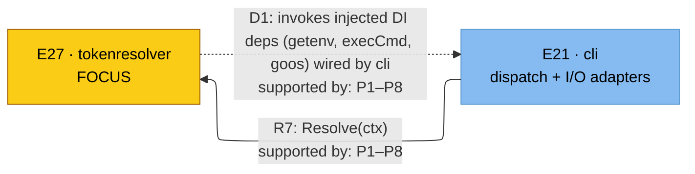

# C4 — tokenresolver (Property/Invariant Ledger)

> Component in focus: **E27 · tokenresolver** (refines L3 c3-engram-cli-binary).
> Source files in scope:
> - [../../internal/tokenresolver/tokenresolver.go](../../internal/tokenresolver/tokenresolver.go)
> - [../../internal/tokenresolver/tokenresolver_test.go](../../internal/tokenresolver/tokenresolver_test.go)

## Context (from L3)

Scoped slice of [c3-engram-cli-binary.md](c3-engram-cli-binary.md): the L3 edges that touch
E27. The DI back-edge convention (see below) applies — E27 → E21 represents the category of
calls E27 makes through dependencies wired by E21.

The R-edge labels cite the P-list each edge backs.

**Legend:**
- Solid grey: L3 elements carried over.
- Yellow: L4 focus component.
- **Solid arrow (R[n])** = direct call. Standard C4 reading: "source initiates the
  interaction with target."
- **Dotted arrow (D[n])** = DI back-edge. Project-specific convention representing "source
  initiates a category of calls whose concrete targets are determined by the dotted-arrow
  target (the wirer)." One D-id per (consumer, wirer) pair regardless of how many concrete
  deps; the per-dep decomposition lives in the Dependency Manifest below.
- **R7:** the existing L3 element-to-element call.
- **D1:** the DI back-edge from E27 to E21, mirrored from L3.

## Dependency Manifest

Each row is one injected dependency the focus component receives. Manifest expands the
Rdi back-edge into per-dep wiring rows. Reciprocal entries live in the wirer's L4 under
"DI Wires" — those two sections must stay in sync.

| Dep field | Type | Wired by | Concrete adapter | Properties |
|---|---|---|---|---|
| `getenv` | `func(string) string` | [E21 · cli](c3-engram-cli-binary.md#e21-cli) (L4: c4-cli.md — TBD) | `os.Getenv` | P1, P2, P8 |
| `execCmd` | `func(ctx, name, args...) ([]byte, error)` | [E21 · cli](c3-engram-cli-binary.md#e21-cli) (L4: c4-cli.md — TBD) | `exec.Command` wrapper | P2–P8 |
| `goos` | `string` | [E21 · cli](c3-engram-cli-binary.md#e21-cli) (L4: c4-cli.md — TBD) | `runtime.GOOS` | P3, P8 |

## Property Ledger

| ID | Property | Statement | Enforced at | Tested at | Notes |
|---|---|---|---|---|---|
| P1 | Env var precedence | For all calls to `Resolve(ctx)`, when `getenv("ENGRAM_API_TOKEN")` returns a non-empty string, the resolver returns that token and never invokes `execCmd`. | [internal/tokenresolver/tokenresolver.go:34](../../internal/tokenresolver/tokenresolver.go#L34) | [internal/tokenresolver/tokenresolver_test.go:13](../../internal/tokenresolver/tokenresolver_test.go#L13) | Test asserts both the returned token and `executorCalled == false`. |
| P2 | Total (never errors) | For all inputs (env state, goos value, exec results, JSON payloads), `Resolve(ctx)` returns a nil error. | [internal/tokenresolver/tokenresolver.go:33](../../internal/tokenresolver/tokenresolver.go#L33) | [internal/tokenresolver/tokenresolver_test.go:13](../../internal/tokenresolver/tokenresolver_test.go#L13), [:46](../../internal/tokenresolver/tokenresolver_test.go#L46), [:68](../../internal/tokenresolver/tokenresolver_test.go#L68), [:90](../../internal/tokenresolver/tokenresolver_test.go#L90), [:112](../../internal/tokenresolver/tokenresolver_test.go#L112), [:134](../../internal/tokenresolver/tokenresolver_test.go#L134), [:156](../../internal/tokenresolver/tokenresolver_test.go#L156) | Documented invariant in L3 catalog. Every test in the package asserts `err NotTo HaveOccurred`. |
| P3 | Non-darwin Keychain skip | For all `goos` values other than `"darwin"`, when env is empty, `Resolve` returns `("", nil)` without invoking `execCmd`. | [internal/tokenresolver/tokenresolver.go:38](../../internal/tokenresolver/tokenresolver.go#L38) | [internal/tokenresolver/tokenresolver_test.go:156](../../internal/tokenresolver/tokenresolver_test.go#L156) | Test uses `goos="linux"` and asserts `executorCalled == false`. |
| P4 | Keychain exec failure swallowed | For all errors returned by `execCmd`, the resolver returns `("", nil)`. | [internal/tokenresolver/tokenresolver.go:47](../../internal/tokenresolver/tokenresolver.go#L47) | [internal/tokenresolver/tokenresolver_test.go:68](../../internal/tokenresolver/tokenresolver_test.go#L68) | `//nolint:nilerr` annotation documents intent: keychain unavailability is non-fatal. |
| P5 | Malformed JSON swallowed | For all `execCmd` outputs that fail `json.Unmarshal` into `keychainPayload`, the resolver returns `("", nil)`. | [internal/tokenresolver/tokenresolver.go:53](../../internal/tokenresolver/tokenresolver.go#L53) | [internal/tokenresolver/tokenresolver_test.go:112](../../internal/tokenresolver/tokenresolver_test.go#L112) | `//nolint:nilerr`: malformed JSON is non-fatal. |
| P6 | Missing-field returns empty | For all JSON payloads parseable as a generic object but lacking `claudeAiOauth.accessToken`, the resolver returns `("", nil)` (Go zero-value of the missing string field). | [internal/tokenresolver/tokenresolver.go:58](../../internal/tokenresolver/tokenresolver.go#L58) | [internal/tokenresolver/tokenresolver_test.go:134](../../internal/tokenresolver/tokenresolver_test.go#L134), [:46](../../internal/tokenresolver/tokenresolver_test.go#L46) | Tests cover both the missing-field and explicitly-empty-string variants. |
| P7 | Keychain success returns AccessToken | For all darwin runs where env is empty and `execCmd` returns valid JSON `{"claudeAiOauth":{"accessToken":<S>}}`, the resolver returns `(S, nil)`. | [internal/tokenresolver/tokenresolver.go:58](../../internal/tokenresolver/tokenresolver.go#L58) | [internal/tokenresolver/tokenresolver_test.go:90](../../internal/tokenresolver/tokenresolver_test.go#L90) | Calls `security find-generic-password -s "Claude Code-credentials" -w`. |
| P8 | No direct I/O (DI-only) | For all package code, no symbol references `os.Getenv`, `os.Setenv`, `exec.Command`, `runtime.GOOS`, or any other process/OS facility directly; all such effects flow through the injected `getenv`, `execCmd`, and `goos` fields supplied by the caller. | [internal/tokenresolver/tokenresolver.go:11](../../internal/tokenresolver/tokenresolver.go#L11) | **⚠ UNTESTED** | Architectural invariant from project DI rule (CLAUDE.md "DI everywhere"). No automated guard; would need an import-scanner test or `forbidigo` lint rule. |

## Cross-links

- Parent: [c3-engram-cli-binary.md](c3-engram-cli-binary.md) (refines **E27 · tokenresolver**)

See `skills/c4/references/property-ledger-format.md` for the full row format and untested-property
discipline.

