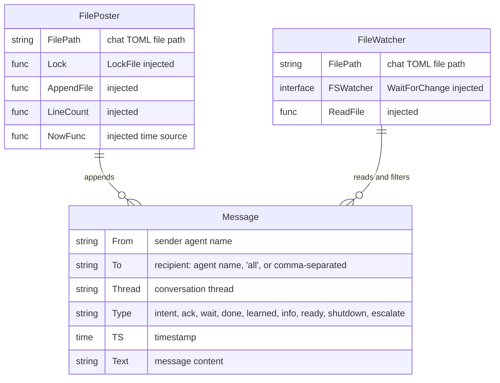
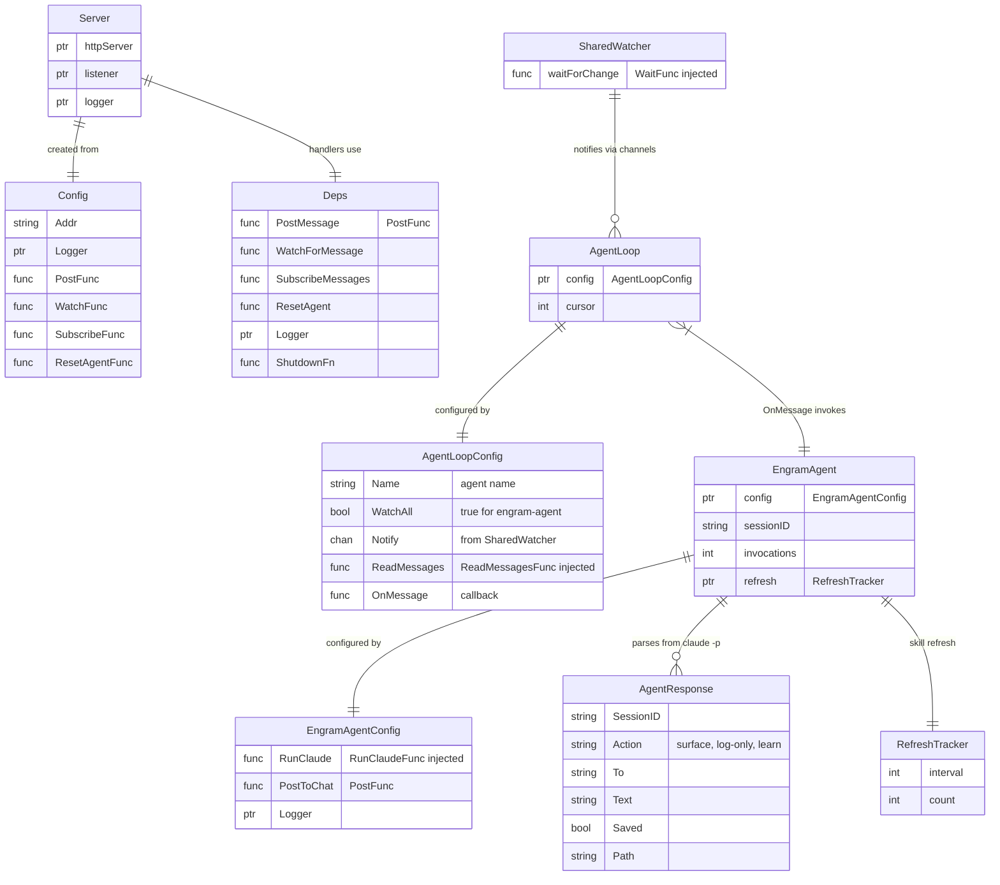
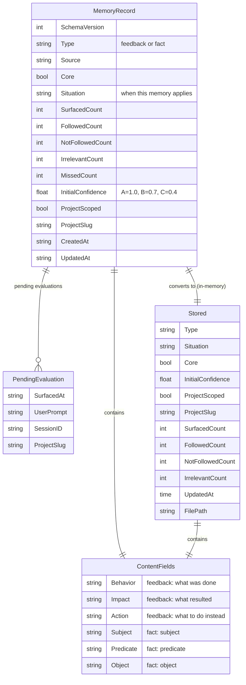

# C1: Code (Entity-Relationship Diagrams)

Key types and their relationships, mapped to source files. See [C2: Component](c2-component.md) for which components own these types.

## Chat Protocol Entities



**Source:** `internal/chat/chat.go`, `internal/chat/poster.go`, `internal/chat/watcher.go`

## API Client Entities

```mermaid
erDiagram
    API_Interface {
        method PostMessage "ctx, PostMessageRequest -> PostMessageResponse, error"
        method WaitForResponse "ctx, WaitRequest -> WaitResponse, error"
        method Subscribe "ctx, SubscribeRequest -> SubscribeResponse, error"
        method Status "ctx -> StatusResponse, error"
    }

    Client {
        string baseURL
        interface doer "HTTPDoer injected"
    }

    PostMessageRequest {
        string From
        string To
        string Text
    }

    PostMessageResponse {
        int Cursor
        string Error
    }

    WaitRequest {
        string From
        string To
        int AfterCursor
    }

    WaitResponse {
        string Text
        int Cursor
        string From
        string To
    }

    SubscribeRequest {
        string Agent
        int AfterCursor
    }

    SubscribeResponse {
        int Cursor
    }

    ChatMessage {
        string From
        string To
        string Text
    }

    StatusResponse {
        bool Running
    }

    Client --|> API_Interface : "implements"
    Client ||--o{ PostMessageRequest : "sends"
    Client ||--o{ PostMessageResponse : "receives"
    Client ||--o{ WaitRequest : "sends"
    Client ||--o{ WaitResponse : "receives"
    SubscribeResponse ||--o{ ChatMessage : "contains"
```

**Source:** `internal/apiclient/client.go`

## Server Entities



**Source:** `internal/server/server.go`, `internal/server/agent.go`, `internal/server/engram.go`, `internal/server/fanout.go`, `internal/server/refresh.go`, `internal/server/stream.go`

## Memory Entities



**Source:** `internal/memory/record.go`, `internal/memory/memory.go`

## MCP Server Entities

```mermaid
erDiagram
    StdoutChannelNotifier {
        mutex mu
        writer io_Writer "stdout"
    }

    AgentNameCapture {
        chan ch "buffered string channel"
        once sync_Once
    }

    ChannelNotifier_Interface {
        method Notify "content, meta -> error"
    }

    ServerStarter_Interface {
        method Start "ctx, apiAddr -> error"
    }

    StdoutChannelNotifier --|> ChannelNotifier_Interface : "implements"
    AgentNameCapture }|--|| StdoutChannelNotifier : "subscribe loop uses"
```

**Source:** `internal/mcpserver/channel.go`, `internal/mcpserver/subscribe.go`, `internal/mcpserver/startup.go`

## Cross-references

- Components that own these types: [C2: Component](c2-component.md)
- How data flows between types: [Sequences](sequences.md)
- Container boundaries: [C3: Container](c3-container.md)
