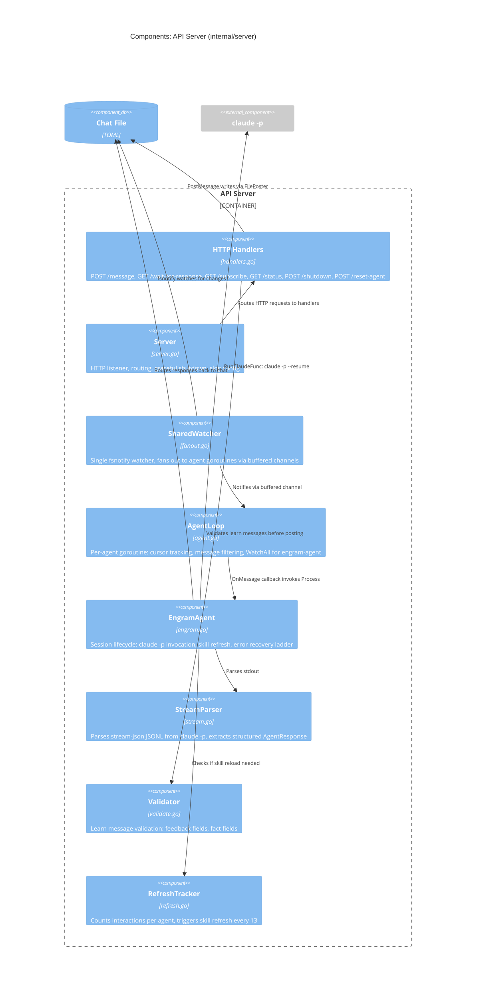
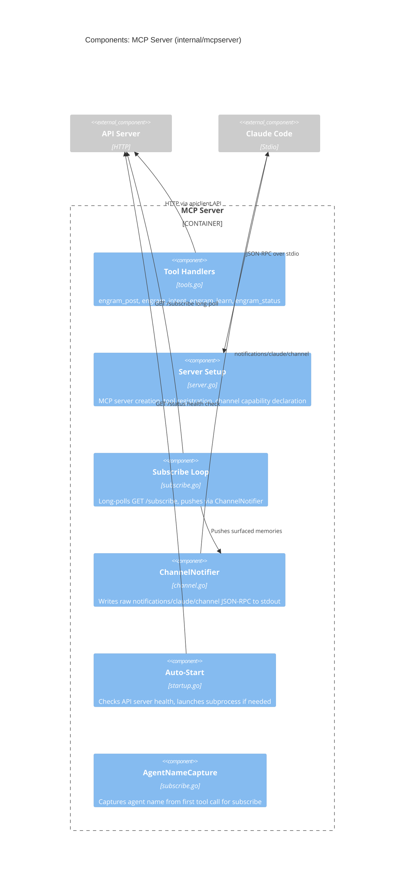
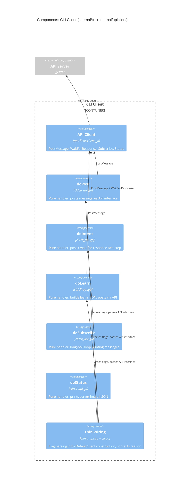

# C2: Component

What's inside each container. See [C3: Container](c3-container.md) for the container boundaries. See [C1: Code](c1-code.md) for the types and interfaces.

## API Server Components

## MCP Server Components

## CLI Client Components

## Component Summary

| Container | Component | File | Responsibility |
|-----------|-----------|------|---------------|
| API Server | Handlers | `handlers.go` | HTTP request/response |
| API Server | Server | `server.go` | Listener, routing, shutdown |
| API Server | SharedWatcher | `fanout.go` | fsnotify fan-out to goroutines |
| API Server | AgentLoop | `agent.go` | Per-agent cursor + filtering |
| API Server | EngramAgent | `engram.go` | claude -p lifecycle + recovery |
| API Server | StreamParser | `stream.go` | Parse structured JSON from stream-json |
| API Server | Validator | `validate.go` | Learn message field validation |
| API Server | RefreshTracker | `refresh.go` | Skill refresh counter |
| MCP Server | Tools | `tools.go` | 4 MCP tool handlers |
| MCP Server | Subscribe Loop | `subscribe.go` | Long-poll + channel push |
| MCP Server | ChannelNotifier | `channel.go` | Raw JSON-RPC to stdout |
| MCP Server | Auto-Start | `startup.go` | API server subprocess launch |
| CLI | API Client | `apiclient/client.go` | HTTP client with DI |
| CLI | Pure Handlers | `cli/cli_api.go` | doPost/doIntent/doLearn/doSubscribe/doStatus |
| CLI | Thin Wiring | `cli/cli.go` | Flag parsing, I/O construction |

## Cross-references

- Types and interfaces used by these components: [C1: Code](c1-code.md)
- Data flowing between components: [Sequences](sequences.md)
- Container boundaries: [C3: Container](c3-container.md)
