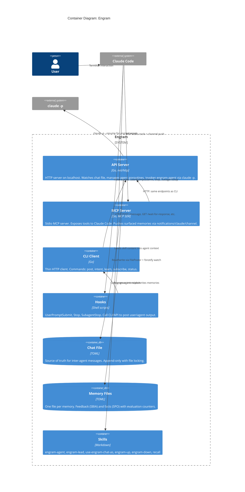

# C3: Container

What's inside engram. Each box is a deployable unit. See [C4: Context](c4-context.md) for the system boundary. See [C2: Component](c2-component.md) for what's inside each container.

## Containers

| Container | Binary/Process | Purpose | Port/Transport |
|-----------|---------------|---------|----------------|
| **API Server** | `engram server up` | All intelligence: routing, validation, agent lifecycle, skill refresh | HTTP on localhost:7932 |
| **MCP Server** | `engram-mcp` | Thin API client exposing MCP tools + async channel push | Stdio (JSON-RPC) |
| **CLI Client** | `engram post/intent/learn/...` | Thin HTTP client for hooks and manual use | HTTP to API server |
| **Hooks** | Shell scripts in `hooks/` | Automatically post user/agent output to API | Called by Claude Code |
| **Chat File** | `~/.local/share/engram/chat/<slug>.toml` | Persistent message log, source of truth | File I/O with locking |
| **Memory Files** | `~/.local/share/engram/memory/{facts,feedback}/` | One TOML file per memory with evaluation counters | File I/O |
| **Skills** | `skills/*/SKILL.md` | Agent behavior instructions loaded into context | Read by Claude Code |

## Key Relationships

- **MCP Server auto-starts API Server** if not running (subprocess launch + health poll)
- **API Server is client-agnostic** — doesn't know if CLI, MCP, or hooks are calling
- **Chat file is the source of truth** — all containers communicate through it
- **Skill refresh** is server-side: API server posts refresh reminders to chat every 13 interactions

## Cross-references

- Each container's internals: [C2: Component](c2-component.md)
- Data flowing between containers: [Sequences](sequences.md)
- Why these containers exist: [Intent](../intent.md)
