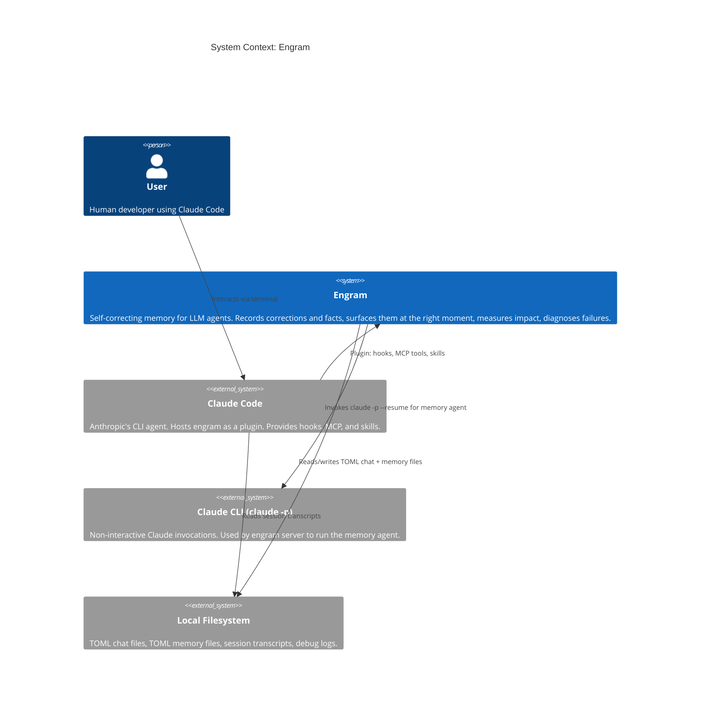

# C4: System Context

How engram fits into the broader environment. See [C3: Container](c3-container.md) for what's inside engram.

## Actors

| Actor | Role | Interaction |
|-------|------|-------------|
| **User** | Human developer | Prompts Claude Code; corrections become memories |
| **Claude Code** | Host agent | Runs engram hooks on prompt/stop; calls MCP tools; loads skills |
| **Claude CLI** | Memory agent runtime | Server invokes `claude -p --resume` to run the engram-agent |
| **Filesystem** | Persistence | Chat file (source of truth), memory TOML files, debug logs |

## Boundary

Everything inside "Engram" is detailed in [C3: Container](c3-container.md).
