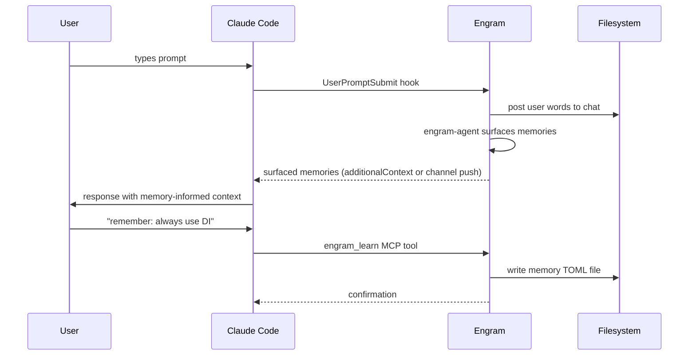
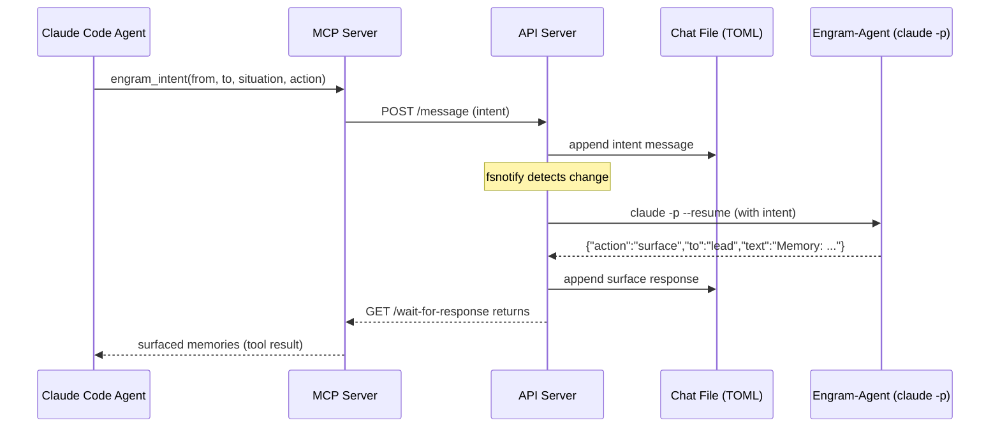
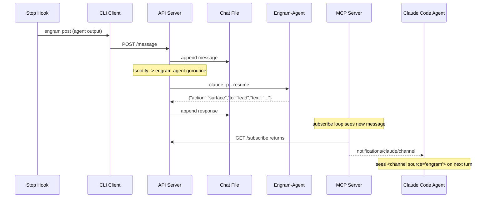
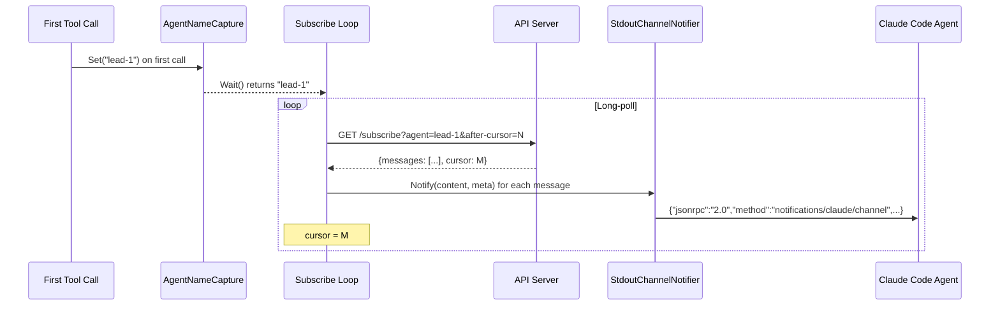
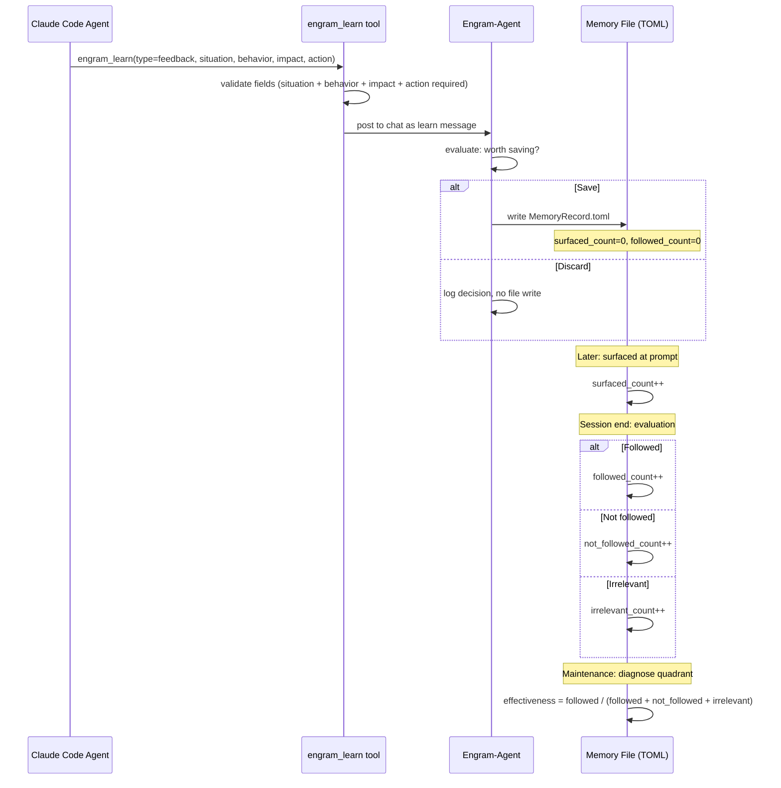

# Sequence Diagrams

How data flows across boundaries at each level. Cross-referenced with [C4](c4-context.md), [C3](c3-container.md), [C2](c2-component.md), and [C1](c1-code.md).

## System Level: User Interaction (C4 boundary)



**Actors:** [C4: Context](c4-context.md)

## Container Level: Synchronous Intent Flow (C3 boundary)

The agent explicitly asks for memories before acting.



**Containers:** [C3: Container](c3-container.md)

## Container Level: Async Channel Push (C3 boundary)

Memories arrive without the agent requesting them.



**Containers:** [C3: Container](c3-container.md)

## Component Level: API Server Message Routing (C2 boundary)

Inside the API server: how a posted message reaches the engram-agent.

```mermaid
sequenceDiagram
    participant Client as HTTP Client
    participant Handler as HandlePostMessage
    participant Poster as FilePoster
    participant Chat as Chat File
    participant Fanout as SharedWatcher
    participant Loop as AgentLoop (engram-agent)
    participant EA as EngramAgent
    participant Claude as claude -p

    Client->>Handler: POST /message {from, to, text}
    Handler->>Handler: validate learn message (if applicable)
    Handler->>Poster: Post(Message)
    Poster->>Chat: append with file lock
    Poster-->>Handler: cursor
    Handler-->>Client: {cursor: N}

    Note over Fanout: fsnotify fires
    Fanout->>Loop: buffered channel notification
    Loop->>Loop: read from cursor, filter messages
    Loop->>EA: OnMessage(msg)
    EA->>EA: check skill refresh (every 13)
    EA->>Claude: claude -p --resume (prompt)
    Claude-->>EA: stream-json output
    EA->>EA: ParseStreamResponse -> AgentResponse
    EA->>Poster: Post(response message)
```

**Components:** [C2: Component](c2-component.md)

## Component Level: Error Recovery (C2 boundary)

The engram-agent's error recovery ladder.

```mermaid
sequenceDiagram
    participant Loop as AgentLoop
    participant EA as EngramAgent
    participant Claude as claude -p

    Loop->>EA: ProcessWithRecovery(msg)

    rect rgb(255, 240, 240)
        Note over EA,Claude: Attempt on current session (up to 3)
        EA->>Claude: claude -p --resume (prompt)
        Claude-->>EA: malformed output
        EA->>Claude: re-prompt with format guidance
        Claude-->>EA: malformed again
        EA->>Claude: re-prompt (3rd attempt)
        Claude-->>EA: malformed (3 failures)
    end

    rect rgb(240, 240, 255)
        Note over EA: Session reset
        EA->>EA: ResetSession() clears session ID
        Note over EA,Claude: Attempt on fresh session (up to 3)
        EA->>Claude: claude -p (fresh, full skill load + last 3 messages)
        Claude-->>EA: valid response
        EA-->>Loop: success
    end

    Note over EA: If fresh session also fails 3x:
    EA->>EA: escalate: post error to chat, log critical, stop invoking
```

**Components:** [C2: Component](c2-component.md), Types: [C1: Code](c1-code.md)

## Component Level: MCP Subscribe Loop (C2 boundary)

How the MCP server pushes memories to the agent.



**Components:** [C2: Component](c2-component.md), Types: [C1: Code](c1-code.md)

## Entity Level: Memory Lifecycle (C1 boundary)

How a MemoryRecord moves through states. See [Memory Lifecycle](../design/memory-lifecycle.md) for the full state diagram.



**Types:** [C1: Code](c1-code.md)

## Cross-references

| Sequence | Level | Related Diagrams |
|----------|-------|-----------------|
| User Interaction | C4 | [Context](c4-context.md) |
| Intent Flow | C3 | [Container](c3-container.md) |
| Async Push | C3 | [Container](c3-container.md) |
| Message Routing | C2 | [Component](c2-component.md) |
| Error Recovery | C2 | [Component](c2-component.md), [Code](c1-code.md) |
| Subscribe Loop | C2 | [Component](c2-component.md), [Code](c1-code.md) |
| Memory Lifecycle | C1 | [Code](c1-code.md) |
