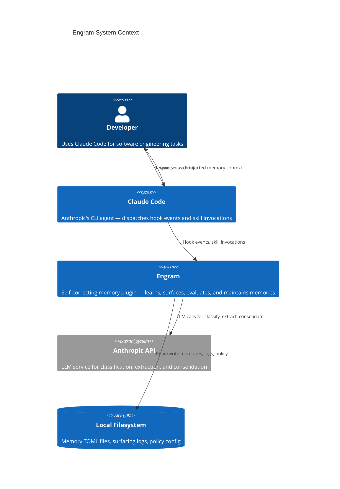

# System Context

Engram is a Claude Code plugin (Go binary + shell hooks + skills) that manages memory extraction, surfacing, evaluation, and maintenance for LLM agent sessions.

## Actors

| Actor | Description |
|-------|-------------|
| **Developer** | Uses Claude Code in a terminal session |
| **Claude Code** | Anthropic's CLI agent that dispatches hook events and skill invocations |
| **Engram** | Self-correcting memory plugin -- learns, surfaces, evaluates, and maintains memories |
| **Anthropic API** | LLM service used for classification, extraction, and consolidation |
| **Local Filesystem** | Memory TOML files, surfacing logs, and policy config on disk |

## C4 Context Diagram

## Relationships

- **Claude Code -> Engram:** Claude Code fires hook events (`SessionStart`, `UserPromptSubmit`, `Stop`) and engram responds with surfaced memories and corrections.
- **Engram -> Anthropic API:** Engram calls the Anthropic API for LLM-dependent operations (extraction, classification, consolidation).
- **Engram -> Filesystem:** All persistent state lives on the local filesystem as TOML files and JSONL logs.
