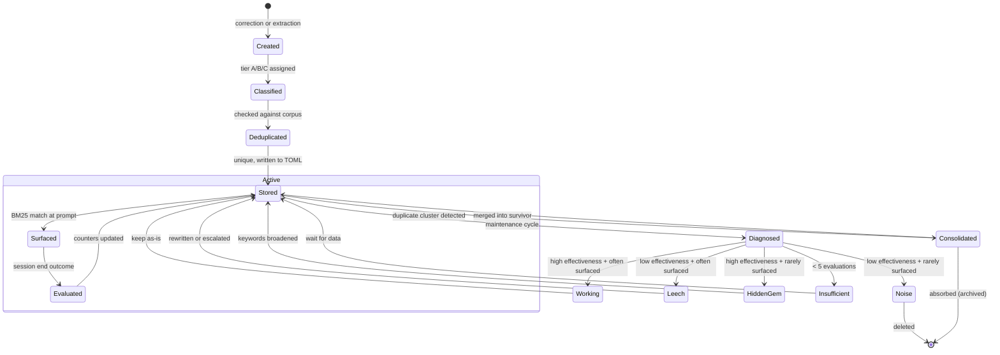

# Memory Lifecycle

A memory's lifecycle from creation to eventual deletion.

## Stages

### 1. Creation

Two paths:

- **Real-time correction:** User says "remember X" or "don't do Y". `engram correct` detects and classifies, writes TOML file.
- **Session learning:** At session end, `engram flush` extracts learnings from transcript, classifies into tiers A/B/C, deduplicates against corpus via BM25+TF-IDF, writes surviving memories.

### 2. Classification

Each memory gets a confidence tier:

- **Tier A:** Explicit instructions ("always", "never", "remember"). Anti-pattern required.
- **Tier B:** Teachable corrections. Anti-pattern optional.
- **Tier C:** Contextual facts. No anti-pattern.

### 3. Surfacing

At each prompt, BM25 keyword matching retrieves relevant memories. Ranking uses quality-weighted scoring: `relevance * generalizability * (1 + quality)`. Each surfacing increments `surfaced_count` and updates `last_surfaced`.

### 4. Evaluation

At session end, the evaluator classifies each surfaced memory's outcome: followed, contradicted, ignored, or irrelevant. Counters are stored in the memory's TOML file.

### 5. Maintenance

Periodic diagnosis classifies memories by effectiveness quadrant:

- **Working** — keep
- **Leech** — rewrite content or escalate enforcement
- **Hidden Gem** — broaden keywords to increase surfacing
- **Noise** — remove
- **Insufficient data** — wait for more evaluations

### 6. Consolidation

Duplicate clusters (>50% keyword overlap + TF-IDF confidence above threshold) are merged. Survivor keeps combined evaluation counts.

### 7. Removal

Noise memories are deleted. File removal = complete removal (filesystem is registry).

## State Diagram

