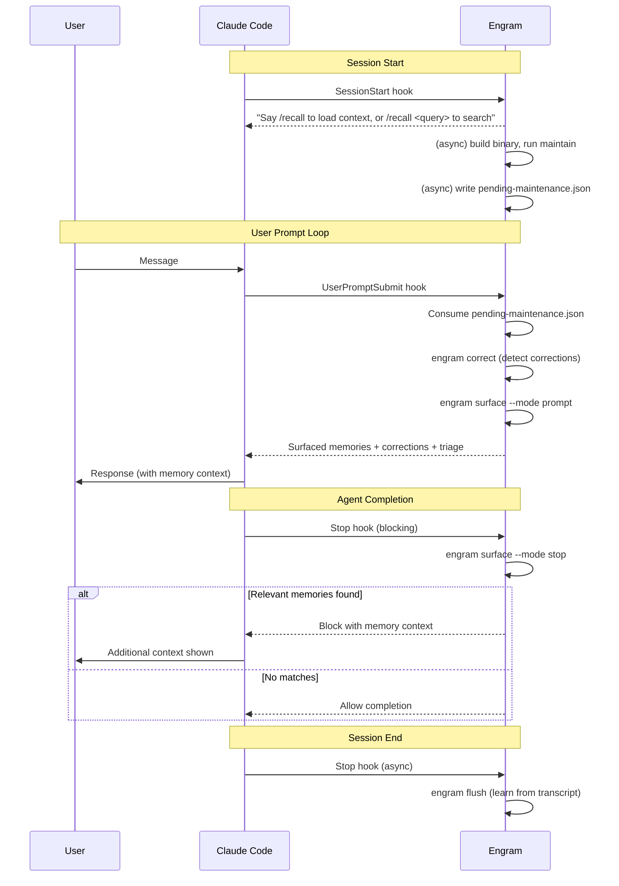

# Session Lifecycle

A Claude Code session from engram's perspective.

## Steps

### 1. SessionStart (session-start.sh, 10s timeout)

- Emits system message: "Say /recall to load context from previous sessions, or /recall <query> to search session history"
- Background (async): rebuilds binary if stale, runs `engram maintain` to generate maintenance proposals
- Parses maintain output, counts proposals by category (noise, hidden gem, leech, refine keywords, escalation, consolidation)
- Checks policy.toml for pending adaptation proposals
- If proposals exist, writes pending-maintenance.json with triage summary

### 2. UserPromptSubmit (user-prompt-submit.sh, 30s timeout)

Fires on every user message.

- Rebuilds binary if stale
- Consumes pending-maintenance.json (atomic move to prevent double-read)
- Skips surfacing if message is a skill invocation (/recall, /adapt, etc.)
- Runs `engram correct` -- detects inline corrections in user message
- Runs `engram surface --mode prompt` -- surfaces relevant memories via BM25
- Merges pending + correct + surface outputs into response

### 3. Stop (stop-surface.sh, 15s timeout, blocking)

- Runs `engram surface --mode stop` -- checks agent output for relevant memories
- If memories match, blocks the agent with surfaced context
- Prevents infinite loops via stop_hook_active flag

### 4. Stop (stop.sh, 120s timeout, async)

- Runs `engram flush` -- extracts learnings from transcript, records outcomes
- Fire-and-forget -- always exits 0

## Sequence Diagram

