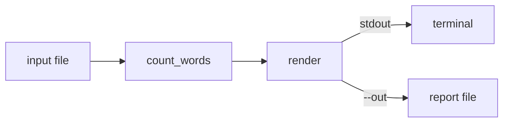

# Architecture

`tally` is a single module. The flow:

`build_parser` owns every flag; `main` wires parsing, counting, and output. When `--out` is
given the report is written to that path, otherwise it goes to stdout.
