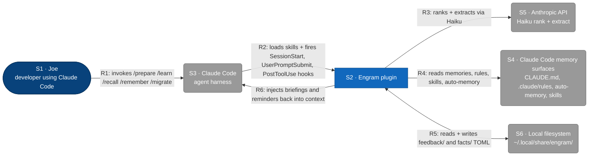

# C1 — Engram (System Context)

Engram is a Claude Code plugin that gives the agent persistent, query-ranked memory.
This diagram shows who and what Engram interacts with at the system boundary; it
deliberately hides the CLI binary, hooks, on-disk stores, and skills (those live at L2).

## Element Catalog

| ID | Name | Type | Responsibility | System of Record |
|---|---|---|---|---|
| S1 | Joe | Person | Developer who triggers `/prepare`, `/recall`, `/remember`, `/learn`, `/migrate` and authors the work that produces memories | Human, at a Claude Code session |
| S2 | Engram plugin | The system in scope | Plugin providing persistent, query-ranked memory: skills decide when to load context, a slim Go binary computes recall/learn, hooks remind the agent at session and tool-use boundaries | This repository (`github.com/toejough/engram`) |
| S3 | Claude Code | External system | Agent harness that loads the plugin, dispatches skills, fires hooks, and exposes its own memory surfaces | Anthropic Claude Code CLI |
| S4 | Claude Code memory surfaces | External system | Read-only sources Engram merges into recall: project + user `CLAUDE.md` (with `@`-imports), `.claude/rules/*.md`, auto-memory under `~/.claude/projects/<slug>/memory/`, and project + user + plugin skill frontmatter | Files owned by Claude Code and the user; never written by Engram |
| S5 | Anthropic API | External system | LLM service used by the recall pipeline for Haiku ranking and extraction; also the classification step in `/learn` and `/remember` quality gates | `api.anthropic.com` |
| S6 | Local filesystem | External system | Engram's own writable data directory: `~/.local/share/engram/memory/feedback/*.toml` and `~/.local/share/engram/memory/facts/*.toml`; also the cached binary at `~/.claude/engram/bin/engram` | XDG data home on the user's machine |

## Relationships

| ID | From | To | Description | Protocol/Medium |
|---|---|---|---|---|
| R1 | Joe | Claude Code | Invokes slash-commands and writes prompts that trigger skill auto-invocation | Claude Code CLI / TTY |
| R2 | Claude Code | Engram plugin | Loads skill markdown, executes hooks (`SessionStart`, `UserPromptSubmit`, `PostToolUse`), invokes `engram` binary subcommands | Plugin manifest, shell hooks (stdin JSON), subprocess exec |
| R3 | Engram plugin | Anthropic API | Ranks memory/skill/auto-memory candidates and extracts snippets during recall; classifies feedback/facts during learn | HTTPS, Anthropic Messages API (Haiku) |
| R4 | Engram plugin | Claude Code memory surfaces | Discovers and reads CLAUDE.md (+ `@`-imports), `.claude/rules/*.md`, auto-memory topic files, and skill frontmatter for ranking | Local file reads (read-only; "read everywhere, write only what you own") |
| R5 | Engram plugin | Local filesystem | Reads and writes Engram's own feedback/fact TOML; reads/writes the cached binary | Local file I/O, TOML |
| R6 | Engram plugin | Claude Code | Returns briefings (`/prepare`), recall results (`/recall`), and hook reminders that re-enter the agent's context | Hook stdout JSON (`systemMessage`, `additionalContext`) |

## Cross-links

- Parent: none (L1 is the root).
- Refined by: *(none yet — to be authored at L2)*. Expected next file: `c2-engram-containers.md` decomposing **S2 · Engram plugin** into the `engram` Go binary (`cmd/engram` + `internal/`), the skill set (`skills/{prepare,recall,learn,remember,migrate,c4}`), the hook scripts (`hooks/{session-start,user-prompt-submit,post-tool-use}.sh`), and the on-disk memory store under `~/.local/share/engram/memory/`.
