# C1 — Doesn't Matter

```mermaid
flowchart LR
    classDef person      fill:#000
    classDef external    fill:#000
    classDef container   fill:#000

    a[S1 · Foo]
    b[S2 · Bar]
    c[S3 · Baz]

    a -->|R1: foo to bar| b
    b -->|R2: bar to baz| c

    class a person
    class b container
    class c external

    click a href "#nowhere" "Foo"
    click b href "#s2-bar" "Bar"
```

## Element Catalog

| ID | Name | Type | Responsibility | System of Record |
|---|---|---|---|---|
| S1 | Foo | Person | resp | sor |
| S2 | Bar | Container | resp | sor |
| S3 | Baz | External system | resp | sor |

## Relationships

| ID | From | To | Description | Protocol/Medium |
|---|---|---|---|---|
| R1 | Foo | Bar | desc | proto |
| R2 | Bar | Baz | desc | proto |
