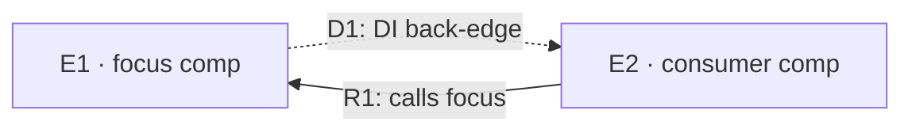

# C4 — audit-l4-clean (Property/Invariant Ledger)

```mermaid
flowchart LR
    classDef person      fill:#08427b,stroke:#052e56,color:#fff
    classDef external    fill:#999,   stroke:#666,   color:#fff
    classDef container   fill:#1168bd,stroke:#0b4884,color:#fff
    classDef component   fill:#85bbf0,stroke:#5d9bd1,color:#000
    classDef focus       fill:#facc15,stroke:#a16207,color:#000

    e1["E1 · focus comp"]
    e2["E2 · consumer comp"]

    e2 -->|"R1: calls focus"| e1
    e1 -.->|"D1: DI back-edge"| e2
```
