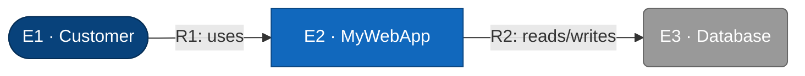

# C1 — MyWebApp (System Context)

Test fixture for skill TDD baseline: a small webapp.

## Element Catalog

| ID | Name | Type | Responsibility | System of Record |
|---|---|---|---|---|
| E1 | Customer | Person | uses the app | human |
| E2 | MyWebApp | The system in scope | the system in scope | this fixture |
| E3 | Database | External system | stores app data | Postgres |

## Relationships

| ID | From | To | Description | Protocol/Medium |
|---|---|---|---|---|
| R1 | Customer | MyWebApp | uses | HTTPS |
| R2 | MyWebApp | Database | reads/writes | TCP |

## Cross-links

- Parent: none (L1 is the root).
- Refined by: *(none yet)*
