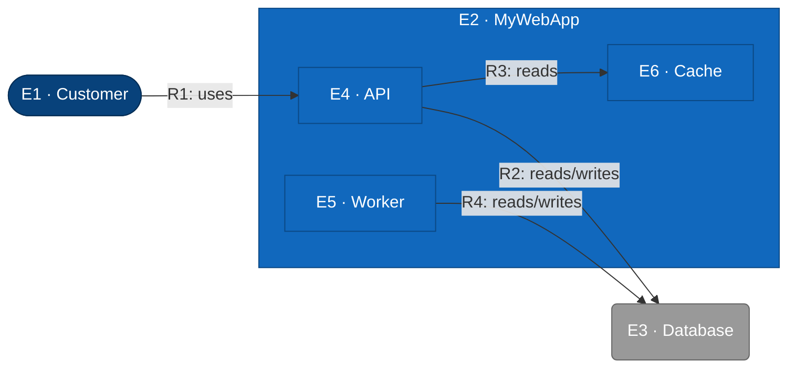

# C2 — MyWebApp (Container)

Test fixture: refines MyWebApp into API, Worker, and Cache containers.

## Element Catalog

| ID | Name | Type | Responsibility | System of Record |
|---|---|---|---|---|
| E1 | Customer | Person | uses the app | human |
| E2 | MyWebApp | The system in scope | the system in scope | this fixture |
| E3 | Database | External system | stores app data | Postgres |
| E4 | API | Container | HTTP API serving user requests | this fixture |
| E5 | Worker | Container | background jobs | this fixture |
| E6 | Cache | Container | hot-data cache | this fixture |

## Relationships

| ID | From | To | Description | Protocol/Medium |
|---|---|---|---|---|
| R1 | Customer | API | uses | HTTPS |
| R2 | API | Database | reads/writes | TCP |
| R3 | API | Cache | reads | TCP |
| R4 | Worker | Database | reads/writes | TCP |

## Cross-links

- Parent: [c1-mywebapp.md](c1-mywebapp.md) (refines **E2 · MyWebApp**)
- Refined by:
  - [`c3-api.md`](./c3-api.md) — refines E4 · API
  - [`c3-worker.md`](./c3-worker.md) — refines E5 · Worker
  - [`c3-cache.md`](./c3-cache.md) — refines E6 · Cache
