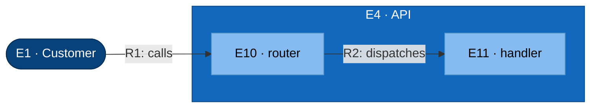

# C3 — API (Component)

Test fixture: refines API into a router and handler.

## Element Catalog

| ID | Name | Type | Responsibility | Code Pointer |
|---|---|---|---|---|
| E4 | API | Container in focus | Container in focus — refined from c2-mywebapp-internal.md. | — |
| E1 | Customer | Person | uses the app | — |
| E10 | router | Component | dispatches incoming HTTP requests | [./router.go](./router.go) |
| E11 | handler | Component | endpoint logic | [./handler.go](./handler.go) |

## Relationships

| ID | From | To | Description | Protocol/Medium |
|---|---|---|---|---|
| R1 | Customer | router | calls | HTTPS |
| R2 | router | handler | dispatches | Go function call |

## Cross-links

- Parent: [c2-mywebapp-internal.md](c2-mywebapp-internal.md) (refines **E4 · API**)
- Siblings:
  - [c3-cache.md](c3-cache.md)
  - [c3-worker.md](c3-worker.md)
- Refined by: *(none yet)*
