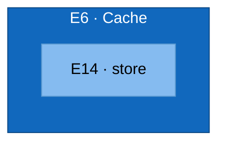

# C3 — Cache (Component)

Test fixture: refines Cache into a store component.

## Element Catalog

| ID | Name | Type | Responsibility | Code Pointer |
|---|---|---|---|---|
| E6 | Cache | Container in focus | Container in focus — refined from c2-mywebapp-internal.md. | — |
| E14 | store | Component | stores hot data | [./store.go](./store.go) |

## Relationships

| ID | From | To | Description | Protocol/Medium |
|---|---|---|---|---|

## Cross-links

- Parent: [c2-mywebapp-internal.md](c2-mywebapp-internal.md) (refines **E6 · Cache**)
- Siblings:
  - [c3-api.md](c3-api.md)
  - [c3-worker.md](c3-worker.md)
- Refined by: *(none yet)*
