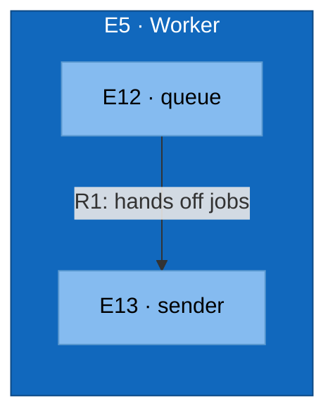

# C3 — Worker (Component)

Test fixture: refines Worker into a queue reader and email sender.

## Element Catalog

| ID | Name | Type | Responsibility | Code Pointer |
|---|---|---|---|---|
| E5 | Worker | Container in focus | Container in focus — refined from c2-mywebapp-internal.md. | — |
| E12 | queue | Component | reads jobs off the queue | [./queue.go](./queue.go) |
| E13 | sender | Component | sends email | [./sender.go](./sender.go) |

## Relationships

| ID | From | To | Description | Protocol/Medium |
|---|---|---|---|---|
| R1 | queue | sender | hands off jobs | Go function call |

## Cross-links

- Parent: [c2-mywebapp-internal.md](c2-mywebapp-internal.md) (refines **E5 · Worker**)
- Siblings:
  - [c3-api.md](c3-api.md)
  - [c3-cache.md](c3-cache.md)
- Refined by: *(none yet)*
