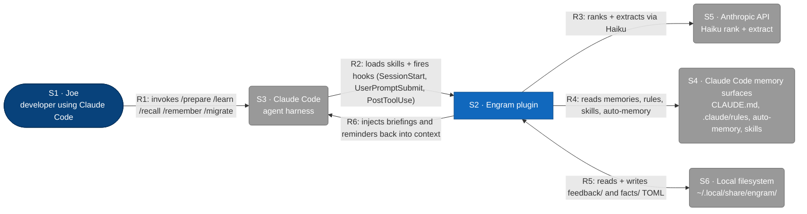

# C1 — Engram plugin (System Context)

Engram is a Claude Code plugin that gives the agent persistent, query-ranked memory.
This diagram shows who and what Engram interacts with at the system boundary; it
deliberately hides the CLI binary, hooks, on-disk stores, and skills (those live at L2).

## Element Catalog

| ID | Name | Type | Responsibility | System of Record |
|---|---|---|---|---|
| S1 | Joe | Person | Developer who triggers `/prepare`, `/recall`, `/remember`, `/learn`, `/migrate` and authors the work that produces memories | Human, at a Claude Code session |
| S2 | Engram plugin | The system in scope | Plugin providing persistent, query-ranked memory: skills decide when to load context, a slim Go binary computes recall/learn, hooks remind the agent at session and tool-use boundaries | This repository (`github.com/toejough/engram`) |
| S3 | Claude Code | External system | Agent harness that loads the plugin, dispatches skills, fires hooks, and exposes its own memory surfaces | Anthropic Claude Code CLI |
| S4 | Claude Code memory surfaces | External system | Read-only sources Engram merges into recall: project + user `CLAUDE.md` (with `@`-imports), `.claude/rules/*.md`, auto-memory under `~/.claude/projects/<slug>/memory/`, and project + user + plugin skill frontmatter | Files owned by Claude Code and the user; never written by Engram |
| S5 | Anthropic API | External system | LLM service used by the recall pipeline for Haiku ranking and extraction; also the classification step in `/learn` and `/remember` quality gates | `api.anthropic.com` |
| S6 | Local filesystem | External system | Engram's own writable data directory: `~/.local/share/engram/memory/feedback/*.toml` and `~/.local/share/engram/memory/facts/*.toml`; also the cached binary at `~/.claude/engram/bin/engram` | XDG data home on the user's machine |

## Relationships

| ID | From | To | Description | Protocol/Medium |
|---|---|---|---|---|
| R1 | Joe | Claude Code | invokes /prepare /learn /recall /remember /migrate | Claude Code CLI |
| R2 | Claude Code | Engram plugin | loads skills + fires hooks (SessionStart, UserPromptSubmit, PostToolUse) | plugin loader + hooks |
| R3 | Engram plugin | Anthropic API | ranks + extracts via Haiku | HTTPS |
| R4 | Engram plugin | Claude Code memory surfaces | reads memories, rules, skills, auto-memory | filesystem |
| R5 | Engram plugin | Local filesystem | reads + writes feedback/ and facts/ TOML | filesystem |
| R6 | Engram plugin | Claude Code | injects briefings and reminders back into context | stdout |

## Cross-links

- Parent: none (L1 is the root).
- Refined by: *(none yet)*
