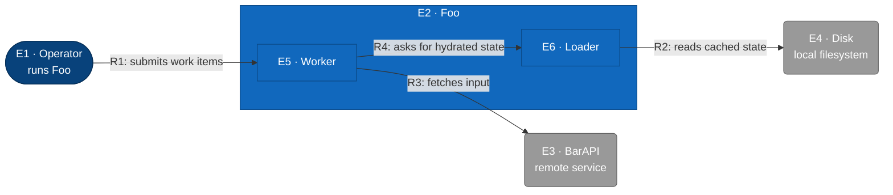

# C2 — Foo (Container)

Refines E2 Foo into a worker that processes input and a loader that hydrates state from disk.

## Element Catalog

| ID | Name | Type | Responsibility | System of Record |
|---|---|---|---|---|
| E1 | Operator | Person | Operator who triggers Foo runs | Human |
| E2 | Foo | The system in scope | The system being refined at this level | This repo |
| E3 | BarAPI | External system | Upstream data source | bar.example.com |
| E4 | Disk | External system | On-disk state | OS filesystem |
| E5 | Worker | Container | Processes incoming work items | internal/worker |
| E6 | Loader | Container | Hydrates state from disk on startup | internal/loader |

## Relationships

| ID | From | To | Description | Protocol/Medium |
|---|---|---|---|---|
| R1 | Operator | Worker | submits work items | CLI |
| R2 | Loader | Disk | reads cached state | filesystem |
| R3 | Worker | BarAPI | fetches input | HTTPS |
| R4 | Worker | Loader | asks for hydrated state | function call |

## Cross-links

- Parent: [c1-foo-system.md](c1-foo-system.md) (refines **E2 · Foo**)
- Refined by: *(none yet)*
