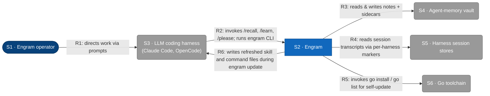
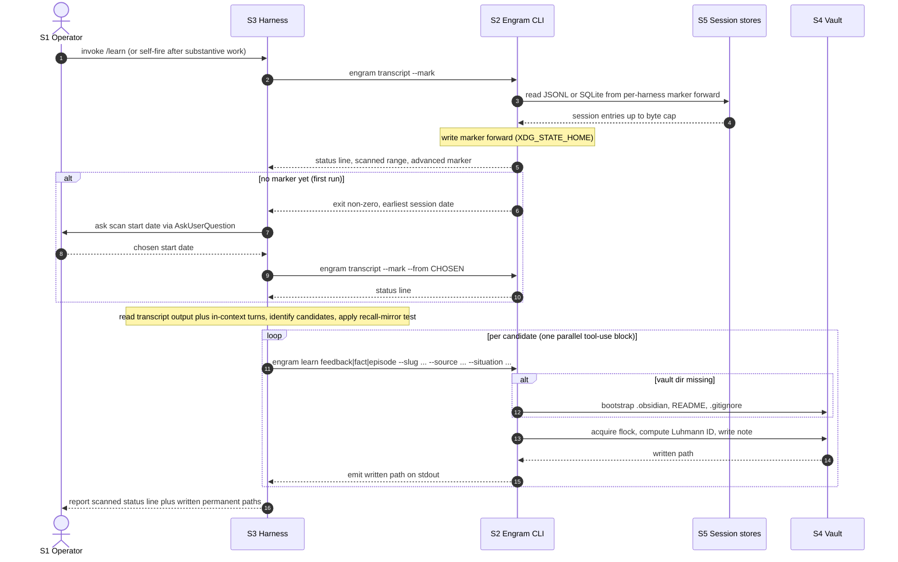
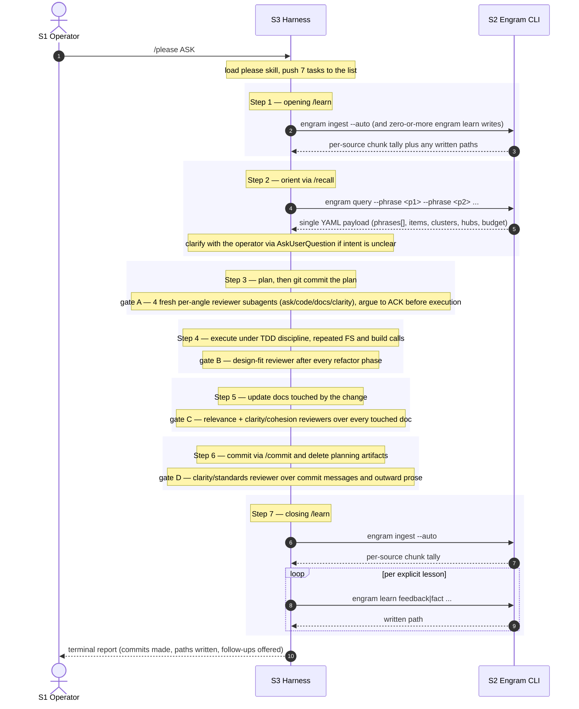
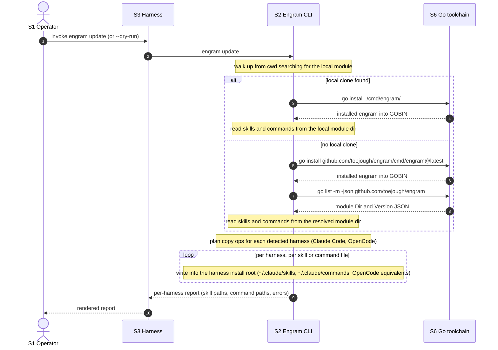
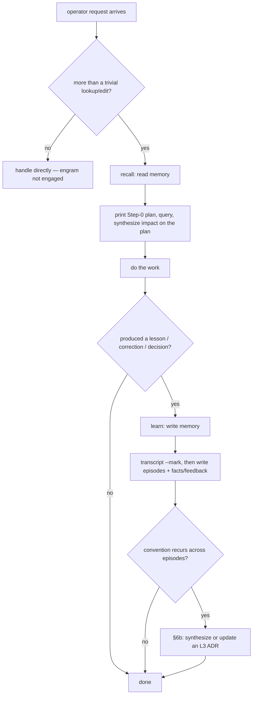
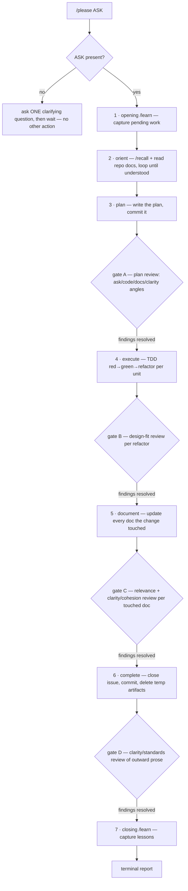

# L1 — System context

The system in scope is **Engram**, persistent memory for LLM coding agents. This
diagram shows the people and external systems engram interacts with at runtime.
Containers, components, technologies, and protocols are hidden — those live at L2
and below (see [L2](c2-containers.md) and [L3](c3-components.md)). The [Key flows](#key-flows) section below pairs the
static view with sequence diagrams for the four user-initiated runtime flows.



## Element catalog

| ID | Name | Type | Responsibility | Source |
|---|---|---|---|---|
| <a id="s1-engram-operator"></a>S1 | Engram operator | Person | Directs work through the LLM coding harness; configures engram via environment variables (`ENGRAM_VAULT_PATH`, `ENGRAM_STATE_DIR`, `ENGRAM_TRANSCRIPT_DIR`, etc.) | Human |
| <a id="s2-engram"></a>S2 | Engram | System in scope | Persistent memory for LLM coding agents: reads & writes a Luhmann zettelkasten vault, reads per-harness session transcripts via markers, and self-updates | This repo (`cmd/engram/`, `internal/`, `skills/`) |
| <a id="s3-llm-coding-harness"></a>S3 | LLM coding harness | External system | Hosts engram's slash commands and subprocess-invokes the engram CLI. Engram skills are loaded by the harness's skill mechanism. | Claude Code (`~/.claude/`), OpenCode (`~/.config/opencode/`) |
| <a id="s4-agent-memory-vault"></a>S4 | Agent-memory vault | External system | Luhmann zettelkasten on the local filesystem — a FLAT layout: notes live at the vault root (each with a sibling `.vec.json` embedding sidecar). The `Permanent/` and `MOCs/` tiers are retired (2026-06-12 flat-vault migration); subdirectories are ignored by the scanner | `$ENGRAM_VAULT_PATH` or `$XDG_DATA_HOME/engram/vault` (typically `~/.local/share/engram/vault`) |
| <a id="s5-harness-session-stores"></a>S5 | Harness session stores | External system | The LLM harness's per-session transcript storage; engram reads them at the filesystem level, not via a harness API | Claude Code: `~/.claude/projects/<slug>/*.jsonl` · OpenCode: `~/.local/share/opencode/opencode.db` (SQLite) |
| <a id="s6-go-toolchain"></a>S6 | Go toolchain | External system | Resolves module versions and installs the engram binary during `engram update` | `go` binary on `$PATH` |

## Relationships

| ID | From | To | Description |
|---|---|---|---|
| <a id="r1"></a>R1 | S1 Engram operator | S3 LLM coding harness | Directs work via prompts in the harness; configures engram via environment variables |
| <a id="r2"></a>R2 | S3 LLM coding harness | S2 Engram | Invokes `/recall`, `/learn`, `/please` slash commands; subprocess-executes the engram CLI for each invocation |
| <a id="r3"></a>R3 | S2 Engram | S4 Agent-memory vault | Reads & writes notes plus their `.vec.json` embedding sidecars under a `flock`-held vault lock; rendered as a single unidirectional arrow per the C4 read+write CRUD convention |
| <a id="r4"></a>R4 | S2 Engram | S5 Harness session stores | Reads JSONL transcripts (Claude Code) and SQLite rows (OpenCode) starting from a per-harness marker held in `$XDG_STATE_HOME/engram` |
| <a id="r5"></a>R5 | S2 Engram | S6 Go toolchain | During `engram update`, invokes `go list -m -json` and `go install` to self-update |
| <a id="r6"></a>R6 | S2 Engram | S3 LLM coding harness | During `engram update`, copies refreshed `skills/` and `commands/` files into each detected harness's install root (`~/.claude/`, `~/.config/opencode/`) |

## Key flows

Four user-initiated flows span the L1 edges. Each diagram below uses the
shorthand participant aliases `Op` (S1), `H` (S3), `E` (S2), `V` (S4), `Tr`
(S5), `Go` (S6) and only declares the participants that flow touches. Source
references cite the entry-point symbol on `main` — grep the symbol, since line numbers drift.

### Flow: recall

Operator asks a question that needs prior memory. The harness loads the `recall`
skill, prints its Step 0 judgement (Ask, Situation, Plan), then phrases 5–15
query strings from the plan and issues a single `engram query` call passing
each phrase as a separate `--phrase` flag. The binary runs one sub-pipeline
per phrase (embed, BFS 3-hop subgraph cap 200, k-means + silhouette clusters,
in-degree top-5 hubs), then merges results server-side (items dedup by path
with max score and union provenances, clusters tagged per-phrase, aggregated
budget). Chunk-space hits are additionally **recency-weighted** — each chunk's
cosine is scaled by a time-decay from the ingest manifest's per-source mtime
plus a small turn-position factor — and an **adaptive recency band** guarantees
a floor of recent transcript chunks survives the cap, so a post-context-loss
agent re-encounters its own recent first-person narration — recovering
authorship from recency itself, with no separate provenance mechanism. The
harness receives a single YAML payload and applies a
per-cluster synthesis gate: dispatches a fire-and-forget subagent for any
cluster meeting cheap gates (≥3 members, rep hints at coherence); the
subagent reads all members from disk, decides whether a binding principle is
worth capturing, and writes a new fact/feedback via `engram learn` with
`--relation` bullets to each constituent. Source:
`internal/cli/query.go` (`RunQuery`, `mergeChunkSpace`), the recency re-rank +
band in `internal/cli/recency.go`, and the `internal/cluster/` package
(`kmeans.go`, `silhouette.go`, `autok.go`).

```mermaid
sequenceDiagram
    autonumber
    actor Op as S1 Operator
    participant H as S3 Harness
    participant E as S2 Engram CLI
    participant V as S4 Vault
    participant Sub as S3 Synthesis subagent

    Op->>H: prompt that may need memory
    Note over H: print Step 0 (Ask, Situation, Plan), phrase 5-15 query strings
    H->>E: engram query --phrase <p1> --phrase <p2> ... --limit N
    E->>V: scan sidecars + bodies for compatible-embed notes
    V-->>E: notes and vectors
    Note over E: per phrase — embed, top-k cosine, BFS 3 hops (cap 200), k-means, in-degree top-5
    Note over E: merge server-side — items dedup by path (max score, union provenances); reweight chunk hits by recency and guarantee a floor of recent chunks; clusters tagged per-phrase
    E-->>H: single YAML payload (phrases[], items, clusters, hubs, budget)
    Note over H: surface anchor concepts from hubs

    loop per cluster
        Note over H: read the cluster representative — gate on ≥3 members and rep-coherence hint
        alt cluster passes the cheap gate
            H-)Sub: dispatch synthesis subagent (fire-and-forget)
            Sub->>V: read all cluster members
            V-->>Sub: member contents
            Note over Sub: decide whether a binding principle is worth capturing
            Sub-)E: engram learn fact or feedback (--relation per constituent)
            E->>V: acquire flock, compute Luhmann, write note
            V-->>E: written path
        else cluster fails the cheap gate
            Note over H: skip — cluster members remain as context
        end
    end

    Note over H: Step 4b synthesis against the Step 0 plan
    H-->>Op: reply opening with anchor concepts, then plan walk (confirmed / adjusted / contradicted / silent)
```

### Flow: learn

Operator runs `/learn` (or the harness self-fires after substantive work). The
harness first invokes `engram transcript --mark` to read session JSONL or
SQLite from S5 and advance the per-harness marker forward, then writes any
captured lessons into the vault via `engram learn {feedback|fact|episode}`. Each
write acquires a `flock` on the vault root before computing the Luhmann ID and
emitting the new file. Source: `internal/cli/transcript.go`
(`advanceAndReportMarker`) and `internal/cli/learn.go` (`runLearn`).



### Flow: please

`/please` is a skill-only orchestration of the engram repo's other skills — it
has no dedicated subcommand. The diagram below shows the seven-step bracket;
each step that crosses an L1 edge appears as a call into Engram (with the
implementation of `recall`, `learn`, etc. shown in their own diagrams above).
The diagram is intentionally workflow-shaped, not call-surface-shaped — at L1
all engram subprocess calls collapse onto the same R2 edge. The orchestrator
consults the `route` skill when staffing each gate reviewer (agent/model/effort);
that is in-context guidance, not an L1 edge, so it does not appear as a message.



### Flow: update

`engram update` refreshes both the engram binary (via Go) and the harness's
installed skills and commands. It walks up from `cwd` to detect a local clone:
on hit it runs `go install ./cmd/engram/` from the clone; on miss it runs
`go install ...@latest` followed by `go list -m -json` to resolve the module
root for the skill source. The CLI then copies each skill file and command
file into every detected harness install root. Source:
`internal/cli/update.go` (`runUpdate`) and `internal/update/update.go`
(`Updater.Run`).



The copy loop and the Go-toolchain calls are modeled in the static L1 as
relationships [R6](#r6) and [R5](#r5) respectively.

### L1 decision flowcharts

The sequence diagrams above show *message order*; these flowcharts show the *operator-level decision
logic* — when the system is engaged at all, and how `/please` sequences it. (L2/L3 carry the
internal-branch flowcharts: recall's §3a gate, §6b update-or-create, and marker forward-progress.)

#### Flow: engram engagement — the read → work → write → synthesize lifecycle



#### Flow: `/please` seven-step gated workflow

Steps run **in order** — each starts only after the previous completes. They are **non-waivable**
(urgency / "no ceremony" do not authorize skipping) and **N/A only when the mechanism is absent**
(no VCS for the step-6 commit; no transcript source for the closing `/learn`). Adversarial review
gates A–D are integral stops, not optional: each fans out fresh per-angle reviewer subagents and
blocks its step's completion until every finding is resolved (see `skills/please/SKILL.md`).



## Out of scope at L1

L1 hides containers, components, technologies, protocols, and internal structure.
Engram's internal containers (CLI binary, skills, transcript reader, vault writer,
update subsystem, debug logger) are deferred to L2.

The embedding model is **not** an external at L1. Engram bundles
`sentence-transformers/all-MiniLM-L6-v2` (384 dims) inside the binary via
`go:embed`; inference runs in pure Go through
[Hugot](https://github.com/knights-analytics/hugot) +
[GoMLX](https://github.com/gomlx/gomlx)'s `simplego` backend. There is no
embedding-API external, no daemon, no network dependency. The embedder
is therefore a container of S2 (C3 in the [L2](c2-containers.md) container
view), not a separate L1 element. The legacy
`docs/superpowers/specs/2026-05-14-tiered-memory-design.md` design that
proposed an external Voyage API was superseded by the 2026-05-22 research
log and the v2 implementation.

The `route` skill is **not** a new L1 element. It adds no system boundary, no
external, and no R-edge: it is skill-level guidance the orchestrator applies
when choosing `Agent`-tool parameters for delegated work (agent type, model,
effort), operating over the existing harness↔engram relationship rather than a
new interaction. It is a sibling of `recall`/`learn`/`please` under S2's skills
container at L2, not a participant at L1.

## Related

- L2 container diagram: [c2-containers.md](c2-containers.md)
- L3 component diagram: [c3-components.md](c3-components.md)
