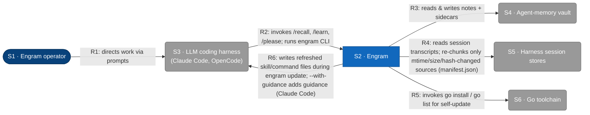
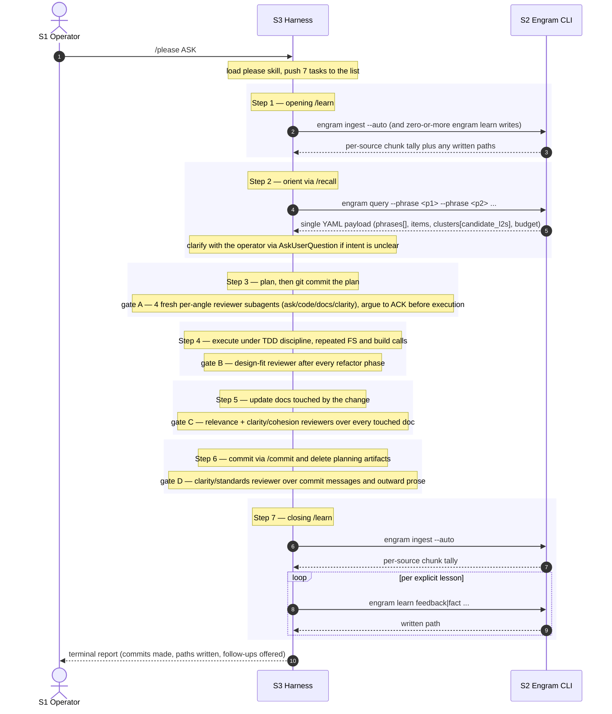
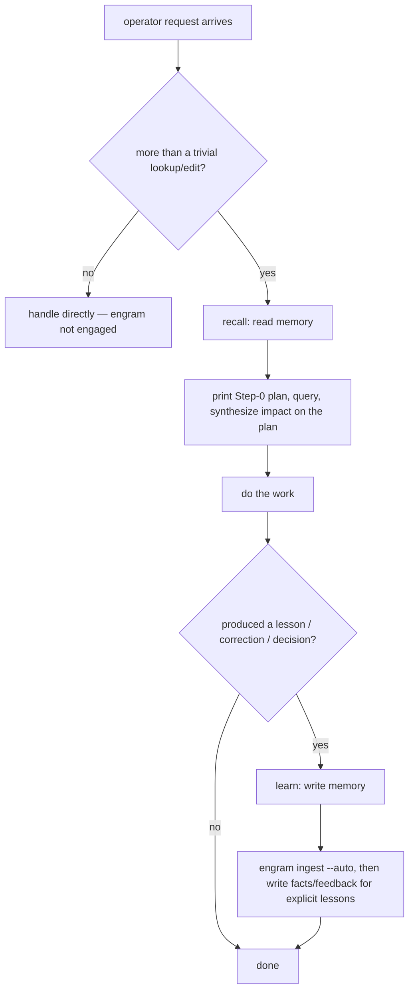
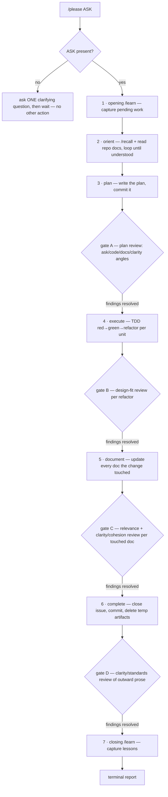

# L1 — System context

The system in scope is **Engram**, persistent memory for LLM coding agents. This
diagram shows the people and external systems engram interacts with at runtime.
Containers, components, technologies, and protocols are hidden — those live at L2
and below (see [L2](c2-containers.md) and [L3](c3-components.md)). The [Key flows](#key-flows) section below pairs the
static view with sequence diagrams for the four user-initiated runtime flows.



## Element catalog

| ID | Name | Type | Responsibility | Source |
|---|---|---|---|---|
| <a id="s1-engram-operator"></a>S1 | Engram operator | Person | Directs work through the LLM coding harness; configures engram via environment variables (`ENGRAM_VAULT_PATH`, `XDG_DATA_HOME`, etc.) | Human |
| <a id="s2-engram"></a>S2 | Engram | System in scope | Persistent memory for LLM coding agents: reads & writes a Luhmann zettelkasten vault, reads per-harness session transcripts via markers, self-updates, and provides `engram prune` (operator-run GC: removes chunk-index entries whose source file no longer exists — outside the recall/learn/please/update flows) | This repo (`cmd/engram/`, `internal/`, `skills/`) |
| <a id="s3-llm-coding-harness"></a>S3 | LLM coding harness | External system | Hosts engram's slash commands and subprocess-invokes the engram CLI. Engram skills are loaded by the harness's skill mechanism. | Claude Code (`~/.claude/`), OpenCode (`~/.config/opencode/`) |
| <a id="s4-agent-memory-vault"></a>S4 | Agent-memory vault | External system | Luhmann zettelkasten on the local filesystem — a FLAT layout: notes live at the vault root (each with a sibling `.vec.json` embedding sidecar). The `Permanent/` and `MOCs/` tiers are retired (2026-06-12 flat-vault migration); subdirectories are ignored by the scanner | `$ENGRAM_VAULT_PATH` or `$XDG_DATA_HOME/engram/vault` (typically `~/.local/share/engram/vault`) |
| <a id="s5-harness-session-stores"></a>S5 | Harness session stores | External system | The LLM harness's per-session transcript storage; engram reads them at the filesystem level, not via a harness API | Claude Code: `~/.claude/projects/<slug>/*.jsonl` (JSONL only; the OpenCode SQLite backend was never wired into production ingest and was removed in the 2026-06-20 deep clean) |
| <a id="s6-go-toolchain"></a>S6 | Go toolchain | External system | Resolves module versions and installs the engram binary during `engram update` | `go` binary on `$PATH` |

## Relationships

| ID | From | To | Description |
|---|---|---|---|
| <a id="r1"></a>R1 | S1 Engram operator | S3 LLM coding harness | Directs work via prompts in the harness; configures engram via environment variables |
| <a id="r2"></a>R2 | S3 LLM coding harness | S2 Engram | Invokes `/recall`, `/learn`, `/please` slash commands; subprocess-executes the engram CLI for each invocation |
| <a id="r3"></a>R3 | S2 Engram | S4 Agent-memory vault | Reads & writes notes plus their `.vec.json` embedding sidecars under a `flock`-held vault lock; rendered as a single unidirectional arrow per the C4 read+write CRUD convention |
| <a id="r4"></a>R4 | S2 Engram | S5 Harness session stores | `engram ingest` re-chunks only sources whose mtime/size/hash changed vs the `manifest.json` in `$XDG_DATA_HOME/engram/chunks`; reads JSONL transcripts (Claude Code `~/.claude/projects/<slug>/*.jsonl`) for changed sources only |
| <a id="r5"></a>R5 | S2 Engram | S6 Go toolchain | During `engram update`, invokes `go list -m -json` and `go install` to self-update |
| <a id="r6"></a>R6 | S2 Engram | S3 LLM coding harness | During `engram update`, copies refreshed `skills/` and `commands/` files into each detected harness's install root (`~/.claude/`, `~/.config/opencode/`); `--with-guidance` additionally deploys `guidance/recall.md` to `~/.claude/engram/recall.md` (Claude Code only; opt-in; OpenCode deferred) |

## Key flows

Four user-initiated flows span the L1 edges. Each diagram below uses the
shorthand participant aliases `Op` (S1), `H` (S3), `E` (S2), `V` (S4), `Tr`
(S5), `Go` (S6) and only declares the participants that flow touches. Source
references cite the entry-point symbol on `main` — grep the symbol, since line numbers drift.

### Flow: recall

Operator asks a question that needs prior memory. The harness loads the `recall`
skill, prints its Step 0 judgement (Ask, Situation, Plan), then phrases exactly
**10** query strings (one per fixed angle) and issues a single `engram query`
call passing each phrase as a separate `--phrase` flag. Recall has two rungs: the default `deep`
(the full procedure shown here, with crystallization writes) and an opt-in `glance` rung
(read-only, ~3 phrases, no crystallization writes — cheaper per fire). Glance escalates to `deep`
for C5 (recency-channel standards). The sequence shown is `deep`.

**Channel 1 — Relevance (clustered):** the binary scores both notes and chunks
against each phrase vector with recency bias (chunk cosine scaled by
`IngestedAt` time-decay + turn-position; note cosine scaled by `LastUsed` decay),
takes the top-30 per phrase — but **reserves up to `noteFloorK` (5) of those slots
for relevance-qualified notes** (`capWithNoteFloor`) so higher-cosine chunks cannot
fully evict a note that cleared the floor (without this, notes the embedder ranks
top-5 in isolation fell out of the unified ranking entirely: real-path note
recall@5 0.22 vs 0.83 isolation — 2026-06-28). It then unions across all 10
phrases with dedup keeping max score, drops items below a **relevance floor**
(`matchRelevanceFloor`, baseScore < 0.25), and caps the matched set at **~300**
(`matchSetCap`, 10×30 per phrase). This bounded matched set is the **only clustering
input**: one AutoK pass over matched notes+chunks (D1 preserved).
Each cluster carries `candidate_l2s: [{path, cosine, content}]` — the within-cluster top-5 notes by centroid
cosine **plus tag-nominated notes** (notes sharing ≥1 vocab term with the top-3 delivered notes; budget fields
`tag_nominations_added`/`dropped`; pool cap 40/cluster). Superseded-note ride-alongs are inserted at the next
rank. The harness then, **inline and blocking**, reads the cluster's members and candidates and applies an
**agent-judged coverage decision**: **covered** (candidate already states the principle with no material
omission, judged against the recency-weighted view) → `engram amend --activate --chunk-source <chunk ids>`
(refresh recency + provenance, no content rewrite); **near** (same situation, ≥1 substantive claim omitted)
→ `engram amend --chunk-source … <re-synthesized content>` (update in place, recency-weighted, D6);
**absent** (no candidate addresses the situation) → hand off to the **write-memory skill**
(2026-07-04), which composes and runs `engram learn fact|feedback --chunk-source …
--source "<descriptive>"` (create the single representative note). An additional write path,
`engram learn qa` (shipped round 1, 2026-07-03; since 2026-07-04 executed via the write-memory
handoff), captures Q&A pairs: the A-note competes in the main matched set (D5′); the Q-note is
excluded from the main set and is reachable via a dedicated q-space channel (round 3, gated).

**Channel 2 — Recency (un-clustered):** after the matched+clustered set, the
binary appends the **newest chunks by `IngestedAt`** (`recentFillChunks`, default **25**, configurable via `--recent-fill` / `ENGRAM_RECENT_FILL`),
deduped against the matched set and tagged `recent`. These are not added to any cluster — they are
raw situational context so a post-context-loss agent re-encounters its own recent
narration and recovers authorship from recency, with no separate provenance
mechanism. Recency now applies to chunk cosine ranking too (per-chunk `IngestedAt`,
replacing the older per-source-mtime approximation).

**Activation is agent-driven:** the binary no longer emits an `activated` flag.
After synthesis, the agent calls `engram activate` only on the notes it actually
used (the `candidate_l2s` judged Covered/Near and any notes cited in the
Step 3 synthesis). A returned-but-unused note's `LastUsed` goes stale and fades
by recency rank — bumping every returned note would defeat the supersede-by-competition
mechanism. Chunks are never activated.

Source: `internal/cli/query.go` (`RunQuery`, `runQuery`,
`buildMatchedSetFromPhrases`, `buildRecentFillItems`), the recency/decay in
`internal/cli/recency.go` (`applyChunkRecency`, `newestChunkItems`), `engram
activate` in `internal/cli/activate.go`, `engram amend` in
`internal/cli/amend.go`, and the `internal/cluster/` package (`kmeans.go`,
`silhouette.go`, `autok.go`).

> Three deliberate evolutions of earlier decisions, all driven by recency and
> retrieval precision: (1) recency applies to **both notes and chunks** — per-chunk
> `IngestedAt` (D5) replaces the per-source-mtime approximation; (2) coverage is
> **agent-judged** from within-cluster nominees (D7 reversed by recall-v2
> DECISION-2) — cosine only nominates top-5 candidates **within each cluster**;
> the agent reads members + candidates and decides; (3) **activation is agent-driven**
> (recall-v2) — the binary no longer pre-judges use; the agent activates only
> notes it actually drew on. Consequence (intended, ACT-R): regularly-useful
> memory stays fresh; never-retrieved memory decays and loses rank.

```mermaid
sequenceDiagram
    autonumber
    actor Op as S1 Operator
    participant H as S3 Harness
    participant E as S2 Engram CLI
    participant V as S4 Vault

    Op->>H: prompt that may need memory
    Note over H: print Step 0 (Ask, Situation, Plan), phrase exactly 10 query strings (one per fixed angle) — deep rung; glance phrases ~3
    H->>E: engram query --phrase <p1> ... --phrase <p10>
    E->>V: scan sidecars + bodies for compatible-embed notes + chunk index
    V-->>E: notes, chunks, and vectors
    Note over E: per phrase — embed; top-30 per phrase (notes+chunks, recency-biased cosine), reserving up to noteFloorK=5 slots for floor-qualified notes (capWithNoteFloor); union across 10 phrases, dedup max score, drop baseScore < 0.25, cap matched set at ~300
    Note over E: Channel 1 (Relevance): one AutoK cluster over matched notes+chunks (D1 preserved); per cluster emit candidate_l2s top-5 from within-cluster notes
    Note over E: Channel 2 (Recency): append newest chunks by IngestedAt (recentFillChunks, default 25), deduped vs matched set, tagged recent — NOT in any cluster
    E-->>H: single YAML payload (phrases[], items[matched+recent], clusters[candidate_l2s], budget)

    Note over H: Step 2.5 — per-cluster coverage synthesis (loop below)
    loop per cluster (blocking inline) — coverage judged from matched clusters only
        Note over H: read candidate_l2s + note members' content inline from the payload (no engram show)
        opt a needed fact lives only in a chunk (rare — notes are load-bearing)
            H->>E: engram show-chunk <source#anchor> (fetch deferred chunk text under --lazy-chunks)
            E-->>H: chunk text
        end
        Note over H: apply recency weight; judge coverage (covered / near / absent)
        alt covered — candidate already states the principle
            H->>E: engram amend --target <note> --activate --chunk-source <ids>
            E->>V: acquire flock, merge provenance, bump LastUsed
            V-->>E: written path
        else near — same situation, substantive claim omitted
            H->>E: engram amend --target <note> --chunk-source <ids> <re-synth content>
            E->>V: acquire flock, replace content fields, merge provenance, re-embed
            V-->>E: written path
        else absent — no candidate addresses the situation
            H->>E: engram learn fact|feedback --chunk-source <ids> --source "<desc>"
            E->>V: acquire flock, compute Luhmann ID, write note
            V-->>E: written path
        end
    end

    Note over H: agent calls engram activate on notes actually USED (covered/near candidates and cited notes only)
    H->>E: engram activate --note <path> ... (agent-driven; unused returned notes are NOT activated)
    E->>V: acquire flock, bump LastUsed on each activated note
    Note over H: Step 3 synthesis against the Step 0 plan
    H-->>Op: reply with plan walk (confirmed / adjusted / contradicted / silent)
```

### Flow: learn

Operator runs `/learn` (or the harness self-fires after substantive work). The
harness first invokes `engram ingest --auto` to merge-append any new chunks from
session transcripts (S5) and markdown sources into the chunk index — re-chunking
and re-embedding only changed content, never deleting existing records (append-only,
D5). It then writes any EXPLICIT lessons (corrections or explicit save-requests)
into the vault via `engram learn {feedback|fact}`. Each write acquires a `flock`
on the vault root before computing the Luhmann ID and emitting the new file.
Source: `internal/cli/ingest.go` (`runIngest`) and `internal/cli/learn.go`
(`runLearn`). The `engram learn episode` subcommand and `engram transcript --mark`
are retired: episodes are superseded by the chunk layer (D4); transcript reading
is subsumed by `engram ingest --auto`.

> Every `learn`, `amend`, and `resituate` write runs an in-process vocab trigger check
> (token-free) that persists `refit_pending` in `vocab.centroids.json` when thresholds
> trip (independent — ANY one: growth ≥40 notes AND ≥14d since last refit; vault-wide
> untagged >8%; any term >25% of vault); surfaced via
> the `engram vocab stats` verdict line + a ≈5-token `refit_pending` field in the query output payload;
> the learn skill's Step 1.5 acts on the verdict autonomously (2026-07-03).

```mermaid
sequenceDiagram
    autonumber
    actor Op as S1 Operator
    participant H as S3 Harness
    participant E as S2 Engram CLI
    participant V as S4 Vault

    Op->>H: invoke /learn (or self-fire after substantive work)

    H->>E: engram ingest --auto
    E->>V: stat known sources (session transcripts, markdown); re-chunk + re-embed changed content only
    Note over E: merge-append new chunks by ContentHash; never delete existing records (D5)
    V-->>E: written chunk count
    E-->>H: per-source chunk tally (or "memory index up to date")

    Note over H: scan THIS session for corrections and explicit save-requests only

    loop per explicit lesson (one parallel tool-use block)
        H->>E: engram learn feedback|fact --slug ... --source ... --situation ...
        alt vault dir missing
            E->>V: bootstrap .obsidian, README, .gitignore
        end
        E->>V: acquire flock, compute Luhmann ID, write note
        V-->>E: written path
        E-->>H: emit written path on stdout
    end

    H-->>Op: report chunk tally plus written permanent paths
```

### Flow: please

`/please` is a skill-only orchestration of the engram repo's other skills — it
has no dedicated subcommand. The diagram below shows the seven-step bracket;
each step that crosses an L1 edge appears as a call into Engram (with the
implementation of `recall`, `learn`, etc. shown in their own diagrams above).
The diagram is intentionally workflow-shaped, not call-surface-shaped — at L1
all engram subprocess calls collapse onto the same R2 edge. The orchestrator
consults the `route` skill when staffing each gate reviewer (agent/model/effort);
that is in-context guidance, not an L1 edge, so it does not appear as a message.



### Flow: update

`engram update` refreshes both the engram binary (via Go) and the harness's
installed skills and commands. It walks up from `cwd` to detect a local clone:
on hit it runs `go install ./cmd/engram/` from the clone; on miss it runs
`go install ...@latest` followed by `go list -m -json` to resolve the module
root for the skill source. The CLI then copies each skill file and command
file into every detected harness install root. Source:
`internal/cli/update.go` (`runUpdate`) and `internal/update/update.go`
(`Updater.Run`).

```mermaid
sequenceDiagram
    autonumber
    actor Op as S1 Operator
    participant H as S3 Harness
    participant E as S2 Engram CLI
    participant Go as S6 Go toolchain

    Op->>H: invoke engram update (or --dry-run)
    H->>E: engram update

    Note over E: walk up from cwd searching for the local module

    alt local clone found
        E->>Go: go install ./cmd/engram/
        Go-->>E: installed engram into GOBIN
        Note over E: read skills and commands from the local module dir
    else no local clone
        E->>Go: go install github.com/toejough/engram/cmd/engram@latest
        Go-->>E: installed engram into GOBIN
        E->>Go: go list -m -json github.com/toejough/engram
        Go-->>E: module Dir and Version JSON
        Note over E: read skills and commands from the resolved module dir
    end

    Note over E: plan copy ops for each detected harness (Claude Code, OpenCode)

    loop per harness, per skill or command file
        Note over E: write into the harness install root (~/.claude/skills, ~/.claude/commands, OpenCode equivalents)
    end
    opt --with-guidance (opt-in; Claude Code only)
        Note over E: write guidance/recall.md → ~/.claude/engram/recall.md
    end

    E-->>H: per-harness report (skill paths, command paths, guidance path if --with-guidance)
    H-->>Op: rendered report
```

The copy loop and the Go-toolchain calls are modeled in the static L1 as
relationships [R6](#r6) and [R5](#r5) respectively.

### L1 decision flowcharts

The sequence diagrams above show *message order*; these flowcharts show the *operator-level decision
logic* — when the system is engaged at all, and how `/please` sequences it. (L2 carries the
internal-branch flowcharts: recall's lazy-L2 coverage decision (covered/near/absent) and the
recall-time lazy-L2 synthesis loop; plus marker forward-progress.)

#### Flow: engram engagement — the read → work → write → synthesize lifecycle



#### Flow: `/please` seven-step gated workflow

Steps run **in order** — each starts only after the previous completes. They are **non-waivable**
(urgency / "no ceremony" do not authorize skipping) and **N/A only when the mechanism is absent**
(no VCS for the step-6 commit; no transcript source for the closing `/learn`). Adversarial review
gates A–D are integral stops, not optional: each fans out fresh per-angle reviewer subagents and
blocks its step's completion until every finding is resolved (see `skills/please/SKILL.md`).



## Out of scope at L1

L1 hides containers, components, technologies, protocols, and internal structure.
Engram's internal containers (CLI binary, skills, transcript reader, vault writer,
update subsystem, debug logger) are deferred to L2.

The embedding model is **not** an external at L1. Engram bundles
`sentence-transformers/all-MiniLM-L6-v2` (384 dims) inside the binary via
`go:embed`; inference runs in pure Go through
[Hugot](https://github.com/knights-analytics/hugot) +
[GoMLX](https://github.com/gomlx/gomlx)'s `simplego` backend. There is no
embedding-API external, no daemon, no network dependency. The embedder
is therefore a container of S2 (C3 in the [L2](c2-containers.md) container
view), not a separate L1 element. The legacy tiered-memory design that
proposed an external Voyage API was superseded by the 2026-05-22 research
log and the v2 implementation (see [DESIGN-HISTORY](../DESIGN-HISTORY.md)).

The `route` skill is **not** a new L1 element. It adds no system boundary, no
external, and no R-edge: it is skill-level guidance the orchestrator applies
when choosing `Agent`-tool parameters for delegated work (agent type, model,
effort), operating over the existing harness↔engram relationship rather than a
new interaction. It is a sibling of `recall`/`learn`/`please` under S2's skills
container at L2, not a participant at L1.

## Related

- L2 container diagram: [c2-containers.md](c2-containers.md)
- L3 component diagram: [c3-components.md](c3-components.md)
