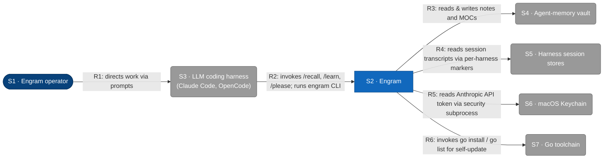

# L1 — System context

The system in scope is **Engram**, persistent memory for LLM coding agents. This
diagram shows the people and external systems engram interacts with at runtime.
Containers, components, technologies, and protocols are hidden — those live at L2
and below (not yet authored).

## Element catalog

| ID | Name | Type | Responsibility | Source |
|---|---|---|---|---|
| S1 | Engram operator | Person | Directs work through the LLM coding harness; configures engram via environment variables (`ENGRAM_VAULT_PATH`, `ENGRAM_STATE_DIR`, `ENGRAM_TRANSCRIPT_DIR`, etc.) | Human |
| S2 | Engram | System in scope | Persistent memory for LLM coding agents: reads & writes a Luhmann zettelkasten vault, reads per-harness session transcripts via markers, and self-updates | This repo (`cmd/engram/`, `internal/`, `skills/`) |
| S3 | LLM coding harness | External system | Hosts engram's slash commands and subprocess-invokes the engram CLI. Engram skills are loaded by the harness's skill mechanism. | Claude Code (`~/.claude/`), OpenCode (`~/.config/opencode/`) |
| S4 | Agent-memory vault | External system | Luhmann zettelkasten on the local filesystem — `Permanent/` notes and `MOCs/` | `$ENGRAM_VAULT_PATH` or `$XDG_DATA_HOME/engram/vault` (typically `~/.local/share/engram/vault`) |
| S5 | Harness session stores | External system | The LLM harness's per-session transcript storage; engram reads them at the filesystem level, not via a harness API | Claude Code: `~/.claude/projects/<slug>/*.jsonl` · OpenCode: `~/.local/share/opencode/opencode.db` (SQLite) |
| S6 | macOS Keychain | External system | Stores the Anthropic API token under the `Claude Code-credentials` service; engram reads it via the `security` command on darwin | macOS `security find-generic-password` |
| S7 | Go toolchain | External system | Resolves module versions and installs the engram binary during `engram update` | `go` binary on `$PATH` |

## Relationships

| ID | From | To | Description |
|---|---|---|---|
| R1 | S1 Engram operator | S3 LLM coding harness | Directs work via prompts in the harness; configures engram via environment variables |
| R2 | S3 LLM coding harness | S2 Engram | Invokes `/recall`, `/learn`, `/please` slash commands; subprocess-executes the engram CLI for each invocation |
| R3 | S2 Engram | S4 Agent-memory vault | Reads & writes notes and MOCs under a `flock`-held vault lock; rendered as a single unidirectional arrow per the C4 read+write CRUD convention |
| R4 | S2 Engram | S5 Harness session stores | Reads JSONL transcripts (Claude Code) and SQLite rows (OpenCode) starting from a per-harness marker held in `$XDG_STATE_HOME/engram` |
| R5 | S2 Engram | S6 macOS Keychain | On darwin, invokes `security find-generic-password` to read the Anthropic API token |
| R6 | S2 Engram | S7 Go toolchain | During `engram update`, invokes `go list -m -json` and `go install` to self-update |

## Out of scope at L1

L1 hides containers, components, technologies, protocols, and internal structure.
Engram's internal containers (CLI binary, skills, transcript reader, vault writer,
update subsystem, debug logger) are deferred to L2.

The Voyage embedding API discussed in
[`docs/superpowers/specs/2026-05-14-tiered-memory-design.md`](../superpowers/specs/2026-05-14-tiered-memory-design.md)
is **not** an external at L1: that design is not built. When it lands, it joins as
an additional external system.

## Related

- L2 container diagram: not yet authored.
