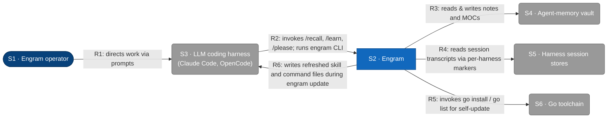
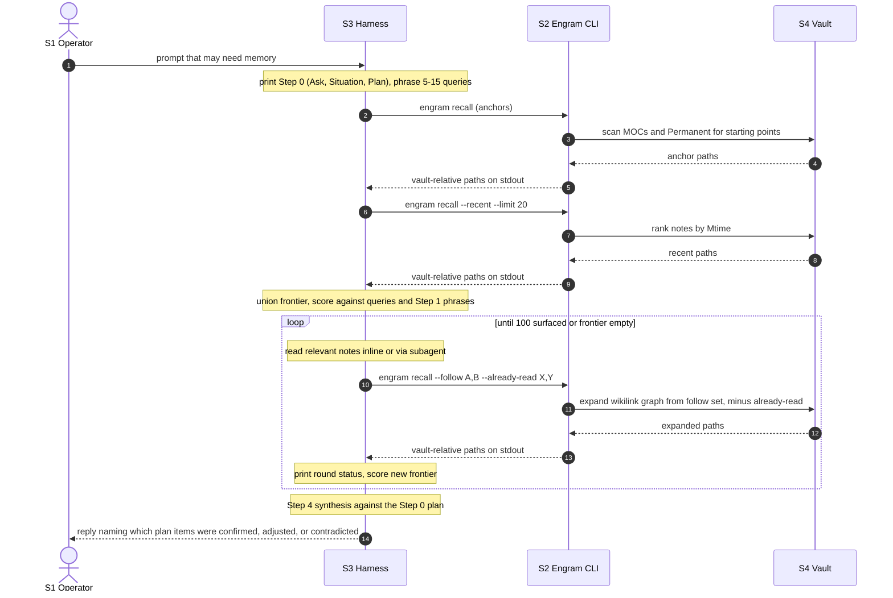
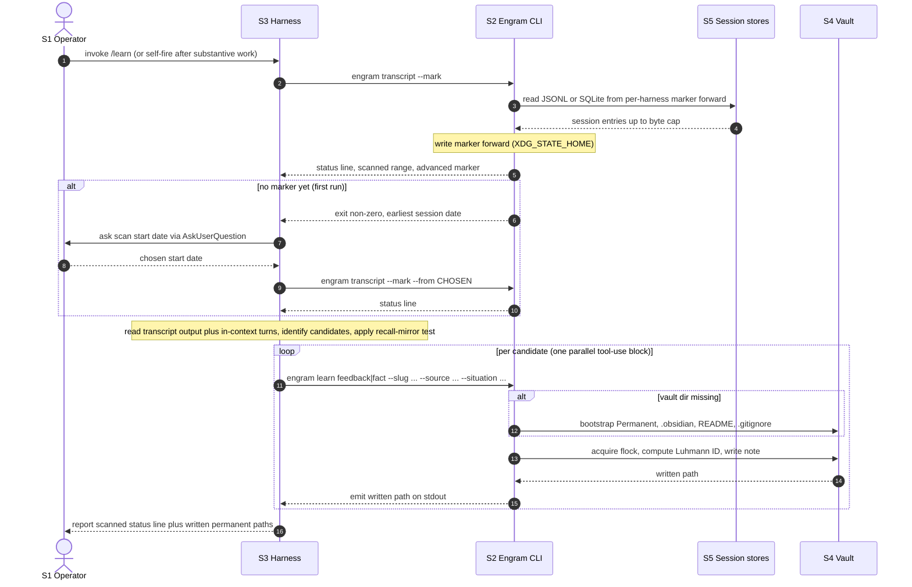
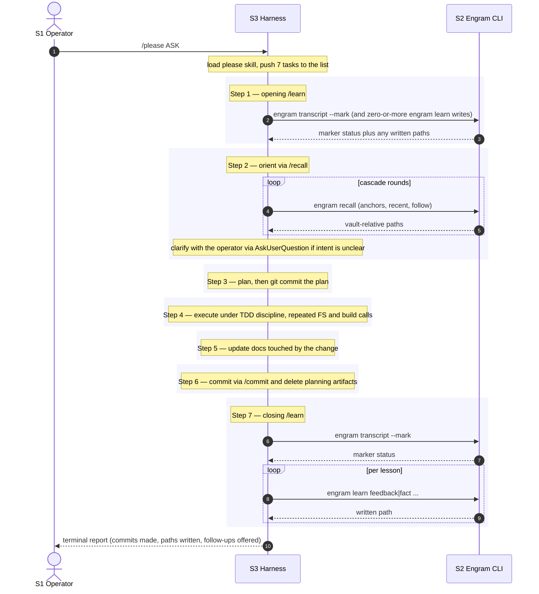
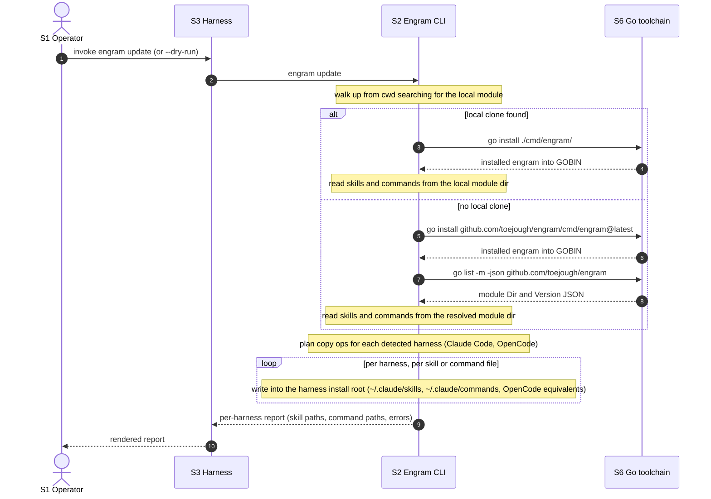

# L1 — System context

The system in scope is **Engram**, persistent memory for LLM coding agents. This
diagram shows the people and external systems engram interacts with at runtime.
Containers, components, technologies, and protocols are hidden — those live at L2
and below (not yet authored). The [Key flows](#key-flows) section below pairs the
static view with sequence diagrams for the four user-initiated runtime flows.

## Element catalog

| ID | Name | Type | Responsibility | Source |
|---|---|---|---|---|
| S1 | Engram operator | Person | Directs work through the LLM coding harness; configures engram via environment variables (`ENGRAM_VAULT_PATH`, `ENGRAM_STATE_DIR`, `ENGRAM_TRANSCRIPT_DIR`, etc.) | Human |
| S2 | Engram | System in scope | Persistent memory for LLM coding agents: reads & writes a Luhmann zettelkasten vault, reads per-harness session transcripts via markers, and self-updates | This repo (`cmd/engram/`, `internal/`, `skills/`) |
| S3 | LLM coding harness | External system | Hosts engram's slash commands and subprocess-invokes the engram CLI. Engram skills are loaded by the harness's skill mechanism. | Claude Code (`~/.claude/`), OpenCode (`~/.config/opencode/`) |
| S4 | Agent-memory vault | External system | Luhmann zettelkasten on the local filesystem — `Permanent/` notes and `MOCs/` | `$ENGRAM_VAULT_PATH` or `$XDG_DATA_HOME/engram/vault` (typically `~/.local/share/engram/vault`) |
| S5 | Harness session stores | External system | The LLM harness's per-session transcript storage; engram reads them at the filesystem level, not via a harness API | Claude Code: `~/.claude/projects/<slug>/*.jsonl` · OpenCode: `~/.local/share/opencode/opencode.db` (SQLite) |
| S6 | Go toolchain | External system | Resolves module versions and installs the engram binary during `engram update` | `go` binary on `$PATH` |

## Relationships

| ID | From | To | Description |
|---|---|---|---|
| R1 | S1 Engram operator | S3 LLM coding harness | Directs work via prompts in the harness; configures engram via environment variables |
| R2 | S3 LLM coding harness | S2 Engram | Invokes `/recall`, `/learn`, `/please` slash commands; subprocess-executes the engram CLI for each invocation |
| R3 | S2 Engram | S4 Agent-memory vault | Reads & writes notes and MOCs under a `flock`-held vault lock; rendered as a single unidirectional arrow per the C4 read+write CRUD convention |
| R4 | S2 Engram | S5 Harness session stores | Reads JSONL transcripts (Claude Code) and SQLite rows (OpenCode) starting from a per-harness marker held in `$XDG_STATE_HOME/engram` |
| R5 | S2 Engram | S6 Go toolchain | During `engram update`, invokes `go list -m -json` and `go install` to self-update |
| R6 | S2 Engram | S3 LLM coding harness | During `engram update`, copies refreshed `skills/` and `commands/` files into each detected harness's install root (`~/.claude/`, `~/.config/opencode/`) |

## Key flows

Four user-initiated flows span the L1 edges. Each diagram below uses the
shorthand participant aliases `Op` (S1), `H` (S3), `E` (S2), `V` (S4), `Tr`
(S5), `Go` (S6) and only declares the participants that flow touches. Source
file:line references point at the entry points on `main`.

### Flow: recall

Operator asks a question that needs prior memory. The harness loads the `recall`
skill, prints its Step 0 judgement (Ask, Situation, Plan), then drives a cascade
of subprocess calls into `engram recall` until the budget is spent or the
wikilink frontier empties. Source: `internal/cli/cli.go:308` (`runRecall`) and
its three branches `runRecallAnchors`, `runRecallRecent`, `runRecallFollow`.

### Flow: learn

Operator runs `/learn` (or the harness self-fires after substantive work). The
harness first invokes `engram transcript --mark` to read session JSONL or
SQLite from S5 and advance the per-harness marker forward, then writes any
captured lessons into the vault via `engram learn {feedback|fact}`. Each
write acquires a `flock` on the vault root before computing the Luhmann ID and
emitting the new file. Source: `internal/cli/transcript.go:117`
(`advanceAndReportMarker`) and `internal/cli/learn.go:338` (`runLearn`).

### Flow: please

`/please` is a skill-only orchestration of the engram repo's other skills — it
has no dedicated subcommand. The diagram below shows the seven-step bracket;
each step that crosses an L1 edge appears as a call into Engram (with the
implementation of `recall`, `learn`, etc. shown in their own diagrams above).
The diagram is intentionally workflow-shaped, not call-surface-shaped — at L1
all engram subprocess calls collapse onto the same R2 edge.

### Flow: update

`engram update` refreshes both the engram binary (via Go) and the harness's
installed skills and commands. It walks up from `cwd` to detect a local clone:
on hit it runs `go install ./cmd/engram/` from the clone; on miss it runs
`go install ...@latest` followed by `go list -m -json` to resolve the module
root for the skill source. The CLI then copies each skill file and command
file into every detected harness install root. Source:
`internal/cli/update.go:199` (`runUpdate`) and `internal/update/update.go:152`
(`Updater.Run`).

The copy loop and the Go-toolchain calls are modeled in the static L1 as
relationships [R6](#r6) and [R5](#r5) respectively.

## Out of scope at L1

L1 hides containers, components, technologies, protocols, and internal structure.
Engram's internal containers (CLI binary, skills, transcript reader, vault writer,
update subsystem, debug logger) are deferred to L2.

The Voyage embedding API discussed in
[`docs/superpowers/specs/2026-05-14-tiered-memory-design.md`](../superpowers/specs/2026-05-14-tiered-memory-design.md)
is **not** an external at L1: that design is not built. When it lands, it joins as
an additional external system.

## Related

- L2 container diagram: not yet authored.
