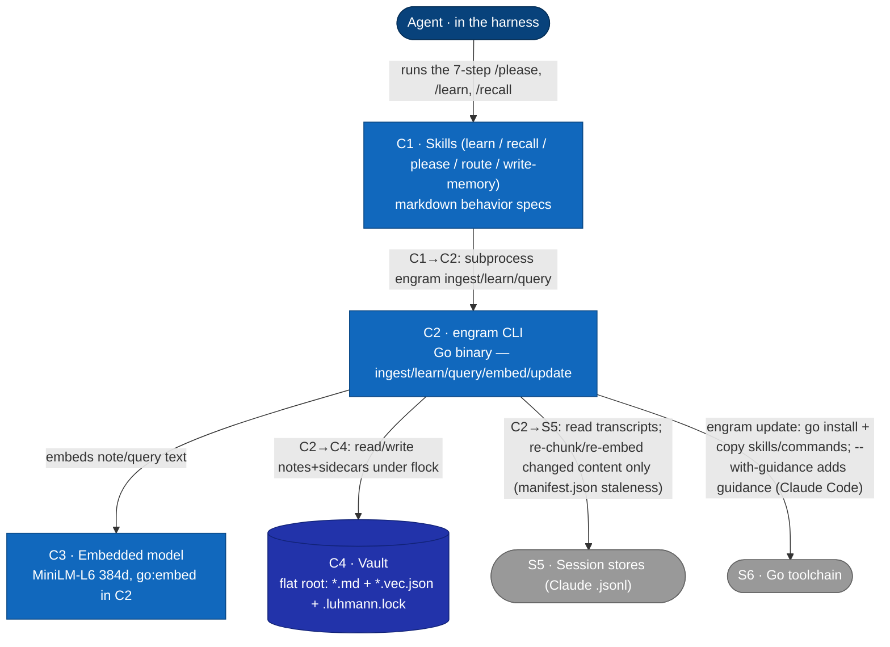
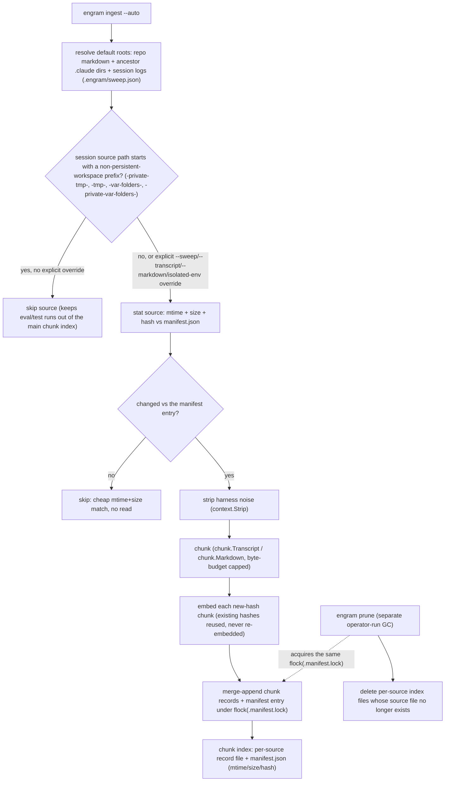
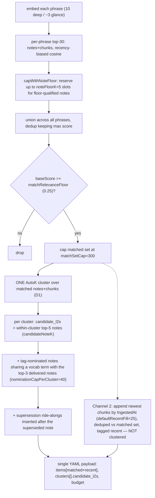
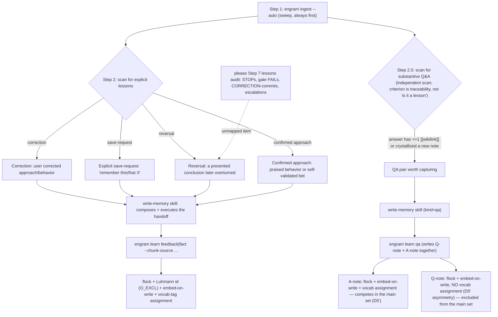
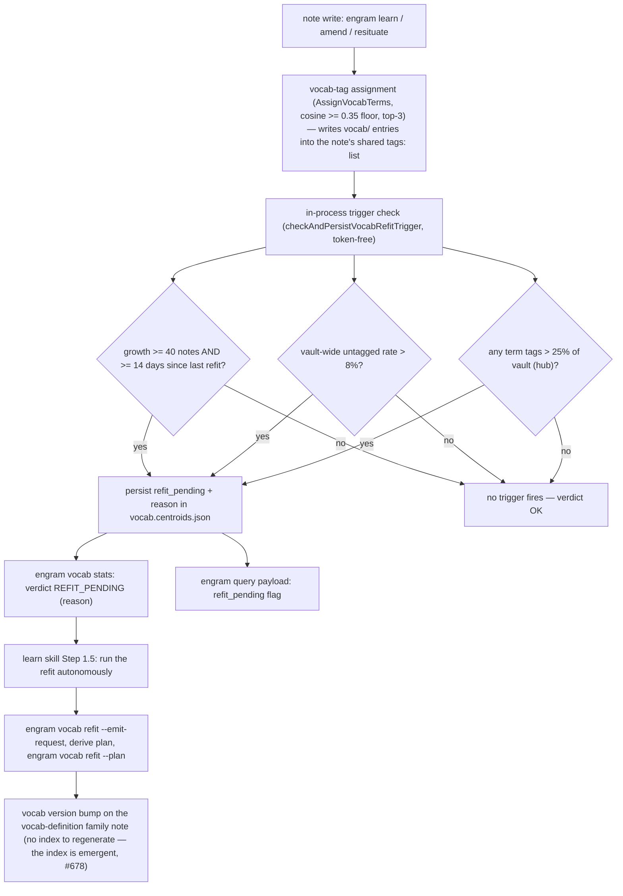
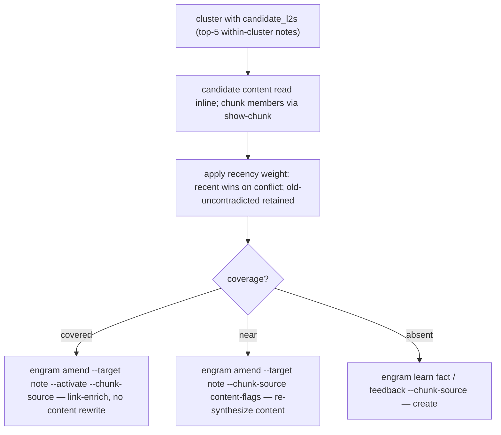

# L2 — Container view

Decomposes **S2 · Engram** (from [L1](c1-system-context.md)) into its runnable/
deployable containers. External systems (harness, session stores, Go toolchain) are
carried over from L1. Reflects the current system; verified-defect
annotations (⚠) mark places the implementation diverges from intent and are
re-verified each time this doc is edited — detail in
[memory-invariants](memory-invariants.md).



## Container catalog
| ID | Container | Tech | Responsibility | ⚠ verified defects |
|---|---|---|---|---|
| C1 | Skills | markdown (loaded by harness) | The LLM-judgment layer: `/learn` (`ingest --auto` + `fact`/`feedback` for explicit lessons), `/recall` (`query` → agent-judged coverage → `amend`/`learn`), `/please` (7-step bracket). `/route` is also a skill here but is dispatch doctrine (agent/model/effort selection), not a judgment flow; `/write-memory` is the vault-write worker (executes learn/recall handoffs — parents judge, the worker writes; 2026-07-04). Deployed to `~/.claude/skills`, `~/.config/opencode` via `engram update`. | — |
| C2 | engram CLI | Go (no CGO; GoMLX simplego) | Pure-compute layer: chunk ingest (`engram ingest --auto` re-chunks/re-embeds only sources whose mtime/size/hash changed vs `manifest.json` in `$XDG_DATA_HOME/engram/chunks`; the manifest read-modify-write is serialized under `.manifest.lock` across `ingest` + `prune`, #660), note write (embed-on-write, Luhmann id under lock, vocab-tag assignment on every write — `vocab/<term>` entries in the shared `tags:` list since the 2026-07-10 tags migration, #678 — in-process vocab trigger check persisting `refit_pending` in `vocab.centroids.json` when thresholds trip — 2026-07-03), query (two-channel recall: relevance channel = recency-biased cosine → bounded matched set (~300) → one AutoK cluster → `candidate_l2s` of within-cluster top-5 **plus tag-nominated notes** sharing a vocab term with top-3 delivered notes + superseded-note ride-alongs; recency channel = newest chunks un-clustered (`recentFillChunks`, default 25); optional `--lazy-chunks` renders matched+recent **chunk** items path/source-only (notes keep full content) for on-demand fetch via `show-chunk`), `vocab` subcommand family (bootstrap/propose/stats/refit), embed apply/status, update; read-only operator/audit surfaces — `check` (vault-invariant checks), `show`/`show-chunk` (note/chunk lookup), `prune` (chunk-index GC), `count` (frontmatter `--group-by`/`--filter` membership counts and `--backlinks-of` wikilink in-degree, ADR-0018) — all side-effect-free and off the query/similarity path. | houses G0, M4 |
| C3 | Embedded model | MiniLM-L6-v2@384, `go:embed` | Deterministic 384-d sentence embeddings for note/query text. Single model id stamped into every sidecar. | M4: off-model sidecars dropped with only a non-fatal stderr advisory under partial migration (`warnModelMismatch` — results thin silently on stdout, no error); a full-vault mismatch errors (`errQueryNoEmbeddings`) |
| C4 | Vault | filesystem | `<luhmann>.<date>.<slug>.md` at the flat vault root + sibling `.vec.json`; `.luhmann.lock` (flock). Tier in frontmatter. Wikilinks in note bodies = the graph edges. | G0: bare-id links unresolved by C2's basename resolver — census 151/183 links bare-id, 28 edges resolve, 138/171 orphaned (memory-invariants.md) |

## Relationships
| From → To | Description |
|---|---|
| Agent → C1 | The agent executes the skills' steps (LLM judgment); the skills are the only entry to the system from the agent's side. |
| C1 → C2 | Each skill step subprocess-invokes `engram <subcommand>` (a fresh process per call). The **binary's** vault/marker I/O is entirely through C2; the **skill layer** no longer pokes vault files directly. Recall reads candidate/member content via `engram show` (notes), `engram show-chunk` (deferred chunk text under `--lazy-chunks`), and the payload's `items[]` (no direct file reads); writes go through `engram amend` (covered/near) and `engram learn` (absent). `engram amend` (`internal/cli/amend.go`) is the sync-preserving in-place edit subcommand, so the old "no `engram` edit subcommand" direct-write gap (INV-S1 write-half) is **resolved**. |
| C2 → C3 | C2 embeds note text (on write) and query text (on read) via the bundled model. All notes embed the body — see [L3](c3-components.md) K5. |
| C2 → C4 | Reads notes+sidecars at query time; writes notes+sidecars atomically (temp-file + rename) under the vault flock (`.luhmann.lock`) — every writer holds it: `learn` (id-compute→write, O_EXCL), `amend`, `resituate`, `activate`. The flock is acquired only at command entry points. The wikilink graph is built from note bodies at query time. `engram learn qa` writes Q&A pairs — Q-notes excluded from the query pipeline, A-notes competing as synthesis notes, machine-written edge lines (see [GLOSSARY](../GLOSSARY.md): qa-question / qa-answer / contributors). |
| C2 → S5 | `engram ingest --auto` reads Claude `.jsonl`; re-chunks and re-embeds only sources whose mtime/size/hash changed vs the `manifest.json` written to `$XDG_DATA_HOME/engram/chunks`; strips harness noise; byte-capped with continuation signalling. `--auto` additionally skips session-log directories whose slugified project path starts with a non-persistent-workspace prefix (`-private-tmp-`, `-tmp-`, `-var-folders-`, `-private-var-folders-` — slugified forms of `/private/tmp`, `/tmp`, and macOS `$TMPDIR`), preventing eval/test runs from bloating the main chunk index (configurable via the `non_persistent_prefixes` key in `.engram/sweep.json`). Two opt-in levers bypass the skip for deliberate test ingestion: explicit `--sweep <dir>` / `--transcript <file>` / `--markdown <file>` — manual sweep roots carry no prefix exclusion — or an isolated index + vault via `ENGRAM_CHUNKS_DIR` / `ENGRAM_VAULT_PATH`. |
| C2 → S6 | `engram update` runs `go install`, then copies refreshed skills/commands into each harness root; `--with-guidance` also deploys the guidance docs under `guidance/` (`recall.md`, `delegate.md`) to `~/.claude/engram/` (Claude Code only; opt-in; OpenCode deferred). |

### Flowchart: ingest/chunking (C2→S5)



Source: `internal/cli/ingest.go` (`RunIngest`, the manifest staleness check, `Lock`),
`internal/cli/sweepspec.go` (`NonPersistentPrefixes` default list), `internal/cli/prune.go` (`RunPrune`).

**Cross-level note (L1↔L2 reclassification).** At [L1](c1-system-context.md) the vault is **S4 — an external system** (operator-configurable, on the operator's filesystem, possibly human-edited in Obsidian); on decomposition it reappears here as **C4**, an internal store, because from engram's runtime view it is the data store engram owns and writes. This is an intentional decomposition choice, noted so the L1→L2 mapping is explicit rather than silent. Staleness tracking (`manifest.json` — mtime/size/hash per source) lives in the chunk index directory (`$XDG_DATA_HOME/engram/chunks`), which is part of C2's operational state rather than a separate container.

## The skills↔binary split (the load-bearing boundary)
- **C2 (binary) is deterministic and the thing the invariants gate:** marker math, noise-strip,
  embed-on-write, Luhmann-id-under-lock, cosine, graph build/BFS, k-means+silhouette, matched-set
  bounding (per-phrase top-30 union, dedup, relevance floor, cap at `matchSetCap`), recency-channel
  fill + dedup. The skill (C1) supplies the 10 phrases; the binary applies the floor, cap, and clustering.
- **C1 (skills) is LLM judgment, gated only by RT acceptance tests:** which candidates to capture,
  recall-mirror framing, and the recall-time lazy-L2 coverage decision (covered/near/absent).
- The two communicate **only** through C2's CLI surface + the vault on disk. This boundary is why
  the invariant checker (Phase 8) lives in C2 and the skill-discipline checks stay RT-only.

## Key flows (L2 — the skills↔binary boundary)

[L1](c1-system-context.md) carries the operator-level sequences. These L2 flows make the
**C1 skill ↔ C2 binary** boundary explicit: every `engram` call is a **fresh subprocess** the
skill shells (C1→C2); all judgment stays in C1; C2 only touches C3 (model), C4 (vault),
S5 (sessions). Every arrow is one of: (a) skill shells a subcommand, (b) a
subcommand touches a store/model/stdout — **never** one subcommand calling another in-process.
The skill layer no longer reads or edits the vault directly: recall reads candidate/member
content via `engram show-chunk` (deferred chunk text under `--lazy-chunks`) plus the query payload (notes carry content inline), and all writes go through `engram amend` /
`engram learn` (INV-S1 resolved — see the C1→C2 row above).

### Flow: recall

```mermaid
sequenceDiagram
    autonumber
    participant Sk as C1 recall skill
    participant E as C2 engram CLI
    participant Md as C3 model
    participant V as C4 vault

    Note over Sk: Step 0 — print Ask/Situation/Plan; Step 1 — phrase exactly 10 queries (one per fixed angle) — deep rung; glance phrases ~3
    Sk->>E: shell engram query --lazy-chunks --phrase p1 … --phrase p10 (fresh process)
    E->>V: Scan notes + load model-compatible sidecars + chunk index
    V-->>E: notes, chunks, and vectors
    E->>Md: embed each phrase
    Md-->>E: query vectors
    Note over E: build the two-channel matched set + clusters (full stage order and constants in the "recall query pipeline" flowchart below)
    E-->>Sk: stdout YAML — items[matched+recent], clusters[].candidate_l2s {path, cosine, content} (top-5 within-cluster), budget (lazy_chunks: true → chunk items path/source-only; notes keep full content)
    loop per cluster (BLOCKING — inline, not fire-and-forget) — coverage from matched clusters only
        Note over Sk: read candidate_l2s + note members' content inline (no engram show)
        opt a chunk is the sole carrier of a needed fact (rare — notes are load-bearing; measured 0 fetches in 13/13 realistic recalls, on-target fetch when sole-source)
            Sk->>E: shell engram show-chunk <source#anchor> (fetch deferred chunk text under --lazy-chunks)
            E-->>Sk: chunk text
        end
        Note over Sk: apply recency weight; judge coverage (covered/near/absent)
        alt covered
            Sk->>E: shell engram amend --target <note> --activate --chunk-source (link-enrich)
        else near
            Sk->>E: shell engram amend --target <note> --chunk-source <content flags> (re-synthesize)
        else absent
            Note over Sk: hand off to write-memory skill (parents judge, worker writes)
            Sk->>E: shell engram learn fact|feedback --chunk-source (create; via write-memory)
        end
        E->>V: write under flock (amend rewrites both copies + re-embeds; learn O_EXCL)
    end
    Note over Sk: agent calls engram activate on notes actually USED (covered/near + cited); binary emits no activated flag
    Note over Sk: Step 3 — synthesize impact on the Step 0 plan
```

### Flowchart: recall query pipeline (C2)

Companion to the sequence diagram above — the same `RunQuery` pipeline (component-level view:
[L3](c3-components.md) `engram query` internals) rendered as a linear stage pipeline, matching the
current constants in `internal/cli/query.go` and `internal/cli/query_nominations.go`.



Source: `internal/cli/query.go` (`matchRelevanceFloor`, `matchSetCap`, `noteFloorK`, `capWithNoteFloor`,
`candidateNoteK`, `defaultRecentFill`, `applyFloorAndCap`), `internal/cli/query_nominations.go`
(`nominationCapPerCluster`, `topNForNomination`, `applyTagNominationAndRideAlong`).

### Flow: learn

```mermaid
sequenceDiagram
    autonumber
    participant Sk as C1 learn skill
    participant E as C2 engram CLI
    participant Tr as S5 sessions
    participant Md as C3 model
    participant V as C4 vault

    Sk->>E: shell engram ingest --auto (fresh process)
    E->>Tr: check mtime/size/hash vs manifest.json; re-chunk/re-embed changed sources only
    Tr-->>E: session entries (changed sources)
    Note over E: strip harness noise (context.Strip); write updated manifest.json to chunk index dir
    E-->>Sk: stdout chunk identifiers + status line (scanned range, new chunk count)
    Note over Sk: scan for the four explicit lesson kinds (corrections, save-requests, reversals, confirmed approaches); hand each to write-memory
    loop per explicit lesson (one parallel tool-use block)
        Note over Sk: hand off to write-memory skill (parents judge, worker writes)
        Sk->>E: shell engram learn fact|feedback … (fresh process; via write-memory)
        E->>V: flock, next Luhmann id, write note (O_EXCL)
        E->>Md: embed body
        Md-->>E: vector
        E->>V: write .vec.json sidecar
        E-->>Sk: stdout written path
    end
```

### Flowchart: learn capture kinds (C1)

Companion to the sequence diagram above — the four Step-2 capture kinds plus the Step-2.5 QA-pair kind
(`skills/learn/SKILL.md` Steps 2/2.5), each handed off to the **write-memory** skill, converging on the
same vault-write mechanics.



Source: `skills/learn/SKILL.md` (Step 1, Step 2, Step 2.5), `skills/please/SKILL.md` (Step 7 lessons
audit), `internal/cli/qa.go` (`isQueryExcludedKind`, `writeQANotesUnderLock`, the D5′ comments),
`internal/cli/learn.go` (`writeLearnUnderLock`, `applyVocabAssignmentCore`).

### Flowchart: vocab lifecycle (C2)



Source: `internal/cli/vocab_trigger.go` (`refitGrowthMinNotes`, `refitGrowthMinDays`,
`refitUntaggedRateMax`, `evaluateVocabTriggers`), `internal/cli/vocab_commands.go` (`hubThreshold`,
stats verdict rendering), `internal/cli/vocab.go` (`AssignVocabTerms`, `WriteVocabAssignment`,
`applyVocabAssignmentCore`), `internal/cli/query.go` (`RefitPending` payload field),
`skills/learn/SKILL.md` Step 1.5.

### Recall-time lazy-L2 synthesis — skill-orchestrated, blocking, NOT a binary loop

Synthesis now happens at **recall**, **inline and blocking** — not at learn time and not via
fire-and-forget subagents. There is **no `engram synthesize`**. The recall skill drives the loop —
shown in full sequence form under "Flow: recall" above — calling `engram query` / `engram show-chunk`
/ `engram amend` / `engram learn` as **separate processes** and making every coverage decision itself.
Cosine only *nominates* candidate notes; the agent decides covered/near/absent. The binary never sees
"the synthesis loop." The covered/near/absent decision (the `alt` block in Flow: recall) is shown
standalone below.

### Flowchart: lazy-L2 coverage decision (C1)


