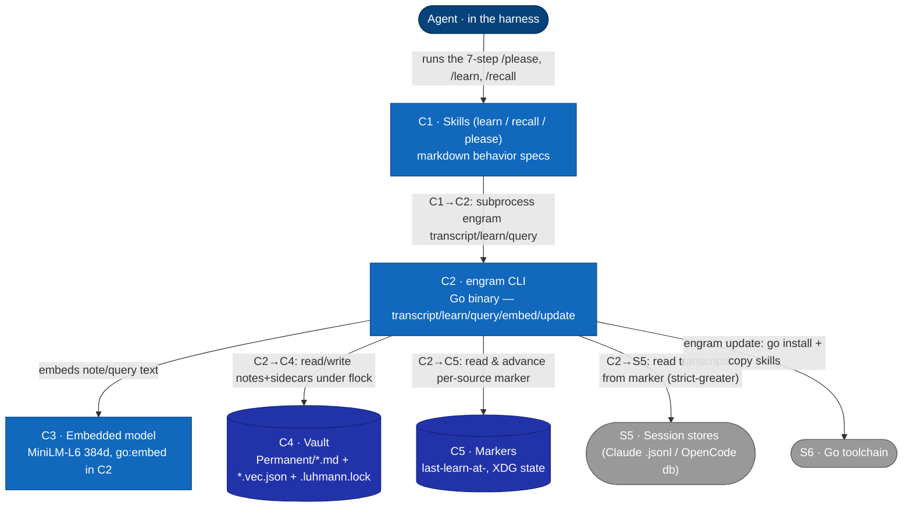
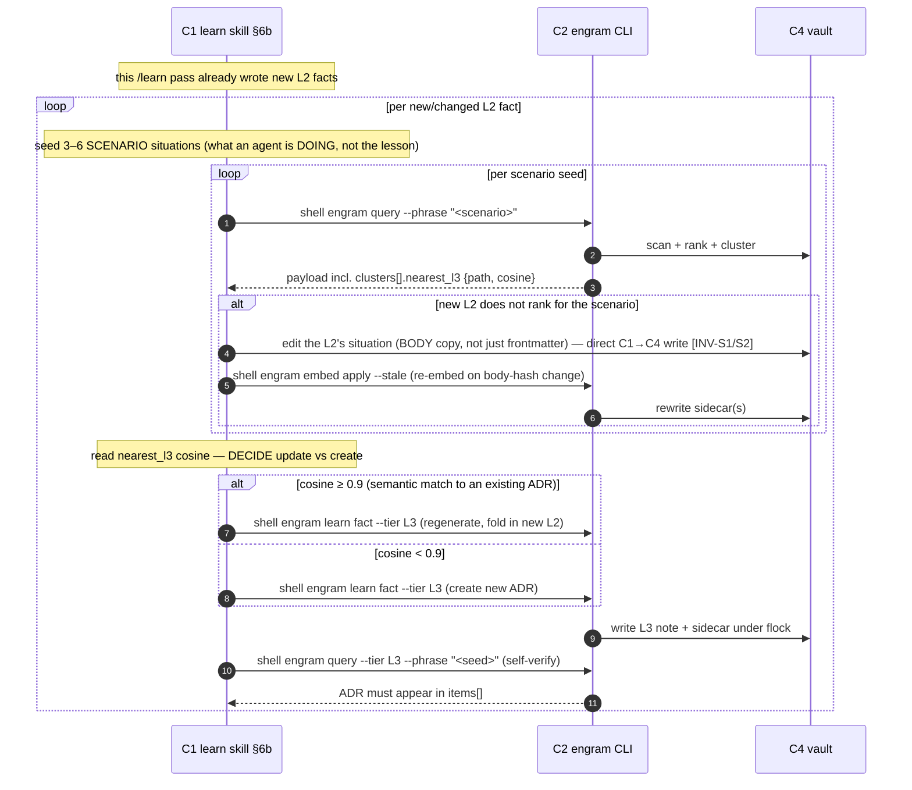
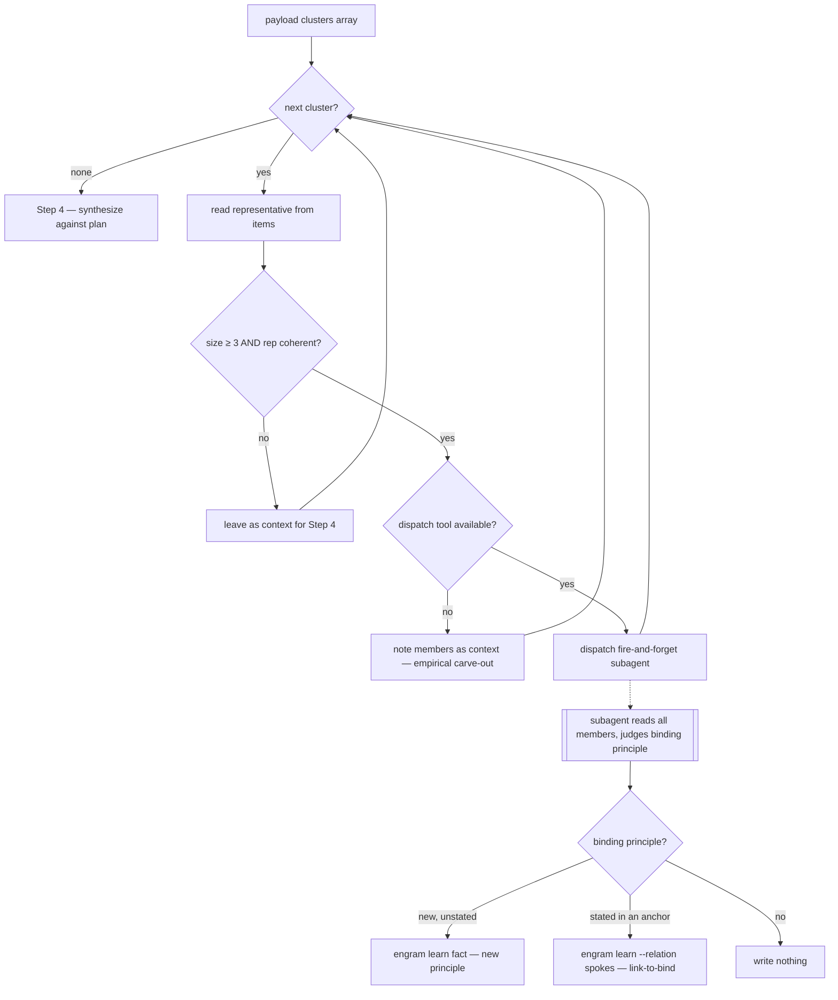
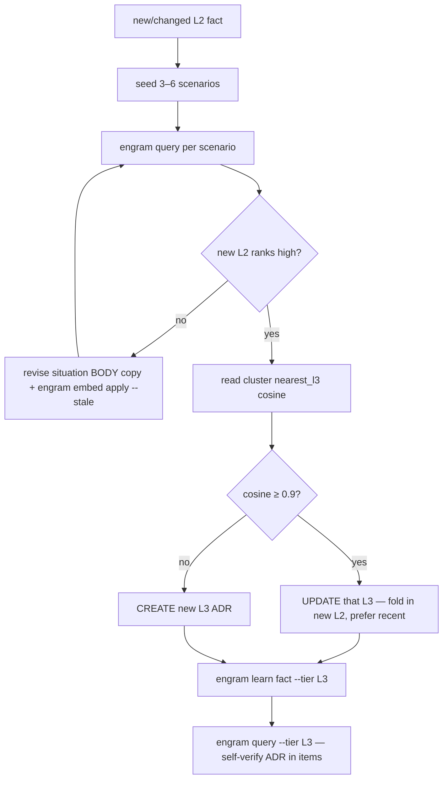

# L2 — Container view

Decomposes **S2 · Engram** (from [L1](c1-system-context.md)) into its runnable/
deployable containers. External systems (harness, session stores, Go toolchain) are
carried over from L1. Reflects the **as-built** system on 2026-06-04; verified-defect
annotations (⚠) mark places the implementation diverges from intent — detail in
[memory-invariants](../superpowers/specs/2026-06-04-memory-invariants.md).



## Container catalog
| ID | Container | Tech | Responsibility | ⚠ verified defects |
|---|---|---|---|---|
| C1 | Skills | markdown (loaded by harness) | The LLM-judgment layer: `/learn` (transcript→episode→fact/feedback→§6b L3), `/recall` (query→synthesis-gate→link-to-bind), `/please` (7-step bracket). Deployed to `~/.claude/skills`, `~/.config/opencode` via `engram update`. | — |
| C2 | engram CLI | Go (no CGO; GoMLX simplego) | Pure-compute layer: transcript scan+marker, note write (tier defaults, embed-on-write, Luhmann id under lock), query (cosine→subgraph→cluster→tier-filter), embed apply/status, update. | houses E4, G0, M2-segments, M4 |
| C3 | Embedded model | MiniLM-L6-v2@384, `go:embed` | Deterministic 384-d sentence embeddings for note/query text. Single model id stamped into every sidecar. | M4: swap silently empties recall (no guard) |
| C4 | Vault | filesystem | `Permanent/<luhmann>.<date>.<slug>.md` + sibling `.vec.json`; `.luhmann.lock` (flock). Tier in frontmatter. Wikilinks in note bodies = the graph edges. | G0: bare-id links unresolved by C2's basename resolver — census 151/183 links bare-id, 28 edges resolve, 138/171 orphaned (memory-invariants.md) |
| C5 | Markers | filesystem (XDG state) | Per-`(project,source)` `last-learn-at-claude/opencode` RFC3339 timestamps; the forward-progress cursor. | M2-segments over-advance |

## Relationships
| From → To | Description |
|---|---|
| Agent → C1 | The agent executes the skills' steps (LLM judgment); the skills are the only entry to the system from the agent's side. |
| C1 → C2 | Each skill step subprocess-invokes `engram <subcommand>` (a fresh process per call). The **binary's** vault/marker I/O is entirely through C2. The **skill layer** additionally touches the vault directly in two spots (see INV-S1): recall §3a — a synthesis subagent **reads** cluster-member files, which the query payload returns as *paths only*; and learn §6b — **editing** a note's `situation` before re-embed (`learn` is create-only, no edit subcommand). |
| C2 → C3 | C2 embeds note text (on write) and query text (on read) via the bundled model. The per-kind embed-source routing (episode `situation` vs body) is a C2 internal — see [L3](c3-components.md) K5. |
| C2 → C4 | Reads notes+sidecars at query time; writes new notes+sidecars atomically under a vault write-lock spanning id-compute→write. The wikilink graph is built from note bodies at query time. |
| C2 → C5 | `transcript --mark` reads the marker, scans `> marker`, advances it (per source, independently). |
| C2 → S5 | Reads Claude `.jsonl` / OpenCode SQLite from the marker; strips harness noise; byte-capped with continuation signalling (non-segments path). |
| C2 → S6 | `engram update` runs `go install`, then copies refreshed skills/commands into each harness root. |

**Cross-level note (L1↔L2 reclassification).** At [L1](c1-system-context.md) the vault is **S4 — an external system** (operator-configurable, on the operator's filesystem, possibly human-edited in Obsidian); on decomposition it reappears here as **C4**, an internal store, because from engram's runtime view it is the data store engram owns and writes. Likewise **C5 Markers** has no distinct L1 element — at L1 it is folded into S2's R4 ("reads … via per-harness markers") and surfaces as its own container only at this level. Both are intentional decomposition choices, noted so the L1→L2 mapping is explicit rather than silent.

## The skills↔binary split (the load-bearing boundary)
- **C2 (binary) is deterministic and the thing the invariants gate:** marker math, noise-strip,
  embed-on-write, Luhmann-id-under-lock, cosine, graph build/BFS, k-means+silhouette, tier filter.
- **C1 (skills) is LLM judgment, gated only by RT acceptance tests:** which candidates to capture,
  recall-mirror framing, arc grouping, scenario-seeding, ADR authoring, the §3a synthesis decision.
- The two communicate **only** through C2's CLI surface + the vault on disk. This boundary is why
  the invariant checker (Phase 8) lives in C2 and the skill-discipline checks stay RT-only.

## Key flows (L2 — the skills↔binary boundary)

[L1](c1-system-context.md) carries the operator-level sequences. These L2 flows make the
**C1 skill ↔ C2 binary** boundary explicit: every `engram` call is a **fresh subprocess** the
skill shells (C1→C2); all judgment stays in C1; C2 only touches C3 (model), C4 (vault),
C5 (markers), S5 (sessions). Every arrow is one of: (a) skill shells a subcommand, (b) a
subcommand touches a store/model/stdout, (c) skill dispatches a subagent — **never** one
subcommand calling another in-process. The two places the skill layer reads/edits the vault
directly are tagged `[INV-S1]`.

### Flow: recall

```mermaid
sequenceDiagram
    autonumber
    participant Sk as C1 recall skill
    participant E as C2 engram CLI
    participant Md as C3 model
    participant V as C4 vault
    participant Sub as C1 synthesis subagent

    Note over Sk: Step 0 — print Ask/Situation/Plan; Step 1 — phrase 5–15 queries
    Sk->>E: shell engram query --phrase p1 … --phrase pN (fresh process)
    E->>V: Scan notes + load model-compatible sidecars
    V-->>E: notes + vectors
    E->>Md: embed each phrase
    Md-->>E: query vectors
    Note over E: per phrase — cosine rank, BFS subgraph, cluster, hubs; tier-filter (items-only today; T1a fix → all channels)
    E-->>Sk: stdout YAML — items, clusters[].members=paths, hubs, nearest_l3, budget
    Note over Sk: Step 3a — per cluster: read rep from items, gate on ≥3 members + coherence
    loop each cluster passing the parent gate
        Sk-)Sub: dispatch synthesis subagent (fire-and-forget)
        Sub->>V: read all member files — direct C1→C4 read [INV-S1]
        Sub->>E: shell engram learn fact|feedback (new principle or link-to-bind)
        E->>V: flock, next id, write note + sidecar (O_EXCL)
    end
    Note over Sk: Step 4 — synthesize impact on the Step 0 plan
```

### Flow: learn

```mermaid
sequenceDiagram
    autonumber
    participant Sk as C1 learn skill
    participant E as C2 engram CLI
    participant Tr as S5 sessions
    participant Mk as C5 markers
    participant Md as C3 model
    participant V as C4 vault

    Sk->>E: shell engram transcript --mark (fresh process)
    E->>Mk: read per-source marker
    E->>Tr: scan rows strictly after marker, within byte budget
    Tr-->>E: session entries
    Note over E: strip harness noise (context.Strip)
    E->>Mk: advance marker (strict-greater; never past earliest unread row)
    E-->>Sk: stdout stripped chunk + status line (scanned range, new marker)
    Note over Sk: identify candidates; classify locus; recall-mirror test
    loop per candidate (one parallel tool-use block)
        Sk->>E: shell engram learn episode|fact|feedback … (fresh process)
        E->>V: flock, next Luhmann id, write note (O_EXCL)
        E->>Md: embed (episode→situation, else body)
        Md-->>E: vector
        E->>V: write .vec.json sidecar
        E-->>Sk: stdout written path
    end
```

### Flow: L3 synthesis (§6b) — skill-orchestrated, NOT a binary loop

The flow most easily mis-drawn: there is **no `engram synthesize`**. The skill runs the whole
loop, calling `engram query` / `engram embed` / `engram learn` as **separate processes** and
making every decision itself. The binary never sees "the §6b loop."



### Flowchart: recall §3a per-cluster synthesis gate (C1 decision)



### Flowchart: §6b update-or-create decision (C1)


