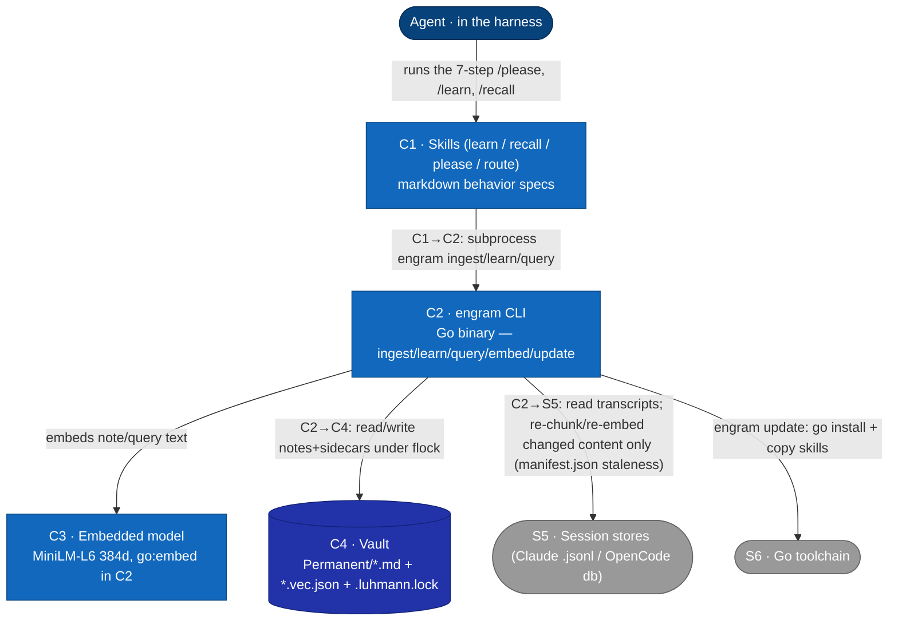
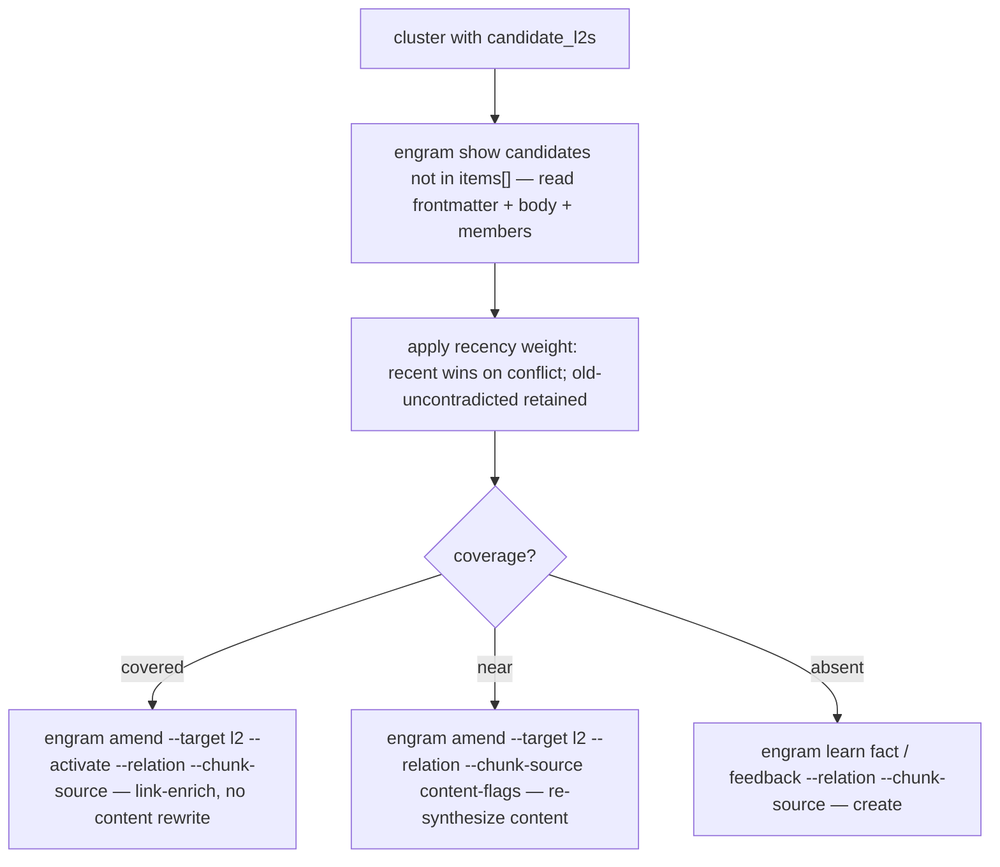

# L2 — Container view

Decomposes **S2 · Engram** (from [L1](c1-system-context.md)) into its runnable/
deployable containers. External systems (harness, session stores, Go toolchain) are
carried over from L1. Reflects the **as-built** system on 2026-06-04; verified-defect
annotations (⚠) mark places the implementation diverges from intent — detail in
[memory-invariants](../superpowers/specs/2026-06-04-memory-invariants.md).



## Container catalog
| ID | Container | Tech | Responsibility | ⚠ verified defects |
|---|---|---|---|---|
| C1 | Skills | markdown (loaded by harness) | The LLM-judgment layer: `/learn` (`ingest --auto` + `fact`/`feedback` for explicit lessons), `/recall` (`query --synthesize-l2` → agent-judged coverage → `amend`/`learn`), `/please` (7-step bracket). `/route` is also a skill here but is dispatch doctrine (agent/model/effort selection), not a judgment flow. Deployed to `~/.claude/skills`, `~/.config/opencode` via `engram update`. | — |
| C2 | engram CLI | Go (no CGO; GoMLX simplego) | Pure-compute layer: chunk ingest (`engram ingest --auto` re-chunks/re-embeds only sources whose mtime/size/hash changed vs `manifest.json` in `$XDG_DATA_HOME/engram/chunks`), note write (tier defaults, embed-on-write, Luhmann id under lock), query (cosine→subgraph→cluster→tier-filter), embed apply/status, update. | houses G0, M4 |
| C3 | Embedded model | MiniLM-L6-v2@384, `go:embed` | Deterministic 384-d sentence embeddings for note/query text. Single model id stamped into every sidecar. | M4: swap silently empties recall (no guard) |
| C4 | Vault | filesystem | `Permanent/<luhmann>.<date>.<slug>.md` + sibling `.vec.json`; `.luhmann.lock` (flock). Tier in frontmatter. Wikilinks in note bodies = the graph edges. | G0: bare-id links unresolved by C2's basename resolver — census 151/183 links bare-id, 28 edges resolve, 138/171 orphaned (memory-invariants.md) |

## Relationships
| From → To | Description |
|---|---|
| Agent → C1 | The agent executes the skills' steps (LLM judgment); the skills are the only entry to the system from the agent's side. |
| C1 → C2 | Each skill step subprocess-invokes `engram <subcommand>` (a fresh process per call). The **binary's** vault/marker I/O is entirely through C2; the **skill layer** no longer pokes vault files directly. Recall reads candidate/member content via `engram show` and the payload's `items[]` (no direct file reads); writes go through `engram amend` (covered/near) and `engram learn` (absent). `engram amend` (`internal/cli/amend.go`) is the sync-preserving in-place edit subcommand, so the old "no `engram` edit subcommand" direct-write gap (INV-S1 write-half) is **resolved**. |
| C2 → C3 | C2 embeds note text (on write) and query text (on read) via the bundled model. All notes embed the body — see [L3](c3-components.md) K5. |
| C2 → C4 | Reads notes+sidecars at query time; writes new notes+sidecars atomically under a vault write-lock spanning id-compute→write. The wikilink graph is built from note bodies at query time. |
| C2 → S5 | `engram ingest --auto` reads Claude `.jsonl` / OpenCode SQLite; re-chunks and re-embeds only sources whose mtime/size/hash changed vs the `manifest.json` written to `$XDG_DATA_HOME/engram/chunks`; strips harness noise; byte-capped with continuation signalling. |
| C2 → S6 | `engram update` runs `go install`, then copies refreshed skills/commands into each harness root. |

**Cross-level note (L1↔L2 reclassification).** At [L1](c1-system-context.md) the vault is **S4 — an external system** (operator-configurable, on the operator's filesystem, possibly human-edited in Obsidian); on decomposition it reappears here as **C4**, an internal store, because from engram's runtime view it is the data store engram owns and writes. This is an intentional decomposition choice, noted so the L1→L2 mapping is explicit rather than silent. Staleness tracking (`manifest.json` — mtime/size/hash per source) lives in the chunk index directory (`$XDG_DATA_HOME/engram/chunks`), which is part of C2's operational state rather than a separate container.

## The skills↔binary split (the load-bearing boundary)
- **C2 (binary) is deterministic and the thing the invariants gate:** marker math, noise-strip,
  embed-on-write, Luhmann-id-under-lock, cosine, graph build/BFS, k-means+silhouette, tier filter.
- **C1 (skills) is LLM judgment, gated only by RT acceptance tests:** which candidates to capture,
  recall-mirror framing, and the recall-time lazy-L2 coverage decision (covered/near/absent).
- The two communicate **only** through C2's CLI surface + the vault on disk. This boundary is why
  the invariant checker (Phase 8) lives in C2 and the skill-discipline checks stay RT-only.

## Key flows (L2 — the skills↔binary boundary)

[L1](c1-system-context.md) carries the operator-level sequences. These L2 flows make the
**C1 skill ↔ C2 binary** boundary explicit: every `engram` call is a **fresh subprocess** the
skill shells (C1→C2); all judgment stays in C1; C2 only touches C3 (model), C4 (vault),
S5 (sessions). Every arrow is one of: (a) skill shells a subcommand, (b) a
subcommand touches a store/model/stdout — **never** one subcommand calling another in-process.
The skill layer no longer reads or edits the vault directly: recall reads candidate/member
content via `engram show` and the query payload, and all writes go through `engram amend` /
`engram learn` (INV-S1 resolved — see the C1→C2 row above).

### Flow: recall

```mermaid
sequenceDiagram
    autonumber
    participant Sk as C1 recall skill
    participant E as C2 engram CLI
    participant Md as C3 model
    participant V as C4 vault

    Note over Sk: Step 0 — print Ask/Situation/Plan; Step 1 — phrase 5–15 queries
    Sk->>E: shell engram query --synthesize-l2 --phrase p1 … --phrase pN (fresh process)
    E->>V: Scan notes + load model-compatible sidecars
    V-->>E: notes + vectors
    E->>Md: embed each phrase
    Md-->>E: query vectors
    Note over E: cosine rank, BFS subgraph, ONE AutoK cluster over matched chunks+notes; tier-filter (items-only today; T1a fix → all channels)
    E-->>Sk: stdout YAML — items, clusters[].candidate_l2s {path, cosine} (top-K by centroid cosine), hubs, budget
    loop per cluster (BLOCKING — inline, not fire-and-forget)
        Sk->>E: shell engram show <candidate L2s> (only those not already in items[])
        E-->>Sk: candidate frontmatter + body + members
        Note over Sk: apply recency weight; judge coverage (covered/near/absent)
        alt covered
            Sk->>E: shell engram amend --target <l2> --activate --relation --chunk-source (link-enrich)
        else near
            Sk->>E: shell engram amend --target <l2> --relation --chunk-source <content flags> (re-synthesize)
        else absent
            Sk->>E: shell engram learn fact|feedback --relation --chunk-source (create)
        end
        E->>V: write under flock (amend rewrites both copies + re-embeds; learn O_EXCL)
    end
    Note over Sk: Step 4 — synthesize impact on the Step 0 plan
```

### Flow: learn

```mermaid
sequenceDiagram
    autonumber
    participant Sk as C1 learn skill
    participant E as C2 engram CLI
    participant Tr as S5 sessions
    participant Md as C3 model
    participant V as C4 vault

    Sk->>E: shell engram ingest --auto (fresh process)
    E->>Tr: check mtime/size/hash vs manifest.json; re-chunk/re-embed changed sources only
    Tr-->>E: session entries (changed sources)
    Note over E: strip harness noise (context.Strip); write updated manifest.json to chunk index dir
    E-->>Sk: stdout chunk identifiers + status line (scanned range, new chunk count)
    Note over Sk: identify candidates; classify locus; recall-mirror test
    loop per candidate (one parallel tool-use block)
        Sk->>E: shell engram learn fact|feedback … (fresh process)
        E->>V: flock, next Luhmann id, write note (O_EXCL)
        E->>Md: embed body
        Md-->>E: vector
        E->>V: write .vec.json sidecar
        E-->>Sk: stdout written path
    end
```

### Flow: recall-time lazy-L2 synthesis — skill-orchestrated, blocking, NOT a binary loop

Synthesis now happens at **recall**, **inline and blocking** — not at learn time and not via
fire-and-forget subagents. There is **no `engram synthesize`**. The recall skill drives the loop,
calling `engram query` / `engram show` / `engram amend` / `engram learn` as **separate processes**
and making every coverage decision itself. Cosine only *nominates* candidate L2s; the agent decides
covered/near/absent. The binary never sees "the synthesis loop."

```mermaid
sequenceDiagram
    autonumber
    participant Sk as C1 recall skill
    participant E as C2 engram CLI
    participant V as C4 vault

    Sk->>E: shell engram query --synthesize-l2 (fresh process)
    E->>V: scan + cluster matched chunks+notes
    E-->>Sk: payload incl. clusters[].candidate_l2s {path, cosine} (top-K by centroid cosine)
    loop per cluster (BLOCKING — inline, not fire-and-forget)
        Sk->>E: shell engram show <candidate L2s> (only those not already in items[])
        E-->>Sk: candidate frontmatter + body + members
        Note over Sk: apply recency weight (recent wins on conflict; old-uncontradicted retained); judge coverage
        alt covered (one representative L2 already says it)
            Sk->>E: shell engram amend --target <l2> --activate --relation <note-srcs> --chunk-source <chunk-ids> (link-enrich, no content rewrite)
        else near (close, needs re-synthesis)
            Sk->>E: shell engram amend --target <l2> --relation … --chunk-source … <content flags> (re-synthesize content)
        else absent (no representative)
            Sk->>E: shell engram learn fact|feedback --relation … --chunk-source … (create)
        end
        E->>V: write under flock (amend rewrites both copies + re-embeds; learn O_EXCL)
    end
```

### Flowchart: lazy-L2 coverage decision (C1)


