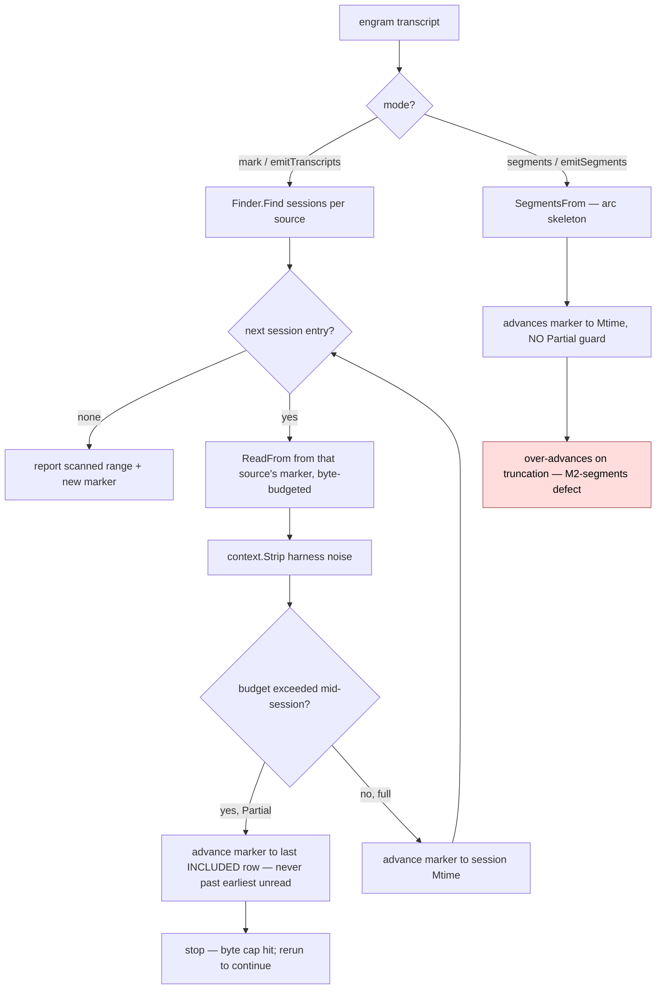

# L3 — Component view (inside C2 · engram CLI)

Decomposes **C2 · engram CLI** (from [L2](c2-containers.md)) into its Go packages/
components and the data they exchange. As-built on 2026-06-04; ⚠ = a verified defect
(see [memory-invariants](../superpowers/specs/2026-06-04-memory-invariants.md)). These
component IDs are the vocabulary the [L3 sequence/flow diagrams](#) reuse.

**Crucial: K1/K4/K6 are SEPARATE PROCESS invocations, not in-process collaborators.**
Each `engram <subcommand>` is its own process. The **C1·Skills orchestrator** (off-binary)
wires them: it reads one subcommand's **stdout** and shells the next. The binary's components
never call each other across subcommands. (This corrects an earlier draft that drew a
fabricated in-process `query→learn` edge — `query.go` has 0 `learn` refs; it ends at
`renderQueryPayload(stdout,…)`.)

```mermaid
flowchart TB
    classDef comp  fill:#1168bd,stroke:#0b4884,color:#fff
    classDef defect fill:#b1331f,stroke:#7a1f12,color:#fff
    classDef store fill:#23a,stroke:#127,color:#fff
    classDef ext fill:#999,stroke:#666,color:#fff
    classDef xcut fill:#5a7d5a,stroke:#3a5a3a,color:#fff,stroke-dasharray:4 3

    skills(["C1 · Skills orchestrator (off-binary)<br/>reads stdout, shells next subcommand"])

    subgraph PT[engram transcript — process]
      tr["K1 · transcript reader<br/>internal/transcript: Finder · JSONLReader"]
      strip["K2 · context.Strip"]
      clitr["K1b · cli/transcript wiring<br/>byte-budget + marker advance"]
    end
    subgraph PL[engram learn — process]
      learn["K4 · learn<br/>tier defaults · write-under-flock · O_EXCL"]
    end
    subgraph PQ[engram query — process]
      query["K6 · query orchestrator"]
      vg["K7 · vaultgraph<br/>ParseWikilinks · BuildGraph · BFSWithCap"]
      cl["K8 · cluster<br/>KMeans · Silhouette · AutoK · BestMatch"]
    end
    subgraph PE[engram embed — process]
      eb["K5b · cli/embed (operator-run migration)<br/>RunEmbedApply · RunEmbedStatus"]
    end
    subgraph PU[engram update — process]
      upd["K9 · update<br/>go install + copy skills/commands"]
    end

    %% shared kernels: compiled into multiple subcommand processes; never call across them
    embed["K5 · embed (shared kernel)<br/>Text(situation|body) · ContentHash · Sidecar · embedder"]
    lz["K10 · luhmann (shared kernel)<br/>ParseID · LetterLess"]
    lm["K3 · learnmarker<br/>Read · Write marker"]
    dbg["K11 · debuglog (cross-cutting, all targets)"]

    vault[("C4 · Vault")]
    markers[("C5 · Markers")]
    model[["C3 · MiniLM"]]
    sessions(["S5 · Session stores"])
    gotool(["S6 · Go toolchain"])

    skills -->|"shell engram transcript --mark"| tr
    skills -->|"shell engram learn (args)"| learn
    skills -->|"shell engram query --phrase"| query
    skills -->|"shell engram update"| upd
    skills -->|"shell engram embed apply (rare)"| eb

    tr --> strip
    tr -->|stdout| clitr
    clitr -->|stdout chunk| skills
    clitr --> lm
    lm --- markers
    tr --- sessions

    learn --> embed
    learn --> lz
    learn -->|note+sidecar under flock| vault

    query --> embed
    query --> vg
    query --> cl
    query -->|stdout payload| skills
    vg --> lz
    vg -->|read notes/wikilinks| vault

    eb --> embed
    eb -->|re-embed sidecars| vault
    embed --- model
    upd -->|go install| gotool

    class tr,strip,clitr,learn,query,vg,cl,eb,embed,upd,lz,lm comp
    class dbg xcut
    class vault,markers store
    class skills,sessions,gotool ext

    e4[["⚠ E4: ContentHash=body vs episode embed=situation (disjoint, always silent)"]]:::defect
    g0[["⚠ G0: BuildGraph resolves basename; learn writes bare ids → most edges dropped (census in memory-invariants.md)"]]:::defect
    m2[["⚠ M2-segments: SegmentsFrom lacks Partial flag → cli marker over-advances"]]:::defect
    embed -.-> e4
    vg -.-> g0
    clitr -.-> m2
```



## Component catalog
| ID | Component | Key functions | Responsibility | ⚠ |
|---|---|---|---|---|
| K1 | `internal/transcript` + `cli/transcript.go` | `Finder.Find`, `JSONLReader.ReadFrom/SegmentsFrom`, `emitTranscripts/emitSegments`, `advanceAndReportMarker` | Find sessions; read rows `> marker` chronologically within a byte budget; emit stripped content + advance the per-source marker (strict-greater, intra-session split, multi-source independent). | **M2-segments**; (M1/M2/M3 fixed on the non-segments path, 5c16c784) |
| K2 | `internal/context` | `Strip`, `StripWithConfigIndexed` | Drop harness-injected USER turns (skill bodies, slash blocks, task-notifications), keep tool-summary + assistant decisions. | — |
| K3 | `internal/learnmarker` | `Read`, `Write`, `MarkerPathWithSuffix`, `StateDirFromHome` | Persist/advance the `(project,source)` forward-progress cursor. | — |
| K4 | `cli/learn.go` | `writeLearnUnderLock`, tier-default logic, `autoEmbedNote`; calls `nextLuhmannID` (in `cli/luhmann.go`) | Assign tier (episode→L1 rigid; fact/feedback→L2 default, `--tier` override; no `adr` kind), compute next Luhmann id and write the note + sidecar atomically under `flock(.luhmann.lock)` + `O_EXCL`. | **K1-lock invariant** untested |
| K5 | `internal/embed` | `Text`, `ContentHash`, `Sidecar`, embedder (Hugot/GoMLX simplego) | Route embed source (episode→`situation`, else body); embed; write/read `.vec.json` (vector + `embedding_model_id` + `content_hash`). | **E4** (hash⟂source), **E5** (empty-situation fallback), **M4** (model homogeneity) |
| K6 | `cli/query.go` | `RunQuery`, `rankCandidates`, `applyTierFilter`, `identifyHubs`, payload assembly | Per-phrase: embed → cosine top-k → subgraph (K7) → cluster (K8) → `nearest_l3` → **filter by `--tier`** (T1a: items today; **clusters/`nearest_l3` leak → fix to all channels**) → hubs → merge. | items-only today; T1a fix → all channels |
| K7 | `internal/vaultgraph` | `ParseWikilinks`, `ParseBasename`, `BuildGraph`, `BFSWithCap` | Build the directed wikilink graph (node=basename), 3-hop BFS subgraph cap 200, in-degree hubs. | **G0** (basename-only resolution), **G5** (parses episode-body `[[x]]` as edges) |
| K8 | `internal/cluster` | `KMeans`, `Silhouette`, `AutoK`, `CosineDistance`, `BestMatch` | Pick k by silhouette; cluster the subgraph; `BestMatch` = centroid→L3 cosine for `nearest_l3` (≥0.9 update boundary). | C1/L3-1 determinism untested |
| K9 | `internal/update` | `Run`, `SourceLocal/Remote` | `go install` the binary; copy refreshed skills/commands per harness; sentinels `ErrGoNotFound`/`ErrNoHarness`/`ErrSkillsSrcMissing`. | **U1** idempotence uncaptured |
| K10 | `internal/luhmann` | `ParseID`, `LetterLess`, sort/tie-break | Parse and order Luhmann ids; **shared kernel** consumed by K4 (`cli/learn.go`, `cli/luhmann.go`) AND K7 (`vaultgraph/{selector,scanner}.go`). | — |
| K11 | `internal/debuglog` | tail-friendly sink | Cross-cutting debug log threaded through every CLI target (`targets.go`, `cli/signal.go`); L1 deferred it to here. | — |
| K5b | `cli/embed.go` | `RunEmbedApply`, `RunEmbedStatus`, `selectStates` | The `engram embed apply/status` subcommand (separate process, operator-run for model migration): re-embeds notes whose sidecar is missing/stale/incompatible via the shared K5 package; `apply` writes sidecars, `status` reports counts. Wired at `targets.go:120-129`. | drives **E4/M4** remediation |

## The recurring defect shape (feeds the Phase-4 ADR) — corrected per Phase-2 antagonist
**TWO of the ⚠ are the same bug** (not three): the write side and the read side key on **different
representations of the same datum**, and the mismatch fails *silently and always*:
- **E4** — write a vector from `situation`; detect staleness from `body`. (disjoint domains)
- **G0** — write an edge as `[[id]]`; resolve an edge as `[[basename]]`. (disjoint keys)

The unifying invariant for those two: **for every write/read pair over the same datum, the read key
must be a function of (or equal to) the write key, and a mismatch must be loud, not silent.**

**M4 is a DIFFERENT mechanism — do not fold it in.** It compares the *same* key (`model@v`) for
*equality* — that's correct — and the defect is the **policy on a legitimate non-match**: off-model
sidecars are dropped, silent only under *partial* migration (when all hits filter out, `query.go:62`
*does* raise `errQueryNoEmbeddings`). So M4 = "version-gate drops off-model sidecars; guarded only in
the all-empty case," a separate finding.

## Missing components (Phase-2 antagonist findings) — added
- **K10 · `internal/luhmann`** — id parse/sort/tie-break (`ParseID`, `LetterLess`). Shared kernel:
  consumed by **K4** (`cli/learn.go`, `cli/luhmann.go`) AND **K7** (`vaultgraph/{selector,scanner,vaultgraph}.go`).
- **K11 · `internal/debuglog`** — tail-friendly debug sink; cross-cutting, threaded through every CLI
  target (`targets.go`, `cli/signal.go`). L1 explicitly deferred it to L2; carried here.

## Dead/test-only surface (Phase-2 antagonist m-1 → flag for Phase 6)
`internal/vaultgraph`'s MOC-navigation half — `StartingPoints`, `SelectStartingPoints`, `Components`,
`Follow`, `Recent` — has **zero production consumers** (no `vault`/`graph`/`follow` subcommand; only
`BuildGraph`, `BFSWithCap`, `InDegreeIn` are live). K7 bundles a dead subsystem; Phase 6 should
confirm + propose deletion.

## Data contracts (what crosses component edges) — corrected
- **transcript → skill → learn (NOT in-process):** `engram transcript` emits the stripped chunk +
  `(session-id, range)` to **stdout**; the skill reads it and shells `engram learn` as a *new process*.
- **K6 payload (to stdout → skill):** `items[]` (tier-filtered, with content) ∪ `clusters[].members`
  (paths) ∪ `clusters[].candidate_l2s` (`[{path, cosine}]`, top-K by centroid cosine, emitted under
  `--synthesize-l2`) ∪ `hubs` ∪ `budget`. Today only `items` is tier-constrained; the **T1a fix** extends `--tier` to clusters/`nearest_l3`/`hubs` (operator decision). The skill — not
  the binary — consumes it and may shell `engram amend` (covered/near) or `engram learn` (absent)
  for recall-time lazy-L2 synthesis.
- **K5 sidecar:** `{vector[384], embedding_model_id, content_hash}` — `content_hash` MUST cover the
  embedded text (E4: currently doesn't, for episodes). Marker-advance (the M2 site) lives in **K1b
  `cli/transcript.go`** orchestration, not the K1 reader package.

## Key flows (L3 — component-internal sequences)

These zoom into a single `engram` subcommand process and show the K-component call order verified
against the code. Each subcommand is its OWN process; nothing here crosses to another subcommand.
[L2](c2-containers.md) shows the skill↔binary orchestration; this is what one binary call does inside.

### Flow: `engram query` internals (RunQuery → per-phrase pipeline)

Verified order: `Scan` → `loadCompatibleSidecars` → per-phrase `Embed → rankCandidates →
expandSubgraph → clusterSubgraph → identifyHubs → mergeProvenances` → `gatherL3Index` →
`aggregate` → `applyProjectFilter` → `applyTierFilter` → `renderQueryPayload`.

```mermaid
sequenceDiagram
    autonumber
    participant Q as K6 query
    participant Em as K5 embed
    participant Md as C3 model
    participant Vg as K7 vaultgraph
    participant Cl as K8 cluster
    participant V as C4 vault

    Note over Q: RunQuery — one process; args from the skill, output to stdout
    Q->>Vg: Scan = vaultgraph.ScanVault
    Vg->>V: read note files; ParseWikilinks → Outgoing at scan time [G5]
    Vg-->>Q: notes (+ parsed wikilinks)
    Q->>V: loadCompatibleSidecars — read sidecars, drop off-model [M4]
    loop per phrase
        Q->>Em: Embed(phrase)
        Em->>Md: encode
        Md-->>Em: vector
        Em-->>Q: query vector
        Q->>V: rankCandidates — read hit bodies, cosine top-k
        Q->>Vg: expandSubgraph → BuildGraph(notes, basename-keyed, no I/O) + BFS 3 hops cap 200 [G0]
        Vg-->>Q: subgraph
        Q->>V: buildSubgraphMembers — read member bodies for content
        Q->>Cl: clusterSubgraph — k-means + silhouette + AutoK
        Cl-->>Q: clusters
        Note over Q: identifyHubs — K6 reads subgraph in-degree top-5 (no I/O)
    end
    Note over Q: gatherL3Index (reads L3 notes; BestMatch centroid→L3 cosine = nearest_l3); aggregate phrases
    Note over Q: applyProjectFilter; applyTierFilter — items-only today, T1a fix → all channels; renderQueryPayload → stdout
```

### Flow: `engram learn` write internals (writeLearnUnderLock)

Verified order: `Lock` → `ListIDs` → `nextLuhmannID` → `assembleLearnContent` → `WriteNew(O_EXCL)`
→ `autoEmbedNote` (`Text` → `ContentHash` → encode → `Sidecar` write).

```mermaid
sequenceDiagram
    autonumber
    participant L as K4 learn
    participant Lz as K10 luhmann
    participant Em as K5 embed
    participant Md as C3 model
    participant V as C4 vault

    Note over L: runLearn → writeLearnUnderLock — one process
    L->>V: Lock(.luhmann.lock) — flock spans id-compute→write [K1-lock]
    L->>V: ListIDs (existing Luhmann ids)
    Note over L: nextLuhmannID (K4, cli/luhmann.go)
    L->>Lz: ParseID · LetterLess — sort/tie-break existing ids
    Lz-->>L: ordered ids → next id
    Note over L: assembleLearnContent — frontmatter + body
    L->>V: WriteNew note (O_EXCL — create-only, errors if exists)
    L->>Em: autoEmbedNote(path, content)
    Note over Em: Text — episode→situation else body [E3]; ContentHash hashes body [E4]
    Em->>Md: encode
    Md-->>Em: vector
    Em->>V: write .vec.json sidecar (vector + model_id + content_hash)
    Note over L: release lock; emit written path → stdout
```

### Flowchart: marker forward-progress (K1 reader · K1b wiring · K3 learnmarker)

The `--mark`/`emitTranscripts` path honours strict-greater + Partial + per-source independence
(fixed 5c16c784). The `--segments`/`emitSegments` path lacks the `Partial` guard — the M2-segments defect.



Per-source independence (`learnmarker` keys markers by `(project, source)`) means one source
filling the byte budget never advances another's marker — INV-M3, fixed in 5c16c784.
