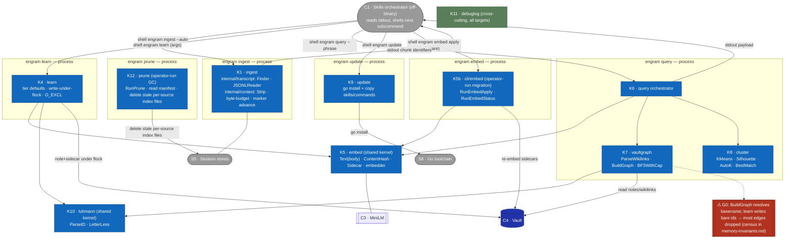

# L3 — Component view (inside C2 · engram CLI)

Decomposes **C2 · engram CLI** (from [L2](c2-containers.md)) into its Go packages/
components and the data they exchange. As-built on 2026-06-04; ⚠ = a verified defect
(see [memory-invariants](../superpowers/specs/2026-06-04-memory-invariants.md)). These
component IDs are the vocabulary the [L3 sequence/flow diagrams](#) reuse.

**Crucial: K1/K4/K6 are SEPARATE PROCESS invocations, not in-process collaborators.**
Each `engram <subcommand>` is its own process. The **C1·Skills orchestrator** (off-binary)
wires them: it reads one subcommand's **stdout** and shells the next. The binary's components
never call each other across subcommands. (This corrects an earlier draft that drew a
fabricated in-process `query→learn` edge — `query.go` has 0 `learn` refs; it ends at
`renderQueryPayload(stdout,…)`.)



## Component catalog
| ID | Component | Key functions | Responsibility | ⚠ |
|---|---|---|---|---|
| K1 | `internal/transcript` + `internal/context` (via `engram ingest`) | `Finder.Find`, `JSONLReader.ReadFrom`, `context.Strip`, manifest write | Find sessions; check mtime/size/hash vs `manifest.json`; re-chunk and re-embed only changed sources within a byte budget; strip harness noise; emit chunk identifiers + write/update the per-source `manifest.json` entry (mtime/size/hash staleness). | — |
| K4 | `cli/learn.go` | `writeLearnUnderLock`, `autoEmbedNote`; calls `nextLuhmannID` (in `cli/luhmann.go`) | Write fact or feedback — no tier assignment (tier/L1/L2/L3 removed in recall-v2; `--tier` flag removed); compute next Luhmann id and write the note + sidecar atomically under `flock(.luhmann.lock)` + `O_EXCL`. | **K1-lock invariant** untested |
| K5 | `internal/embed` | `Text`, `ContentHash`, `Sidecar`, embedder (Hugot/GoMLX simplego) | Embed situation and body text; write/read dual-vector `.vec.json` (`situation_vector` + `body_vector` + `embedding_model_id` + `content_hash` + `last_used`). `bestVector` selects the axis with the higher query cosine at recall time. | **M4** (model homogeneity) |
| K6 | `cli/query.go` | `RunQuery`, `runQuery`, `buildMatchedSetFromPhrases`, `buildRecentFillItems`, payload assembly | Single query path: per phrase embed → top-30 (notes+chunks, recency-biased cosine); union across 10 phrases, dedup max score, relevance floor (baseScore < 0.25), cap matched set at ~300 (`matchSetCap`); ONE AutoK cluster over matched set (D1 preserved); `candidate_l2s` = top-5 from within-cluster notes; Channel 2 appends the newest chunks by IngestedAt (`recentFillChunks`, default 25, configurable via `--recent-fill` / `ENGRAM_RECENT_FILL`), deduped, tagged `recent`, not in any cluster. All notes cluster as normal notes; no hub computation. Optional `--lazy-chunks` renders chunk items path/source-only (notes keep content), fetched on demand via the `show-chunk` subcommand (`cli/show_chunk.go`). | — |
| K7 | `internal/vaultgraph` | `ParseWikilinks`, `ParseBasename`, `BuildGraph`, `ScanVault`, `UnresolvedTargets` | Build the directed wikilink graph (node=basename); scan vault notes for query; identify unresolved links for `engram check`. | **G0** (basename-only resolution), **G5** (verbatim `[[x]]` strings in chunk bodies (raw transcript content) become false edges) |
| K8 | `internal/cluster` | `KMeans`, `Silhouette`, `AutoK`, `CosineDistance` | Pick k by silhouette; cluster the matched set. Silhouette is O(n²) per k swept, so clustering inputs are bounded: the matched set is hard-capped at `matchSetCap`=300 (10 phrases × top-30 per phrase) before clustering; recency-channel chunks (`recentFillChunks`, default 25; `--recent-fill`) are appended un-clustered and never enter K8. | C1/L3-1 determinism untested |
| K9 | `internal/update` | `Run`, `SourceLocal/Remote` | `go install` the binary; copy refreshed skills/commands per harness; sentinels `ErrGoNotFound`/`ErrNoHarness`/`ErrSkillsSrcMissing`. | **U1** idempotence uncaptured |
| K10 | `internal/luhmann` | `ParseID`, `LetterLess`, sort/tie-break | Parse and order Luhmann ids; **shared kernel** consumed by K4 (`cli/learn.go`, `cli/luhmann.go`) AND K7 (`vaultgraph/{selector,scanner}.go`). | — |
| K11 | `internal/debuglog` | tail-friendly sink | Cross-cutting debug log threaded through every CLI target (`targets.go`, `cli/signal.go`); L1 deferred it to here. | — |
| K5b | `cli/embed.go` | `RunEmbedApply`, `RunEmbedStatus`, `selectStates` | The `engram embed apply/status` subcommand (separate process, operator-run for model migration): re-embeds notes whose sidecar is missing/stale/incompatible via the shared K5 package; `apply` writes sidecars, `status` reports counts. Wired in `targets.go` (grep `Name("embed")`). | drives **M4** remediation |
| K12 | `cli/prune.go` | `RunPrune` | The `engram prune` subcommand (operator-run GC): reads the chunk-index manifest and, for every source whose file no longer exists, deletes that source's per-source index file and drops its manifest entry. Not part of the recall/learn/please flows — manual cleanup only. Wired in `targets.go` (grep `Name("prune")`) alongside ingest/query. | — |

## The recurring defect shape (feeds the Phase-4 ADR) — corrected per Phase-2 antagonist
The canonical example of the silent-mismatch bug class:
- **G0** — write an edge as `[[id]]`; resolve an edge as `[[basename]]`. (disjoint keys)

The unifying invariant: **for every write/read pair over the same datum, the read key
must be a function of (or equal to) the write key, and a mismatch must be loud, not silent.**

**M4 is a DIFFERENT mechanism — do not fold it in.** It compares the *same* key (`model@v`) for
*equality* — that's correct — and the defect is the **policy on a legitimate non-match**: off-model
sidecars are dropped, silent only under *partial* migration (when all hits filter out, `query.go:62`
*does* raise `errQueryNoEmbeddings`). So M4 = "version-gate drops off-model sidecars; guarded only in
the all-empty case," a separate finding.

## Missing components (Phase-2 antagonist findings) — added
- **K10 · `internal/luhmann`** — id parse/sort/tie-break (`ParseID`, `LetterLess`). Shared kernel:
  consumed by **K4** (`cli/learn.go`, `cli/luhmann.go`) AND **K7** (`vaultgraph/{selector,scanner,vaultgraph}.go`).
- **K11 · `internal/debuglog`** — tail-friendly debug sink; cross-cutting, threaded through every CLI
  target (`targets.go`, `cli/signal.go`). L1 explicitly deferred it to L2; carried here.

## Dead/test-only surface (Phase-2 antagonist m-1 → flag for Phase 6)
`internal/vaultgraph`'s MOC-navigation half — `StartingPoints`, `SelectStartingPoints`, `Components`,
`Follow`, `Recent` — has **zero production consumers** (no `vault`/`graph`/`follow` subcommand; only
`BuildGraph`, `BFSWithCap`, `InDegreeIn` are live). K7 bundles a dead subsystem; Phase 6 should
confirm + propose deletion.

## Data contracts (what crosses component edges) — corrected
- **ingest → skill → learn (NOT in-process):** `engram ingest --auto` scans chunk sources, re-chunks
  changed content, emits chunk identifiers + status line to **stdout**; the skill reads them and
  shells `engram learn fact|feedback` as a *new process* per candidate.
- **K6 payload (to stdout → skill):** `items[]` (matched notes+chunks + recency-channel chunks
  tagged `recent`; notes carry full content inline, chunk items path/source-only under `--lazy-chunks`, fetched via `show-chunk`) ∪ `clusters[].members` (paths, from matched set only) ∪
  `clusters[].candidate_l2s` (`[{path, cosine}]`, top-5 from within-cluster notes) ∪ `budget`.
  No `nearest_l3` field; no `hubs` field; recency-channel items appear in `items[]` but never in
  any cluster's `members[]`. The skill — not the binary — consumes it and may shell `engram amend`
  (covered/near) or `engram learn` (absent) for recall-time lazy synthesis. Activation is
  agent-driven: the binary emits no `activated` flag; the skill calls `engram activate` on only
  the notes it actually used.
- **K5 sidecar:** `{situation_vector[384], body_vector[384], embedding_model_id, dims, content_hash, last_used}` — dual-vector; `bestVector` selects the axis with the higher query cosine. `content_hash` covers the note's situation + body text. `last_used` is bumped by `engram activate`; it is excluded from `content_hash` so activation never marks a note stale. Staleness tracking (mtime/size/hash `manifest.json`) lives in `engram ingest` (K1); there is no separate learnmarker package. GC of manifest entries whose source file no longer exists is handled by K12 (`engram prune`, operator-run).

## Key flows (L3 — component-internal sequences)

These zoom into a single `engram` subcommand process and show the K-component call order verified
against the code. Each subcommand is its OWN process; nothing here crosses to another subcommand.
[L2](c2-containers.md) shows the skill↔binary orchestration; this is what one binary call does inside.

### Flow: `engram query` internals (RunQuery)

This is the sole query path (the `--synthesis`/BFS-subgraph path was removed in the 2026-06-20 deep clean; unified clustering is now the only mode).

Verified order: `Scan` → `loadCompatibleSidecars` → `loadClusterChunkRecords`
→ `buildMatchedSetFromPhrases` (per-phrase unified ranking) → `applyFloorAndCap` →
`clusterMatchedSet` (K8) →
`mergeProvenances` → `buildRecentFillItems` → `renderQueryPayload`.

```mermaid
sequenceDiagram
    autonumber
    participant Q as K6 query
    participant Em as K5 embed
    participant Md as C3 model
    participant Vg as K7 vaultgraph
    participant Cl as K8 cluster
    participant V as C4 vault

    Note over Q: RunQuery — one process; args from the skill, output to stdout
    Q->>Vg: Scan = vaultgraph.ScanVault
    Vg->>V: read note files; ParseWikilinks → Outgoing at scan time [G5]
    Vg-->>Q: notes (+ parsed wikilinks)
    Q->>V: loadCompatibleSidecars — read sidecars, drop off-model [M4]
    Q->>V: loadClusterChunkRecords — read chunk index
    loop per phrase (10 phrases)
        Q->>Em: Embed(phrase)
        Em->>Md: encode
        Md-->>Em: vector
        Em-->>Q: query vector
        Note over Q: score notes (rankCandidates, recency-biased) + chunks (per-phrase scorer, applyChunkRecency); merge into one list; take top-30
    end
    Note over Q: union across phrases, dedup keeping max score; drop baseScore < 0.25; cap at matchSetCap=300 → matched set
    Note over Q: matched set holds both note and chunk members (unified ranking)
    Q->>Cl: clusterUnionForSynthesis — ONE AutoK k-means + silhouette over matched set (D1)
    Cl-->>Q: clusters with candidate_l2s (top-5 within-cluster notes by centroid cosine)
    Note over Q: mergeProvenances; applyProjectFilter
    Note over Q: buildRecentFillItems — newest chunks by IngestedAt (recentFillChunks, default 25), deduped vs matched set, tagged recent; NOT in any cluster
    Note over Q: renderQueryPayload → stdout (items[matched+recent], clusters[candidate_l2s], budget)
```

### Flow: `engram learn` write internals (writeLearnUnderLock)

Verified order: `Lock` → `ListIDs` → `nextLuhmannID` → `assembleLearnContent` → `WriteNew(O_EXCL)`
→ `autoEmbedNote` (`Text` → `ContentHash` → encode → `Sidecar` write).

```mermaid
sequenceDiagram
    autonumber
    participant L as K4 learn
    participant Lz as K10 luhmann
    participant Em as K5 embed
    participant Md as C3 model
    participant V as C4 vault

    Note over L: runLearn → writeLearnUnderLock — one process
    L->>V: Lock(.luhmann.lock) — flock spans id-compute→write [K1-lock]
    L->>V: ListIDs (existing Luhmann ids)
    Note over L: nextLuhmannID (K4, cli/luhmann.go)
    L->>Lz: ParseID · LetterLess — sort/tie-break existing ids
    Lz-->>L: ordered ids → next id
    Note over L: assembleLearnContent — frontmatter + body
    L->>V: WriteNew note (O_EXCL — create-only, errors if exists)
    L->>Em: autoEmbedNote(path, content)
    Note over Em: Text — body; ContentHash hashes body
    Em->>Md: encode
    Md-->>Em: vector
    Em->>V: write .vec.json sidecar (vector + model_id + content_hash)
    Note over L: release lock; emit written path → stdout
```

