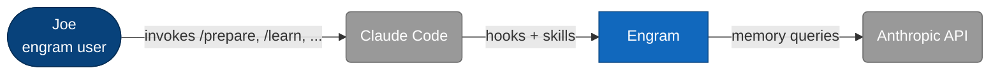
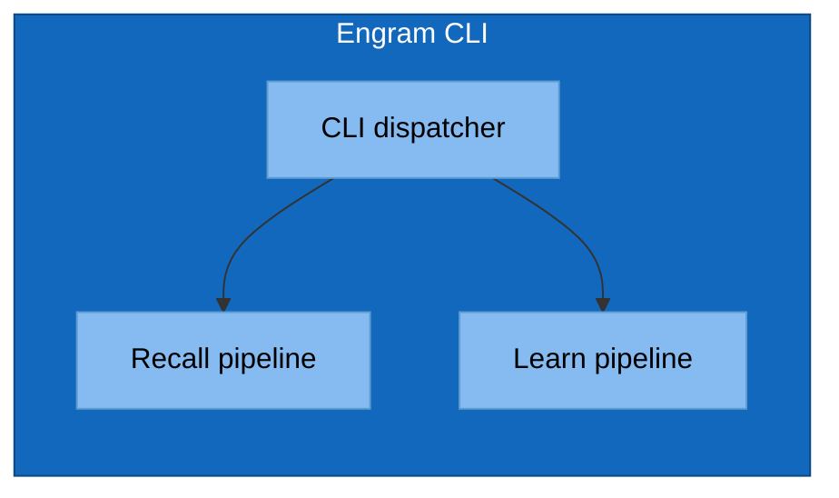
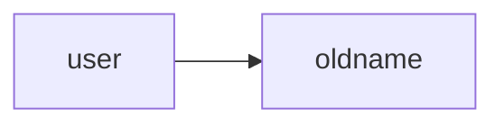

# C4 Diagram Skill Implementation Plan

> **For agentic workers:** REQUIRED SUB-SKILL: Use superpowers:subagent-driven-development (recommended) or superpowers:executing-plans to implement this plan task-by-task. Steps use checkbox (`- [ ]`) syntax for tracking. Per project CLAUDE.md, **all SKILL.md authoring must also use `superpowers:writing-skills`** for TDD discipline.

**Goal:** Build a `/c4` skill at `skills/c4/` that generates and maintains C4 architecture diagrams (L1–L3 standard form, L4 as a property/invariant ledger) under `architecture/c4/`, with code-grounded drafting, ask-the-user conflict resolution, and per-layer propagation proposals.

**Architecture:** A markdown-only Claude Code skill. `SKILL.md` carries the dispatch flow and non-negotiable rules; reference files (`c4-principles.md`, `mermaid-conventions.md`, `property-ledger-format.md`) and per-level templates (`c1-template.md` through `c4-template.md`) under `skills/c4/references/` load on demand. No Go code, no binary changes.

**Tech Stack:** Markdown, mermaid (rendered by GitHub), the existing engram skill discovery mechanism (skills auto-discovered under `skills/<name>/SKILL.md`).

**Spec:** `docs/superpowers/specs/2026-04-25-c4-diagram-skill-design.md`

---

## File Structure

To be created (all under `skills/c4/`):

| File | Responsibility |
|---|---|
| `SKILL.md` | Frontmatter (name, description), dispatch flow, the four sub-actions (`create`/`update`/`review`/`audit`), the non-negotiable rules (mermaid conventions summary, conflict resolution = ask-the-user, propagation = propose-per-layer-then-apply), pointers to reference files, footer "Verification" section. |
| `references/c4-principles.md` | Distilled C4 model knowledge (4 levels, abstractions, common pitfalls) drawn from c4model.com. |
| `references/mermaid-conventions.md` | The classDef block, shape conventions (`:::person`, `:::external`, `:::container`, `:::component`), GitHub mermaid quirks, copy-paste-ready boilerplate. |
| `references/property-ledger-format.md` | L4 ledger row format, universal-quantification style, untested-property callout rule, examples. |
| `references/templates/c1-template.md` | L1 (System Context) starter file: header, mermaid block, catalog, relationships, cross-links. |
| `references/templates/c2-template.md` | L2 (Container) template. |
| `references/templates/c3-template.md` | L3 (Component) template. |
| `references/templates/c4-template.md` | L4 (Code) ledger template. |

Test artifacts (for pressure tests, kept under `skills/c4/tests/`):

| File | Responsibility |
|---|---|
| `tests/baseline-prompt.md` | The exact user prompt used for RED/GREEN baseline. |
| `tests/baseline-output-no-skill.md` | Captured output from a fresh session with the skill NOT loaded. |
| `tests/baseline-output-with-skill.md` | Captured output from a fresh session with the skill loaded. |
| `tests/pressure-conflict.md` | Conflict pressure test: prompt + expected behaviors + observed result. |
| `tests/pressure-propagation.md` | Propagation pressure test record. |
| `tests/pressure-untested-property.md` | L4 untested-property pressure test record. |

No production code outside `skills/c4/` is changed by this plan.

---

## Task 1: Capture RED baseline

**Files:**
- Create: `skills/c4/tests/baseline-prompt.md`
- Create: `skills/c4/tests/baseline-output-no-skill.md`

- [ ] **Step 1: Write the baseline prompt file**

Create `skills/c4/tests/baseline-prompt.md` with:

```markdown
# Baseline Behavioral Test Prompt

This prompt is used for both RED (no skill) and GREEN (skill loaded) runs.
A fresh Claude Code session is given this prompt verbatim and the response is captured.

---

Create a C4 Level 1 (System Context) diagram for the engram codebase.
Save it to `architecture/c4/c1-engram-system.md`.
Use mermaid. Include external actors and external systems.
Cross-link to whatever you'd expect at L2.
```

- [ ] **Step 2: Run RED baseline**

Dispatch a fresh subagent (use `Agent` with `subagent_type: general-purpose`) with this prompt:

```
You are operating in /Users/joe/repos/personal/engram. The "c4" skill does NOT exist yet. Read the user prompt below and produce your response. Do NOT search for or use any C4 skill. Output the response inline; do NOT actually create files.

---
<paste contents of skills/c4/tests/baseline-prompt.md here>
```

Capture the subagent's response.

- [ ] **Step 3: Save the captured output**

Write the captured response verbatim to `skills/c4/tests/baseline-output-no-skill.md` with a header:

```markdown
# RED Baseline (No Skill Loaded)

Captured: <YYYY-MM-DD>
Subagent: general-purpose

---

<verbatim response>
```

- [ ] **Step 4: Verify the baseline shows the expected gaps**

Read `baseline-output-no-skill.md` and confirm at least 3 of these gaps are present (this is what the skill must improve on):
1. No standardized mermaid classDef styling
2. No element catalog table
3. No relationships table
4. No drift notes section
5. No explicit cross-link to L2 children
6. No code-grounding (the response makes claims about engram without reading source)

If fewer than 3 gaps appear, the prompt is too easy — strengthen the prompt and re-run.

- [ ] **Step 5: Commit**

```bash
git add skills/c4/tests/baseline-prompt.md skills/c4/tests/baseline-output-no-skill.md
git commit -m "$(cat <<'EOF'
test(c4): capture RED baseline for c4 skill

Records pre-skill behavior on a 'create C1 diagram for engram' prompt
to anchor TDD discipline for the c4 skill build-out.

AI-Used: [claude]
EOF
)"
```

---

## Task 2: Draft references/c4-principles.md

**Files:**
- Create: `skills/c4/references/c4-principles.md`

- [ ] **Step 1: Fetch source material**

Use `WebFetch` on `https://c4model.com/` and follow the linked pages for the 4 abstractions and the 4 levels. Use a prompt like:
> "Extract: the 4 core abstractions (Person, Software System, Container, Component); the 4 levels (Context, Container, Component, Code) with what each shows and what each omits; the most-cited C4 pitfalls (e.g., conflating containers with components, mixing levels in one diagram). Return as structured headings."

- [ ] **Step 2: Write the distilled reference**

Create `skills/c4/references/c4-principles.md` with these sections:

```markdown
# C4 Principles

Distilled from c4model.com. The skill consults this when it needs to verify a level boundary,
abstraction choice, or relationship style.

## The 4 Abstractions

| Abstraction | What it represents | Examples |
|---|---|---|
| Person | A user/role outside the software system | End user, admin, ops engineer |
| Software System | The thing being designed, or one it talks to | "Engram", "Stripe API" |
| Container | A separately runnable/deployable unit | CLI binary, web service, database |
| Component | A grouping of related code inside a container | Package, module, layer |

## The 4 Levels

### L1 — System Context
Shows: the system, its users, and the external systems it interacts with.
Hides: containers, components, code.
Audience: anyone (technical or not).
One diagram per system.

### L2 — Container
Shows: containers inside the system + the people and external systems from L1.
Hides: components, code.
Audience: technical people inside and outside the team.
Typically one diagram per system.

### L3 — Component
Shows: components inside ONE container + neighboring containers/people/externals as context.
Hides: code-level structure.
Audience: software architects/developers.
One diagram per container worth detailing.

### L4 — Code
The official model uses class/UML-style diagrams here. **Engram-specific deviation:** this skill
replaces L4 with a property/invariant ledger (see `property-ledger-format.md`). Reason: UML
goes stale fast, IDEs show class structure, and the durable thing is what the code GUARANTEES.

## Common Pitfalls

1. **Mixing levels** — a single diagram showing both containers and components inside them. Each
   diagram lives at exactly one level.
2. **Conflating container with component** — a "module" is not a container unless it runs as its
   own deployable.
3. **Anonymous arrows** — every relationship gets a label describing what flows and how.
4. **Hidden externals** — if the system talks to an outside party, that party is on the diagram.
5. **Aspirational without grounding** — the diagram shows what the code WILL do rather than what
   it does. The c4 skill resolves this via ask-the-user conflict resolution.

## When to Split a New Diagram

- L1 → L2: always. L1 is the entry point.
- L2 → L3: if a container has internal structure worth explaining, OR is being actively designed.
- L3 → L4: if a component has invariants worth tracking and testing.
```

- [ ] **Step 3: Verify the file**

Run `wc -l skills/c4/references/c4-principles.md`. Expect 50–100 lines. If shorter, content was lost; re-fetch and re-distill.

- [ ] **Step 4: Commit**

```bash
git add skills/c4/references/c4-principles.md
git commit -m "$(cat <<'EOF'
docs(c4): add c4-principles reference for c4 skill

Distilled from c4model.com: the 4 abstractions, the 4 levels (with
engram-specific L4 deviation noted), common pitfalls, and
when-to-split heuristics.

AI-Used: [claude]
EOF
)"
```

---

## Task 3: Draft references/mermaid-conventions.md

**Files:**
- Create: `skills/c4/references/mermaid-conventions.md`

- [ ] **Step 1: Write the conventions file**

Create `skills/c4/references/mermaid-conventions.md`:

````markdown
# Mermaid Conventions for C4 Diagrams

Mermaid has no native C4 shape vocabulary. The c4 skill enforces a project-wide convention
so all diagrams in `architecture/c4/` look the same.

## The Shape Convention

| C4 element | Mermaid shape | classDef class |
|---|---|---|
| Person / actor | Stadium: `id([Name])` | `:::person` |
| External system | Rounded: `id(Name)` | `:::external` |
| Internal container | Rectangle: `id[Name]` | `:::container` |
| Internal component | Subgraph inside container | `:::component` |

## The classDef Block (paste at top of every diagram)

```mermaid
flowchart LR
    classDef person      fill:#08427b,stroke:#052e56,color:#fff
    classDef external    fill:#999,   stroke:#666,   color:#fff
    classDef container   fill:#1168bd,stroke:#0b4884,color:#fff
    classDef component   fill:#85bbf0,stroke:#5d9bd1,color:#000
```

## L1 Skeleton



## L2 Skeleton

Same as L1, but `engram` expands into multiple containers (CLI binary, hooks, on-disk stores)
each shown as `:::container`.

## L3 Skeleton



## GitHub Mermaid Quirks

- GitHub renders mermaid blocks marked ` ```mermaid `. Don't use `mmd`, `mermaidjs`, etc.
- HTML in labels is supported for `<br/>` only. Avoid raw HTML beyond that.
- `subgraph` titles cannot contain commas in some renderers — replace with `&comma;` or omit.
- Long labels: wrap with `<br/>`, don't trust auto-wrap.
- Edge labels: always use `-->|label|` form, never `-- label -->` (the former renders consistently).
````

- [ ] **Step 2: Render-check the skeleton blocks**

Paste each of the three skeleton mermaid blocks into <https://mermaid.live> and confirm each renders without error. If any fail, fix and retry.

- [ ] **Step 3: Commit**

```bash
git add skills/c4/references/mermaid-conventions.md
git commit -m "$(cat <<'EOF'
docs(c4): add mermaid conventions reference for c4 skill

Project-wide shape/styling vocabulary for L1-L3 diagrams, render-tested
skeletons for each level, and GitHub mermaid quirks the skill must
respect.

AI-Used: [claude]
EOF
)"
```

---

## Task 4: Draft references/property-ledger-format.md

**Files:**
- Create: `skills/c4/references/property-ledger-format.md`

- [ ] **Step 1: Write the property-ledger format reference**

Create `skills/c4/references/property-ledger-format.md`:

````markdown
# L4 Property Ledger Format

L4 (Code) does NOT use UML. It uses a property/invariant ledger: a table of universally-quantified
guarantees the code provides, each linked to the code that enforces it and the test that validates it.

## Why properties, not classes

- UML class diagrams go stale fast and IDEs already show structure.
- The durable, decision-relevant thing is the **contract**: what does this code guarantee for ALL
  inputs? That contract survives refactors.
- Test gaps become visible when every untested property is explicitly flagged.

## Row Format

Every row in an L4 ledger has these columns:

| Column | Content |
|---|---|
| Property | A short name (≤6 words). |
| Statement | A universally-quantified claim ("for all X, …"). |
| Enforced at | Markdown link to `file:line` where the property is established. |
| Tested at | Markdown link to `test_file:line`, OR **⚠ UNTESTED** if no test exists. |
| Notes | Caveats, edge-case carve-outs, related properties. |

## Statement Style

- Begin with "For all …" — make the universal quantifier explicit.
- State the GUARANTEE, not the implementation. ("For all valid inputs, the function returns within
  500ms" is a guarantee. "The function uses a cache" is implementation.)
- One property per row. Don't smuggle two properties into one statement with "and".
- Negative properties are allowed: "For all inputs, the function never panics."
- Probabilistic guarantees include the bound: "For all inputs, the cache hit rate is ≥ 0.9 after
  warm-up."

## Examples

| Property | Statement | Enforced at | Tested at | Notes |
|---|---|---|---|---|
| Idempotent learn | For all transcripts T and offsets O, calling `RunIncremental(T, O)` twice consecutively produces identical state and zero additional LLM calls on the second call. | [internal/learn/incremental.go:42](../../internal/learn/incremental.go#L42) | [internal/learn/incremental_test.go:88](../../internal/learn/incremental_test.go#L88) | Relies on offset persistence after first call. |
| Bounded surface output | For all queries Q, `engram surface --format json` returns ≤ `--budget-bytes` bytes of context. | [internal/surface/budget.go:31](../../internal/surface/budget.go#L31) | **⚠ UNTESTED** | No test exercises the budget cap with real surfaces. |
| Strip is total | For all transcript bytes B, `Strip(B)` returns successfully (no panic, no error). | [internal/context/strip.go:17](../../internal/context/strip.go#L17) | [internal/context/strip_test.go:54](../../internal/context/strip_test.go#L54) | Includes malformed JSON, binary blobs. |

## Untested-Property Discipline

- Never invent a test pointer. If no test exists, the row is **⚠ UNTESTED**.
- Untested rows are a feature, not a bug — they make coverage gaps visible at the architecture
  layer where they get triaged.
- Do NOT remove an untested property to make the ledger "cleaner". The skill must surface it.

## Anti-Patterns

| Anti-pattern | Fix |
|---|---|
| "The function handles errors gracefully" | State which errors and what "gracefully" means: "For all errors returned by io.Read, the function wraps them with context and returns." |
| "Returns the right answer" | State the answer in terms of inputs: "For all sorted inputs S and target T, returns the index i such that S[i] == T or -1 if absent." |
| Mixing implementation with guarantee | Split: implementation goes in Notes; the row's Statement is the guarantee. |
````

- [ ] **Step 2: Verify links in the example table use the relative path that would work from a real `architecture/c4/c4-*.md` file**

Real diagrams live at `architecture/c4/c4-*.md`. From there, `../../internal/...` reaches the right file. The reference file's example table uses that relative form for realism. Verify by counting `..` levels: `architecture/c4/` → `../` (engram root) → `internal/...`. So `../../internal/...` is correct.

- [ ] **Step 3: Commit**

```bash
git add skills/c4/references/property-ledger-format.md
git commit -m "$(cat <<'EOF'
docs(c4): add property-ledger format reference for c4 skill L4

Captures the universally-quantified statement style, untested-property
discipline (never invent test links), and worked examples drawn from
engram's own internal packages.

AI-Used: [claude]
EOF
)"
```

---

## Task 5: Draft per-level templates

**Files:**
- Create: `skills/c4/references/templates/c1-template.md`
- Create: `skills/c4/references/templates/c2-template.md`
- Create: `skills/c4/references/templates/c3-template.md`
- Create: `skills/c4/references/templates/c4-template.md`

- [ ] **Step 1: Write c1-template.md**

Create `skills/c4/references/templates/c1-template.md`:

````markdown
---
level: 1
name: <NAME>
parent: null
children: []
last_reviewed_commit: <SHA>
---

# C1 — <NAME> (System Context)

```mermaid
flowchart LR
    classDef person      fill:#08427b,stroke:#052e56,color:#fff
    classDef external    fill:#999,   stroke:#666,   color:#fff
    classDef container   fill:#1168bd,stroke:#0b4884,color:#fff

    %% nodes
    %% relationships
    %% class assignments
```

## Element Catalog

| Name | Type | Responsibility | System of Record |
|---|---|---|---|
| <element> | Person / External system / The system | <one sentence> | <where this lives in reality> |

## Relationships

| From | To | Description | Protocol/Medium |
|---|---|---|---|

## Cross-links

- Refined by: <list relative paths to L2 files, or "(none yet)">
````

- [ ] **Step 2: Write c2-template.md**

Create `skills/c4/references/templates/c2-template.md`:

````markdown
---
level: 2
name: <NAME>
parent: <relative path to c1-*.md>
children: []
last_reviewed_commit: <SHA>
---

# C2 — <NAME> (Container)

```mermaid
flowchart LR
    classDef person      fill:#08427b,stroke:#052e56,color:#fff
    classDef external    fill:#999,   stroke:#666,   color:#fff
    classDef container   fill:#1168bd,stroke:#0b4884,color:#fff

    %% nodes (containers + retained context from L1)
    %% relationships
    %% class assignments
```

## Element Catalog

| Name | Type | Responsibility | System of Record |
|---|---|---|---|

## Relationships

| From | To | Description | Protocol/Medium |
|---|---|---|---|

## Cross-links

- Parent: <relative path to c1-*.md>
- Refined by: <list relative paths to c3-*.md>
````

- [ ] **Step 3: Write c3-template.md**

Create `skills/c4/references/templates/c3-template.md`:

````markdown
---
level: 3
name: <NAME>
parent: <relative path to c2-*.md>
children: []
last_reviewed_commit: <SHA>
---

# C3 — <NAME> (Component)

> Container in focus: <name of the L2 container being expanded>


## Element Catalog

| Name | Type | Responsibility | Code Pointer |
|---|---|---|---|
| <component> | Component | <one sentence> | [path/to/pkg](../../path/to/pkg) |

## Relationships

| From | To | Description | Protocol/Medium |
|---|---|---|---|

## Cross-links

- Parent: <relative path to c2-*.md>
- Refined by: <list relative paths to c4-*.md, or "(none)">
````

- [ ] **Step 4: Write c4-template.md**

Create `skills/c4/references/templates/c4-template.md`:

````markdown
---
level: 4
name: <NAME>
parent: <relative path to c3-*.md>
children: []
last_reviewed_commit: <SHA>
---

# C4 — <NAME> (Property/Invariant Ledger)

> Component in focus: <name of the L3 component being expanded>
> Source files in scope: <list of file paths>

## Property Ledger

| Property | Statement | Enforced at | Tested at | Notes |
|---|---|---|---|---|
| <name> | For all <quantified inputs>, <guarantee>. | [file:line](../../path#L42) | [test_file:line](../../path_test#L88) OR **⚠ UNTESTED** | <caveats> |

## Cross-links

- Parent: <relative path to c3-*.md>

See `skills/c4/references/property-ledger-format.md` for the full row format and untested-property
discipline.
````

- [ ] **Step 5: Verify all four templates**

Run:

```bash
ls -la skills/c4/references/templates/
```

Expected: 4 files (c1, c2, c3, c4 -template.md).

For each, confirm front-matter is YAML between `---` delimiters and that the placeholder strings (`<NAME>`, `<SHA>`, `<relative path…>`) are present.

- [ ] **Step 6: Commit**

```bash
git add skills/c4/references/templates/
git commit -m "$(cat <<'EOF'
docs(c4): add per-level templates for c4 skill

Starter scaffolds for c1-c4 diagram files: front-matter, mermaid
skeleton (or property ledger for L4), element catalog, relationships,
and explicit cross-link slots.

AI-Used: [claude]
EOF
)"
```

---

## Task 6: Author SKILL.md

**Files:**
- Create: `skills/c4/SKILL.md`

> **Per project rule:** This task MUST be performed under the `superpowers:writing-skills` skill (TDD discipline for skill authoring). The RED baseline from Task 1 is the starting test; the GREEN test runs in Task 7.

- [ ] **Step 1: Invoke superpowers:writing-skills**

Use the `Skill` tool with `skill: superpowers:writing-skills`. Follow its flow. The remaining sub-steps describe the SKILL.md content the skill author produces.

- [ ] **Step 2: Write SKILL.md**

Create `skills/c4/SKILL.md`:

````markdown
---
name: c4
description: Use when generating, updating, or reviewing C4 architecture diagrams under architecture/c4/. Triggers on "/c4", "create C4 diagram", "update C4", "add component to L3", "regenerate context diagram", or any request to add/modify architecture diagrams in C4 form.
---

# C4 Diagram Skill

Generate and maintain C4 architecture diagrams under `architecture/c4/`. Diagrams live at
`architecture/c4/c[level]-[name].md`. L1–L3 use mermaid + element catalog + relationships table.
L4 is a property/invariant ledger linking to enforcing code and validating tests.

## Sub-actions

Dispatch by intent. The user invokes `/c4 <sub-action> [args]`.

| Sub-action | What it does |
|---|---|
| `create <level> <name>` | Draft a new diagram file; require explicit user approval before writing. |
| `update <name>` | Modify an existing diagram, then propose updates per affected layer. |
| `review <name>` | Read-only drift report. No edits. |
| `audit` | Sweep `architecture/c4/`, produce a roll-up drift report. No edits. |

## Non-Negotiable Rules

1. **Ask, don't guess, on code/intent conflict.** When code reality and intent (docs / commit
   bodies / session memory) disagree, STOP drafting. Present both views. Ask the user which is
   correct. Record the resolution in the file (drift note) or proceed per their answer.
2. **Never invent test pointers** (L4). If a property has no test, mark it **⚠ UNTESTED**.
3. **Never edit a non-target file without per-file approval.** Propagation is by proposal +
   user approve/skip/defer, not by silent edit.
4. **Every diagram uses the project mermaid convention.** classDef block at top, `:::person /
   :::external / :::container / :::component` classes. See `references/mermaid-conventions.md`.
5. **Cross-link in the file body.** No index file. Each file names its parent and children
   directly with relative paths.

## Workflow: `create <level> <name>`

1. Read `architecture/c4/`. Note what already exists.
2. If `level > 1`, read the parent-level file. The new diagram MUST refine an element of its
   parent.
3. Shallow-scan the repo: `ls`, top-level dirs, `cmd/`, `internal/` package list, `README.md`.
4. For L3/L4, deep-read the specific packages/files in scope.
5. Read intent sources:
   - `CLAUDE.md` (project-level + user-global)
   - `docs/` tree
   - `git log --format=full` (scoped to files in play for L3/L4; recent N=50 repo-wide for L1/L2).
     Commit bodies are first-class evidence of *why*. Quote them when explaining a relationship,
     a deprecation, or a drift note.
   - Recent session memory: `engram recall --query "<topic>"`
6. **If conflict:** stop, present each conflict with both views, ask the user. Record resolutions.
7. Open `references/templates/c<level>-template.md` and fill it in.
8. For L1–L3, follow `references/mermaid-conventions.md`. For L4, follow
   `references/property-ledger-format.md`.
9. Show full draft to user, get approval, write the file at `architecture/c4/c<level>-<name>.md`.
10. After write: scan parent file for cross-link updates. Present those as propagation proposals
    (see Workflow: update). Apply approved ones; skip/defer the rest.

## Workflow: `update <name>`

1. Read the target file and its parent + children (per the file's front-matter `parent` and
   `children` fields).
2. Take the user's requested change.
3. Re-ground in code (steps 3–5 of `create`, scoped to affected packages).
4. Resolve any new code/intent conflicts via ask-the-user.
5. Draft the new diagram + catalog state.
6. Compute propagation:
   - Renamed/removed element → check L(N-1) box and every child file's `parent` reference.
   - New element → propose adding to L(N-1) parent's catalog; offer to scaffold an L(N+1) child.
   - Changed responsibility/relationship → check parent for consistency; check children for
     orphaned assumptions.
   - L3/L4 code-pointer change → re-verify L4 properties still link to live code; flag broken
     test pointers.
7. Present, in order: the target-layer diff, then per-affected-layer proposed change. Each
   proposed edit is a unified diff with a one-line reason.
8. For each proposal, the user picks `[a]pply`, `[s]kip`, or `[d]efer`. Apply approved edits.
   Persist deferred ones as drift notes in the target file.

## Workflow: `review <name>`

Steps 1–4 of `update`, read-only. Output a report: drift findings, missing cross-links, broken
code/test pointers, untested L4 properties added since last review. No edits.

## Workflow: `audit`

Loop `review` over every file in `architecture/c4/`. Produce a roll-up report.

## Drift Notes

When the user defers a propagation proposal or chooses to record a code/intent gap rather than
resolve it, append to a `## Drift Notes` section at the bottom of the target file:

```markdown
## Drift Notes

- **YYYY-MM-DD** — <one-line description>. Reason: <why deferred>.
```

Drift notes never silently disappear. They persist until a future `update` resolves them.

## References (load on demand)

- `references/c4-principles.md` — the 4 abstractions, 4 levels, common pitfalls.
- `references/mermaid-conventions.md` — classDef block + shape conventions + GitHub quirks.
- `references/property-ledger-format.md` — L4 row format + untested-property discipline.
- `references/templates/c<1-4>-template.md` — per-level starter scaffolds.

## Verification

This skill was verified with:

1. **Behavioral RED/GREEN test** — `tests/baseline-output-no-skill.md` vs.
   `tests/baseline-output-with-skill.md`. The skill-loaded run must produce a file at
   `architecture/c4/c1-<name>.md` with mermaid classDef block, element catalog, relationships
   table, and explicit cross-links to L2.
2. **Pressure test 1 — code/intent conflict** (`tests/pressure-conflict.md`): given docs that
   disagree with code, the skill must surface the conflict and ask, not silently pick one.
3. **Pressure test 2 — propagation** (`tests/pressure-propagation.md`): renaming a container at
   L2 must trigger proposed updates to the L1 parent and every L3 child file referencing it.
4. **Pressure test 3 — L4 untested property** (`tests/pressure-untested-property.md`): given a
   real invariant with no test, the skill must mark it **⚠ UNTESTED**, not omit it and not
   fabricate a test link.
````

- [ ] **Step 3: Verify the file**

Run:

```bash
test -f skills/c4/SKILL.md && head -3 skills/c4/SKILL.md
```

Expected: first line `---`, second line `name: c4`, third line starts with `description:`.

- [ ] **Step 4: Commit**

```bash
git add skills/c4/SKILL.md
git commit -m "$(cat <<'EOF'
feat(skills/c4): add c4 skill for generating C4 diagrams

Skill dispatches create/update/review/audit sub-actions over diagrams
under architecture/c4/. Encodes the project's non-negotiable rules:
ask-the-user on code/intent conflict, never invent test pointers,
per-file approval for cross-layer propagation, mermaid conventions for
L1-L3, property/invariant ledger for L4.

AI-Used: [claude]
EOF
)"
```

---

## Task 7: GREEN baseline (skill-loaded run)

**Files:**
- Create: `skills/c4/tests/baseline-output-with-skill.md`

- [ ] **Step 1: Run the skill-loaded baseline**

Dispatch a fresh subagent (`Agent` with `subagent_type: general-purpose`) with this prompt:

```
You are operating in /Users/joe/repos/personal/engram. The "c4" skill exists at skills/c4/SKILL.md.
You SHOULD invoke it via Skill if the prompt matches. Read the user prompt below and produce
your response. Output the response inline; do NOT actually create files.

---
<paste contents of skills/c4/tests/baseline-prompt.md here>
```

Capture the response.

- [ ] **Step 2: Save the captured output**

Write the response verbatim to `skills/c4/tests/baseline-output-with-skill.md` with header:

```markdown
# GREEN Baseline (Skill Loaded)

Captured: <YYYY-MM-DD>
Subagent: general-purpose

---

<verbatim response>
```

- [ ] **Step 3: Verify GREEN behavior**

Read `baseline-output-with-skill.md`. Confirm ALL of:

1. The subagent invoked the `c4` skill (mention of skill invocation, or following the skill's
   workflow steps).
2. Output includes a mermaid block with the project classDef (`:::person`, `:::external`,
   `:::container`).
3. Output includes an element catalog table with columns: Name, Type, Responsibility, System of
   Record.
4. Output includes a relationships table with columns: From, To, Description, Protocol/Medium.
5. Output names a parent-of-children cross-link section (or notes "(none yet)").
6. Output cites at least one specific engram source (file path or commit) — evidence the subagent
   grounded in code.

If ANY check fails, the skill needs revision: amend SKILL.md, re-commit, re-run from Step 1.

- [ ] **Step 4: Commit**

```bash
git add skills/c4/tests/baseline-output-with-skill.md
git commit -m "$(cat <<'EOF'
test(c4): capture GREEN baseline confirming skill behavior change

Skill-loaded subagent produces standardized mermaid + catalog +
relationships + cross-links + code-grounded content, vs. RED baseline's
generic single-block output.

AI-Used: [claude]
EOF
)"
```

---

## Task 8: Pressure test — code/intent conflict

**Files:**
- Create: `skills/c4/tests/pressure-conflict.md`

- [ ] **Step 1: Construct the conflict scenario**

Pick an engram example where docs assert one thing and code shows another. Use:

> README claims engram has "five memory input sources" but the actual code in
> `internal/recall/orchestrate.go` only orchestrates four phases.

(Verify this is true by `grep -c 'phase' internal/recall/orchestrate.go` and reading the README
section. If counts match, find a different real conflict — e.g., a doc that names a deleted
package.)

- [ ] **Step 2: Run the pressure test**

Dispatch a fresh subagent with prompt:

```
You are operating in /Users/joe/repos/personal/engram. The "c4" skill exists at skills/c4/SKILL.md.
The user asks: "Create a C4 L2 (Container) diagram for engram."

Note: the README and the actual code disagree about the number of memory input sources. Do NOT
ask the user about this in advance — proceed with the skill's normal workflow and let the conflict
arise naturally.

Output your response inline; do NOT create files. Show every place you would have asked the user
a question, with the question's exact text.
```

- [ ] **Step 3: Save and verify**

Write the response to `skills/c4/tests/pressure-conflict.md` with a header.

The response PASSES if it contains a question to the user that:
- Names both views (the README claim and the code reality).
- Asks which is correct, not what to do.
- Does NOT pre-resolve the conflict (e.g., "I'll go with the code since…" is a FAIL).

If it FAILS, revise SKILL.md to strengthen the ask-don't-guess rule and re-run.

- [ ] **Step 4: Commit**

```bash
git add skills/c4/tests/pressure-conflict.md
git commit -m "$(cat <<'EOF'
test(c4): pressure test for code/intent conflict resolution

Confirms the c4 skill surfaces conflicts to the user with both views
named, rather than silently picking one.

AI-Used: [claude]
EOF
)"
```

---

## Task 9: Pressure test — propagation

**Files:**
- Create: `skills/c4/tests/pressure-propagation.md`

- [ ] **Step 1: Set up test fixture**

Manually create three minimal fixture files (the test will reference them; don't commit them as
real architecture):

```bash
mkdir -p /tmp/c4-fixture/architecture/c4
cat > /tmp/c4-fixture/architecture/c4/c1-test-system.md <<'EOF'
---
level: 1
name: test-system
parent: null
children: ["c2-test-containers.md"]
last_reviewed_commit: HEAD
---

# C1 — test-system



## Element Catalog

| Name | Type | Responsibility |
|---|---|---|
| oldname | Container | Does the thing |
EOF

cat > /tmp/c4-fixture/architecture/c4/c2-test-containers.md <<'EOF'
---
level: 2
name: test-containers
parent: c1-test-system.md
children: ["c3-oldname.md"]
last_reviewed_commit: HEAD
---

# C2 — test-containers
EOF

cat > /tmp/c4-fixture/architecture/c4/c3-oldname.md <<'EOF'
---
level: 3
name: oldname
parent: c2-test-containers.md
children: []
last_reviewed_commit: HEAD
---

# C3 — oldname (Component)
EOF
```

- [ ] **Step 2: Run the pressure test**

Dispatch a fresh subagent with prompt:

```
You are operating in /tmp/c4-fixture. The "c4" skill is at /Users/joe/repos/personal/engram/skills/c4/SKILL.md.
The user asks: "/c4 update test-containers — rename the container 'oldname' to 'newname'."

Output your response inline. Show every cross-file edit you would propose and the diff for each.
Do NOT actually edit files.
```

- [ ] **Step 3: Save and verify**

Write the response to `skills/c4/tests/pressure-propagation.md`.

PASSES if the response proposes diffs for ALL of:
1. The target `c2-test-containers.md` itself.
2. The L1 parent `c1-test-system.md` (its catalog references `oldname`).
3. The L3 child `c3-oldname.md` (its filename and front-matter `name` need to change to
   `newname`; its `parent` link doesn't change).

FAILS if any are missing, OR if the response just does the L2 edit without proposing the
others.

- [ ] **Step 4: Cleanup and commit**

```bash
rm -rf /tmp/c4-fixture
git add skills/c4/tests/pressure-propagation.md
git commit -m "$(cat <<'EOF'
test(c4): pressure test for cross-layer update propagation

Confirms /c4 update on a renamed container proposes diffs to the L1
parent's catalog and the L3 child file, not just the target L2 file.

AI-Used: [claude]
EOF
)"
```

---

## Task 10: Pressure test — L4 untested property

**Files:**
- Create: `skills/c4/tests/pressure-untested-property.md`

- [ ] **Step 1: Identify a real engram invariant with no test**

Run:

```bash
grep -rn 'func.*Strip' internal/context/ | head -5
ls internal/context/strip_test.go 2>/dev/null && echo TESTED || echo UNTESTED
```

Pick an invariant where the function has no corresponding `_test.go` file, OR a function in
which a specific property (e.g., panic-freeness on malformed input) has no targeted test.

If everything is tested, fall back to a synthetic example: state that
`internal/surface/budget.go:31` has a "bounded output bytes" property with no test and use that
in the prompt.

- [ ] **Step 2: Run the pressure test**

Dispatch a fresh subagent with prompt:

```
You are operating in /Users/joe/repos/personal/engram. The "c4" skill is at skills/c4/SKILL.md.
The user asks: "/c4 create 4 surface-budget — generate a property ledger for the surface budget
component, focused on the 'bounded output bytes' invariant in internal/surface/budget.go."

Note: that specific invariant is NOT covered by any test in the repo. Verify by inspecting
internal/surface/ before drafting.

Output your response inline; do NOT create files.
```

- [ ] **Step 3: Save and verify**

Write the response to `skills/c4/tests/pressure-untested-property.md`.

PASSES if the response:
1. Includes a property ledger row for the bounded-output-bytes invariant.
2. Marks "Tested at" as **⚠ UNTESTED** (verbatim, including the warning glyph).
3. Does NOT invent a test pointer or omit the row.
4. Statement is universally-quantified ("For all …").

FAILS if any of those conditions doesn't hold. If FAIL, revise SKILL.md and/or
`property-ledger-format.md` to strengthen the never-invent-test-pointers rule and re-run.

- [ ] **Step 4: Commit**

```bash
git add skills/c4/tests/pressure-untested-property.md
git commit -m "$(cat <<'EOF'
test(c4): pressure test for untested L4 property handling

Confirms the c4 skill marks untested invariants with the explicit
UNTESTED callout rather than inventing a test pointer or omitting the
row.

AI-Used: [claude]
EOF
)"
```

---

## Task 11: Self-audit and final summary

**Files:**
- Modify: `skills/c4/SKILL.md` (only if any pressure test FAILED and revisions were made)

- [ ] **Step 1: Confirm all artifacts exist**

Run:

```bash
ls -la skills/c4/ skills/c4/references/ skills/c4/references/templates/ skills/c4/tests/
```

Expected files:

```
skills/c4/SKILL.md
skills/c4/references/c4-principles.md
skills/c4/references/mermaid-conventions.md
skills/c4/references/property-ledger-format.md
skills/c4/references/templates/c1-template.md
skills/c4/references/templates/c2-template.md
skills/c4/references/templates/c3-template.md
skills/c4/references/templates/c4-template.md
skills/c4/tests/baseline-prompt.md
skills/c4/tests/baseline-output-no-skill.md
skills/c4/tests/baseline-output-with-skill.md
skills/c4/tests/pressure-conflict.md
skills/c4/tests/pressure-propagation.md
skills/c4/tests/pressure-untested-property.md
```

If any file is missing, return to the corresponding task.

- [ ] **Step 2: Confirm targ check still passes**

Run:

```bash
targ check-full
```

Expected: same as before this plan started (we only added markdown under `skills/c4/`; no Go
code changed).

- [ ] **Step 3: Commit any final SKILL.md revisions**

If pressure tests required revisions, those should already be committed. If not yet:

```bash
git add skills/c4/SKILL.md
git commit -m "$(cat <<'EOF'
fix(skills/c4): tighten <rule> after pressure test <N>

<short description of what was tightened>

AI-Used: [claude]
EOF
)"
```

- [ ] **Step 4: Done**

The c4 skill is shipped. Next user invocation `/c4 create 1 engram-system` should produce the
first real diagram for the engram codebase.
