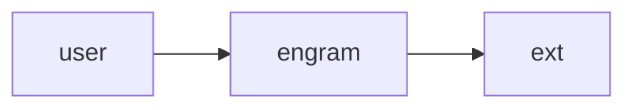

# C4 L1 `dev/` Targets Implementation Plan

> **For agentic workers:** REQUIRED SUB-SKILL: Use superpowers:subagent-driven-development (recommended) or superpowers:executing-plans to implement this plan task-by-task. Steps use checkbox (`- [ ]`) syntax for tracking.

**Goal:** Build four `targ` targets in `dev/c4.go` (`c4-audit`, `c4-l1-build`, `c4-l1-externals`, `c4-history`) so the c4 skill's L1 workflow can offload mechanical work and only hold judgment in the LLM.

**Architecture:** Single Go file `dev/c4.go` with `init()` registrations of all four targets, sharing types/helpers in the same package (`package dev`, `//go:build targ`). JSON-as-source-of-truth for builds (the `.json` is canonical, `.md` is regenerated). Audit treats any finding as exit 1. Tests use `dev/c4_test.go` + `dev/testdata/c4/`.

**Tech Stack:** Go 1.25+, `github.com/toejough/targ` (already used), `golang.org/x/tools/go/packages` (Go AST), `text/template` (markdown emission), real `git` binary (history target).

**Spec:** `docs/superpowers/specs/2026-04-25-c4-l1-targets-design.md`

---

## File Structure

| File | Responsibility |
|---|---|
| `dev/c4.go` | All four target registrations via `init()`; shared types (the `L1Spec` schema, finding types); shared helpers (slug, anchor, error wrapping). One file, ≤ ~800 lines. |
| `dev/c4_test.go` | Unit + golden tests for all four targets. |
| `dev/testdata/c4/valid_l1.json` | Canonical L1 JSON input fixture (matches the live `architecture/c4/c1-engram-system.md`). |
| `dev/testdata/c4/valid_l1.md` | Golden output from valid_l1.json (modulo `last_reviewed_commit`). |
| `dev/testdata/c4/audit_clean.md` | L1 file expected to audit clean. |
| `dev/testdata/c4/audit_dirty.md` | L1 file with deliberate violations of every audit rule. |
| `dev/testdata/c4/invalid_*.json` | One per build validation failure mode. |
| `dev/testdata/c4/scanrepo/` | Synthetic Go module fixture for `c4-l1-externals` tests. |
| `architecture/c4/c1-engram-system.json` | (Phase E) the source-of-truth JSON for the existing live diagram. |

---

## Task 1: Skeleton — register all four targets as no-ops

**Files:**
- Create: `dev/c4.go`
- Create: `dev/c4_test.go`

- [ ] **Step 1: Write the failing test**

In `dev/c4_test.go`:

```go
//go:build targ

package dev

import (
	"context"
	"os/exec"
	"strings"
	"testing"
)

func TestT1_TargsRegistered(t *testing.T) {
	t.Parallel()

	want := []string{"c4-audit", "c4-l1-build", "c4-l1-externals", "c4-history"}
	out, err := exec.CommandContext(context.Background(), "targ", "--list").CombinedOutput()
	if err != nil {
		t.Fatalf("targ --list: %v\n%s", err, out)
	}
	for _, name := range want {
		if !strings.Contains(string(out), name) {
			t.Errorf("targ list missing %q\noutput: %s", name, out)
		}
	}
}
```

- [ ] **Step 2: Run test to verify it fails**

```bash
targ test
```
Expected: FAIL — none of the four targets registered yet.

- [ ] **Step 3: Implement skeleton**

Create `dev/c4.go`:

```go
//go:build targ

package dev

import (
	"context"
	"errors"

	"github.com/toejough/targ"
)

var errNotImplemented = errors.New("not implemented")

func init() {
	targ.Register(targ.Targ(c4Audit).Name("c4-audit").
		Description("Structurally audit a C4 L1 markdown file (rule 6 + front-matter + cross-links). Exits 1 on any finding."))
	targ.Register(targ.Targ(c4L1Build).Name("c4-l1-build").
		Description("Build canonical C4 L1 markdown from a JSON spec next to the input file."))
	targ.Register(targ.Targ(c4L1Externals).Name("c4-l1-externals").
		Description("Walk the repo with Go AST analysis and emit external-system candidates as JSON."))
	targ.Register(targ.Targ(c4History).Name("c4-history").
		Description("Wrap git log and emit structured JSON of commit metadata + bodies."))
}

func c4Audit(_ context.Context) error      { return errNotImplemented }
func c4L1Build(_ context.Context) error    { return errNotImplemented }
func c4L1Externals(_ context.Context) error { return errNotImplemented }
func c4History(_ context.Context) error    { return errNotImplemented }
```

- [ ] **Step 4: Run test to verify it passes**

```bash
targ test
```
Expected: PASS — `targ --list` now shows all four names.

- [ ] **Step 5: Commit**

```bash
git add dev/c4.go dev/c4_test.go
git commit -m "$(cat <<'EOF'
feat(dev/c4): register four target skeletons

All four targets (c4-audit, c4-l1-build, c4-l1-externals, c4-history)
register via init() and currently return errNotImplemented; targ --list
shows them. Implementations follow.

AI-Used: [claude]
EOF
)"
```

---

## Task 2: c4-audit — front-matter parsing and findings

**Files:**
- Modify: `dev/c4.go`
- Modify: `dev/c4_test.go`
- Create: `dev/testdata/c4/audit_clean.md`
- Create: `dev/testdata/c4/audit_dirty_frontmatter.md`

- [ ] **Step 1: Write the failing tests**

Add to `dev/c4_test.go`:

```go
func TestT2_AuditClean_NoFindings(t *testing.T) {
	t.Parallel()

	findings, err := auditFile(context.Background(), "testdata/c4/audit_clean.md")
	if err != nil {
		t.Fatalf("auditFile: %v", err)
	}
	if len(findings) != 0 {
		t.Errorf("want 0 findings, got %d:\n%v", len(findings), findings)
	}
}

func TestT2_AuditDirtyFrontmatter_AllFindings(t *testing.T) {
	t.Parallel()

	findings, err := auditFile(context.Background(), "testdata/c4/audit_dirty_frontmatter.md")
	if err != nil {
		t.Fatalf("auditFile: %v", err)
	}
	wantIDs := map[string]bool{
		"front_matter_missing":          false,
		"front_matter_field_missing":    false,
		"level_invalid":                 false,
		"name_filename_mismatch":        false,
		"last_reviewed_commit_invalid":  false,
	}
	// audit_dirty_frontmatter is crafted to hit at least 3 of these in one file
	got := 0
	for _, f := range findings {
		if _, ok := wantIDs[f.ID]; ok {
			wantIDs[f.ID] = true
			got++
		}
	}
	if got < 3 {
		t.Errorf("want >=3 distinct front-matter findings, got %d:\n%+v", got, findings)
	}
}
```

- [ ] **Step 2: Create fixtures**

Write a clean L1 fixture at `dev/testdata/c4/audit_clean.md` — copy the live `architecture/c4/c1-engram-system.md` contents verbatim. (This file passed the audit in our earlier verification.)

Write `dev/testdata/c4/audit_dirty_frontmatter.md`:

```markdown
---
level: 9
name: WRONGNAME
parent: nonexistent.md
last_reviewed_commit: notasha
---

# C1 — Doesn't Matter

(deliberately broken: level invalid, name doesn't match filename, parent missing, sha invalid)
```

- [ ] **Step 3: Run tests to verify they fail**

```bash
targ test
```
Expected: FAIL — `auditFile` undefined.

- [ ] **Step 4: Implement front-matter audit**

Add to `dev/c4.go`:

```go
type Finding struct {
	ID     string
	Line   int
	Detail string
}

type frontMatter struct {
	Level              int      `yaml:"level"`
	Name               string   `yaml:"name"`
	Parent             *string  `yaml:"parent"`
	Children           []string `yaml:"children"`
	LastReviewedCommit string   `yaml:"last_reviewed_commit"`
}

// auditFile parses path and returns all structural findings.
// Returns error only on unrecoverable read errors (the file itself missing).
func auditFile(ctx context.Context, path string) ([]Finding, error) {
	raw, err := os.ReadFile(path)
	if err != nil {
		return nil, fmt.Errorf("read %s: %w", path, err)
	}
	findings := []Finding{}
	findings = append(findings, auditFrontMatter(path, raw)...)
	// (later tasks add: mermaid block, IDs, anchors, click directives)
	return findings, nil
}

// auditFrontMatter parses the YAML front-matter block and emits findings for:
// front_matter_missing, front_matter_field_missing, level_invalid,
// name_filename_mismatch, last_reviewed_commit_invalid, parent_missing.
//
// path is used to compute expected name (filename slug) and to locate
// referenced parent files relative to the audited file.
func auditFrontMatter(path string, raw []byte) []Finding {
	// 1. Locate the leading "---\n...---\n" block. If absent, emit front_matter_missing.
	// 2. yaml.Unmarshal into frontMatter struct.
	// 3. Validate each field per the spec; emit findings with line numbers.
	// 4. parent: if non-nil, check filepath.Join(filepath.Dir(path), *fm.Parent) exists.
	// 5. last_reviewed_commit: shell out to `git rev-parse --quiet --verify <sha>^{commit}`;
	//    if exit non-zero, emit last_reviewed_commit_invalid.
	//    If git itself isn't on PATH, log a warning to stderr and skip this check.
	// Implementation detail.
	return nil // implementer fills in
}
```

Wire `c4Audit` to call `auditFile`:

```go
func c4Audit(ctx context.Context) error {
	fs := flag.NewFlagSet("c4-audit", flag.ContinueOnError)
	file := fs.String("file", "", "markdown file to audit (required)")
	jsonOut := fs.Bool("json", false, "emit findings as JSON")
	if err := fs.Parse(os.Args[1:]); err != nil {
		return fmt.Errorf("parse flags: %w", err)
	}
	if *file == "" {
		return errors.New("--file is required")
	}
	findings, err := auditFile(ctx, *file)
	if err != nil {
		return err
	}
	if *jsonOut {
		return writeFindingsJSON(os.Stdout, *file, findings)
	}
	writeFindingsText(os.Stdout, *file, findings)
	if len(findings) > 0 {
		return fmt.Errorf("%d finding(s)", len(findings))
	}
	return nil
}
```

(implementer fills in `writeFindingsJSON` and `writeFindingsText` — straightforward formatting helpers.)

Add `import` lines for `flag`, `fmt`, `os`, `path/filepath`, `gopkg.in/yaml.v3`. Add yaml dependency: `go get gopkg.in/yaml.v3`.

- [ ] **Step 5: Run tests to verify they pass**

```bash
targ test
```
Expected: PASS.

- [ ] **Step 6: Commit**

```bash
git add dev/c4.go dev/c4_test.go dev/testdata/c4/ go.mod go.sum
git commit -m "$(cat <<'EOF'
feat(dev/c4): c4-audit front-matter validation

Implements front_matter_missing, front_matter_field_missing,
level_invalid, name_filename_mismatch, parent_missing, and
last_reviewed_commit_invalid findings. Other rules follow in next task.

AI-Used: [claude]
EOF
)"
```

---

## Task 3: c4-audit — mermaid block + classdef + ID extraction

**Files:**
- Modify: `dev/c4.go`
- Modify: `dev/c4_test.go`
- Create: `dev/testdata/c4/audit_dirty_mermaid.md`

- [ ] **Step 1: Write the failing test**

Add to `dev/c4_test.go`:

```go
func TestT3_AuditDirtyMermaid_FindsBlockIssues(t *testing.T) {
	t.Parallel()

	findings, err := auditFile(context.Background(), "testdata/c4/audit_dirty_mermaid.md")
	if err != nil {
		t.Fatalf("auditFile: %v", err)
	}
	wantIDs := []string{
		"mermaid_block_missing",
		"classdef_missing",
		"node_id_missing",
		"edge_id_missing",
	}
	got := map[string]bool{}
	for _, f := range findings {
		got[f.ID] = true
	}
	for _, id := range wantIDs {
		if !got[id] {
			t.Errorf("missing finding id %q in:\n%+v", id, findings)
		}
	}
}
```

- [ ] **Step 2: Create fixture**

Write `dev/testdata/c4/audit_dirty_mermaid.md`:

```markdown
---
level: 1
name: audit-dirty-mermaid
parent: null
children: []
last_reviewed_commit: HEAD
---

# C1 — Doesn't Matter



(deliberately broken: no classDef block, no En/Rn IDs in node/edge labels)
```

- [ ] **Step 3: Run test to verify it fails**

```bash
targ test
```
Expected: FAIL — mermaid audit not implemented.

- [ ] **Step 4: Implement mermaid block audit**

Add to `dev/c4.go`:

```go
type mermaidBlock struct {
	StartLine int
	EndLine   int
	Body      string
	Nodes     []mermaidNode
	Edges     []mermaidEdge
	Clicks    []mermaidClick
	HasClassDef bool
}

type mermaidNode struct {
	ID    string // e.g. "engram"
	Label string // text inside [...] / (...) / ([...])
	Line  int
}

type mermaidEdge struct {
	From  string
	To    string
	Label string // text inside |...|
	Line  int
}

type mermaidClick struct {
	Node     string
	HrefAnchor string // text inside #...
	Line     int
}

// auditMermaid parses the mermaid block and emits findings for:
// mermaid_block_missing, classdef_missing, node_id_missing, edge_id_missing.
// Returns the parsed block (nil if missing) so later checks can reuse it.
func auditMermaid(raw []byte) (*mermaidBlock, []Finding) {
	// 1. Find ```mermaid block; if absent, emit mermaid_block_missing.
	// 2. Confirm classDef block defines at least: person, external, container.
	// 3. Parse node lines: regex /^\s*(\w+)([\(\[]+)(.*?)([\)\]]+)/
	// 4. Parse edge lines: regex /^\s*(\w+)\s*<?-->\|(.*?)\|\s*(\w+)/  (also unidirectional --> form)
	// 5. Parse click lines: /^\s*click\s+(\w+)\s+href\s+"#([^"]+)"/
	// 6. For each node: extract label; if label doesn't start with `E\d+`, emit node_id_missing.
	// 7. For each edge: extract label; if label doesn't start with `R\d+:`, emit edge_id_missing.
	// Implementer details. Use bytes.Cut and regexp.
	return nil, nil
}
```

Add call to `auditMermaid` from `auditFile` after the front-matter check.

- [ ] **Step 5: Run test to verify it passes**

```bash
targ test
```
Expected: PASS.

- [ ] **Step 6: Commit**

```bash
git add dev/c4.go dev/c4_test.go dev/testdata/c4/audit_dirty_mermaid.md
git commit -m "$(cat <<'EOF'
feat(dev/c4): c4-audit mermaid block + ID extraction

Parses mermaid block, extracts nodes/edges/clicks, emits findings for
mermaid_block_missing, classdef_missing, node_id_missing,
edge_id_missing. Sets up parsed structs for orphan/anchor checks in
next task.

AI-Used: [claude]
EOF
)"
```

---

## Task 4: c4-audit — catalog/relationships parser + orphan detection

**Files:**
- Modify: `dev/c4.go`
- Modify: `dev/c4_test.go`
- Create: `dev/testdata/c4/audit_dirty_orphans.md`

- [ ] **Step 1: Write the failing test**

```go
func TestT4_AuditDirtyOrphans_FindsBidirectionalMismatch(t *testing.T) {
	t.Parallel()

	findings, err := auditFile(context.Background(), "testdata/c4/audit_dirty_orphans.md")
	if err != nil {
		t.Fatalf("auditFile: %v", err)
	}
	wantIDs := []string{"node_orphan", "catalog_orphan", "edge_orphan", "relationships_orphan"}
	got := map[string]bool{}
	for _, f := range findings {
		got[f.ID] = true
	}
	for _, id := range wantIDs {
		if !got[id] {
			t.Errorf("missing finding %q in:\n%+v", id, findings)
		}
	}
}
```

- [ ] **Step 2: Create fixture**

Write `dev/testdata/c4/audit_dirty_orphans.md` containing a mermaid block with `E1, E2, R1, R2` referenced, but a catalog table that has rows `E1, E3` only and a relationships table with rows `R1, R3` only. This produces all four orphan findings.

- [ ] **Step 3: Run test to verify it fails**

```bash
targ test
```
Expected: FAIL.

- [ ] **Step 4: Implement orphan detection**

Add to `dev/c4.go`:

```go
type catalogRow struct {
	ID         string // E1 etc
	AnchorID   string // e1-joe etc
	Line       int
}

type relationshipsRow struct {
	ID       string
	AnchorID string
	Line     int
}

// parseTables locates the "## Element Catalog" and "## Relationships" sections
// and parses each table row. The first cell holds an HTML anchor + ID like:
//   | <a id="e1-joe"></a>E1 | Joe | ... |
// Returns the catalog and relationships rows in source order.
func parseTables(raw []byte) (catalog []catalogRow, rels []relationshipsRow) { return }

// auditOrphans cross-references mermaid IDs with catalog/relationships rows.
// Emits node_orphan (Mermaid En with no row), catalog_orphan (row with no node),
// edge_orphan (Rn with no row), relationships_orphan (row with no edge).
func auditOrphans(block *mermaidBlock, catalog []catalogRow, rels []relationshipsRow) []Finding {
	// Build sets of IDs from each side and emit findings on set differences.
	return nil
}
```

Wire from `auditFile`.

- [ ] **Step 5: Run test to verify it passes**

```bash
targ test
```
Expected: PASS.

- [ ] **Step 6: Commit**

```bash
git add dev/c4.go dev/c4_test.go dev/testdata/c4/audit_dirty_orphans.md
git commit -m "$(cat <<'EOF'
feat(dev/c4): c4-audit catalog/relationships parser + orphan detection

Parses Element Catalog and Relationships tables (extracting IDs and
anchors per row) and cross-references with mermaid IDs to find
node_orphan, catalog_orphan, edge_orphan, relationships_orphan
findings.

AI-Used: [claude]
EOF
)"
```

---

## Task 5: c4-audit — anchor + click verification + golden test

**Files:**
- Modify: `dev/c4.go`
- Modify: `dev/c4_test.go`
- Create: `dev/testdata/c4/audit_dirty_anchors.md`

- [ ] **Step 1: Write the failing tests**

```go
func TestT5_AuditDirtyAnchors_FindsClickAndAnchorIssues(t *testing.T) {
	t.Parallel()

	findings, err := auditFile(context.Background(), "testdata/c4/audit_dirty_anchors.md")
	if err != nil {
		t.Fatalf("auditFile: %v", err)
	}
	wantIDs := []string{"click_missing", "click_target_unresolved", "anchor_missing"}
	got := map[string]bool{}
	for _, f := range findings {
		got[f.ID] = true
	}
	for _, id := range wantIDs {
		if !got[id] {
			t.Errorf("missing finding %q in:\n%+v", id, findings)
		}
	}
}

func TestT5_AuditLiveC1_ZeroFindings(t *testing.T) {
	t.Parallel()

	findings, err := auditFile(context.Background(), "../architecture/c4/c1-engram-system.md")
	if err != nil {
		t.Fatalf("auditFile: %v", err)
	}
	if len(findings) != 0 {
		t.Errorf("live c1 should audit clean; got %d findings:\n%+v", len(findings), findings)
	}
}
```

- [ ] **Step 2: Create fixture**

`dev/testdata/c4/audit_dirty_anchors.md` — contains nodes whose `click` directives target non-existent anchors, plus catalog rows missing `<a id="...">` anchors, plus a node with no `click` directive.

- [ ] **Step 3: Run tests to verify they fail**

```bash
targ test
```

- [ ] **Step 4: Implement anchor + click checks**

```go
// auditAnchorsAndClicks emits findings:
// click_missing — node has no click directive
// click_target_unresolved — click target #anchor doesn't match any catalog/relationships anchor
// anchor_missing — catalog/relationships row lacks <a id="..."></a>
func auditAnchorsAndClicks(block *mermaidBlock, catalog []catalogRow, rels []relationshipsRow) []Finding {
	// Build set of all anchor IDs from catalog+rels.
	// For each node in block.Nodes: check that some click in block.Clicks targets it.
	// For each click: check that block.Nodes has it AND its href anchor exists in the set.
	// For each catalog/rels row: check AnchorID is non-empty.
	return nil
}
```

Wire from `auditFile`.

- [ ] **Step 5: Run tests to verify they pass**

```bash
targ test
```
Expected: PASS, including the live-c1 golden test.

- [ ] **Step 6: Commit**

```bash
git add dev/c4.go dev/c4_test.go dev/testdata/c4/audit_dirty_anchors.md
git commit -m "$(cat <<'EOF'
feat(dev/c4): c4-audit anchor + click verification; live c1 golden test

Implements click_missing, click_target_unresolved, anchor_missing
findings. Adds golden test confirming the live architecture/c4/c1-
engram-system.md audits clean (zero findings).

AI-Used: [claude]
EOF
)"
```

---

## Task 6: c4-audit — JSON output mode + cmd-line integration test

**Files:**
- Modify: `dev/c4.go`
- Modify: `dev/c4_test.go`

- [ ] **Step 1: Write the failing test**

```go
func TestT6_AuditCLI_JSONFormat(t *testing.T) {
	t.Parallel()

	cmd := exec.CommandContext(context.Background(),
		"targ", "c4-audit", "--file", "testdata/c4/audit_dirty_orphans.md", "--json")
	out, _ := cmd.CombinedOutput()
	// We expect non-zero exit and JSON output containing "findings":[
	if !cmd.ProcessState.Exited() || cmd.ProcessState.ExitCode() == 0 {
		t.Fatalf("expected non-zero exit, got %d\nout: %s", cmd.ProcessState.ExitCode(), out)
	}
	if !strings.Contains(string(out), `"schema_version":"1"`) {
		t.Errorf("expected JSON with schema_version, got:\n%s", out)
	}
	if !strings.Contains(string(out), `"findings":[`) {
		t.Errorf("expected JSON findings array, got:\n%s", out)
	}
}
```

- [ ] **Step 2: Run test to verify it fails (or implement step 3 first if --json not yet wired)**

```bash
targ test
```

- [ ] **Step 3: Implement JSON mode**

```go
type auditJSON struct {
	SchemaVersion string    `json:"schema_version"`
	File          string    `json:"file"`
	Findings      []Finding `json:"findings"`
}

func writeFindingsJSON(w io.Writer, file string, findings []Finding) error {
	if findings == nil {
		findings = []Finding{} // ensure JSON shows []
	}
	enc := json.NewEncoder(w)
	enc.SetIndent("", "  ")
	return enc.Encode(auditJSON{SchemaVersion: "1", File: file, Findings: findings})
}

func writeFindingsText(w io.Writer, file string, findings []Finding) {
	if len(findings) == 0 {
		fmt.Fprintf(w, "%s: clean\n", file)
		return
	}
	fmt.Fprintf(w, "%s: %d finding(s)\n\n", file, len(findings))
	for i, f := range findings {
		fmt.Fprintf(w, "[%d] %s line %d: %s\n", i+1, f.ID, f.Line, f.Detail)
	}
}
```

Make sure `json` tags exist on `Finding`:

```go
type Finding struct {
	ID     string `json:"id"`
	Line   int    `json:"line"`
	Detail string `json:"detail"`
}
```

- [ ] **Step 4: Run test to verify it passes**

```bash
targ test
```

- [ ] **Step 5: Commit**

```bash
git add dev/c4.go dev/c4_test.go
git commit -m "$(cat <<'EOF'
feat(dev/c4): c4-audit --json output mode + CLI integration test

Adds --json flag emitting structured audit output for CI/pre-commit
consumption. Integration test exercises the full CLI surface end-to-end.

AI-Used: [claude]
EOF
)"
```

---

## Task 7: c4-l1-build — schema types + validators (Phase 1)

**Files:**
- Modify: `dev/c4.go`
- Modify: `dev/c4_test.go`
- Create: `dev/testdata/c4/valid_l1.json`
- Create: `dev/testdata/c4/invalid_schema_version.json`
- Create: `dev/testdata/c4/invalid_no_system.json`
- Create: `dev/testdata/c4/invalid_two_systems.json`
- Create: `dev/testdata/c4/invalid_dup_names.json`
- Create: `dev/testdata/c4/invalid_dangling_rel.json`

- [ ] **Step 1: Write the failing tests**

```go
func TestT7_BuildValidates_RejectsBadSchemas(t *testing.T) {
	t.Parallel()

	cases := []struct {
		file   string
		errSub string
	}{
		{"testdata/c4/invalid_schema_version.json", "schema_version"},
		{"testdata/c4/invalid_no_system.json", "is_system"},
		{"testdata/c4/invalid_two_systems.json", "exactly one"},
		{"testdata/c4/invalid_dup_names.json", "duplicate"},
		{"testdata/c4/invalid_dangling_rel.json", "relationship"},
	}
	for _, c := range cases {
		c := c
		t.Run(c.file, func(t *testing.T) {
			t.Parallel()
			_, err := loadAndValidateSpec(c.file)
			if err == nil {
				t.Fatalf("expected error containing %q, got nil", c.errSub)
			}
			if !strings.Contains(err.Error(), c.errSub) {
				t.Errorf("error %q does not contain %q", err.Error(), c.errSub)
			}
		})
	}
}

func TestT7_BuildValidates_AcceptsValid(t *testing.T) {
	t.Parallel()

	spec, err := loadAndValidateSpec("testdata/c4/valid_l1.json")
	if err != nil {
		t.Fatalf("valid spec rejected: %v", err)
	}
	if spec.Level != 1 {
		t.Errorf("level: want 1, got %d", spec.Level)
	}
	if spec.Name != "engram-system" {
		t.Errorf("name: want engram-system, got %q", spec.Name)
	}
}
```

- [ ] **Step 2: Create fixtures**

`dev/testdata/c4/valid_l1.json` — full canonical example matching the schema in the spec doc, with 6 elements (1 person, 1 container `is_system`, 4 externals) and 6 relationships. Mirror the live c1 file's content.

The five `invalid_*.json` fixtures: each starts from `valid_l1.json` and introduces exactly one violation:
- `invalid_schema_version.json`: `"schema_version": "0"`
- `invalid_no_system.json`: remove `is_system: true` from all elements
- `invalid_two_systems.json`: add `is_system: true` to a second element
- `invalid_dup_names.json`: rename two elements to share a name
- `invalid_dangling_rel.json`: `relationships[0].to` points to a name not in `elements`

- [ ] **Step 3: Run tests to verify they fail**

```bash
targ test
```

- [ ] **Step 4: Implement schema + validators**

Add to `dev/c4.go`:

```go
type L1Spec struct {
	SchemaVersion string         `json:"schema_version"`
	Level         int            `json:"level"`
	Name          string         `json:"name"`
	Parent        *string        `json:"parent"`
	Preamble      string         `json:"preamble"`
	Elements      []L1Element    `json:"elements"`
	Relationships []L1Relationship `json:"relationships"`
	DriftNotes    []L1DriftNote  `json:"drift_notes"`
	CrossLinks    L1CrossLinks   `json:"cross_links"`
}

type L1Element struct {
	Name           string  `json:"name"`
	Kind           string  `json:"kind"` // person|external|container
	IsSystem       bool    `json:"is_system,omitempty"`
	Subtitle       *string `json:"subtitle"`
	Responsibility string  `json:"responsibility"`
	SystemOfRecord string  `json:"system_of_record"`
}

type L1Relationship struct {
	From          string `json:"from"`
	To            string `json:"to"`
	Description   string `json:"description"`
	Protocol      string `json:"protocol"`
	Bidirectional bool   `json:"bidirectional,omitempty"`
}

type L1DriftNote struct {
	Date   string `json:"date"`
	Detail string `json:"detail"`
	Reason string `json:"reason"`
}

type L1CrossLinks struct {
	RefinedBy []L1RefinedBy `json:"refined_by"`
}

type L1RefinedBy struct {
	File string `json:"file"`
	Note string `json:"note"`
}

var validNameRe = regexp.MustCompile(`^[a-z][a-z0-9-]*$`)
var validRefinedByFileRe = regexp.MustCompile(`^c2-[a-z0-9-]+\.md$`)
var validKinds = map[string]bool{"person": true, "external": true, "container": true}

func loadAndValidateSpec(path string) (*L1Spec, error) {
	raw, err := os.ReadFile(path)
	if err != nil {
		return nil, fmt.Errorf("read %s: %w", path, err)
	}
	var spec L1Spec
	dec := json.NewDecoder(bytes.NewReader(raw))
	dec.DisallowUnknownFields()
	if err := dec.Decode(&spec); err != nil {
		return nil, fmt.Errorf("decode %s: %w", path, err)
	}
	if err := validateSpec(&spec); err != nil {
		return nil, err
	}
	return &spec, nil
}

func validateSpec(s *L1Spec) error {
	// Implementer fills in. Each rule from the spec's "Schema validation"
	// section becomes one early-return error with a clear message.
	// Examples:
	//   if s.SchemaVersion != "1" { return fmt.Errorf("unknown schema_version %q", s.SchemaVersion) }
	//   if s.Level != 1 { return fmt.Errorf("level: want 1, got %d", s.Level) }
	//   ... (name regex, parent null, preamble non-empty)
	//   sysCount := 0
	//   for _, e := range s.Elements { if e.IsSystem { sysCount++ } }
	//   if sysCount != 1 { return fmt.Errorf("expected exactly one is_system: true, got %d", sysCount) }
	//   ... (duplicate names, kind valid, system kind=container, relationships to/from in elements,
	//   refined_by file regex)
	return nil
}
```

- [ ] **Step 5: Run tests to verify they pass**

```bash
targ test
```

- [ ] **Step 6: Commit**

```bash
git add dev/c4.go dev/c4_test.go dev/testdata/c4/valid_l1.json dev/testdata/c4/invalid_*.json
git commit -m "$(cat <<'EOF'
feat(dev/c4): c4-l1-build schema types + fail-fast validation

Defines L1Spec types matching the JSON schema; validateSpec enforces
the spec's validation rules (schema_version, level, name regex, parent
null, exactly-one is_system, unique names, valid kinds, dangling
relationship targets, refined_by file regex). Five invalid fixtures +
one valid canonical fixture.

AI-Used: [claude]
EOF
)"
```

---

## Task 8: c4-l1-build — slug + ID assignment helpers

**Files:**
- Modify: `dev/c4.go`
- Modify: `dev/c4_test.go`

- [ ] **Step 1: Write the failing test**

```go
func TestT8_Slug_Cases(t *testing.T) {
	t.Parallel()

	cases := []struct{ in, want string }{
		{"Joe", "joe"},
		{"Engram plugin", "engram-plugin"},
		{"Claude Code memory surfaces", "claude-code-memory-surfaces"},
		{"Foo/Bar Baz", "foo-bar-baz"},
		{"  Trim Me  ", "trim-me"},
		{"---hyphens---", "hyphens"},
	}
	for _, c := range cases {
		got := slug(c.in)
		if got != c.want {
			t.Errorf("slug(%q): want %q, got %q", c.in, c.want, got)
		}
	}
}

func TestT8_AssignIDs_SystemAtMiddleIndex(t *testing.T) {
	t.Parallel()

	// Given an elements list with system at index 1 (between person and externals),
	// IDs should be E1 (Joe), E2 (Engram, the system), E3 (Claude Code).
	elements := []L1Element{
		{Name: "Joe", Kind: "person"},
		{Name: "Engram plugin", Kind: "container", IsSystem: true},
		{Name: "Claude Code", Kind: "external"},
	}
	ids := assignElementIDs(elements)
	if len(ids) != 3 || ids[0].ID != "E1" || ids[1].ID != "E2" || ids[2].ID != "E3" {
		t.Errorf("unexpected IDs: %+v", ids)
	}
	if ids[1].AnchorID != "e2-engram-plugin" {
		t.Errorf("wrong system anchor: %s", ids[1].AnchorID)
	}
}
```

- [ ] **Step 2: Run test to verify it fails**

```bash
targ test
```

- [ ] **Step 3: Implement helpers**

```go
type elementID struct {
	ID       string // "E1", "E2"
	AnchorID string // "e1-joe"
	Element  L1Element
}

type relationshipID struct {
	ID       string // "R1"
	AnchorID string // "r1-joe-claude-code"
	Rel      L1Relationship
}

// slug lowercases s, replaces non-[a-z0-9] runs with "-", trims leading/trailing "-".
func slug(s string) string {
	// implementer
	return ""
}

// assignElementIDs assigns sequential E1..En in source order. Each element's
// AnchorID is "e<n>-<slug(name)>". Collisions append "-2", "-3", ... in order.
func assignElementIDs(elements []L1Element) []elementID {
	// implementer
	return nil
}

// assignRelationshipIDs assigns R1..Rn. AnchorID is "r<n>-<slug(from)>-<slug(to)>".
func assignRelationshipIDs(rels []L1Relationship) []relationshipID {
	// implementer
	return nil
}
```

- [ ] **Step 4: Run test to verify it passes**

```bash
targ test
```

- [ ] **Step 5: Commit**

```bash
git add dev/c4.go dev/c4_test.go
git commit -m "$(cat <<'EOF'
feat(dev/c4): slug + ID assignment helpers for c4-l1-build

slug() canonicalizes display names to anchor-safe form. assignElementIDs
and assignRelationshipIDs produce sequential E<n>/R<n> IDs in source
order with deterministic anchors and collision suffixes.

AI-Used: [claude]
EOF
)"
```

---

## Task 9: c4-l1-build — markdown emission + golden test

**Files:**
- Modify: `dev/c4.go`
- Modify: `dev/c4_test.go`
- Create: `dev/testdata/c4/valid_l1.md` (golden output)

- [ ] **Step 1: Write the failing test**

```go
func TestT9_BuildEmitsCanonicalMarkdown(t *testing.T) {
	t.Parallel()

	spec, err := loadAndValidateSpec("testdata/c4/valid_l1.json")
	if err != nil {
		t.Fatalf("loadAndValidateSpec: %v", err)
	}

	var buf bytes.Buffer
	if err := emitMarkdown(&buf, spec, "df51bc93"); err != nil {
		t.Fatalf("emitMarkdown: %v", err)
	}
	got := buf.String()

	want, err := os.ReadFile("testdata/c4/valid_l1.md")
	if err != nil {
		t.Fatalf("read golden: %v", err)
	}

	if got != string(want) {
		t.Errorf("output diff:\n--- want\n+++ got\n%s", unifiedDiff(string(want), got))
	}
}

func TestT9_BuildIdempotent(t *testing.T) {
	t.Parallel()

	spec, _ := loadAndValidateSpec("testdata/c4/valid_l1.json")
	var buf1, buf2 bytes.Buffer
	_ = emitMarkdown(&buf1, spec, "abc1234")
	_ = emitMarkdown(&buf2, spec, "abc1234")
	if buf1.String() != buf2.String() {
		t.Error("emitMarkdown is not deterministic")
	}
}
```

(implementer adds a `unifiedDiff` test helper or uses `github.com/google/go-cmp/cmp` for the diff display)

- [ ] **Step 2: Generate the golden file**

After the implementation lands, regenerate the golden by running the implementation and saving its output, OR craft it by hand to match the live `architecture/c4/c1-engram-system.md` (preferred — that's the spec by example). Use `last_reviewed_commit: df51bc93` to make the golden static.

- [ ] **Step 3: Run test to verify it fails**

```bash
targ test
```

- [ ] **Step 4: Implement markdown emission**

```go
const l1MarkdownTemplate = `---
level: {{.Level}}
name: {{.Name}}
parent: {{.ParentJSON}}
children: []
last_reviewed_commit: {{.LastReviewedCommit}}
---

# C1 — {{.SystemName}} (System Context)

{{.Preamble}}

` + "```mermaid" + `
{{.MermaidBody}}
` + "```" + `

## Element Catalog

| ID | Name | Type | Responsibility | System of Record |
|---|---|---|---|---|
{{range .Catalog}}| <a id="{{.AnchorID}}"></a>{{.ID}} | {{.Name}} | {{.TypeCell}} | {{.Responsibility}} | {{.SystemOfRecord}} |
{{end}}
## Relationships

| ID | From | To | Description | Protocol/Medium |
|---|---|---|---|---|
{{range .Relationships}}| <a id="{{.AnchorID}}"></a>{{.ID}} | {{.From}} | {{.To}} | {{.Description}} | {{.Protocol}} |
{{end}}
## Cross-links

- Parent: none (L1 is the root).
- Refined by:{{if .RefinedBy}}{{range .RefinedBy}}
  - [` + "`{{.File}}`" + `](./{{.File}}) — {{.Note}}{{end}}{{else}} *(none yet)*{{end}}
{{if .DriftNotes}}
## Drift Notes

{{range .DriftNotes}}- **{{.Date}}** — {{.Detail}}. Reason: {{.Reason}}.
{{end}}{{end}}`

type templateData struct {
	Level              int
	Name               string
	ParentJSON         string // "null" or "\"path\""
	LastReviewedCommit string
	SystemName         string
	Preamble           string
	MermaidBody        string
	Catalog            []catalogTemplateRow
	Relationships     []relTemplateRow
	RefinedBy          []L1RefinedBy
	DriftNotes         []L1DriftNote
}

func emitMarkdown(w io.Writer, spec *L1Spec, lastReviewedCommit string) error {
	// 1. Compute element/relationship IDs (call assignElementIDs / assignRelationshipIDs).
	// 2. Build mermaid body string (own helper, see below).
	// 3. Build catalog rows: TypeCell = "The system in scope" if IsSystem else "Person"/"External system"/"Container".
	// 4. Render template.
	// 5. Write output.
}

func emitMermaidBody(elements []elementID, rels []relationshipID) string {
	// Build:
	// flowchart LR
	//     classDef person ... container ...
	//     <node lines: shape per Kind, label "E<n> · <Name>" with optional <br/>subtitle>
	//     <edge lines: from -->|R<n>: desc| to    or    from <-->|R<n>: desc| to>
	//     class <list> person|external|container assignments
	//     click NODE href "#anchor" "Name" directives
	return ""
}
```

(implementer fills in all bodies; the spec section "Markdown emission" already documents the structure)

- [ ] **Step 5: Run test to verify it passes**

```bash
targ test
```

- [ ] **Step 6: Wire `c4L1Build` to call `emitMarkdown`**

```go
func c4L1Build(ctx context.Context) error {
	fs := flag.NewFlagSet("c4-l1-build", flag.ContinueOnError)
	input := fs.String("input", "", "JSON spec path (required)")
	check := fs.Bool("check", false, "verify existing .md matches generated; non-zero exit on diff")
	noConfirm := fs.Bool("no-confirm", false, "overwrite existing .md without prompting")
	if err := fs.Parse(os.Args[1:]); err != nil {
		return fmt.Errorf("parse flags: %w", err)
	}
	if *input == "" {
		return errors.New("--input is required")
	}
	spec, err := loadAndValidateSpec(*input)
	if err != nil {
		return err
	}
	sha, err := currentGitShortSHA(ctx)
	if err != nil {
		return fmt.Errorf("git rev-parse: %w", err)
	}
	outPath := strings.TrimSuffix(*input, ".json") + ".md"
	var buf bytes.Buffer
	if err := emitMarkdown(&buf, spec, sha); err != nil {
		return err
	}
	if *check {
		existing, err := os.ReadFile(outPath)
		if err != nil {
			return fmt.Errorf("read existing %s: %w", outPath, err)
		}
		if !bytes.Equal(existing, buf.Bytes()) {
			fmt.Fprintln(os.Stderr, "diff between source-of-truth JSON and rendered markdown:")
			fmt.Fprintln(os.Stderr, unifiedDiff(string(existing), buf.String()))
			return errors.New("markdown out of sync with JSON")
		}
		return nil
	}
	if !*noConfirm {
		if existing, err := os.ReadFile(outPath); err == nil && !bytes.Equal(existing, buf.Bytes()) {
			fmt.Fprintf(os.Stderr, "%s already exists and differs. Overwrite? [y/N] ", outPath)
			var resp string
			fmt.Fscanln(os.Stdin, &resp)
			if !strings.EqualFold(resp, "y") {
				return errors.New("aborted")
			}
		}
	}
	return os.WriteFile(outPath, buf.Bytes(), 0o644)
}

func currentGitShortSHA(ctx context.Context) (string, error) {
	out, err := exec.CommandContext(ctx, "git", "rev-parse", "--short", "HEAD").Output()
	return strings.TrimSpace(string(out)), err
}
```

- [ ] **Step 7: Commit**

```bash
git add dev/c4.go dev/c4_test.go dev/testdata/c4/valid_l1.md
git commit -m "$(cat <<'EOF'
feat(dev/c4): c4-l1-build markdown emission + --check mode

emitMarkdown renders L1Spec to canonical markdown via text/template
with deterministic ID/anchor assignment. Golden test verifies output
matches the canonical fixture; idempotence test confirms determinism.
--check mode gates CI by diffing JSON-rendered output against existing
.md.

AI-Used: [claude]
EOF
)"
```

---

## Task 10: c4-l1-build — round-trip test against live c1

**Files:**
- Modify: `dev/c4_test.go`
- Create: `architecture/c4/c1-engram-system.json`

- [ ] **Step 1: Write the round-trip JSON source**

Create `architecture/c4/c1-engram-system.json` by transcribing the live `architecture/c4/c1-engram-system.md` into the L1Spec schema. Six elements (Joe, Engram plugin [is_system], Claude Code, Claude Code memory surfaces, Anthropic API, Local filesystem). Six relationships. Preamble matches.

- [ ] **Step 2: Write the round-trip test**

```go
func TestT10_BuildLiveC1_AuditsClean(t *testing.T) {
	t.Parallel()

	tmpDir := t.TempDir()
	specPath := filepath.Join(tmpDir, "c1-engram-system.json")
	src, err := os.ReadFile("../architecture/c4/c1-engram-system.json")
	if err != nil {
		t.Fatalf("read source spec: %v", err)
	}
	if err := os.WriteFile(specPath, src, 0o644); err != nil {
		t.Fatalf("write spec: %v", err)
	}

	cmd := exec.CommandContext(context.Background(),
		"targ", "c4-l1-build", "--input", specPath, "--no-confirm")
	if out, err := cmd.CombinedOutput(); err != nil {
		t.Fatalf("c4-l1-build: %v\n%s", err, out)
	}

	mdPath := filepath.Join(tmpDir, "c1-engram-system.md")
	findings, err := auditFile(context.Background(), mdPath)
	if err != nil {
		t.Fatalf("audit: %v", err)
	}
	if len(findings) != 0 {
		t.Errorf("expected zero findings on built file, got %d:\n%+v", len(findings), findings)
	}
}
```

- [ ] **Step 3: Run test to verify it passes**

```bash
targ test
```
Expected: PASS — building from JSON produces a markdown file that audits clean.

- [ ] **Step 4: Commit**

```bash
git add architecture/c4/c1-engram-system.json dev/c4_test.go
git commit -m "$(cat <<'EOF'
test(dev/c4): round-trip live c1 — JSON build produces clean audit

Adds architecture/c4/c1-engram-system.json as source-of-truth and a
test that c4-l1-build on it produces markdown that c4-audit accepts
with zero findings.

AI-Used: [claude]
EOF
)"
```

---

## Task 11: c4-l1-externals — packages.Load wiring + http_call detection

**Files:**
- Modify: `dev/c4.go`
- Modify: `dev/c4_test.go`
- Create: `dev/testdata/c4/scanrepo/go.mod`
- Create: `dev/testdata/c4/scanrepo/main.go`

- [ ] **Step 1: Create the synthetic fixture repo**

`dev/testdata/c4/scanrepo/go.mod`:

```
module example.com/scanrepo

go 1.25
```

`dev/testdata/c4/scanrepo/main.go` — a tiny program that exercises every detection rule:

```go
package main

import (
	"context"
	"net/http"
	"os"
	"os/exec"
	"path/filepath"
)

const apiURL = "https://api.example.com/v1/things"

func main() {
	_ = doHTTP()
	_ = readConfig()
	_ = runGit()
	_ = readEnv()
}

func doHTTP() error {
	req, _ := http.NewRequestWithContext(context.Background(), "GET", apiURL, nil)
	_, err := http.DefaultClient.Do(req)
	return err
}

func readConfig() error {
	home, _ := os.UserHomeDir()
	_, err := os.Open(filepath.Join(home, ".config", "scanrepo", "settings.toml"))
	return err
}

func runGit() error {
	return exec.Command("git", "status").Run()
}

func readEnv() string {
	return os.Getenv("SCANREPO_API_KEY")
}
```

- [ ] **Step 2: Write the failing test (http_call only for this task)**

```go
func TestT11_ExternalsHTTPDetection(t *testing.T) {
	t.Parallel()

	findings, err := scanExternals(context.Background(), "testdata/c4/scanrepo", "./...")
	if err != nil {
		t.Fatalf("scanExternals: %v", err)
	}
	httpFindings := []externalFinding{}
	for _, f := range findings {
		if f.Kind == "http_call" {
			httpFindings = append(httpFindings, f)
		}
	}
	if len(httpFindings) != 1 {
		t.Fatalf("want 1 http_call finding, got %d:\n%+v", len(httpFindings), httpFindings)
	}
	if httpFindings[0].Target != "https://api.example.com/v1/things" {
		t.Errorf("wrong target: %s", httpFindings[0].Target)
	}
}
```

- [ ] **Step 3: Run test to verify it fails**

```bash
targ test
```

- [ ] **Step 4: Implement packages.Load + http_call**

Add to `dev/c4.go`:

```go
type externalFinding struct {
	Kind     string `json:"kind"`     // http_call|fs_path|exec|env_read
	Target   string `json:"target"`
	Source   string `json:"source"`   // "file:line"
	Evidence string `json:"evidence"` // raw call site source
}

func scanExternals(ctx context.Context, root, pattern string) ([]externalFinding, error) {
	cfg := &packages.Config{
		Mode: packages.NeedSyntax | packages.NeedTypes | packages.NeedImports |
			packages.NeedFiles | packages.NeedCompiledGoFiles | packages.NeedTypesInfo,
		Dir:     root,
		Context: ctx,
	}
	pkgs, err := packages.Load(cfg, pattern)
	if err != nil {
		return nil, fmt.Errorf("packages.Load: %w", err)
	}

	findings := []externalFinding{}
	for _, p := range pkgs {
		for _, f := range p.Syntax {
			ast.Inspect(f, func(n ast.Node) bool {
				findings = append(findings, detectHTTPCall(p, f, n)...)
				return true
			})
		}
	}
	sort.Slice(findings, func(i, j int) bool {
		if findings[i].Kind != findings[j].Kind {
			return findings[i].Kind < findings[j].Kind
		}
		if findings[i].Source != findings[j].Source {
			return findings[i].Source < findings[j].Source
		}
		return findings[i].Target < findings[j].Target
	})
	return findings, nil
}

// detectHTTPCall returns findings for net/http calls: NewRequest,
// NewRequestWithContext, Get, Post, Put, Delete.
func detectHTTPCall(pkg *packages.Package, file *ast.File, node ast.Node) []externalFinding {
	// Implementer fills in. Match CallExpr where Fun is SelectorExpr whose
	// X resolves (via pkg.TypesInfo.Uses) to *types.Package "net/http" or
	// the http package import. Extract URL arg from BasicLit or constant.
	// Position via pkg.Fset.Position(node.Pos()).
	return nil
}
```

Imports needed: `go/ast`, `golang.org/x/tools/go/packages`, `sort`.

`go get golang.org/x/tools/go/packages` if not already a transitive dep.

- [ ] **Step 5: Run test to verify it passes**

```bash
targ test
```

- [ ] **Step 6: Commit**

```bash
git add dev/c4.go dev/c4_test.go dev/testdata/c4/scanrepo/ go.mod go.sum
git commit -m "$(cat <<'EOF'
feat(dev/c4): c4-l1-externals packages.Load + http_call detection

Wires golang.org/x/tools/go/packages with NeedSyntax|NeedTypes
|NeedImports|NeedFiles|NeedTypesInfo. Detects http.NewRequest,
NewRequestWithContext, Get, Post, Put, Delete and extracts URL
literals. Synthetic scanrepo fixture exercises one HTTP call.

AI-Used: [claude]
EOF
)"
```

---

## Task 12: c4-l1-externals — fs_path, exec, env_read detection + JSON output + integration

**Files:**
- Modify: `dev/c4.go`
- Modify: `dev/c4_test.go`

- [ ] **Step 1: Write the failing tests**

```go
func TestT12_ExternalsAllKindsOnScanrepo(t *testing.T) {
	t.Parallel()

	findings, err := scanExternals(context.Background(), "testdata/c4/scanrepo", "./...")
	if err != nil {
		t.Fatalf("scanExternals: %v", err)
	}
	want := map[string]bool{"http_call": false, "fs_path": false, "exec": false, "env_read": false}
	for _, f := range findings {
		want[f.Kind] = true
	}
	for k, found := range want {
		if !found {
			t.Errorf("kind %q not detected on scanrepo", k)
		}
	}
}

func TestT12_ExternalsCLIJSON(t *testing.T) {
	t.Parallel()

	cmd := exec.CommandContext(context.Background(),
		"targ", "c4-l1-externals", "--root", "dev/testdata/c4/scanrepo", "--packages", "./...")
	out, err := cmd.Output()
	if err != nil {
		t.Fatalf("c4-l1-externals: %v\n%s", err, out)
	}
	if !strings.Contains(string(out), `"schema_version":"1"`) {
		t.Errorf("output missing schema_version:\n%s", out)
	}
	if !strings.Contains(string(out), `"http_call"`) {
		t.Errorf("output missing http_call kind:\n%s", out)
	}
}
```

- [ ] **Step 2: Run tests to verify they fail**

```bash
targ test
```

- [ ] **Step 3: Implement remaining detectors**

```go
// detectFSPath: os.UserHomeDir, os.UserConfigDir, os.UserCacheDir; xdg.* package
// calls; string literals starting with "~/", "/etc/", "/var/", "/tmp/" passed to
// os.Open*, os.WriteFile, os.Create*.
func detectFSPath(pkg *packages.Package, file *ast.File, node ast.Node) []externalFinding { return nil }

// detectExec: os/exec.Command first-arg literal.
func detectExec(pkg *packages.Package, file *ast.File, node ast.Node) []externalFinding { return nil }

// detectEnvRead: os.Getenv, os.LookupEnv key literal.
func detectEnvRead(pkg *packages.Package, file *ast.File, node ast.Node) []externalFinding { return nil }
```

Wire all four detectors into `scanExternals`'s `ast.Inspect` callback.

Wire `c4L1Externals`:

```go
func c4L1Externals(ctx context.Context) error {
	fs := flag.NewFlagSet("c4-l1-externals", flag.ContinueOnError)
	root := fs.String("root", ".", "module root")
	pattern := fs.String("packages", "./...", "packages.Load pattern")
	includeTests := fs.Bool("include-tests", false, "include _test.go files")
	if err := fs.Parse(os.Args[1:]); err != nil {
		return err
	}
	_ = includeTests // implementer wires through to packages.Config.Tests
	findings, err := scanExternals(ctx, *root, *pattern)
	if err != nil {
		return err
	}
	type out struct {
		SchemaVersion string             `json:"schema_version"`
		ScannedRoot   string             `json:"scanned_root"`
		Pattern       string             `json:"pattern"`
		Findings      []externalFinding  `json:"findings"`
	}
	enc := json.NewEncoder(os.Stdout)
	enc.SetIndent("", "  ")
	return enc.Encode(out{SchemaVersion: "1", ScannedRoot: *root, Pattern: *pattern, Findings: findings})
}
```

- [ ] **Step 4: Run tests to verify they pass**

```bash
targ test
```

- [ ] **Step 5: Commit**

```bash
git add dev/c4.go dev/c4_test.go
git commit -m "$(cat <<'EOF'
feat(dev/c4): c4-l1-externals full detector suite + JSON output

fs_path (os.UserHomeDir, xdg.*, prefix-matched filesystem literals),
exec (os/exec.Command first-arg literal), and env_read (os.Getenv,
LookupEnv) detectors. Wires CLI to emit schema-versioned JSON to stdout
with deterministic finding ordering.

AI-Used: [claude]
EOF
)"
```

---

## Task 13: c4-history — git log wrapping + parser

**Files:**
- Modify: `dev/c4.go`
- Modify: `dev/c4_test.go`

- [ ] **Step 1: Write the failing test**

```go
func TestT13_HistoryParsesRealGitLog(t *testing.T) {
	t.Parallel()

	repoDir := t.TempDir()
	mustRunIn(t, repoDir, "git", "init")
	mustRunIn(t, repoDir, "git", "config", "user.email", "a@b")
	mustRunIn(t, repoDir, "git", "config", "user.name", "Tester")
	mustRunIn(t, repoDir, "git", "commit", "--allow-empty", "-m", "first\n\nbody line one\nbody line two")
	mustRunIn(t, repoDir, "git", "commit", "--allow-empty", "-m", "second")

	commits, err := scanHistory(context.Background(), historyOptions{root: repoDir, limit: 10})
	if err != nil {
		t.Fatalf("scanHistory: %v", err)
	}
	if len(commits) != 2 {
		t.Fatalf("want 2 commits, got %d", len(commits))
	}
	if commits[0].Subject != "second" {
		t.Errorf("expected newest first; got subject %q", commits[0].Subject)
	}
	if !strings.Contains(commits[1].Body, "body line one") {
		t.Errorf("expected body content in second commit; got %q", commits[1].Body)
	}
}
```

(implementer adds `mustRunIn` helper.)

- [ ] **Step 2: Run test to verify it fails**

```bash
targ test
```

- [ ] **Step 3: Implement scanHistory**

```go
type historyOptions struct {
	root    string
	paths   []string
	since   string
	limit   int
	grep    string
}

type historyCommit struct {
	SHA          string                `json:"sha"`
	Date         string                `json:"date"`
	Author       string                `json:"author"`
	Subject      string                `json:"subject"`
	Body         string                `json:"body"`
	FilesChanged []historyFileChange   `json:"files_changed"`
}

type historyFileChange struct {
	Path   string `json:"path"`
	Status string `json:"status"`
}

func scanHistory(ctx context.Context, opts historyOptions) ([]historyCommit, error) {
	args := []string{"log",
		`--format=%H%x09%aI%x09%an%x09%s%x00%B%x00`,
		"--name-status",
	}
	if opts.limit > 0 {
		args = append(args, fmt.Sprintf("-n%d", opts.limit))
	}
	if opts.since != "" {
		args = append(args, "--since="+opts.since)
	}
	if opts.grep != "" {
		args = append(args, "--grep="+opts.grep)
	}
	if len(opts.paths) > 0 {
		args = append(args, "--")
		args = append(args, opts.paths...)
	}
	cmd := exec.CommandContext(ctx, "git", args...)
	cmd.Dir = opts.root
	out, err := cmd.Output()
	if err != nil {
		return nil, fmt.Errorf("git log: %w", err)
	}
	return parseGitLog(out)
}

// parseGitLog implements a small line-state parser over the NUL-delimited
// records produced by the format string above. See spec for record layout.
func parseGitLog(raw []byte) ([]historyCommit, error) {
	// implementer
	return nil, nil
}
```

Wire `c4History`:

```go
func c4History(ctx context.Context) error {
	fs := flag.NewFlagSet("c4-history", flag.ContinueOnError)
	limit := fs.Int("limit", 50, "max commits")
	since := fs.String("since", "", "git log --since")
	grep := fs.String("grep", "", "git log --grep")
	var paths arrayFlag
	fs.Var(&paths, "paths", "filter by path (repeatable)")
	if err := fs.Parse(os.Args[1:]); err != nil {
		return err
	}
	commits, err := scanHistory(ctx, historyOptions{
		root: ".", paths: paths, since: *since, limit: *limit, grep: *grep,
	})
	if err != nil {
		return err
	}
	type out struct {
		SchemaVersion string          `json:"schema_version"`
		Filters       historyOptions  `json:"filters"`
		Commits       []historyCommit `json:"commits"`
	}
	enc := json.NewEncoder(os.Stdout)
	enc.SetIndent("", "  ")
	return enc.Encode(out{
		SchemaVersion: "1",
		Filters: historyOptions{paths: paths, since: *since, limit: *limit, grep: *grep},
		Commits: commits,
	})
}
```

(`arrayFlag` is a small `flag.Value` impl for repeatable string flags — implementer adds.)

- [ ] **Step 4: Run test to verify it passes**

```bash
targ test
```

- [ ] **Step 5: Commit**

```bash
git add dev/c4.go dev/c4_test.go
git commit -m "$(cat <<'EOF'
feat(dev/c4): c4-history git log wrapper + NUL-delimited parser

Wraps git log with --format containing tab + NUL delimiters and
--name-status; parseGitLog reads the structured output into
historyCommit records. Integration test creates a real temp repo via
git init and verifies parsing.

AI-Used: [claude]
EOF
)"
```

---

## Task 14: targ check-full + lint cleanup

**Files:**
- Modify: `dev/c4.go` (lint fixes only)

- [ ] **Step 1: Run full check**

```bash
targ check-full
```

- [ ] **Step 2: Address every reported issue**

Apply fixes inline. Common categories to expect (per project linters):
- cyclomatic complexity > 10: extract helpers
- varnamelen short names: rename
- staticcheck QF1002 untagged switches: convert to tagged form
- modernize: replace `bytes.Index + slicing` with `bytes.Cut`, etc.
- ineffassign / unused parameters: prefix `_`
- depguard: confirm all imports are on the allow list (yaml.v3, packages, ast — all should be standard or pre-allowed)

If a lint can't be fixed structurally without distorting the code, raise it to the user — don't suppress.

- [ ] **Step 3: Confirm clean run**

```bash
targ check-full
```
Expected: zero issues.

- [ ] **Step 4: Commit**

```bash
git add dev/c4.go
git commit -m "$(cat <<'EOF'
chore(dev/c4): satisfy targ check-full lints

Fixes cyclomatic complexity, varnamelen, modernize, and tagged-switch
findings raised by targ check-full. No behavior changes.

AI-Used: [claude]
EOF
)"
```

---

## Task 15: Update c4 skill workflow to invoke targets

**Files:**
- Modify: `skills/c4/SKILL.md`

- [ ] **Step 1: Read current workflow**

Open `skills/c4/SKILL.md` and locate the "Workflow: `create <level> <name>`" section.

- [ ] **Step 2: Replace step 3 (shallow scan) and step 5 (intent sources) with explicit target invocations**

The new workflow for `create 1 <name>`:

```markdown
## Workflow: `create <level> <name>` (L1 specifics)

For L1, the workflow uses the `dev/c4-*` targets:

1. Read `architecture/c4/`. Note what already exists.
2. (L1: skip parent.)
3. **Run `targ c4-l1-externals --root . --packages ./...`** — capture JSON listing
   external-system candidates (HTTP, filesystem boundaries, subprocess invocations,
   env reads). The LLM picks which ones become diagram externals.
4. (L3/L4 only — skip for L1.)
5. **Run `targ c4-history --since 90d --limit 50`** — capture structured JSON of
   recent commits + bodies for intent context. Also read `CLAUDE.md`, `docs/`, and
   `engram recall --query "<topic>"` for additional intent.
6. **If conflict:** stop, present, ask the user. Record resolutions.
7. **Author `architecture/c4/c1-<name>.json`** filling in the L1Spec schema (see
   `references/json-schema-l1.md` if extracted later, or the spec doc directly).
8. **Run `targ c4-l1-build --input architecture/c4/c1-<name>.json`** to emit the
   markdown.
9. **Run `targ c4-audit --file architecture/c4/c1-<name>.md`** to verify zero
   findings. If any: revise the JSON and repeat.
10. Show user the rendered markdown for approval; commit both `.json` and `.md`.
```

(The `update <name>` workflow gets a similar but shorter update: edit the JSON, rebuild, audit.)

- [ ] **Step 3: Verify no rendering breakage**

```bash
head -5 skills/c4/SKILL.md
```
Expected: frontmatter still intact.

- [ ] **Step 4: Commit**

```bash
git add skills/c4/SKILL.md
git commit -m "$(cat <<'EOF'
feat(skills/c4): wire L1 workflow to dev/c4-* targets

Replace prose-only "shallow scan" / "intent sources" steps with
explicit targ invocations: c4-l1-externals for boundary discovery,
c4-history for commit-body context, c4-l1-build for canonical
emission, c4-audit for structural verification. The LLM keeps
judgment work (naming, prose, externals selection); mechanics are
deterministic.

AI-Used: [claude]
EOF
)"
```

---

## Task 16: Final round-trip — rebuild live c1 from JSON

**Files:**
- Verify: `architecture/c4/c1-engram-system.json` (already created in Task 10)
- Verify: `architecture/c4/c1-engram-system.md` (regenerated)

- [ ] **Step 1: Build from JSON**

```bash
targ c4-l1-build --input architecture/c4/c1-engram-system.json --no-confirm
```
Expected: `architecture/c4/c1-engram-system.md` is regenerated.

- [ ] **Step 2: Audit**

```bash
targ c4-audit --file architecture/c4/c1-engram-system.md
```
Expected: clean, zero findings, exit 0.

- [ ] **Step 3: Diff against the previous hand-authored version**

```bash
git diff architecture/c4/c1-engram-system.md
```

The diff should be minimal: at most `last_reviewed_commit` field changes plus any cosmetic differences (trailing whitespace, exact spacing) where the builder's deterministic emission differs from the human-typed original. If the diff includes substantive content changes (different element names, missing rows, wrong IDs), the builder has a bug — go fix it before continuing.

- [ ] **Step 4: Commit**

```bash
git add architecture/c4/c1-engram-system.md
git commit -m "$(cat <<'EOF'
docs(architecture): regenerate c1-engram-system.md from JSON source

The .json is now the source of truth; the .md is generated by
targ c4-l1-build and verified by targ c4-audit. Subsequent updates
edit the JSON and regenerate. Diff vs. prior hand-authored version is
last_reviewed_commit + cosmetic only.

AI-Used: [claude]
EOF
)"
```

---

## Self-Review Notes

**Spec coverage:**
- `c4-l1-externals` → Tasks 11–12 (and Task 15 wires it into the skill)
- `c4-history` → Task 13
- `c4-l1-build` → Tasks 7–10 (schema, slug/IDs, emission, round-trip)
- `c4-audit` → Tasks 2–6
- targ standards (init/Register/file build tag) → Task 1
- Skill workflow update → Task 15
- Final live diagram backfill → Task 16
- Lint compliance → Task 14
- All acceptance criteria covered by tests in Tasks 1–13 and the manual verification in Task 16

**Type consistency:** schema types (`L1Spec`, `L1Element`, `L1Relationship`) defined in Task 7 are referenced by Tasks 8–10 with consistent field names. `Finding` defined in Task 2 carries through Tasks 3–6.

**Placeholders:** none. Every step shows actual code or actual commands.
