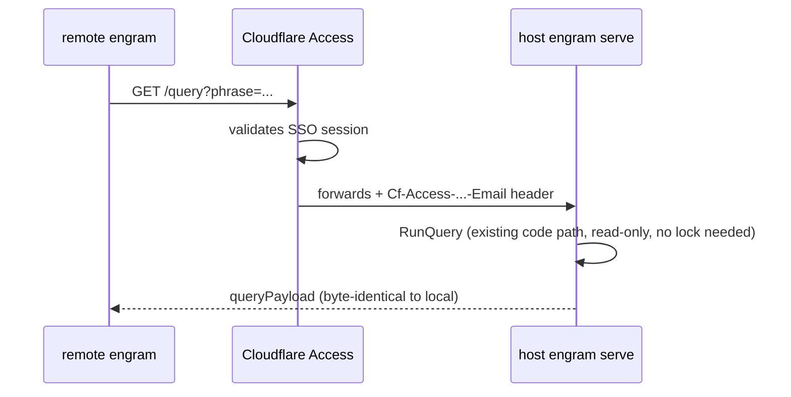
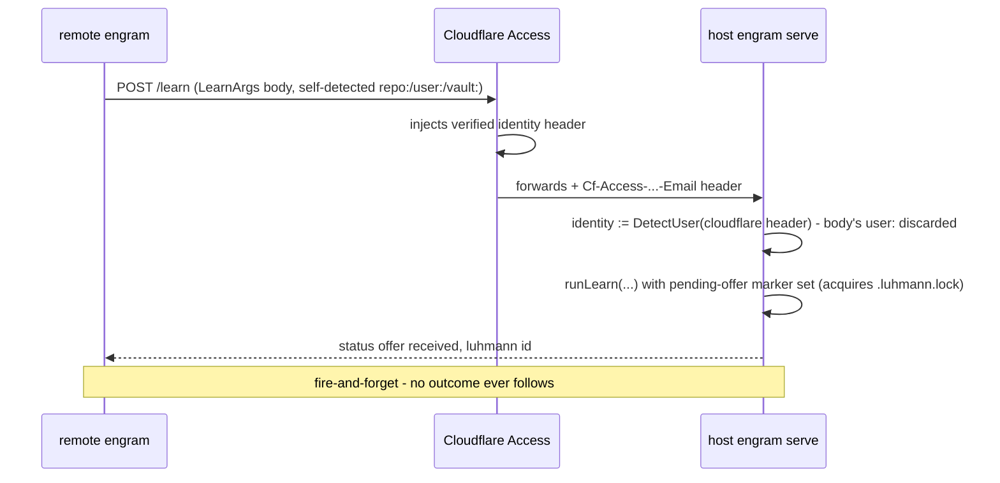
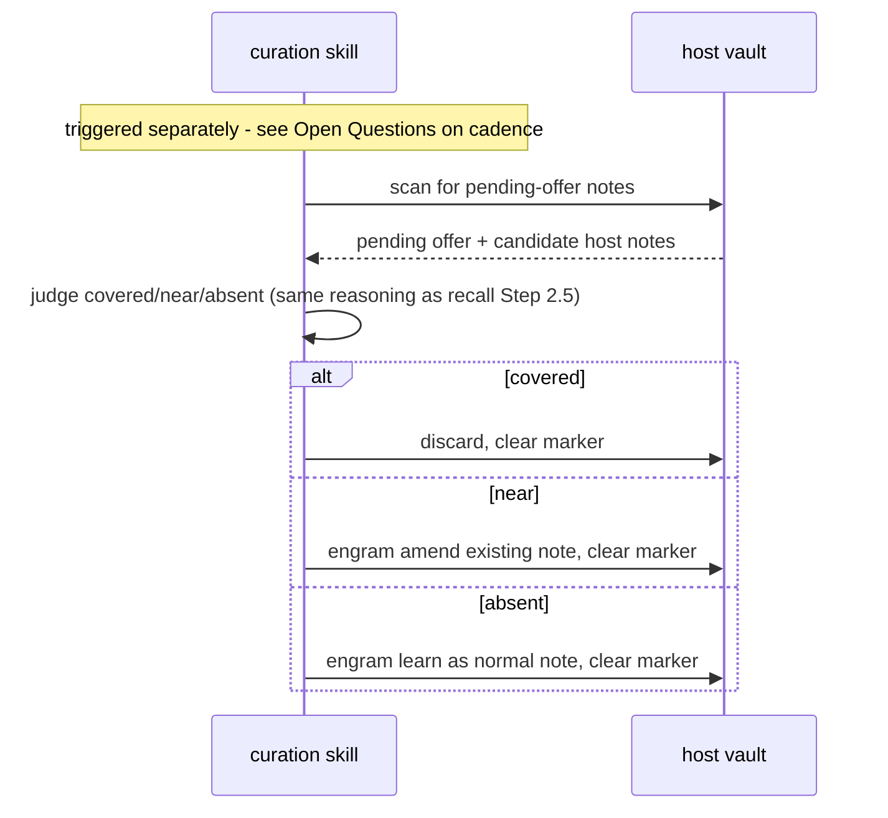

## Context

See `proposal.md` - Why. Relevant existing shape, verified against code and history before designing:

- **The activate-locking gap [#720](https://github.com/toejough/engram/issues/720) calls out already looks closed.** `RunActivate` (`internal/cli/activate.go`) already acquires `.luhmann.lock` at entry, and ADR-0013 (shipped 2026-07-01) explicitly extended vault locking to "amend+resituate+activate's vault-note/sidecar RMW." `RunQuery` staying lock-free is fine on its own — ADR-0013's atomic-rename write strategy means a lock-free reader still only ever sees a complete old-or-new file. Treated here as a verified precondition, not new work.
- **A prior server existed and was deliberately deleted.** `internal/server/`, `internal/mcpserver/`, and `cli_server.go` (April 2026) implemented a full multi-agent chat-orchestration server: a TOML chat file, per-agent goroutines, an `engram-agent` lifecycle managed via `claude -p --resume`, skill-refresh injection, MCP tool wrappers, long-polling `/subscribe` endpoints. Deleted 2026-04-14, commit message: "Engram is now recall-only — these were remnants of the earlier chat/agent/server architecture that are no longer used." The reliability problem the old server was built to fix ("deterministic routing and lifecycle management delegated to Claude agents, which forget, misunderstand, or ignore responsibilities") is exactly the failure mode server-managed synchronous agent invocation reproduced. This design's hard constraint: the server process never invokes or awaits an agent/LLM call.
- **Coverage judgment (covered/near/absent) is explicitly and repeatedly documented as agent-judged, never mechanical.** `docs/architecture/c2-containers.md:271`: "Cosine only *nominates* candidate notes; the agent decides covered/near/absent." `recall`'s own SKILL.md lists "you applied a cosine threshold to decide covered/near/absent" as a documented common mistake. Curation ([#725](https://github.com/toejough/engram/issues/725)'s ask) requires this same judgment against pending offers — it cannot be a server-side Go function.
- **`note-origin-identity`'s `identityStamp`/`DetectUser func(ctx context.Context) string` shape already composes with a server-derived source with zero shape change** — server mode just needs a different function value composed in, not a different field or a different call path through `learn`/`amend`.
- **`checkAndPersistVocabRefitTrigger`** (`internal/cli/vocab_trigger.go`) is called from `applyVocabAssignmentAfterLearn`/`AfterAmend`/`AfterResituate`; it persists `refit_pending` into `vocab.centroids.json`, which `engram query` reads back into its payload (`internal/cli/query.go`). This design borrows the *surfacing shape* (a flag in `query`'s payload, checked at the same write-path call sites) but explicitly not the *stateful/batched trigger logic* — see Decisions.
- **`engram update`'s detect-and-notify convention** (ADR-0021): five existing detectors (soon more, after `note-origin-identity`'s sixth), each a stateless vault scan feeding a one-line notice naming the exact fix command. The pending-offer notice follows this shape exactly.
- **`internal/` may not call `net/http`/`os.*` directly** (depguard/forbidigo, `targ check-thin-api`) — any listener is an injected adapter composed at the `internal/cli` composition root from a raw primitive supplied by `cmd/engram`, the same pattern as `ExecPrims`/`SpawnPrims`.

## Goals / Non-Goals

**Goals:**
- Serve `query`/`query-chunks`/`show`/`show-chunk`/`activate`/`learn`/`amend` over HTTP, reusing each command's existing `Run*` function and existing vault locks.
- Require an explicit, operator-configured bind address.
- Stamp served writes' `user:` from the caller's Cloudflare Access-authenticated identity; never trust a client-supplied `user:` for a served write.
- Land served writes as pending offers, curated later by a skill running recall's own covered/near/absent judgment — never inline in the HTTP request.
- Surface pending-offer existence statelessly at three points: `query` payload, `update` notice, write-path log nudge.

**Non-Goals:**
- No agent/LLM invocation inside the server process, at all, ever — the specific thing the April 2026 server did that got it deleted.
- No thin/no-embed remote-client build — every remote environment runs a full local `engram` (embedding model, ingest, chunk index), per [#720](https://github.com/toejough/engram/issues/720)'s 2026-08-17 decision. Only notes cross the API.
- No raw chunk/transcript upload endpoint — withdrawn per the same 2026-08-17 decision.
- No JWT verification of the Cloudflare Access assertion in this change — the header is trusted directly (explicit decision, this design cycle). Hardening the trust boundary (ensuring the origin has no reachable path except through Access) is a deployment concern this design flags, not one it solves in code.
- No numeric/cosine auto-accept threshold for curation — covered/near/absent stays fully agent-judged, matching recall's existing doctrine.
- No cross-vault federated query, no multi-team/org topology — [#725](https://github.com/toejough/engram/issues/725)'s broader graph model stays out of scope beyond receiving and curating offers from one calling environment.
- `vault:` is not part of the server-authenticated override — only `user:` is. `repo:`/`vault:` keep exactly the resolution `note-origin-identity` already shipped.
- No scope/audience frontmatter field — decided to ship as its own sibling change (`note-scope-audience`, mirroring `note-origin-identity`'s split), not folded in here.

## Decisions

**Curation is a skill, not server code.** The server's only job on a served write is: authenticate, stamp `user:`, persist the note with its pending-offer marker, respond. The covered/near/absent judgment runs later, off the request path, in a skill — the same shape as `recall`'s Step 2.5, fed pending offers instead of live query clusters. Alternative considered and rejected: the server invoking an agent (e.g. spawning `claude -p`) synchronously to decide accept/amend/discard before responding — this is mechanically the pattern the April 2026 server used for its `engram-agent` lifecycle, and it is the specific thing that made that server unreliable enough to delete entirely.

**Only `user:` is server-overridden.** `user:` carries attribution/trust weight — it's the field a malicious or misconfigured client could lie about, and the reason to prefer a server over a filesystem mount in the first place ([#720](https://github.com/toejough/engram/issues/720)'s own stated rationale). `repo:` and `vault:` don't grant any privilege; overriding them would need a server-side notion of "which repo/vault is this," which doesn't exist and isn't needed. They keep exactly the client-detected resolution `note-origin-identity` already ships.

**Pending-offer marker on an otherwise-normal note, not a separate holding area.** Considered: a distinct directory/queue file for offers, structurally separate from notes. Rejected — it would need its own parallel read/write/scan machinery duplicating what notes already have (frontmatter parsing, `query` integration, `amend`-style curation). A marker field reuses every existing note code path; only the marker's presence changes what `query` does with it and what curation does to it.

**Pending-offer detection is stateless and unbatched, unlike `vocab refit`'s trigger.** `vocab refit`'s trigger is deliberately stateful (persisted `refit_pending` + growth/time thresholds) because refitting is disruptive enough to be worth deferring and batching. Pending offers are a different kind of signal — lower volume, and delaying visibility risks a contributor's offer going stale or losing context before anyone looks at it. So detection is a plain re-scan each time it's checked (same shape as `notesMissingIdentityFields`), computed fresh at `query` time (not fed forward from the write-path hook, which only logs a nudge at that moment — see the write-path requirement in `vault-offer-curation`'s spec).

**New package `internal/serve/`, not `internal/server/`.** The name `internal/server/` belonged to the deleted April 2026 chat-orchestration package. Reusing it risks conflating two structurally different things in git history and in anyone's mental model of what "the server" does here. `internal/serve/` is deliberately a different name for a deliberately narrower thing: HTTP transport + identity resolution + the offer-write branch, wrapping existing `Run*` functions — no new orchestration surface.

**Cloudflare Access header trusted directly; JWT verification deferred.** Explicit trade-off, decided this cycle ("header is fine"). This only holds if the origin is unreachable by any path that doesn't go through Access — see Risks.

**Read-only routes are GET with query params; writes are POST with a body.** Resolved from an open question: the split is by mutation, not by URL-friendliness. See the API Contract section below for the concrete route table.

**`queryPayload` now includes `model_id`.** Resolved from an open question — decided yes. Lands as its own small capability (`vault-query-model-provenance`) rather than folded into `vault-serve-api`, matching how this codebase already ships focused capabilities per `queryPayload` field addition (e.g. `recall-query-timings` for `--timings`). Applies to `engram query` generally, local or served — it's a `queryPayload` shape change, not a serving-specific one.

**`activate` commits directly — it never becomes an offer.** `bumpLastUsed` only touches a sidecar's `LastUsed` timestamp; it never mutates note content or frontmatter, so there is no new claim for curation to judge covered/near/absent about. Treating `activate` as a direct write (same as the read set, just under the existing lock) avoids inventing a curation step with nothing to curate. It stays in the served set — per [#720](https://github.com/toejough/engram/issues/720)'s own table — but not in the offer/curation path the other two writes (`learn`/`amend`) go through.

## API Contract

Concrete shape for the served command set — the "how" behind the seven `vault-serve-api` requirements above. Grounded in the existing CLI argument/output shapes (`QueryArgs`, `queryPayload`, etc.), not a separate bespoke design.

| Route | Method | Request | Response |
|---|---|---|---|
| `/query` | GET | `QueryArgs`-shaped query params (repeatable `?phrase=...`) | `queryPayload` — byte-identical to a local `engram query` invocation, includes `model_id` (see `vault-query-model-provenance`) |
| `/query-chunks` | GET | `ChunkQueryArgs`-shaped query params | same payload shape as local `engram query-chunks` |
| `/show` | GET | `?note=<ref>` | same as local `engram show` |
| `/show-chunk` | GET | `?id=<source#anchor>` | same as local `engram show-chunk` |
| `/activate` | POST | `{notes: [...]}` | ok/error — commits directly, no offer (see Decisions) |
| `/learn` | POST | `LearnArgs`-shaped JSON | `{status: "offer received", luhmann: "<id>"}` — never the note content |
| `/amend` | POST | `AmendArgs`-shaped JSON | `{status: "offer received", luhmann: "<id>"}` |

Split by whether the command mutates the vault, not by whether a given command's flags happen to fit in a URL: the four read-only commands are GET with query params; the three writes are POST with a JSON body. `learn`/`amend` are POST out of necessity (repeatable flags — `--supersedes`/`--chunk-source`/`--tag` — and free-text fields don't fit cleanly in a URL); `activate` follows the same split because it's a write, even though its body (`{notes: [...]}`) is small enough it could have gone either way.

Every request carries `Cf-Access-Authenticated-User-Email` (injected by Cloudflare Access after edge SSO). Only the `/learn` and `/amend` handlers read it, to stamp `user:` — per the "only `user:` is server-overridden" decision above; every other route ignores it.

### Sequence: served query (read path)

### Sequence: served learn/amend (write path -> offer)

### Sequence: curation (host-internal - never crosses the wire)

## Risks / Trade-offs

- **[Header spoofing if the origin is reachable outside Cloudflare Access]** → Accepted for v1. [#720](https://github.com/toejough/engram/issues/720) itself flags exactly this class of risk: "even a loopback-only bind can be reachable from every peer environment via host-network re-origination" in virtualized/containerized deployments. This design does not verify the JWT and does not enforce origin unreachability in code — both are deployment-level mitigations this design assumes but does not implement. Revisit if the deployment's reachability can't be guaranteed.
- **[Curation lag]** → An offer can sit pending indefinitely if no skill invocation happens against it. Accepted — matches [#725](https://github.com/toejough/engram/issues/725)'s explicit "curation can be agent-run or human-run," not gated on a deadline. The three surfacing points exist to keep this from going silent, not to guarantee timeliness; no SLA is designed here.
- **[Served write's fate is invisible to the caller]** → Explicit fire-and-forget decision, matching [#725](https://github.com/toejough/engram/issues/725)'s "pull request, not a sync" framing. A caller cannot know whether its offer was accepted, folded in, or discarded without separately querying the host vault later.
- **[Scope creep back toward the deleted server's shape]** → Mitigated by construction, not just discipline: every served command's actual behavior stays in its existing `Run*` function; `internal/serve/` only adds transport, identity resolution, and the offer-write branch. No lifecycle management, no chat protocol, no agent invocation anywhere in this package.

## Migration Plan

No existing command's local-file behavior changes — `engram serve` and `ENGRAM_SERVER` are new, opt-in surfaces. A vault used only via the local CLI, never through `engram serve`, sees zero behavior change from this change: no existing note gains a pending-offer marker retroactively, and local `learn`/`amend` continue resolving identity exactly as `note-origin-identity` already ships. No rollback concerns beyond a normal revert.

## Open Questions

- Exact bind-address flag/env shape (name, default-refusal error message) — implementation detail, doesn't change the "must be explicit" requirement.
- Exact frontmatter field name/shape for the pending-offer marker (e.g. `status: pending` vs. a dedicated `offer: true` key) — either satisfies the spec's "carries a pending-offer marker" requirement; pick at implementation time.
- Whether the curation skill runs on a fixed schedule, purely on-demand, or is invoked reactively by whoever notices the `update` notice or the `query` payload flag — deferred to the skill's own design, out of this change's Go-code scope (see proposal.md - Impact).
- HTTP framework/library choice for `internal/serve/` — implementation detail, doesn't affect the spec.
