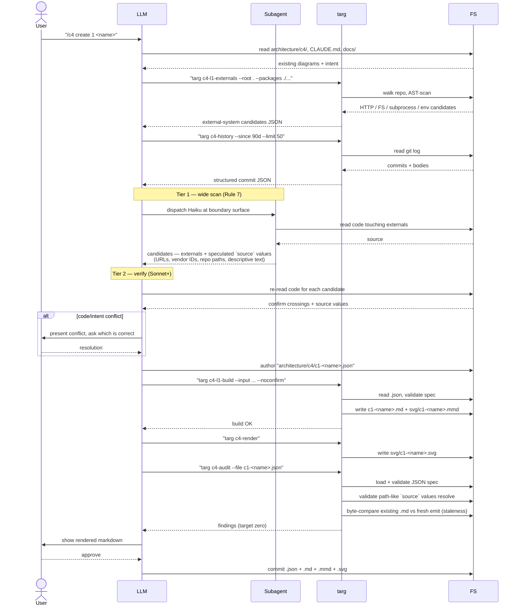
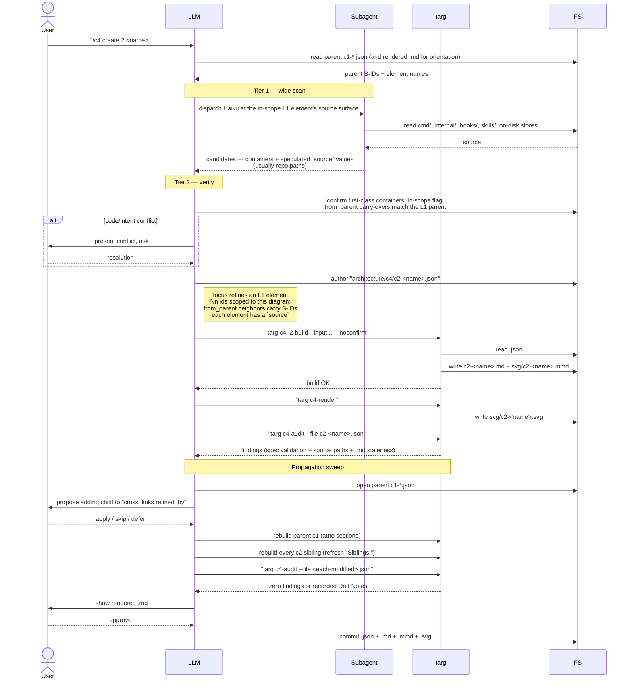
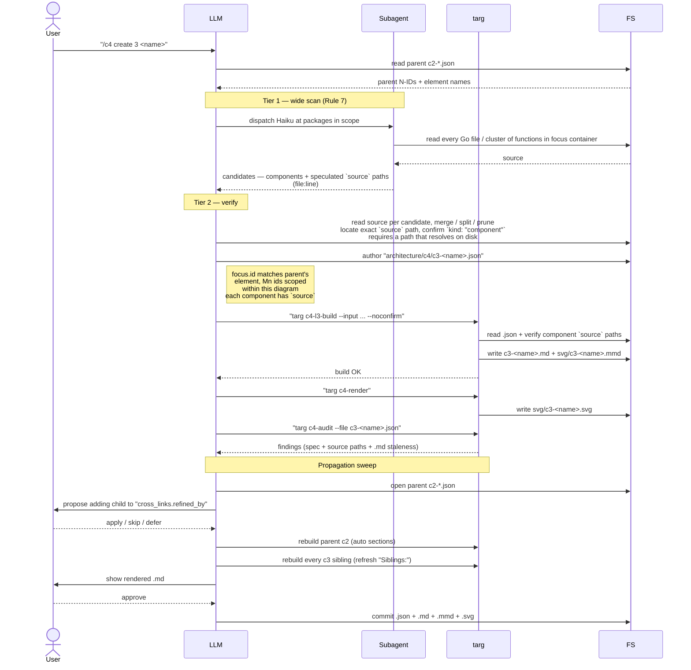
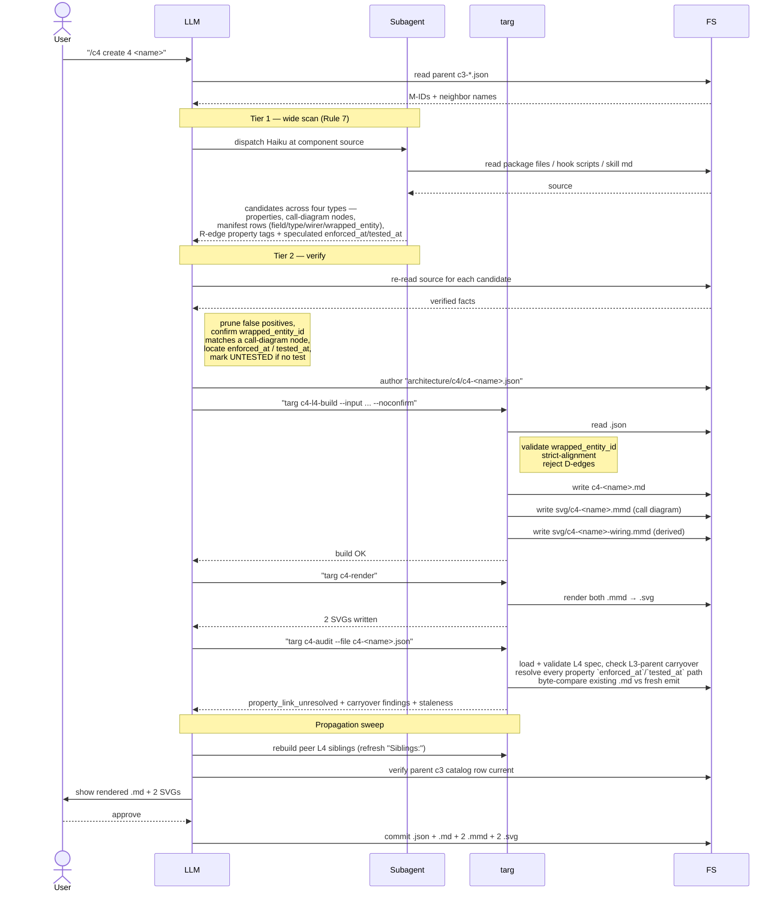
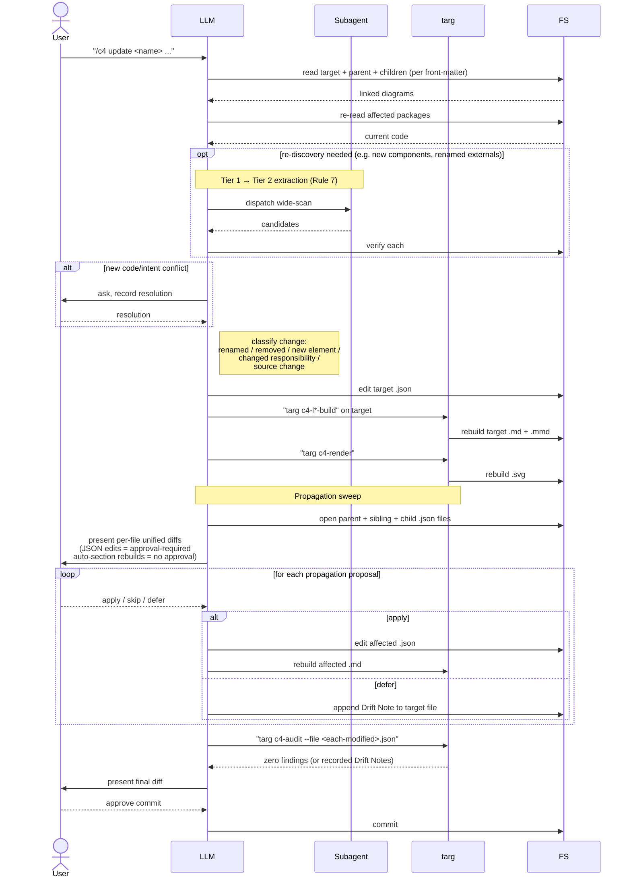
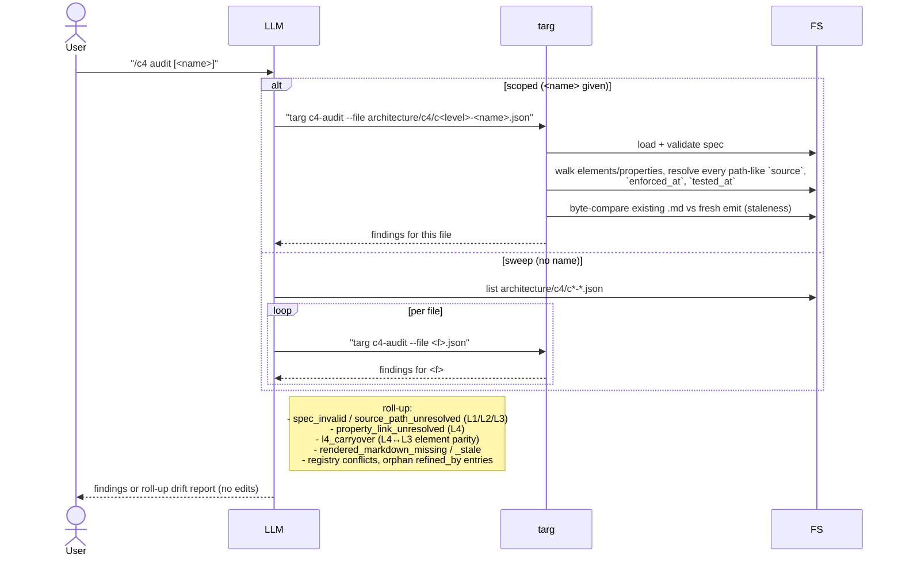

# C4 Workflow Sequence Diagrams

Sequence diagrams for the workflows defined in `skills/c4/SKILL.md`. Lanes:

- **User** — invokes `/c4 <sub-action>`, approves drafts and propagation proposals.
- **LLM** — the agent following the c4 skill (this is "you" when the skill loads).
- **Subagent** — Haiku-class sub-agent dispatched for Tier 1 wide-scan extraction
  (Rule 7: every `scan-source-for-findings` task at every level uses Two-Tier
  Extraction; Tier 1 = recall, Tier 2 = precision verified by the orchestrator).
- **targ** — the project's build-tool binary (`targ c4-l*-build`, `c4-render`,
  `c4-audit`, `c4-l1-externals`, `c4-history`).
- **FS** — the filesystem under `architecture/c4/` plus repo source (`internal/`,
  `cmd/`, `docs/`, `CLAUDE.md`, etc.).

The audit (`targ c4-audit`) takes the `.json` spec only — the rendered `.md`
is a mechanical artifact and is checked solely for staleness via byte-compare
against a fresh emit.

---

## 1. `create 1 <name>` — author L1 system context

---

## 2. `create 2 <name>` — author L2 container diagram

---

## 3. `create 3 <name>` — author L3 component diagram

---

## 4. `create 4 <name>` — author L4 property ledger (two-tier + two-diagram)

---

## 5. `update <name>` — modify an existing diagram

---

## 6. `audit [<name>]` — read-only drift report

`audit` collapsed `review` + the old `audit` into one sub-action. With `<name>`,
scoped to one file. Without, sweeps `architecture/c4/`. No edits in either mode.

---

## Notes on what these diagrams elide

- **Each `targ c4-l*-build` invocation is itself a sub-process** that reads the
  JSON spec, validates the schema, and writes the rendered `.md` + `.mmd`. Treat
  as a black box per the project rule "don't reverse-engineer targ's behavior."
- **The audit reads the `.json` spec, not the `.md`.** Passing a `.md` is rejected
  with a hint. The rendered `.md` is checked only for staleness via byte-compare
  against a fresh in-memory emit. The fresh emit reuses the SHA stamped in the
  existing front-matter so audit-time vs. build-time SHA drift doesn't false-positive.
- **The "user approves" steps are not single yes/no prompts** — propagation proposals
  come in `[a]pply / [s]kip / [d]efer` lists, one per file. Idempotent rebuilds of
  auto-generated sections (mermaid block, catalog, cross-links) do NOT require
  approval; JSON edits to non-target files DO.
- **Tier 1 / Tier 2 (Rule 7) applies at every level**, not just L4. The L1/L2/L3
  diagrams above show explicit Tier 1 dispatch boxes; in practice the ratio of
  candidates to verified findings shrinks as the level deepens (L1 has few
  externals; L4 has many properties). The principle is the same: Tier 1 owns
  recall, Tier 2 owns precision and verifies every *where* against source.
- **Drift Notes** persist across sessions; they're appended to the target file's
  `## Drift Notes` section when the user defers a propagation proposal or chooses
  to record a code/intent gap rather than resolve it.
