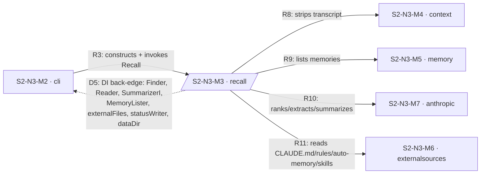
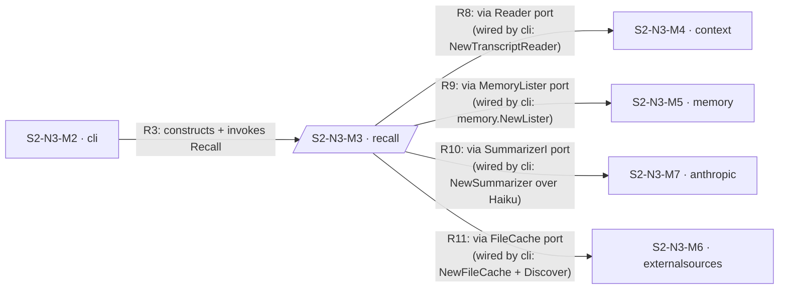
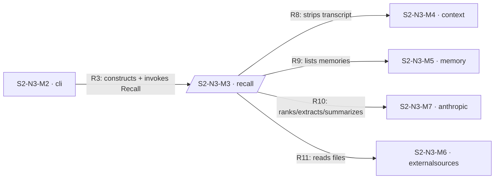
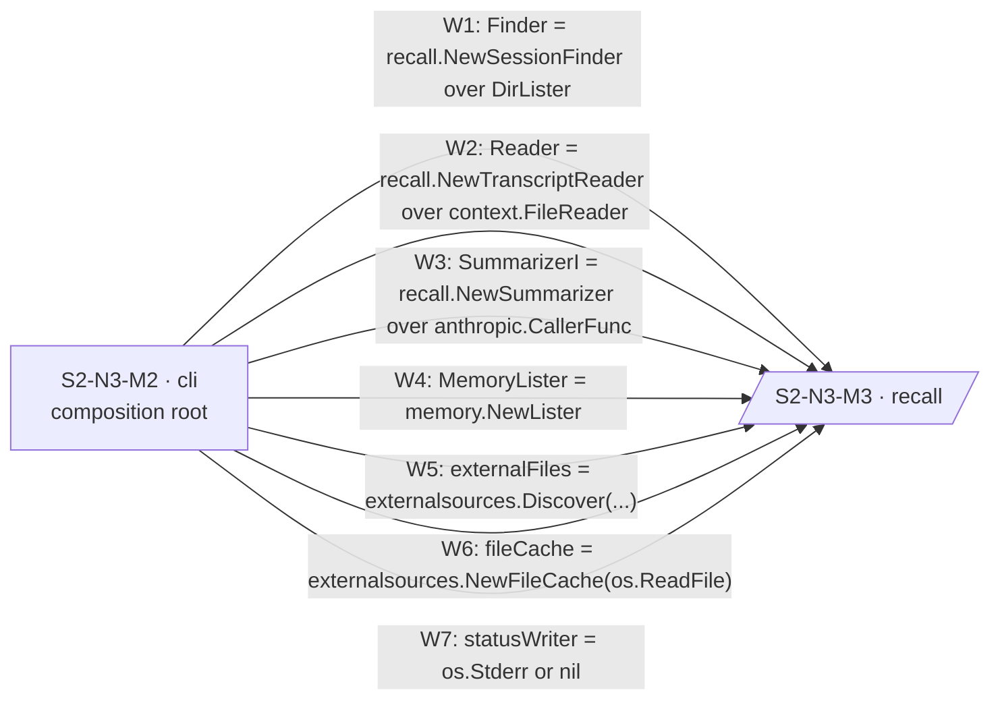
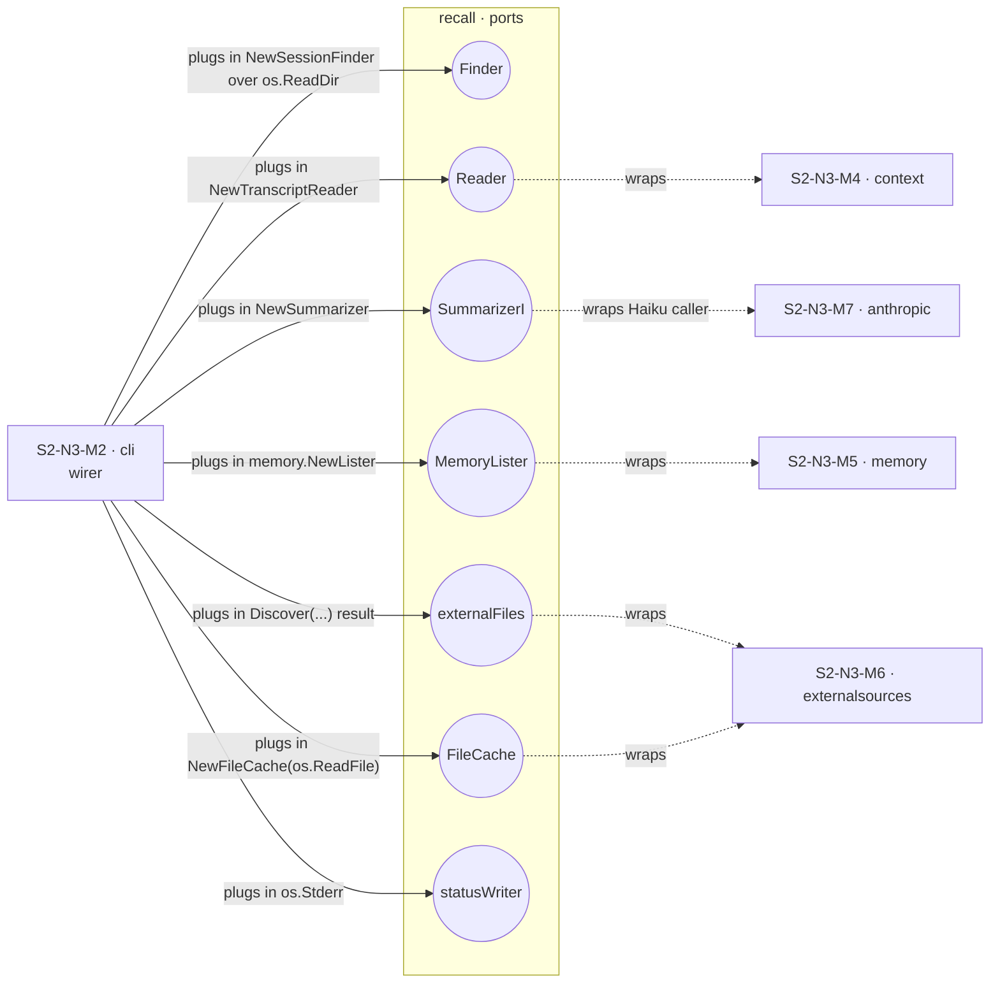

# #603 — DI notation brainstorm: rendered sketches

Real `recall` L4 data (7 DI seams: Finder, Reader, SummarizerI, MemoryLister, externalFiles, fileCache, statusWriter — all wired by `cli`).

---

## Baseline (current convention)

D5 points the wrong direction per C4's "arrow = initiates" rule, and the label is a comma-soup that doesn't tell you which adapter goes with which port.

---

## Approach D — annotated call edges

**Wins:** no back-edges, all arrows point the right way.
**Loses:** Finder and statusWriter (and dataDir) have no outbound call edge to ride on, so they vanish entirely. That's nearly half of recall's wiring made invisible.

---

## Approach C — separate wiring view (two diagrams per L4)

### View 1: call flow

### View 2: wiring graph

All seven seams visible; arrows correctly point in the wiring-call direction (cli → recall, since cli initiates the construction). New `W<n>` namespace keeps it from competing with R/D.

---

## Approach C-hex — ports & adapters view

What it adds over plain C:

- **Ports are first-class diagram nodes** owned by the focus component. The interface name *is* the node identity, not a label on an edge.
- **Adapter-to-driven-system relationship is visible** via dotted "wraps" edges (e.g., the Reader port wraps `context`; the SummarizerI port wraps `anthropic`).
- **The wirer's role becomes obvious by position**: `cli` only ever connects to ports, never to driven systems directly.
- **Generalises to fakes/mocks**: swap the cli-side adapter with a test adapter; port stays, hexagon stays.

Cost: more nodes per diagram (one port node per DI seam), and we'd want a node style/class for ports so they read as distinct from components.

---

## Read

**C-hex** is the strongest answer to "how do we indicate who SETS the dependency cleanly?" It treats ports as named nodes, makes the wirer's role visual, and exposes the adapter-wraps-driven-system axis we've been missing.

**D** is too lossy — components with non-call DI seams (Finder, statusWriter, dataDir on recall) lose visibility entirely.

**Plain C** is a fine middle ground if C-hex feels too heavy.
