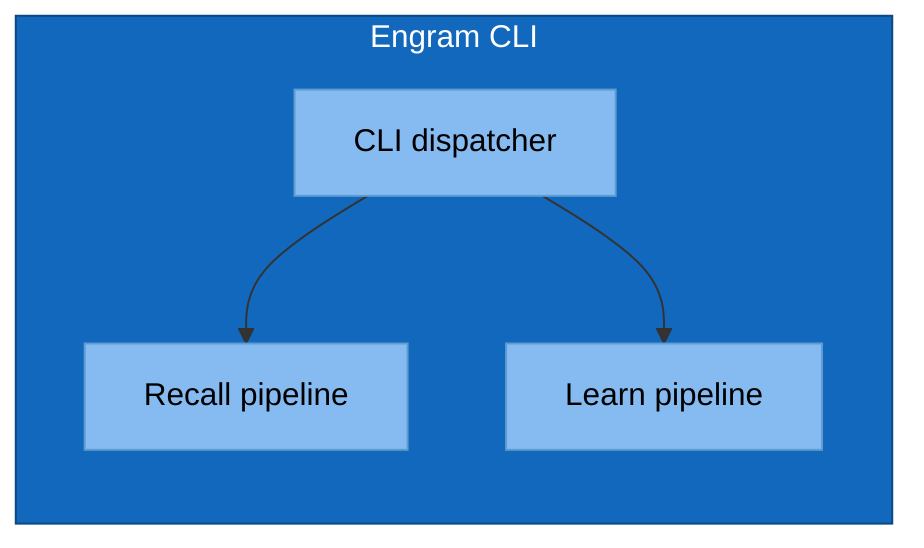

# Mermaid Conventions for C4 Diagrams

Mermaid has no native C4 shape vocabulary. The c4 skill enforces a project-wide convention
so all diagrams in `architecture/c4/` look the same.

## The Shape Convention

| C4 element | Mermaid shape | classDef class |
|---|---|---|
| Person / actor | Stadium: `id([Name])` | `:::person` |
| External system | Rounded: `id(Name)` | `:::external` |
| Internal container | Rectangle: `id[Name]` | `:::container` |
| Internal component | Subgraph inside container | `:::component` |

## The classDef Block (paste at top of every diagram)

```mermaid
flowchart LR
    classDef person      fill:#08427b,stroke:#052e56,color:#fff
    classDef external    fill:#999,   stroke:#666,   color:#fff
    classDef container   fill:#1168bd,stroke:#0b4884,color:#fff
    classDef component   fill:#85bbf0,stroke:#5d9bd1,color:#000
```

## L1 Skeleton


## L2 Skeleton

Same as L1, but `engram` expands into multiple containers (CLI binary, hooks, on-disk stores)
each shown as `:::container`.

## L3 Skeleton



## Element & Relationship IDs (and clickable anchors)

Every L1–L3 diagram is paired with two tables: an **Element Catalog** (catalog rows) and a
**Relationships** table. To make mismatches between diagram and tables eyeballable — and to
make every diagram node click through to its catalog row — the c4 skill enforces this
convention:

1. **Every catalog row has an ID** of the form `E1`, `E2`, … (one per row, sequential).
2. **Every relationships row has an ID** of the form `R1`, `R2`, … (one per row, sequential).
3. **Every mermaid node label embeds its catalog ID:** `engram[E2 · Engram plugin]`. The dot
   separator is for readability; the ID prefix is the contract.
4. **Every mermaid edge label embeds its relationship ID:** `cc -->|R2: loads skills + fires hooks| engram`.
5. **Every node has a `click` directive** to its catalog row's anchor:
   ```mermaid
   click engram href "#e2-engram-plugin" "Engram plugin"
   ```
6. **Every catalog and relationships row has an HTML anchor** in its first cell so the click
   resolves on GitHub:
   ```markdown
   | <a id="e2-engram-plugin"></a>E2 | Engram plugin | The system in scope | … |
   ```

### Mismatch as drift

- A node label with `En` that has no matching catalog row → orphan-in-diagram drift.
- A catalog row with ID `En` whose ID never appears in any node label → orphan-in-catalog drift.
- Same rules apply to `Rn` and edge labels.
- The skill's `review` and `audit` sub-actions report these as drift findings.

### Why edges aren't clickable

Mermaid does not support `click` on edges, only on nodes. Edge `Rn` IDs are visual cross-reference
only — the reader scans the relationships table by ID. Nodes ARE clickable; clicking a node on
GitHub jumps to its catalog row.

### Worked example


| ID | Name | Type | Responsibility | System of Record |
|---|---|---|---|---|
| <a id="e1-joe"></a>E1 | Joe | Person | engram user | Human |
| <a id="e2-engram"></a>E2 | Engram | The system | … | This repo |
| <a id="e3-claude-code"></a>E3 | Claude Code | External system | … | Anthropic CLI |
| <a id="e4-anthropic-api"></a>E4 | Anthropic API | External system | … | api.anthropic.com |

## GitHub Mermaid Quirks

- GitHub renders mermaid blocks marked ` ```mermaid `. Don't use `mmd`, `mermaidjs`, etc.
- HTML in labels is supported for `<br/>` only. Avoid raw HTML beyond that.
- `subgraph` titles cannot contain commas in some renderers — replace with `&comma;` or omit.
- Long labels: wrap with `<br/>`, don't trust auto-wrap.
- Edge labels: always use `-->|label|` form, never `-- label -->` (the former renders consistently).
